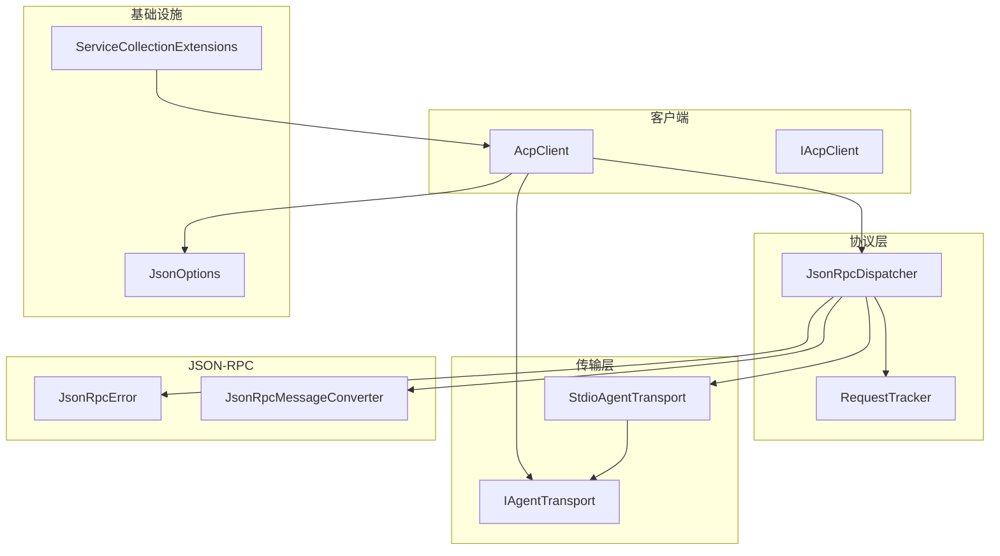
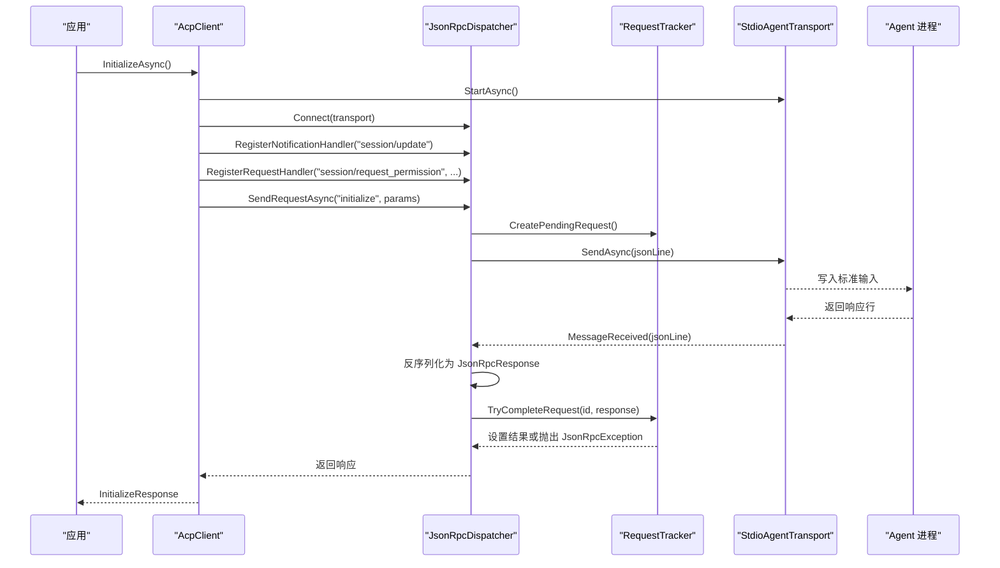
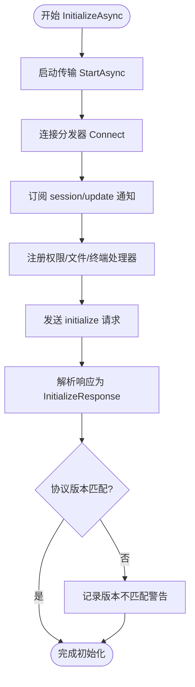
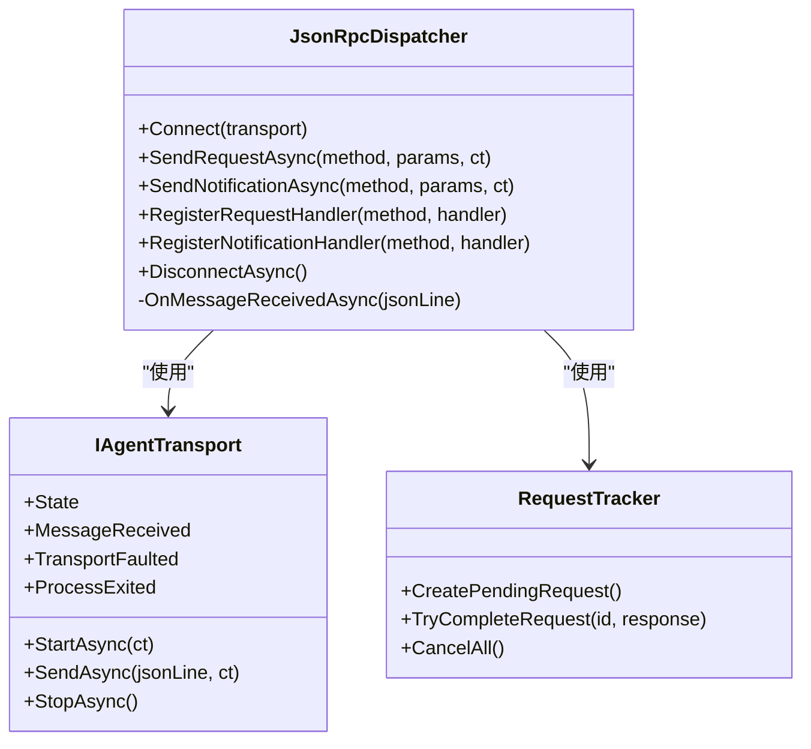
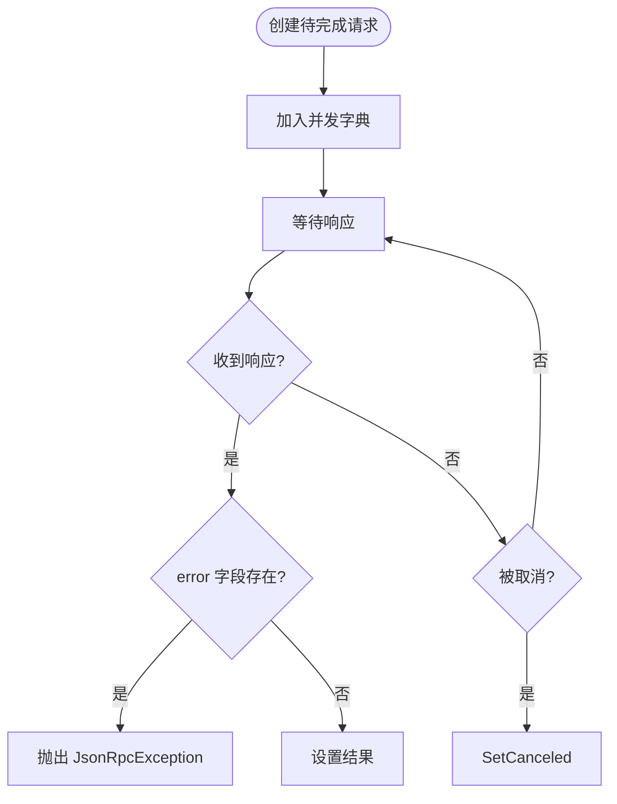
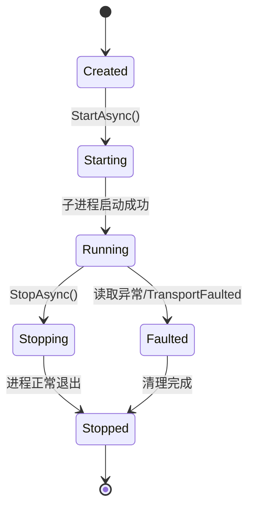
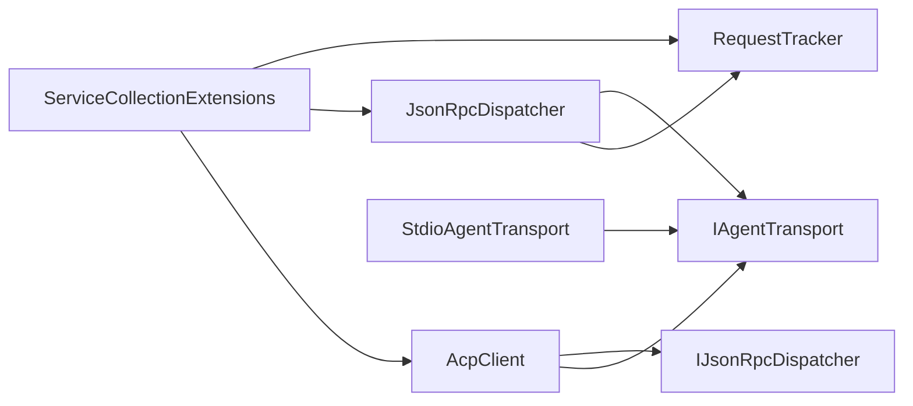

# 故障排除

<cite>
**本文引用的文件**   
- [README.md](file://README.md)
- [AcpClient.cs](file://Client/AcpClient.cs)
- [IAcpClient.cs](file://Client/IAcpClient.cs)
- [JsonRpcDispatcher.cs](file://Protocol/JsonRpcDispatcher.cs)
- [RequestTracker.cs](file://Protocol/RequestTracker.cs)
- [StdioAgentTransport.cs](file://Transport/StdioAgentTransport.cs)
- [IAgentTransport.cs](file://Transport/IAgentTransport.cs)
- [JsonOptions.cs](file://Infrastructure/JsonOptions.cs)
- [ServiceCollectionExtensions.cs](file://Infrastructure/ServiceCollectionExtensions.cs)
- [JsonRpcError.cs](file://JsonRpc/JsonRpcError.cs)
- [JsonRpcMessageConverter.cs](file://JsonRpc/JsonRpcMessageConverter.cs)
</cite>

## 目录
1. [简介](#简介)
2. [项目结构](#项目结构)
3. [核心组件](#核心组件)
4. [架构总览](#架构总览)
5. [详细组件分析](#详细组件分析)
6. [依赖关系分析](#依赖关系分析)
7. [性能考虑](#性能考虑)
8. [故障排除指南](#故障排除指南)
9. [结论](#结论)
10. [附录](#附录)

## 简介
本指南面向使用 Agentic.ACPLibrary 的开发者，聚焦于连接问题、协议错误、序列化异常与进程通信失败的诊断与修复。内容涵盖 JSON-RPC 错误码含义、网络与超时处理、调试技巧（日志、断点、性能分析）、常见配置错误（路径、权限、依赖冲突）以及性能问题识别与优化建议（内存泄漏、CPU 占用过高、网络延迟）。文档同时提供完整的错误日志示例与分析方法，帮助快速定位并解决问题。

## 项目结构
该库采用分层设计：
- Transport 层负责与 Agent 子进程的 stdio 通信
- Protocol 层实现 JSON-RPC 分发与请求跟踪
- Client 层封装 ACP 协议交互流程
- Infrastructure 层提供 JSON 序列化选项与服务注册扩展
- JsonRpc 层定义消息类型与转换器

图表来源
- [AcpClient.cs:1-120](file://Client/AcpClient.cs#L1-L120)
- [JsonRpcDispatcher.cs:1-124](file://Protocol/JsonRpcDispatcher.cs#L1-L124)
- [RequestTracker.cs:1-52](file://Protocol/RequestTracker.cs#L1-L52)
- [StdioAgentTransport.cs:1-147](file://Transport/StdioAgentTransport.cs#L1-L147)
- [IAgentTransport.cs:1-39](file://Transport/IAgentTransport.cs#L1-L39)
- [JsonOptions.cs:1-28](file://Infrastructure/JsonOptions.cs#L1-L28)
- [ServiceCollectionExtensions.cs:1-23](file://Infrastructure/ServiceCollectionExtensions.cs#L1-L23)
- [JsonRpcError.cs:1-19](file://JsonRpc/JsonRpcError.cs#L1-L19)
- [JsonRpcMessageConverter.cs:1-73](file://JsonRpc/JsonRpcMessageConverter.cs#L1-L73)

章节来源
- [README.md:1-99](file://README.md#L1-L99)

## 核心组件
- AcpClient：封装初始化握手、会话管理、提示发送、事件订阅与处理器注册；通过 ILogger 输出关键日志。
- JsonRpcDispatcher：负责 JSON-RPC 请求/通知分发、响应匹配与反序列化；在消息接收时进行类型判断与路由。
- RequestTracker：维护待完成请求的 TaskCompletionSource，支持取消与异常传播。
- StdioAgentTransport：启动子进程、读写标准输入输出、处理进程退出与错误流。
- JsonOptions：集中配置 System.Text.Json 行为，包含自定义转换器与枚举序列化策略。
- ServiceCollectionExtensions：将 ACP 相关服务注入到 DI 容器。

章节来源
- [AcpClient.cs:1-361](file://Client/AcpClient.cs#L1-L361)
- [JsonRpcDispatcher.cs:1-124](file://Protocol/JsonRpcDispatcher.cs#L1-L124)
- [RequestTracker.cs:1-52](file://Protocol/RequestTracker.cs#L1-L52)
- [StdioAgentTransport.cs:1-147](file://Transport/StdioAgentTransport.cs#L1-L147)
- [JsonOptions.cs:1-28](file://Infrastructure/JsonOptions.cs#L1-L28)
- [ServiceCollectionExtensions.cs:1-23](file://Infrastructure/ServiceCollectionExtensions.cs#L1-L23)

## 架构总览
下图展示了从客户端发起初始化到收到响应的完整调用链，包括事件订阅与错误传播路径。

图表来源
- [AcpClient.cs:48-182](file://Client/AcpClient.cs#L48-L182)
- [JsonRpcDispatcher.cs:27-47](file://Protocol/JsonRpcDispatcher.cs#L27-L47)
- [RequestTracker.cs:11-30](file://Protocol/RequestTracker.cs#L11-L30)
- [StdioAgentTransport.cs:30-68](file://Transport/StdioAgentTransport.cs#L30-L68)

## 详细组件分析

### AcpClient 分析与故障点
- 初始化流程：启动传输、连接分发器、订阅 session/update、注册权限与文件系统/终端处理器、发送 initialize 请求并解析响应。
- 常见故障点：
  - 未设置 PermissionHandler/FileSystemHandler/TerminalHandler 导致对应请求返回 -32601 错误。
  - 协议版本不匹配会记录警告。
  - 事件未订阅导致无法接收流式更新。
- 调试要点：
  - 检查 InitializeAsync 的日志输出，确认是否成功建立会话。
  - 确认处理器已正确赋值并在请求到达时返回有效结果。

图表来源
- [AcpClient.cs:48-182](file://Client/AcpClient.cs#L48-L182)

章节来源
- [AcpClient.cs:1-361](file://Client/AcpClient.cs#L1-L361)
- [IAcpClient.cs:1-59](file://Client/IAcpClient.cs#L1-L59)

### JsonRpcDispatcher 分析与故障点
- 功能：发送请求/通知、注册处理器、反序列化消息、分发响应与通知。
- 常见故障点：
  - 未连接传输即发送请求会抛出 InvalidOperationException。
  - 反序列化失败或处理器异常被捕获后忽略，需结合日志排查。
  - 未正确注册方法处理器导致请求无响应。
- 调试要点：
  - 在 OnMessageReceivedAsync 中增加日志以观察消息流转。
  - 确保所有必要处理器均已注册。

图表来源
- [JsonRpcDispatcher.cs:1-124](file://Protocol/JsonRpcDispatcher.cs#L1-L124)
- [IAgentTransport.cs:1-39](file://Transport/IAgentTransport.cs#L1-L39)
- [RequestTracker.cs:1-52](file://Protocol/RequestTracker.cs#L1-L52)

章节来源
- [JsonRpcDispatcher.cs:1-124](file://Protocol/JsonRpcDispatcher.cs#L1-L124)

### RequestTracker 分析与故障点
- 功能：维护待完成请求映射，支持设置结果或抛出 JsonRpcException，支持取消。
- 常见故障点：
  - 响应中包含 error 字段时会抛出 JsonRpcException，需在调用方捕获。
  - 取消后 TCS 被 SetCanceled，上层应处理 OperationCanceledException。
- 调试要点：
  - 检查 TryCompleteRequest 是否按预期移除并设置结果。
  - 关注 CancelAll 在断开时的清理逻辑。

图表来源
- [RequestTracker.cs:11-39](file://Protocol/RequestTracker.cs#L11-L39)

章节来源
- [RequestTracker.cs:1-52](file://Protocol/RequestTracker.cs#L1-L52)

### StdioAgentTransport 分析与故障点
- 功能：启动子进程、读取标准输出/错误、发送 JSON 行、优雅停止与强制终止。
- 常见故障点：
  - 命令路径错误或参数不正确导致进程启动失败。
  - 工作目录不存在或无权限导致子进程运行异常。
  - 标准输入/输出编码非 UTF-8 导致序列化异常。
  - 进程提前退出触发 ProcessExited 事件。
- 调试要点：
  - 监听 TransportFaulted 与 ProcessExited 事件。
  - 检查 StandardError 输出以获取子进程诊断信息。

图表来源
- [StdioAgentTransport.cs:30-93](file://Transport/StdioAgentTransport.cs#L30-L93)
- [IAgentTransport.cs:30-39](file://Transport/IAgentTransport.cs#L30-L39)

章节来源
- [StdioAgentTransport.cs:1-147](file://Transport/StdioAgentTransport.cs#L1-L147)
- [IAgentTransport.cs:1-39](file://Transport/IAgentTransport.cs#L1-L39)

### JSON 序列化与协议错误
- JsonOptions：统一配置属性名大小写不敏感、忽略 null、关闭缩进、允许元数据属性乱序，并添加 JsonRpcMessageConverter 与字符串枚举转换器。
- JsonRpcMessageConverter：根据字段 presence 区分请求、通知与响应，避免递归转换。
- 常见故障点：
  - 未启用 AllowOutOfOrderMetadataProperties 导致某些模型反序列化失败。
  - 自定义转换器未移除自身导致递归。
  - 枚举值命名不一致导致解析失败。
- 调试要点：
  - 检查 JsonOptions.Default 是否正确配置。
  - 在反序列化前后记录原始 JSON 文本以便比对。

章节来源
- [JsonOptions.cs:1-28](file://Infrastructure/JsonOptions.cs#L1-L28)
- [JsonRpcMessageConverter.cs:1-73](file://JsonRpc/JsonRpcMessageConverter.cs#L1-L73)

## 依赖关系分析
- AcpClient 依赖 IAgentTransport 与 IJsonRpcDispatcher，并通过 JsonOptions 进行序列化配置。
- JsonRpcDispatcher 依赖 RequestTracker 与 IAgentTransport，负责消息路由与响应匹配。
- StdioAgentTransport 实现 IAgentTransport，管理子进程生命周期。
- ServiceCollectionExtensions 将上述组件注册到 DI 容器，便于测试与替换。

图表来源
- [ServiceCollectionExtensions.cs:1-23](file://Infrastructure/ServiceCollectionExtensions.cs#L1-L23)
- [AcpClient.cs:1-120](file://Client/AcpClient.cs#L1-L120)
- [JsonRpcDispatcher.cs:1-60](file://Protocol/JsonRpcDispatcher.cs#L1-L60)
- [StdioAgentTransport.cs:1-60](file://Transport/StdioAgentTransport.cs#L1-L60)

章节来源
- [ServiceCollectionExtensions.cs:1-23](file://Infrastructure/ServiceCollectionExtensions.cs#L1-L23)

## 性能考虑
- 内存管理：
  - 避免在处理器中持有大对象引用，及时释放资源。
  - 使用 JsonDocument 的 RootElement.Clone() 时注意内存占用。
- CPU 占用：
  - 减少不必要的反序列化与字符串拼接。
  - 合理设置 CancellationToken 以避免长时间阻塞。
- 网络延迟：
  - 使用异步 IO 与合适的缓冲区大小。
  - 监控子进程 stdout/stderr 的读取性能。
- 监控建议：
  - 使用性能分析工具（如 dotnet-trace、dotnet-counters）观察 GC 与线程活动。
  - 在关键路径添加计时日志，定位瓶颈。

## 故障排除指南

### 连接问题
- 症状：InitializeAsync 超时或立即失败；SessionUpdated 从未触发。
- 可能原因：
  - 子进程命令路径错误或参数不正确。
  - 工作目录不存在或无执行权限。
  - 标准输入/输出编码非 UTF-8。
- 诊断步骤：
  - 检查 StdioAgentTransport.StartAsync 是否成功，查看 TransportState。
  - 监听 ProcessExited 事件，记录退出码。
  - 捕获 TransportFaulted 异常并打印堆栈。
- 解决方案：
  - 修正命令路径与参数，确保可执行文件存在且具备执行权限。
  - 指定正确的 workingDirectory，并确保当前用户有访问权限。
  - 确认 StandardOutputEncoding 与 StandardErrorEncoding 设置为 UTF-8。

章节来源
- [StdioAgentTransport.cs:30-68](file://Transport/StdioAgentTransport.cs#L30-L68)
- [StdioAgentTransport.cs:137-145](file://Transport/StdioAgentTransport.cs#L137-L145)

### 协议错误与 JSON-RPC 错误码
- 症状：调用 SendRequestAsync 抛出 JsonRpcException；响应中包含 error 字段。
- 常见错误码：
  - -32601：方法未找到或处理器不可用（例如未设置 FileSystemHandler/TerminalHandler）。
  - 其他标准 JSON-RPC 错误码可根据 message 进一步分类。
- 诊断步骤：
  - 检查 RequestTracker.TryCompleteRequest 是否设置了异常。
  - 查看 AcpClient 中注册的处理器是否覆盖所有必要方法。
- 解决方案：
  - 确保在 InitializeAsync 前设置所有必需的处理器。
  - 对于未知方法，使用 RegisterRequestHandler 进行扩展。

章节来源
- [RequestTracker.cs:19-30](file://Protocol/RequestTracker.cs#L19-L30)
- [AcpClient.cs:102-144](file://Client/AcpClient.cs#L102-L144)
- [AcpClient.cs:250-359](file://Client/AcpClient.cs#L250-L359)

### 序列化异常
- 症状：反序列化失败或模型字段缺失；枚举值解析错误。
- 可能原因：
  - JsonOptions 未启用 AllowOutOfOrderMetadataProperties。
  - 自定义转换器未移除自身导致递归。
  - 枚举成员名称与 JSON 不一致。
- 诊断步骤：
  - 在反序列化前后记录原始 JSON 文本。
  - 检查 JsonRpcMessageConverter 的 Read/Write 逻辑。
- 解决方案：
  - 确保 JsonOptions.Default 包含必要的转换器与选项。
  - 修正枚举成员名称或使用 JsonStringEnumMemberName 特性。

章节来源
- [JsonOptions.cs:13-26](file://Infrastructure/JsonOptions.cs#L13-L26)
- [JsonRpcMessageConverter.cs:11-32](file://JsonRpc/JsonRpcMessageConverter.cs#L11-L32)

### 进程通信失败
- 症状：MessageReceived 未触发；子进程提前退出。
- 可能原因：
  - 子进程崩溃或未输出任何内容。
  - 标准输入未正确写入或刷新。
  - 读取循环被取消或异常中断。
- 诊断步骤：
  - 监听 TransportFaulted 与 ProcessExited 事件。
  - 检查 StandardError 输出以获取子进程诊断信息。
- 解决方案：
  - 确保 SendAsync 在 Running 状态下调用。
  - 增加重试机制与超时控制。

章节来源
- [StdioAgentTransport.cs:95-118](file://Transport/StdioAgentTransport.cs#L95-L118)
- [StdioAgentTransport.cs:120-135](file://Transport/StdioAgentTransport.cs#L120-L135)

### 超时处理
- 症状：请求长时间无响应；Task.WaitAsync 抛出超时异常。
- 可能原因：
  - 子进程未返回响应。
  - 网络或 IO 阻塞。
- 诊断步骤：
  - 检查 RequestTracker 中的 Pending 列表是否为空。
  - 在调用处传入合理的 CancellationToken 与超时时间。
- 解决方案：
  - 在 AcpClient.SendPromptAsync 等方法中传递 CancellationToken。
  - 增加全局超时策略与重试逻辑。

章节来源
- [JsonRpcDispatcher.cs:27-47](file://Protocol/JsonRpcDispatcher.cs#L27-L47)

### 调试技巧与工具使用
- 日志配置：
  - 使用 Microsoft.Extensions.Logging 输出关键事件（初始化、会话创建、错误）。
  - 在 JsonRpcDispatcher.OnMessageReceivedAsync 中增加日志以追踪消息流转。
- 断点调试：
  - 在 AcpClient.InitializeAsync、JsonRpcDispatcher.SendRequestAsync、StdioAgentTransport.ReadLoopAsync 设置断点。
  - 检查事件订阅是否正确。
- 性能分析：
  - 使用 dotnet-trace 采集 CPU 与 GC 事件。
  - 使用 dotnet-counters 监控实时指标。

章节来源
- [AcpClient.cs:48-182](file://Client/AcpClient.cs#L48-L182)
- [JsonRpcDispatcher.cs:86-122](file://Protocol/JsonRpcDispatcher.cs#L86-L122)

### 常见配置错误与解决方法
- 路径问题：
  - 子进程命令路径错误导致启动失败。
  - 解决：验证路径存在且可执行。
- 权限问题：
  - 工作目录无访问权限或子进程无执行权限。
  - 解决：调整目录权限或指定正确的工作目录。
- 依赖冲突：
  - System.Text.Json 版本不兼容导致序列化异常。
  - 解决：统一依赖版本并检查 NuGet 包约束。

章节来源
- [StdioAgentTransport.cs:34-46](file://Transport/StdioAgentTransport.cs#L34-L46)
- [JsonOptions.cs:13-26](file://Infrastructure/JsonOptions.cs#L13-L26)

### 性能问题识别与优化建议
- 内存泄漏：
  - 避免在处理器中缓存大对象；及时释放 JsonDocument。
- CPU 占用过高：
  - 减少频繁的反序列化与字符串操作。
- 网络延迟：
  - 优化 IO 读取循环，避免阻塞。
- 监控与优化：
  - 使用性能分析工具定位热点。
  - 引入批处理与缓冲策略。

### 完整错误日志示例与分析方法
- 初始化失败日志示例：
  - “Initializing ACP client...” → “Agent process exited with code X”
  - 分析：检查子进程启动参数与工作目录。
- 协议错误日志示例：
  - “Protocol version mismatch: client=1, agent=Y”
  - 分析：升级或降级客户端/服务端以匹配协议版本。
- 处理器缺失日志示例：
  - “File system not available” / “Terminal handler not available”
  - 分析：确保在 InitializeAsync 前设置相应处理器。
- 分析方法：
  - 收集 AcpClient 与 JsonRpcDispatcher 的日志。
  - 结合 TransportFaulted 与 ProcessExited 事件输出。
  - 对比原始 JSON 文本与期望模型结构。

章节来源
- [AcpClient.cs:48-182](file://Client/AcpClient.cs#L48-L182)
- [AcpClient.cs:102-144](file://Client/AcpClient.cs#L102-L144)
- [AcpClient.cs:250-359](file://Client/AcpClient.cs#L250-L359)

## 结论
通过系统化分析 AcpClient、JsonRpcDispatcher、RequestTracker 与 StdioAgentTransport 的实现与交互，结合 JSON 序列化配置与事件机制，可以高效定位并解决连接、协议、序列化与进程通信等常见问题。建议在生产环境中启用详细日志与性能监控，持续优化资源使用与响应时间。

## 附录
- 快速参考：
  - 初始化顺序：StartAsync → Connect → RegisterHandlers → SendRequestAsync
  - 事件订阅：SessionUpdated、AgentProcessExited
  - 错误传播：JsonRpcException 携带 Code 与 Message
- 常用命令：
  - 启动代理：new StdioAgentTransport("path/to/agent", "--acp", workingDirectory: ".")
  - 注册处理器：client.PermissionHandler = ...; client.FileSystemHandler = ...; client.TerminalHandler = ...