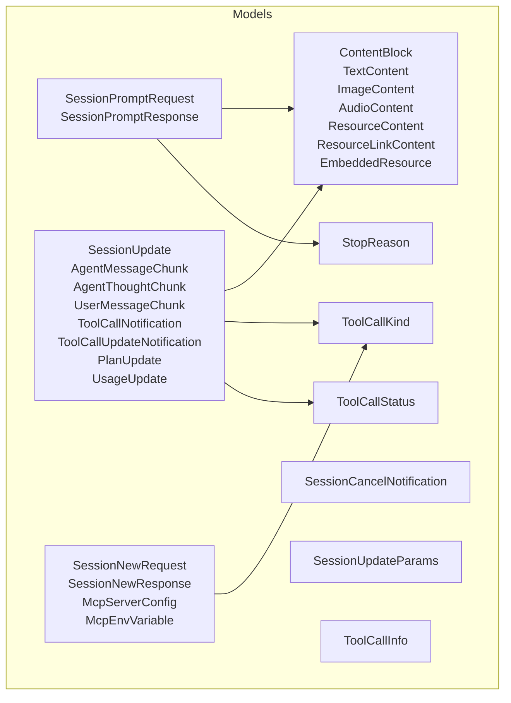
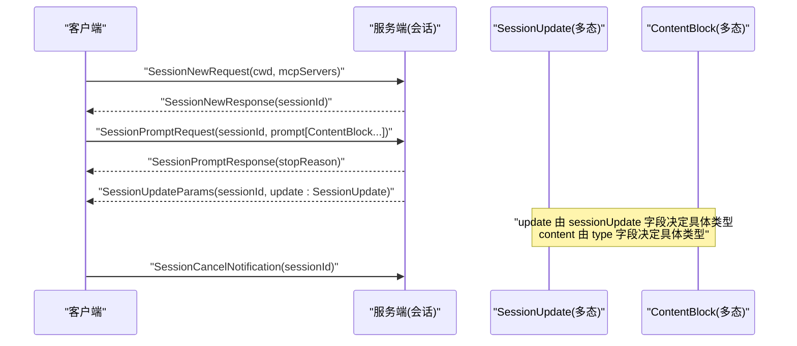
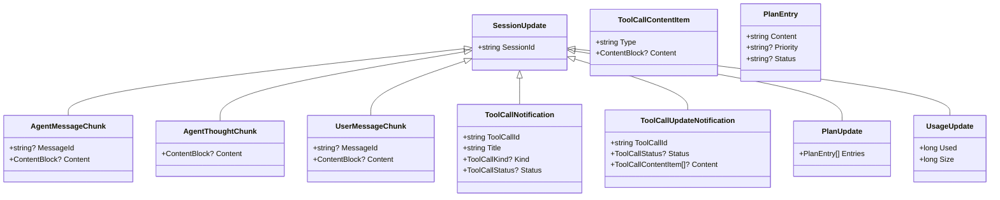
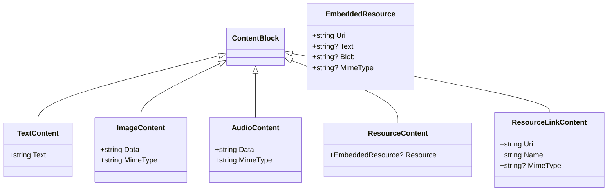
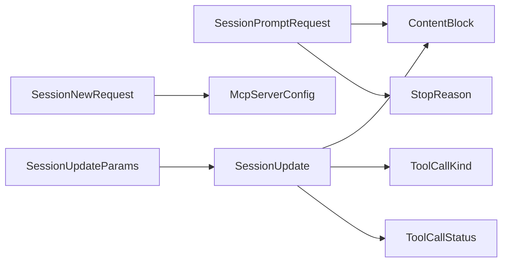
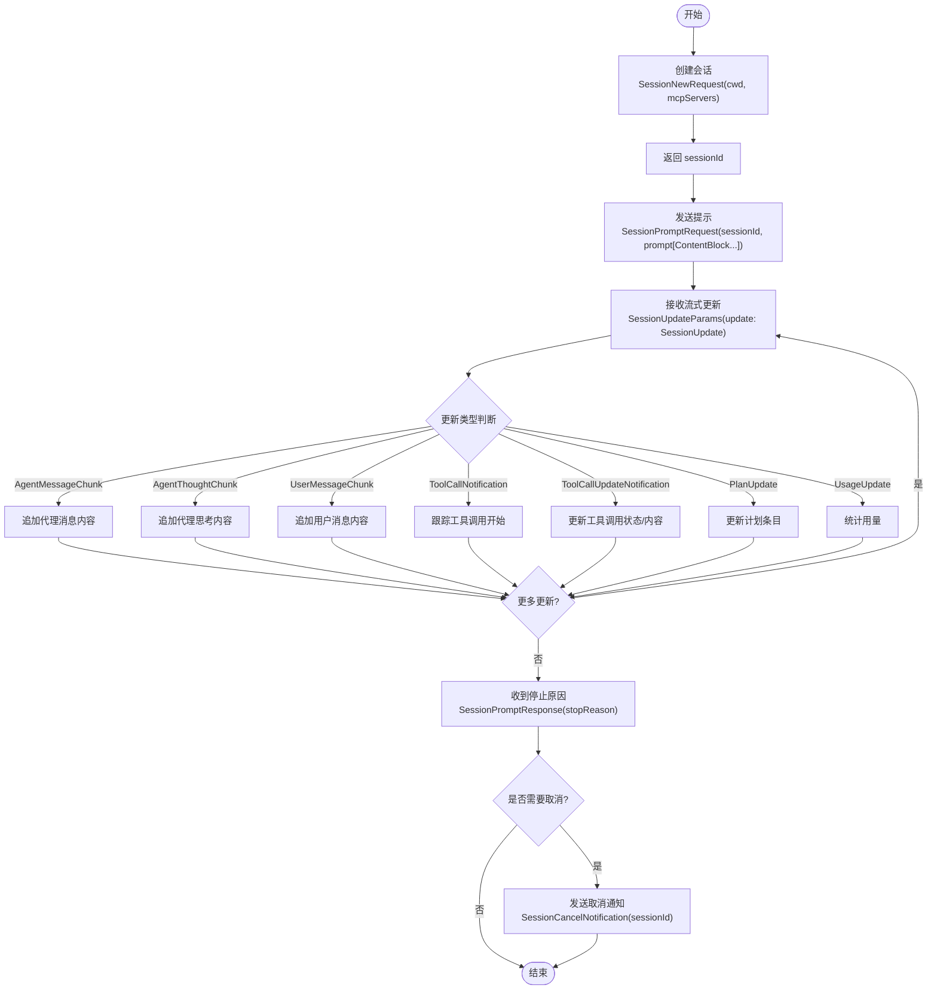

# 会话模型

<cite>
**本文引用的文件**   
- [SessionPromptRequest.cs](file://Models/SessionPromptRequest.cs)
- [SessionNewRequest.cs](file://Models/SessionNewRequest.cs)
- [SessionCancelNotification.cs](file://Models/SessionCancelNotification.cs)
- [SessionUpdate.cs](file://Models/SessionUpdate.cs)
- [SessionUpdateWrapper.cs](file://Models/SessionUpdateWrapper.cs)
- [ContentBlock.cs](file://Models/ContentBlock.cs)
- [ToolCall.cs](file://Models/ToolCall.cs)
- [StopReason.cs](file://Models/Enums/StopReason.cs)
- [ToolCallKind.cs](file://Models/Enums/ToolCallKind.cs)
- [ToolCallStatus.cs](file://Models/Enums/ToolCallStatus.cs)
</cite>

## 目录
1. [简介](#简介)
2. [项目结构](#项目结构)
3. [核心组件](#核心组件)
4. [架构总览](#架构总览)
5. [详细组件分析](#详细组件分析)
6. [依赖关系分析](#依赖关系分析)
7. [性能考量](#性能考量)
8. [故障排查指南](#故障排查指南)
9. [结论](#结论)
10. [附录：会话生命周期与处理模式示例](#附录会话生命周期与处理模式示例)

## 简介
本文件围绕会话管理相关的数据模型进行系统化说明，重点覆盖以下方面：
- SessionPromptRequest 的属性与内容块集合（Prompt）的语义与使用方式。
- SessionNewRequest 的会话创建参数（工作目录、MCP 服务器配置等）。
- SessionCancelNotification 的取消机制（基于会话标识的取消通知）。
- SessionUpdate 基类及其派生类型的继承层次结构（文本、思考、用户消息、工具调用、计划、用量等更新类型）。
- SessionUpdateWrapper（实际为 SessionUpdateParams）的包装机制，用于承载 session/update 通知中的多态更新对象。
- 会话生命周期管理的完整示例与数据处理模式，帮助读者理解从创建到终止的全流程。

## 项目结构
与会话模型相关的代码集中在 Models 命名空间下，采用记录（record）与类（class）混合的方式定义请求、响应、通知与多态更新对象。枚举类型位于 Models/Enums 子目录中，用于统一序列化行为。

图表来源
- [SessionPromptRequest.cs:1-20](file://Models/SessionPromptRequest.cs#L1-L20)
- [SessionNewRequest.cs:1-45](file://Models/SessionNewRequest.cs#L1-L45)
- [SessionCancelNotification.cs:1-10](file://Models/SessionCancelNotification.cs#L1-L10)
- [SessionUpdate.cs:1-119](file://Models/SessionUpdate.cs#L1-L119)
- [SessionUpdateWrapper.cs:1-17](file://Models/SessionUpdateWrapper.cs#L1-L17)
- [ContentBlock.cs:1-79](file://Models/ContentBlock.cs#L1-L79)
- [ToolCall.cs:1-22](file://Models/ToolCall.cs#L1-L22)
- [StopReason.cs:1-19](file://Models/Enums/StopReason.cs#L1-L19)
- [ToolCallKind.cs:1-27](file://Models/Enums/ToolCallKind.cs#L1-L27)
- [ToolCallStatus.cs:1-17](file://Models/Enums/ToolCallStatus.cs#L1-L17)

章节来源
- [SessionPromptRequest.cs:1-20](file://Models/SessionPromptRequest.cs#L1-L20)
- [SessionNewRequest.cs:1-45](file://Models/SessionNewRequest.cs#L1-L45)
- [SessionCancelNotification.cs:1-10](file://Models/SessionCancelNotification.cs#L1-L10)
- [SessionUpdate.cs:1-119](file://Models/SessionUpdate.cs#L1-L119)
- [SessionUpdateWrapper.cs:1-17](file://Models/SessionUpdateWrapper.cs#L1-L17)
- [ContentBlock.cs:1-79](file://Models/ContentBlock.cs#L1-L79)
- [ToolCall.cs:1-22](file://Models/ToolCall.cs#L1-L22)
- [StopReason.cs:1-19](file://Models/Enums/StopReason.cs#L1-L19)
- [ToolCallKind.cs:1-27](file://Models/Enums/ToolCallKind.cs#L1-L27)
- [ToolCallStatus.cs:1-17](file://Models/Enums/ToolCallStatus.cs#L1-L17)

## 核心组件
本节对会话模型的核心数据结构进行概览式说明，包括请求、通知、更新与内容块等。

- SessionPromptRequest：包含会话标识与提示内容块集合（Prompt），用于向 Agent 发送一次提示请求。
- SessionPromptResponse：返回停止原因（StopReason），指示本轮交互结束的原因。
- SessionNewRequest：创建新会话所需的参数，包括当前工作目录（cwd）与 MCP 服务器列表（mcpServers）。
- SessionNewResponse：返回新建会话的会话标识（sessionId）。
- SessionCancelNotification：携带会话标识的通知，用于取消正在进行的会话操作。
- SessionUpdate 及其派生类型：通过 sessionUpdate 字段作为多态判别器，表示不同类别的增量更新（如文本、思考、用户消息、工具调用、计划、用量等）。
- SessionUpdateParams（即 SessionUpdateWrapper 的实际实现）：用于封装 session/update 通知的参数，包含 sessionId 与 update 字段。
- ContentBlock 及其派生类型：通过 type 字段作为多态判别器，表示文本、图片、音频、资源与资源链接等内容块。
- ToolCallInfo：描述工具调用的基本信息（ID、标题、类型、状态）。
- 枚举类型：StopReason、ToolCallKind、ToolCallStatus 提供统一的字符串枚举序列化。

章节来源
- [SessionPromptRequest.cs:1-20](file://Models/SessionPromptRequest.cs#L1-L20)
- [SessionNewRequest.cs:1-45](file://Models/SessionNewRequest.cs#L1-L45)
- [SessionCancelNotification.cs:1-10](file://Models/SessionCancelNotification.cs#L1-L10)
- [SessionUpdate.cs:1-119](file://Models/SessionUpdate.cs#L1-L119)
- [SessionUpdateWrapper.cs:1-17](file://Models/SessionUpdateWrapper.cs#L1-L17)
- [ContentBlock.cs:1-79](file://Models/ContentBlock.cs#L1-L79)
- [ToolCall.cs:1-22](file://Models/ToolCall.cs#L1-L22)
- [StopReason.cs:1-19](file://Models/Enums/StopReason.cs#L1-L19)
- [ToolCallKind.cs:1-27](file://Models/Enums/ToolCallKind.cs#L1-L27)
- [ToolCallStatus.cs:1-17](file://Models/Enums/ToolCallStatus.cs#L1-L17)

## 架构总览
下图展示了会话模型在 JSON 序列化与反序列化过程中的关键路径：请求/响应与通知通过明确的属性名映射；更新对象通过 sessionUpdate 字段进行多态解析；内容块通过 type 字段进行多态解析。

图表来源
- [SessionNewRequest.cs:1-45](file://Models/SessionNewRequest.cs#L1-L45)
- [SessionPromptRequest.cs:1-20](file://Models/SessionPromptRequest.cs#L1-L20)
- [SessionCancelNotification.cs:1-10](file://Models/SessionCancelNotification.cs#L1-L10)
- [SessionUpdate.cs:1-119](file://Models/SessionUpdate.cs#L1-L119)
- [ContentBlock.cs:1-79](file://Models/ContentBlock.cs#L1-L79)

## 详细组件分析

### SessionPromptRequest 与 SessionPromptResponse
- SessionPromptRequest
  - sessionId：标识目标会话。
  - prompt：内容块集合，每个元素为 ContentBlock 的多态实例，支持文本、图片、音频、资源与资源链接。
- SessionPromptResponse
  - stopReason：本轮交互的停止原因，枚举值涵盖正常结束、令牌上限、轮次上限、拒绝与取消等场景。

章节来源
- [SessionPromptRequest.cs:1-20](file://Models/SessionPromptRequest.cs#L1-L20)
- [StopReason.cs:1-19](file://Models/Enums/StopReason.cs#L1-L19)

### SessionNewRequest 与 SessionNewResponse
- SessionNewRequest
  - cwd：当前工作目录，影响 Agent 的文件系统上下文。
  - mcpServers：MCP 服务器配置数组，名称、命令、参数与环境变量（可选）。
- SessionNewResponse
  - sessionId：新建会话的唯一标识。

章节来源
- [SessionNewRequest.cs:1-45](file://Models/SessionNewRequest.cs#L1-L45)

### SessionCancelNotification
- 仅包含 sessionId，用于通知服务端取消指定会话的当前操作。

章节来源
- [SessionCancelNotification.cs:1-10](file://Models/SessionCancelNotification.cs#L1-L10)

### SessionUpdate 基类与派生类型
SessionUpdate 是会话更新的基类，所有更新类型均继承自该基类并通过 sessionUpdate 字段进行多态解析。其设计要点如下：
- 基类属性
  - sessionId：关联的会话标识。
- 派生类型
  - AgentMessageChunk：代理消息片段，包含可选 messageId 与 content（ContentBlock）。
  - AgentThoughtChunk：代理思考片段，包含 content（ContentBlock）。
  - UserMessageChunk：用户消息片段，包含可选 messageId 与 content（ContentBlock）。
  - ToolCallNotification：工具调用通知，包含 toolCallId、title、kind（可选）、status（可选）。
  - ToolCallUpdateNotification：工具调用更新通知，包含 toolCallId、status（可选）、content（可选，List<ToolCallContentItem>）。
  - PlanUpdate：计划更新，包含 entries（List<PlanEntry>）。
  - UsageUpdate：用量更新，包含 used 与 size（均为 long）。
- 辅助类型
  - ToolCallContentItem：工具调用内容项，type 与 content（ContentBlock，可选）。
  - PlanEntry：计划条目，content、priority（可选）、status（可选）。

图表来源
- [SessionUpdate.cs:1-119](file://Models/SessionUpdate.cs#L1-L119)

章节来源
- [SessionUpdate.cs:1-119](file://Models/SessionUpdate.cs#L1-L119)

### SessionUpdateWrapper（SessionUpdateParams）
- 作用：封装 session/update 通知的参数，包含 sessionId 与 update（SessionUpdate 多态对象）。
- 特点：update 字段允许为空，便于在不包含更新内容的情况下传递会话标识。

章节来源
- [SessionUpdateWrapper.cs:1-17](file://Models/SessionUpdateWrapper.cs#L1-L17)

### ContentBlock 多态体系
ContentBlock 通过 type 字段作为多态判别器，支持多种内容类型：
- TextContent：文本内容，包含 text。
- ImageContent：图片内容，包含 data 与 mimeType。
- AudioContent：音频内容，包含 data 与 mimeType。
- ResourceContent：嵌入资源，包含 EmbeddedResource（uri、text、blob、mimeType，部分可选）。
- ResourceLinkContent：资源链接，包含 uri、name、mimeType（可选）。

图表来源
- [ContentBlock.cs:1-79](file://Models/ContentBlock.cs#L1-L79)

章节来源
- [ContentBlock.cs:1-79](file://Models/ContentBlock.cs#L1-L79)

### 工具调用信息（ToolCallInfo）
- ToolCallInfo：描述工具调用的基本信息，包含 toolCallId、title、kind（可选）、status（可选）。

章节来源
- [ToolCall.cs:1-22](file://Models/ToolCall.cs#L1-L22)

### 枚举类型
- StopReason：停止原因，包括 end_turn、max_tokens、max_turn_requests、refusal、cancelled。
- ToolCallKind：工具调用类型，包括 read、edit、delete、move、search、execute、think、fetch、other。
- ToolCallStatus：工具调用状态，包括 pending、in_progress、completed、failed。

章节来源
- [StopReason.cs:1-19](file://Models/Enums/StopReason.cs#L1-L19)
- [ToolCallKind.cs:1-27](file://Models/Enums/ToolCallKind.cs#L1-L27)
- [ToolCallStatus.cs:1-17](file://Models/Enums/ToolCallStatus.cs#L1-L17)

## 依赖关系分析
- SessionPromptRequest 依赖 ContentBlock 集合与 StopReason 枚举。
- SessionNewRequest 依赖 McpServerConfig 与 McpEnvVariable，间接依赖枚举（用于后续扩展）。
- SessionUpdate 及其派生类型依赖 ContentBlock、ToolCallKind、ToolCallStatus。
- SessionUpdateParams 依赖 SessionUpdate。
- 所有多态类型通过 JsonPolymorphic 与 JsonDerivedType 注解声明，确保 JSON 序列化的正确性。

图表来源
- [SessionPromptRequest.cs:1-20](file://Models/SessionPromptRequest.cs#L1-L20)
- [SessionNewRequest.cs:1-45](file://Models/SessionNewRequest.cs#L1-L45)
- [SessionUpdate.cs:1-119](file://Models/SessionUpdate.cs#L1-L119)
- [SessionUpdateWrapper.cs:1-17](file://Models/SessionUpdateWrapper.cs#L1-L17)
- [ContentBlock.cs:1-79](file://Models/ContentBlock.cs#L1-L79)
- [StopReason.cs:1-19](file://Models/Enums/StopReason.cs#L1-L19)
- [ToolCallKind.cs:1-27](file://Models/Enums/ToolCallKind.cs#L1-L27)
- [ToolCallStatus.cs:1-17](file://Models/Enums/ToolCallStatus.cs#L1-L17)

章节来源
- [SessionPromptRequest.cs:1-20](file://Models/SessionPromptRequest.cs#L1-L20)
- [SessionNewRequest.cs:1-45](file://Models/SessionNewRequest.cs#L1-L45)
- [SessionUpdate.cs:1-119](file://Models/SessionUpdate.cs#L1-L119)
- [SessionUpdateWrapper.cs:1-17](file://Models/SessionUpdateWrapper.cs#L1-L17)
- [ContentBlock.cs:1-79](file://Models/ContentBlock.cs#L1-L79)
- [StopReason.cs:1-19](file://Models/Enums/StopReason.cs#L1-L19)
- [ToolCallKind.cs:1-27](file://Models/Enums/ToolCallKind.cs#L1-L27)
- [ToolCallStatus.cs:1-17](file://Models/Enums/ToolCallStatus.cs#L1-L17)

## 性能考量
- 多态解析开销：SessionUpdate 与 ContentBlock 的多态解析依赖于 JSON 库的类型判别字段（sessionUpdate、type）。在高吞吐场景下，建议缓存解析器配置并避免频繁重建。
- 大对象传输：ContentBlock 可能包含二进制数据（data）或大型文本，建议在应用层进行分片或压缩策略。
- 空值忽略：多处使用 WhenWritingNull 条件忽略空字段，有助于减少网络负载。
- 枚举序列化：统一使用字符串枚举转换器，提升可读性与兼容性。

## 故障排查指南
- 未知更新类型：当 Agent 发送新的 SessionUpdate 类型时，由于 IgnoreUnrecognizedTypeDiscriminators 与 UnknownDerivedTypeHandling 设置为回退到基类，不会抛出异常，但需要上层逻辑识别并处理未知类型。
- 未知内容类型：同理，ContentBlock 的新类型会回退到基类，需在上层根据业务需求进行兼容处理。
- 工具调用状态不一致：检查 ToolCallNotification 与 ToolCallUpdateNotification 的状态流转是否符合预期（pending -> in_progress -> completed/failed）。
- 取消无效：确认 SessionCancelNotification 的 sessionId 与目标会话一致，且服务端已正确处理取消逻辑。

章节来源
- [SessionUpdate.cs:1-119](file://Models/SessionUpdate.cs#L1-L119)
- [ContentBlock.cs:1-79](file://Models/ContentBlock.cs#L1-L79)
- [SessionCancelNotification.cs:1-10](file://Models/SessionCancelNotification.cs#L1-L10)

## 结论
会话模型通过清晰的请求/响应与通知结构，结合多态更新与内容块体系，提供了灵活而健壮的会话管理能力。SessionUpdate 的继承层次与 ContentBlock 的多态设计使得扩展新类型成为可能，同时保持向后兼容。配合 SessionUpdateParams 的包装机制，可以在不破坏现有协议的前提下平滑演进。

## 附录：会话生命周期与处理模式示例
以下示例展示从创建会话到发送提示、接收更新、最终取消的完整流程与数据处理模式。请注意，此处为概念性流程图，不直接映射到具体源码文件。

[此图为概念性流程，未直接映射到具体源码文件]