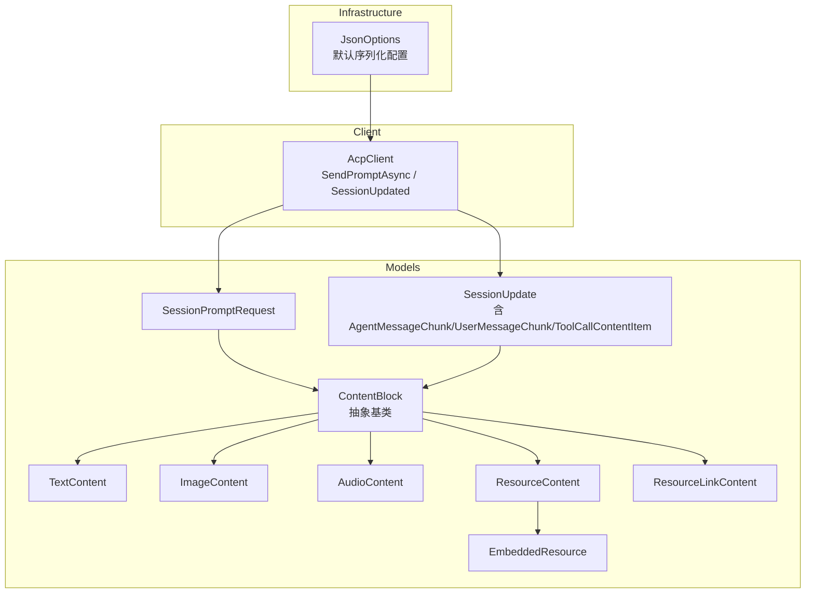
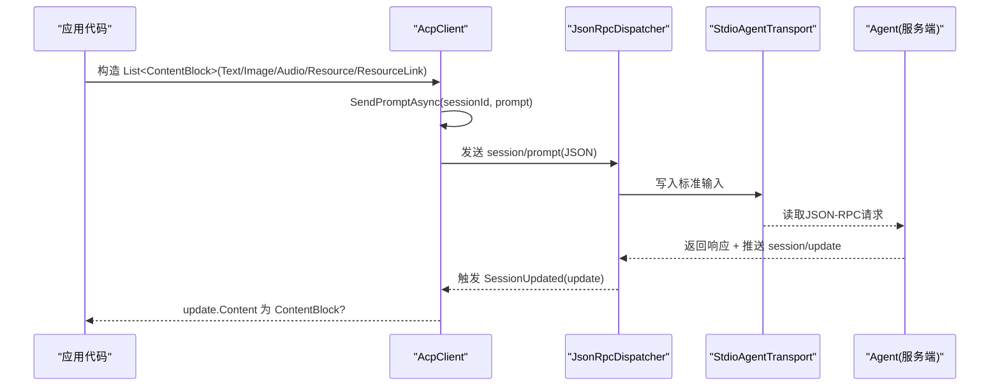
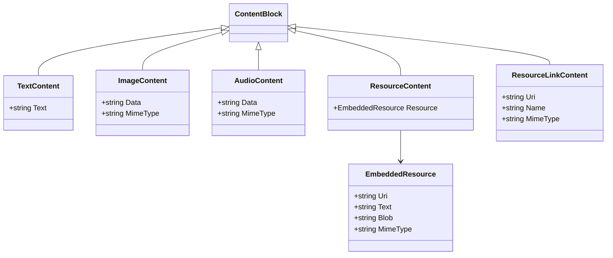
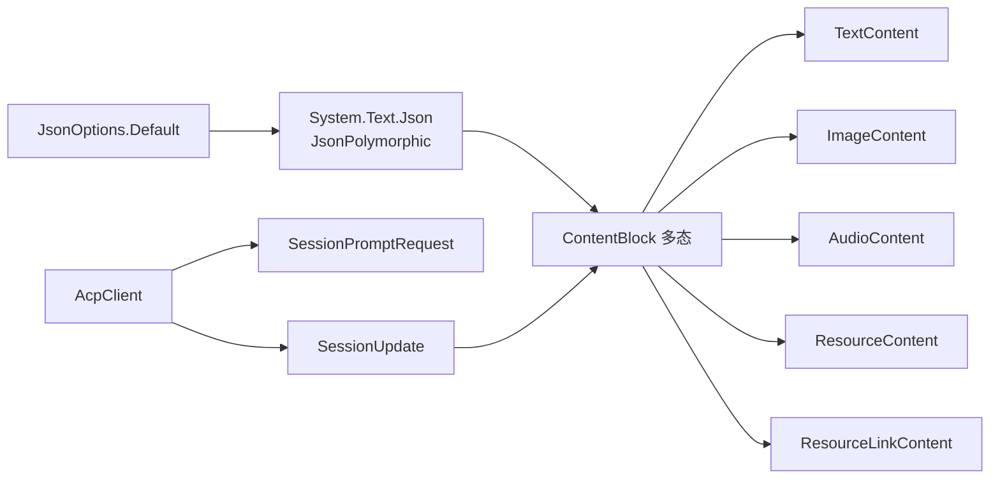

# 内容模型

<cite>
**本文引用的文件**   
- [ContentBlock.cs](file://Models/ContentBlock.cs)
- [SessionPromptRequest.cs](file://Models/SessionPromptRequest.cs)
- [SessionUpdate.cs](file://Models/SessionUpdate.cs)
- [JsonOptions.cs](file://Infrastructure/JsonOptions.cs)
- [AcpClient.cs](file://Client/AcpClient.cs)
- [README.md](file://README.md)
</cite>

## 目录
1. [简介](#简介)
2. [项目结构](#项目结构)
3. [核心组件](#核心组件)
4. [架构总览](#架构总览)
5. [详细组件分析](#详细组件分析)
6. [依赖关系分析](#依赖关系分析)
7. [性能考量](#性能考量)
8. [故障排查指南](#故障排查指南)
9. [结论](#结论)
10. [附录：创建与使用示例](#附录创建与使用示例)

## 简介
本文件聚焦于“内容块数据模型”的设计与实现，系统性说明 ContentBlock 抽象基类及其派生类型（TextContent、ImageContent、AudioContent、ResourceContent、ResourceLinkContent）的结构、属性、验证规则与适用场景。同时解释多模态内容的处理流程与类型识别机制，并提供最佳实践与常见问题排查建议，帮助读者在 ACP 协议下正确构建、传输与消费文本、图像、音频及资源型内容。

## 项目结构
内容模型位于 Models 命名空间，采用基于功能域的模块化组织方式：
- Models/ContentBlock.cs：定义 ContentBlock 抽象基类与各具体类型，以及嵌入式资源与资源链接结构。
- Models/SessionPromptRequest.cs：会话提示请求，包含 List<ContentBlock> Prompt 字段，用于发送多模态提示。
- Models/SessionUpdate.cs：会话更新流式通知，其中消息块携带 ContentBlock? 字段，体现接收端对多模态内容的消费。
- Infrastructure/JsonOptions.cs：全局 JSON 序列化选项，启用大小写不敏感、忽略空值、允许元数据属性乱序等，支撑多态反序列化。
- Client/AcpClient.cs：客户端调用入口，将 List<ContentBlock> 序列化为 session/prompt 请求参数，并订阅 SessionUpdated 事件以消费流式内容。
- README.md：快速开始示例展示了如何构造 TextContent 并作为 prompt 发送。

图表来源
- [ContentBlock.cs:1-79](file://Models/ContentBlock.cs#L1-L79)
- [SessionPromptRequest.cs:1-20](file://Models/SessionPromptRequest.cs#L1-L20)
- [SessionUpdate.cs:1-119](file://Models/SessionUpdate.cs#L1-L119)
- [JsonOptions.cs:1-28](file://Infrastructure/JsonOptions.cs#L1-L28)
- [AcpClient.cs:207-216](file://Client/AcpClient.cs#L207-L216)

章节来源
- [ContentBlock.cs:1-79](file://Models/ContentBlock.cs#L1-L79)
- [SessionPromptRequest.cs:1-20](file://Models/SessionPromptRequest.cs#L1-L20)
- [SessionUpdate.cs:1-119](file://Models/SessionUpdate.cs#L1-L119)
- [JsonOptions.cs:1-28](file://Infrastructure/JsonOptions.cs#L1-L28)
- [AcpClient.cs:207-216](file://Client/AcpClient.cs#L207-L216)

## 核心组件
- ContentBlock：多态基类，通过 type 字段进行 JSON 多态判别；未知类型回退到基类以避免扩展性错误。
- TextContent：纯文本内容，包含 text 字段。
- ImageContent：图像内容，包含 data（通常为 base64）与 mimeType。
- AudioContent：音频内容，包含 data（通常为 base64）与 mimeType。
- ResourceContent：内嵌资源，包含 EmbeddedResource（uri、可选 text/blob/mimeType）。
- ResourceLinkContent：资源链接，包含 uri、name、可选 mimeType。
- EmbeddedResource：支持 URI 引用与可选的文本或二进制负载，以及可选 MIME 类型。

这些类型共同构成 ACP 的多模态内容体系，既可用于用户输入（prompt），也可用于代理输出（streaming updates）。

章节来源
- [ContentBlock.cs:1-79](file://Models/ContentBlock.cs#L1-L79)

## 架构总览
内容模型在多模态通信中的关键路径如下：
- 客户端构造 List<ContentBlock> 作为 prompt，经 AcpClient.SendPromptAsync 序列化为 JSON-RPC 请求。
- 服务端（Agent）解析后生成流式 SessionUpdate，其中消息块携带 ContentBlock?，客户端通过 SessionUpdated 事件消费。
- JSON 多态由 System.Text.Json 的 JsonPolymorphic 驱动，type 字段决定具体派生类型；未知类型安全回退至基类。

图表来源
- [AcpClient.cs:207-216](file://Client/AcpClient.cs#L207-L216)
- [SessionUpdate.cs:24-48](file://Models/SessionUpdate.cs#L24-L48)
- [SessionPromptRequest.cs:6-13](file://Models/SessionPromptRequest.cs#L6-L13)

## 详细组件分析

### ContentBlock 抽象基类与多态判别
- 多态判别字段：type（字符串），用于区分 text、image、audio、resource、resource_link。
- 未知类型处理：IgnoreUnrecognizedTypeDiscriminators=true 且 UnknownDerivedTypeHandling=FallBackToBaseType，确保向前兼容。
- 序列化选项：默认忽略空值、属性名大小写不敏感、允许元数据属性乱序，提升鲁棒性与互操作性。

图表来源
- [ContentBlock.cs:1-79](file://Models/ContentBlock.cs#L1-L79)

章节来源
- [ContentBlock.cs:1-79](file://Models/ContentBlock.cs#L1-L79)
- [JsonOptions.cs:1-28](file://Infrastructure/JsonOptions.cs#L1-L28)

### TextContent
- 用途：传递纯文本片段，适合对话、指令、代码片段等。
- 属性：
  - text：必需的非空字符串（建议在业务层校验非空与长度限制）。
- 典型场景：
  - 用户提问、系统提示、工具描述等。
- 注意事项：
  - 若需富文本，可考虑分段为多个 TextContent 或使用资源引用。

章节来源
- [ContentBlock.cs:19-23](file://Models/ContentBlock.cs#L19-L23)

### ImageContent
- 用途：传递图像数据，常用于视觉理解或多模态输入。
- 属性：
  - data：通常为 base64 编码的图像字节串。
  - mimeType：如 image/png、image/jpeg 等，便于服务端解码。
- 典型场景：
  - 截图上传、OCR、图像问答。
- 注意事项：
  - 数据体积较大时，建议分片或改用 ResourceLinkContent 指向外部存储。
  - 务必设置正确的 mimeType，避免解码失败。

章节来源
- [ContentBlock.cs:25-32](file://Models/ContentBlock.cs#L25-L32)

### AudioContent
- 用途：传递音频数据，适用于语音转文本、音频分析等。
- 属性：
  - data：通常为 base64 编码的音频字节串。
  - mimeType：如 audio/wav、audio/mp3 等。
- 典型场景：
  - 语音助手、会议转录、音频分类。
- 注意事项：
  - 音频时长与采样率会影响处理成本，应在业务层做前置校验与压缩。

章节来源
- [ContentBlock.cs:34-41](file://Models/ContentBlock.cs#L34-L41)

### ResourceContent 与 EmbeddedResource
- 用途：承载内嵌资源，支持 URI 引用与可选文本/二进制负载。
- 属性：
  - resource.uri：资源的统一标识。
  - resource.text：可选文本内容（当资源为文本时）。
  - resource.blob：可选二进制内容（当资源为二进制时）。
  - resource.mimeType：可选 MIME 类型。
- 典型场景：
  - 文档片段、配置文件、结构化数据等。
- 注意事项：
  - 优先提供 uri，text/blob 仅在需要内联时提供，避免冗余。

章节来源
- [ContentBlock.cs:43-65](file://Models/ContentBlock.cs#L43-L65)

### ResourceLinkContent
- 用途：通过链接引用外部资源，减少 payload 体积。
- 属性：
  - uri：资源地址。
  - name：可读名称（可选语义信息）。
  - mimeType：可选 MIME 类型。
- 典型场景：
  - 大文件、远程图片/音频、云存储对象。
- 注意事项：
  - 确保 uri 可达且权限正确；必要时在服务端缓存。

章节来源
- [ContentBlock.cs:67-78](file://Models/ContentBlock.cs#L67-L78)

### 多模态内容的使用位置
- 发送侧：SessionPromptRequest.Prompt 为 List<ContentBlock>，用于一次请求中混合多种内容类型。
- 接收侧：AgentMessageChunk、UserMessageChunk、ToolCallContentItem.Content 均为 ContentBlock?，表示流式消息中可能包含任意类型的多模态内容。

章节来源
- [SessionPromptRequest.cs:6-13](file://Models/SessionPromptRequest.cs#L6-L13)
- [SessionUpdate.cs:24-48](file://Models/SessionUpdate.cs#L24-L48)
- [SessionUpdate.cs:81-89](file://Models/SessionUpdate.cs#L81-L89)

## 依赖关系分析
- 序列化依赖：System.Text.Json 的 JsonPolymorphic 与 JsonDerivedType 完成类型识别；JsonOptions.Default 提供统一的序列化行为。
- 客户端依赖：AcpClient 将 List<ContentBlock> 序列化为 JSON-RPC 请求，并通过事件分发 SessionUpdate。
- 模型间耦合：ContentBlock 与其派生类型松耦合，通过 type 字段解耦；EmbeddedResource 被 ResourceContent 组合。

图表来源
- [JsonOptions.cs:1-28](file://Infrastructure/JsonOptions.cs#L1-L28)
- [ContentBlock.cs:1-79](file://Models/ContentBlock.cs#L1-L79)
- [AcpClient.cs:207-216](file://Client/AcpClient.cs#L207-L216)
- [SessionPromptRequest.cs:6-13](file://Models/SessionPromptRequest.cs#L6-L13)
- [SessionUpdate.cs:24-48](file://Models/SessionUpdate.cs#L24-L48)

章节来源
- [JsonOptions.cs:1-28](file://Infrastructure/JsonOptions.cs#L1-L28)
- [ContentBlock.cs:1-79](file://Models/ContentBlock.cs#L1-L79)
- [AcpClient.cs:207-216](file://Client/AcpClient.cs#L207-L216)

## 性能考量
- 大对象传输：ImageContent/AudioContent 的 data 字段可能很大，建议：
  - 使用 ResourceLinkContent 指向外部存储，降低网络开销。
  - 对 data 进行合理压缩（如 JPEG/WebP、Opus/MP3）。
- 序列化开销：List<ContentBlock> 多态序列化有额外开销，建议：
  - 复用 JsonSerializerOptions（JsonOptions.Default）。
  - 批量发送时合并相近类型的内容块以减少元数据重复。
- 流式处理：SessionUpdate 中的 ContentBlock? 应增量消费，避免一次性加载全部消息。

[本节为通用指导，不直接分析具体文件]

## 故障排查指南
- 类型识别失败
  - 现象：收到未知 type 值导致反序列化异常。
  - 原因：未注册的新类型或 type 拼写不一致。
  - 解决：利用 IgnoreUnrecognizedTypeDiscriminators 与 FallBackToBaseType 保证兼容性；在服务端/客户端同步扩展类型映射。
- 缺少必要字段
  - 现象：ImageContent/AudioContent 无 mimeType 或 data 为空。
  - 解决：在业务层增加必填校验与默认值填充。
- 资源不可达
  - 现象：ResourceLinkContent 的 uri 无法访问。
  - 解决：检查网络、鉴权与跨域策略；在服务端增加重试与降级逻辑。
- 序列化问题
  - 现象：属性名大小写不一致导致反序列化失败。
  - 解决：启用 PropertyNameCaseInsensitive（已在 JsonOptions.Default 中配置）。

章节来源
- [ContentBlock.cs:7-9](file://Models/ContentBlock.cs#L7-L9)
- [JsonOptions.cs:15-22](file://Infrastructure/JsonOptions.cs#L15-L22)

## 结论
ContentBlock 及其派生类型构成了 ACP 多模态内容的核心数据结构，借助 System.Text.Json 的多态能力实现了灵活、可扩展的类型识别与序列化。通过合理的验证与转换策略，可在文本、图像、音频与资源之间无缝切换，满足复杂交互场景。结合流式 SessionUpdate 与客户端事件机制，可实现高效、健壮的多模态通信。

[本节为总结性内容，不直接分析具体文件]

## 附录：创建与使用示例
- 创建文本内容块
  - 构造 TextContent 并放入 List<ContentBlock>，作为 prompt 发送给 Agent。
  - 参考路径：[README.md:31](file://README.md#L31)
- 创建图像/音频内容块
  - 构造 ImageContent/AudioContent，设置 data（base64）与 mimeType，加入 prompt。
  - 参考路径：[ContentBlock.cs:25-41](file://Models/ContentBlock.cs#L25-L41)
- 使用资源引用
  - 构造 ResourceLinkContent 或 ResourceContent，优先使用 uri 引用外部资源。
  - 参考路径：[ContentBlock.cs:43-78](file://Models/ContentBlock.cs#L43-L78)
- 发送提示与消费更新
  - 使用 AcpClient.SendPromptAsync 发送 prompt；订阅 SessionUpdated 获取流式 ContentBlock?。
  - 参考路径：[AcpClient.cs:207-216](file://Client/AcpClient.cs#L207-L216)、[SessionUpdate.cs:24-48](file://Models/SessionUpdate.cs#L24-L48)

章节来源
- [README.md:31](file://README.md#L31)
- [ContentBlock.cs:25-78](file://Models/ContentBlock.cs#L25-L78)
- [AcpClient.cs:207-216](file://Client/AcpClient.cs#L207-L216)
- [SessionUpdate.cs:24-48](file://Models/SessionUpdate.cs#L24-L48)