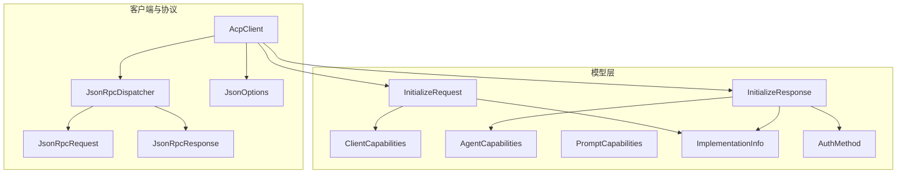
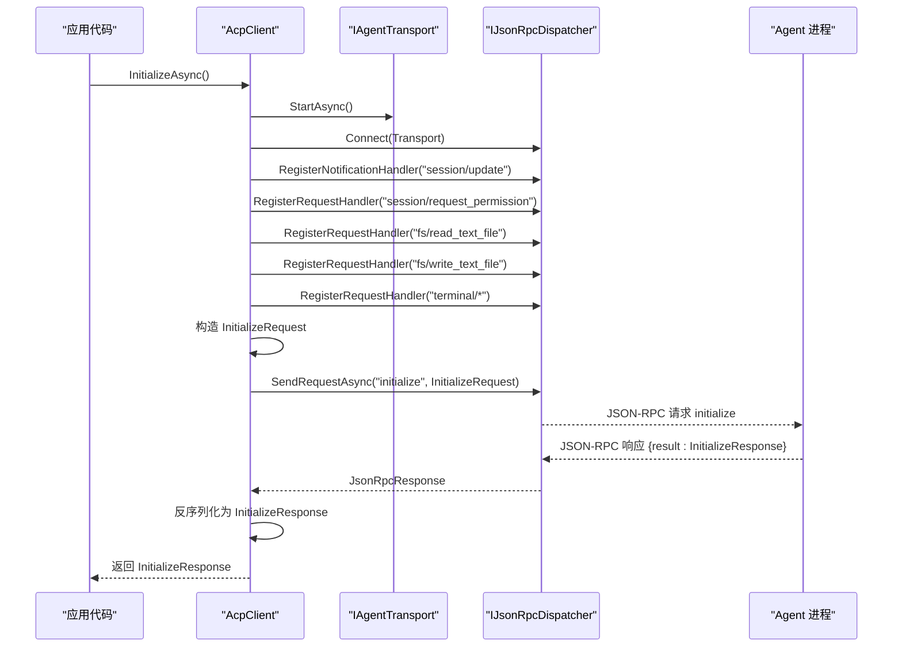
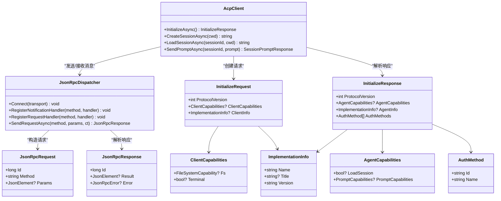

# 初始化模型

<cite>
**本文引用的文件**   
- [InitializeRequest.cs](file://Models/InitializeRequest.cs)
- [InitializeResponse.cs](file://Models/InitializeResponse.cs)
- [Capabilities.cs](file://Models/Capabilities.cs)
- [AcpClient.cs](file://Client/AcpClient.cs)
- [JsonOptions.cs](file://Infrastructure/JsonOptions.cs)
- [JsonRpcRequest.cs](file://JsonRpc/JsonRpcRequest.cs)
- [JsonRpcResponse.cs](file://JsonRpc/JsonRpcResponse.cs)
- [README.md](file://README.md)
</cite>

## 目录
1. [简介](#简介)
2. [项目结构](#项目结构)
3. [核心组件](#核心组件)
4. [架构总览](#架构总览)
5. [详细组件分析](#详细组件分析)
6. [依赖关系分析](#依赖关系分析)
7. [性能考虑](#性能考虑)
8. [故障排查指南](#故障排查指南)
9. [结论](#结论)
10. [附录：JSON 序列化与反序列化示例](#附录json-序列化与反序列化示例)

## 简介
本文件聚焦于 ACP（Agent Client Protocol）客户端初始化阶段的握手数据模型与流程，详细说明 InitializeRequest 与 InitializeResponse 的字段含义、用途及在握手过程中的作用；解释 ClientCapabilities 与 ImplementationInfo 的结构定义；并给出完整的 JSON 序列化和反序列化示例。同时总结客户端能力协商的实现细节与最佳实践，帮助读者正确实现兼容的客户端与 Agent 交互。

## 项目结构
初始化相关的数据模型集中在 Models 命名空间下，包括请求、响应以及能力描述等类型；初始化握手由 AcpClient 发起并通过 JsonRpcDispatcher 进行 JSON-RPC 通信；JSON 序列化选项统一由 Infrastructure.JsonOptions 提供。

图表来源
- [InitializeRequest.cs:5-15](file://Models/InitializeRequest.cs#L5-L15)
- [InitializeResponse.cs:5-27](file://Models/InitializeResponse.cs#L5-L27)
- [Capabilities.cs:5-64](file://Models/Capabilities.cs#L5-L64)
- [AcpClient.cs:48-182](file://Client/AcpClient.cs#L48-L182)
- [JsonRpcRequest.cs:7-18](file://JsonRpc/JsonRpcRequest.cs#L7-L18)
- [JsonRpcResponse.cs:7-19](file://JsonRpc/JsonRpcResponse.cs#L7-L19)
- [JsonOptions.cs:13-26](file://Infrastructure/JsonOptions.cs#L13-L26)

章节来源
- [README.md:1-33](file://README.md#L1-L33)

## 核心组件
- InitializeRequest：客户端向 Agent 发送的初始化请求，包含协议版本、客户端能力与客户端实现信息。
- InitializeResponse：Agent 返回的初始化响应，包含协议版本、Agent 能力、Agent 实现信息与认证方法列表。
- ClientCapabilities：客户端声明的能力集合，当前支持文件系统读写与终端能力开关。
- AgentCapabilities：Agent 声明的能力集合，包含会话加载与提示能力（图像、音频、嵌入式上下文）。
- ImplementationInfo：通用实现信息，包含名称、标题与版本号。
- AuthMethod：支持的认证方法标识与名称。

章节来源
- [InitializeRequest.cs:5-15](file://Models/InitializeRequest.cs#L5-L15)
- [InitializeResponse.cs:5-27](file://Models/InitializeResponse.cs#L5-L27)
- [Capabilities.cs:5-64](file://Models/Capabilities.cs#L5-L64)

## 架构总览
初始化握手通过 AcpClient.InitializeAsync 完成：启动传输、连接分发器、注册通知与请求处理器、构造 InitializeRequest 并发送“initialize”方法调用，随后解析 InitializeResponse 并校验协议版本。

图表来源
- [AcpClient.cs:48-182](file://Client/AcpClient.cs#L48-L182)
- [JsonRpcRequest.cs:7-18](file://JsonRpc/JsonRpcRequest.cs#L7-L18)
- [JsonRpcResponse.cs:7-19](file://JsonRpc/JsonRpcResponse.cs#L7-L19)

## 详细组件分析

### InitializeRequest 类
- 字段说明
  - ProtocolVersion：客户端期望使用的协议版本，默认值为 1。
  - ClientCapabilities：可选，客户端能力声明，用于协商后续功能。
  - ClientInfo：可选，客户端实现信息（名称、标题、版本）。
- 设计要点
  - 使用 record 类型，属性为 init-only，保证不可变性与简洁性。
  - 使用 JsonPropertyName 指定 JSON 键名，确保与协议一致。
  - 可选字段允许为空，便于向后兼容与渐进式能力扩展。

章节来源
- [InitializeRequest.cs:5-15](file://Models/InitializeRequest.cs#L5-L15)

### InitializeResponse 类
- 字段说明
  - ProtocolVersion：Agent 确认的协议版本，客户端需据此判断兼容性。
  - AgentCapabilities：可选，Agent 能力声明，如是否支持会话加载与提示能力。
  - AgentInfo：可选，Agent 实现信息（名称、标题、版本）。
  - AuthMethods：可选，支持的认证方法列表，每项包含 id 与 name。
- 设计要点
  - 使用 record 类型，属性为 init-only。
  - 可选字段允许为空，避免不必要的冗余。
  - AuthMethod 作为独立记录类型，便于扩展更多认证方式。

章节来源
- [InitializeResponse.cs:5-27](file://Models/InitializeResponse.cs#L5-L27)

### ClientCapabilities 与 AgentCapabilities
- ClientCapabilities
  - Fs：文件系统能力，包含 ReadTextFile 与 WriteTextFile 布尔开关。
  - Terminal：终端能力开关，表示客户端是否支持终端交互。
- AgentCapabilities
  - LoadSession：是否支持加载已有会话。
  - PromptCapabilities：提示能力，包含 Image、Audio、EmbeddedContext 布尔开关。
- 设计要点
  - 所有能力均为可空布尔或对象，便于未来新增能力而不破坏兼容性。
  - 使用 JsonIgnoreCondition.WhenWritingNull 减少无效字段输出。

章节来源
- [Capabilities.cs:5-51](file://Models/Capabilities.cs#L5-L51)

### ImplementationInfo
- 字段说明
  - Name：实现名称（必填）。
  - Title：显示标题（可选）。
  - Version：版本号（必填）。
- 设计要点
  - 适用于客户端与 Agent 双方互相暴露实现信息，便于调试与诊断。

章节来源
- [Capabilities.cs:53-64](file://Models/Capabilities.cs#L53-L64)

### 初始化握手流程中的对象作用
- 客户端构造 InitializeRequest，声明自身能力与实现信息，并指定协议版本。
- Agent 返回 InitializeResponse，确认协议版本、声明自身能力与实现信息，并提供可用认证方法。
- 客户端根据返回的 AgentCapabilities 决定后续行为（例如是否启用终端、是否支持图片/音频输入等）。
- 若协议版本不匹配，客户端应记录警告并按策略处理（如降级或终止）。

章节来源
- [AcpClient.cs:149-182](file://Client/AcpClient.cs#L149-L182)

## 依赖关系分析
- AcpClient 依赖 JsonRpcDispatcher 发送/接收 JSON-RPC 消息。
- JsonRpcRequest/JsonRpcResponse 是底层消息载体，携带 id、method、params/result/error。
- JsonOptions 提供统一的序列化配置，包括忽略 null、大小写不敏感、枚举字符串化等。
- Models 下的各类记录类型通过 JsonPropertyName 映射到 JSON 字段。

图表来源
- [AcpClient.cs:48-182](file://Client/AcpClient.cs#L48-L182)
- [JsonRpcRequest.cs:7-18](file://JsonRpc/JsonRpcRequest.cs#L7-L18)
- [JsonRpcResponse.cs:7-19](file://JsonRpc/JsonRpcResponse.cs#L7-L19)
- [InitializeRequest.cs:5-15](file://Models/InitializeRequest.cs#L5-L15)
- [InitializeResponse.cs:5-27](file://Models/InitializeResponse.cs#L5-L27)
- [Capabilities.cs:5-64](file://Models/Capabilities.cs#L5-L64)

## 性能考虑
- 使用 record 与 init-only 属性可减少对象创建开销与可变状态带来的额外检查。
- 使用 JsonIgnoreCondition.WhenWritingNull 避免输出空字段，降低网络负载。
- 统一 JsonSerializerOptions 复用，避免重复构建序列化配置。
- 在能力协商中仅声明必要能力，减少不必要的数据交换。

[本节为通用指导，不直接分析具体文件]

## 故障排查指南
- 协议版本不匹配：当 Agent 返回的 ProtocolVersion 与客户端不一致时，客户端会记录警告。建议客户端根据版本差异采取降级或终止策略。
- 能力缺失：如果 Agent 未声明某项能力（如终端），客户端应避免调用相关方法或回退到替代方案。
- 认证方法为空：若 AuthMethods 为空，客户端不应尝试认证流程，或按默认策略处理。
- 日志定位：AcpClient 在初始化过程中记录关键步骤与异常，可通过 ILogger 查看详细信息。

章节来源
- [AcpClient.cs:175-179](file://Client/AcpClient.cs#L175-L179)

## 结论
InitializeRequest 与 InitializeResponse 构成了 ACP 客户端与 Agent 之间的能力协商与实现信息交换的核心。通过明确的能力声明与版本控制，双方可以在稳定、可扩展的基础上进行后续交互。遵循本文的最佳实践，可以确保客户端在不同 Agent 实现间的兼容性与健壮性。

[本节为总结性内容，不直接分析具体文件]

## 附录：JSON 序列化与反序列化示例
以下示例展示 InitializeRequest 与 InitializeResponse 的典型 JSON 格式，供参考与对照。实际序列化/反序列化由 JsonOptions.Default 统一管理，包含大小写不敏感、忽略 null、枚举字符串化等配置。

- InitializeRequest 示例
{
  "protocolVersion": 1,
  "clientCapabilities": {
    "fs": {
      "readTextFile": true,
      "writeTextFile": true
    },
    "terminal": false
  },
  "clientInfo": {
    "name": "agentic-desktop",
    "title": "Agentic Desktop",
    "version": "1.0.0"
  }
}

- InitializeResponse 示例
{
  "protocolVersion": 1,
  "agentCapabilities": {
    "loadSession": true,
    "promptCapabilities": {
      "image": true,
      "audio": true,
      "embeddedContext": false
    }
  },
  "agentInfo": {
    "name": "example-agent",
    "title": "Example Agent",
    "version": "0.1.0"
  },
  "authMethods": [
    {
      "id": "basic",
      "name": "Basic Authentication"
    }
  ]
}

章节来源
- [JsonOptions.cs:13-26](file://Infrastructure/JsonOptions.cs#L13-L26)
- [AcpClient.cs:149-182](file://Client/AcpClient.cs#L149-L182)