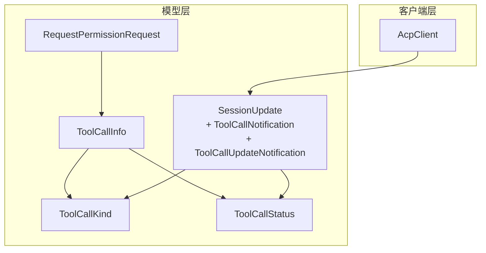
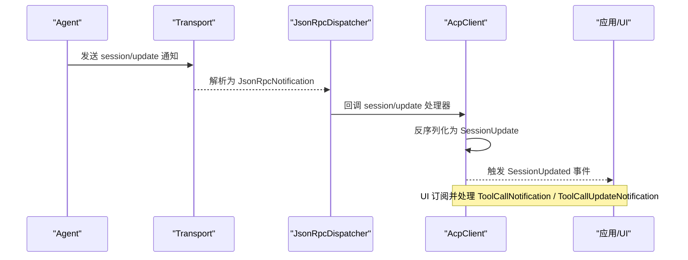
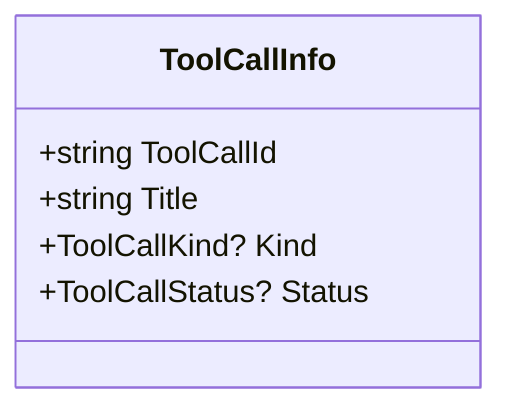
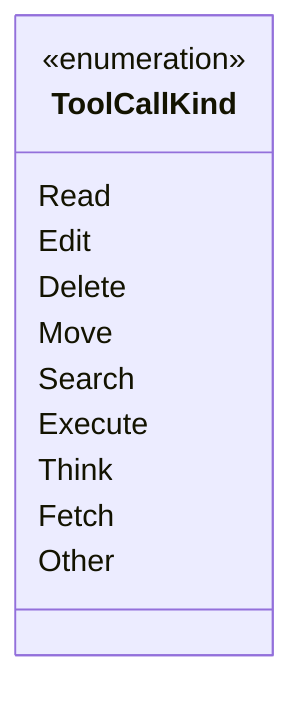
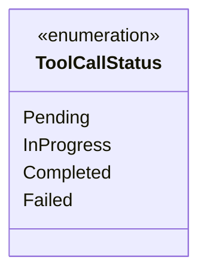
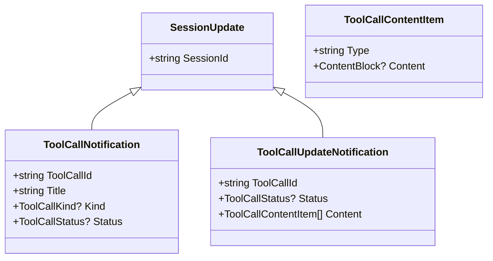
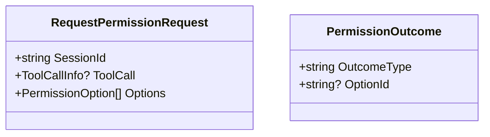
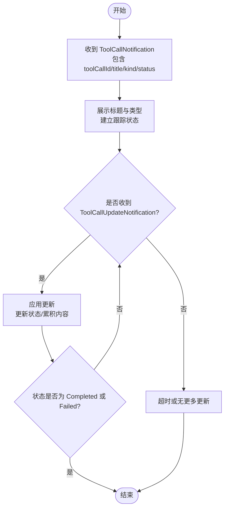
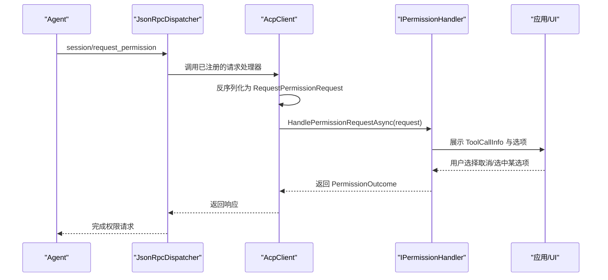
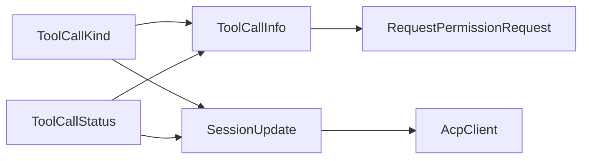

# 工具模型

<cite>
**本文引用的文件**   
- [Models/ToolCall.cs](file://Models/ToolCall.cs)
- [Models/Enums/ToolCallKind.cs](file://Models/Enums/ToolCallKind.cs)
- [Models/Enums/ToolCallStatus.cs](file://Models/Enums/ToolCallStatus.cs)
- [Models/SessionUpdate.cs](file://Models/SessionUpdate.cs)
- [Models/RequestPermissionRequest.cs](file://Models/RequestPermissionRequest.cs)
- [Client/AcpClient.cs](file://Client/AcpClient.cs)
- [README.md](file://README.md)
</cite>

## 目录
1. [简介](#简介)
2. [项目结构](#项目结构)
3. [核心组件](#核心组件)
4. [架构总览](#架构总览)
5. [详细组件分析](#详细组件分析)
6. [依赖关系分析](#依赖关系分析)
7. [性能考量](#性能考量)
8. [故障排查指南](#故障排查指南)
9. [结论](#结论)
10. [附录](#附录)

## 简介
本文件聚焦于“工具调用”相关数据模型的详细说明，包括：
- ToolCallInfo 的属性与用途（工具标识、标题、类型、状态）
- ToolCallKind 枚举的工具类型（读取、编辑、删除、移动、搜索、执行、思考、抓取、其他）
- ToolCallStatus 枚举的执行状态（待处理、进行中、已完成、失败）
- 工具调用的完整生命周期示例（从请求到执行的各阶段）
- 错误处理与状态监控模式（权限请求、流式更新、异常分支）

该库通过 JSON-RPC 与 ACP 兼容的 Agent 通信，工具调用以 SessionUpdate 的子类型进行流式通知，并在需要时触发权限请求。

## 项目结构
围绕工具调用的关键代码位于 Models 与 Client 层：
- Models/ToolCall.cs：定义 ToolCallInfo 记录，用于携带工具调用的元信息
- Models/Enums/ToolCallKind.cs：定义工具类型枚举
- Models/Enums/ToolCallStatus.cs：定义工具执行状态枚举
- Models/SessionUpdate.cs：定义工具调用相关的通知类型（初始通知与更新通知）
- Models/RequestPermissionRequest.cs：在需要用户授权时携带 ToolCallInfo
- Client/AcpClient.cs：注册 session/update 通知处理器，转发 ToolCall 相关事件

图表来源
- [Models/ToolCall.cs:6-21](file://Models/ToolCall.cs#L6-L21)
- [Models/Enums/ToolCallKind.cs:6-26](file://Models/Enums/ToolCallKind.cs#L6-L26)
- [Models/Enums/ToolCallStatus.cs:6-16](file://Models/Enums/ToolCallStatus.cs#L6-L16)
- [Models/SessionUpdate.cs:50-79](file://Models/SessionUpdate.cs#L50-L79)
- [Models/RequestPermissionRequest.cs:5-15](file://Models/RequestPermissionRequest.cs#L5-L15)
- [Client/AcpClient.cs:64-72](file://Client/AcpClient.cs#L64-L72)

章节来源
- [Models/ToolCall.cs:6-21](file://Models/ToolCall.cs#L6-L21)
- [Models/Enums/ToolCallKind.cs:6-26](file://Models/Enums/ToolCallKind.cs#L6-L26)
- [Models/Enums/ToolCallStatus.cs:6-16](file://Models/Enums/ToolCallStatus.cs#L6-L16)
- [Models/SessionUpdate.cs:50-79](file://Models/SessionUpdate.cs#L50-L79)
- [Models/RequestPermissionRequest.cs:5-15](file://Models/RequestPermissionRequest.cs#L5-L15)
- [Client/AcpClient.cs:64-72](file://Client/AcpClient.cs#L64-L72)

## 核心组件
- ToolCallInfo：不可变记录，包含工具调用标识、标题、可选的类型与状态。常用于权限请求中向用户展示即将执行的操作摘要。
- ToolCallKind：工具类型枚举，涵盖读、写、删、移、搜、执行、思考、抓取、其他等常见操作类别。
- ToolCallStatus：工具执行状态枚举，覆盖待处理、进行中、已完成、失败四种典型状态。
- ToolCallNotification：工具调用初始通知，包含 toolCallId、title、kind、status，表示一次工具调用的开始。
- ToolCallUpdateNotification：工具调用更新通知，包含 toolCallId、status 以及可选的内容片段列表，用于增量更新执行进度或结果。
- RequestPermissionRequest：当 Agent 需要用户授权时发送的请求，包含 sessionId、toolCall（ToolCallInfo）、options（可选选项）。

章节来源
- [Models/ToolCall.cs:6-21](file://Models/ToolCall.cs#L6-L21)
- [Models/Enums/ToolCallKind.cs:6-26](file://Models/Enums/ToolCallKind.cs#L6-L26)
- [Models/Enums/ToolCallStatus.cs:6-16](file://Models/Enums/ToolCallStatus.cs#L6-L16)
- [Models/SessionUpdate.cs:50-79](file://Models/SessionUpdate.cs#L50-L79)
- [Models/RequestPermissionRequest.cs:5-15](file://Models/RequestPermissionRequest.cs#L5-L15)

## 架构总览
工具调用在 ACP 协议中以“会话更新”的形式流式推送。客户端在初始化时注册 session/update 通知处理器，将收到的 SessionUpdate 派发到上层事件。工具调用涉及两类通知：
- ToolCallNotification：首次通知，提供工具调用的基本信息（ID、标题、类型、初始状态）
- ToolCallUpdateNotification：后续更新，提供状态变更与内容片段（如输出、日志、中间结果）

图表来源
- [Client/AcpClient.cs:64-72](file://Client/AcpClient.cs#L64-L72)
- [Models/SessionUpdate.cs:8-18](file://Models/SessionUpdate.cs#L8-L18)

章节来源
- [Client/AcpClient.cs:64-72](file://Client/AcpClient.cs#L64-L72)
- [Models/SessionUpdate.cs:8-18](file://Models/SessionUpdate.cs#L8-L18)

## 详细组件分析

### ToolCallInfo 数据结构
- 字段说明
  - ToolCallId：唯一标识一次工具调用，贯穿整个生命周期
  - Title：人类可读的标题，便于展示
  - Kind：工具类型（可选），对应 ToolCallKind
  - Status：当前状态（可选），对应 ToolCallStatus
- 设计要点
  - 使用 record 实现不可变性与值语义
  - 使用 JsonPropertyName 控制序列化键名
  - Kind 与 Status 可空，避免早期消息缺少这些字段导致解析失败

图表来源
- [Models/ToolCall.cs:6-21](file://Models/ToolCall.cs#L6-L21)

章节来源
- [Models/ToolCall.cs:6-21](file://Models/ToolCall.cs#L6-L21)

### ToolCallKind 枚举
- 取值与含义
  - Read：读取类操作
  - Edit：编辑类操作
  - Delete：删除类操作
  - Move：移动类操作
  - Search：搜索类操作
  - Execute：命令执行类操作
  - Think：思考/推理类操作
  - Fetch：抓取/拉取类操作
  - Other：其他未分类操作
- 设计要点
  - 使用 JsonStringEnumConverter 与 JsonStringEnumMemberName 确保与协议字符串一致

图表来源
- [Models/Enums/ToolCallKind.cs:6-26](file://Models/Enums/ToolCallKind.cs#L6-L26)

章节来源
- [Models/Enums/ToolCallKind.cs:6-26](file://Models/Enums/ToolCallKind.cs#L6-L26)

### ToolCallStatus 枚举
- 取值与含义
  - Pending：待处理
  - InProgress：进行中
  - Completed：已完成
  - Failed：失败
- 设计要点
  - 使用 JsonStringEnumConverter 与 JsonStringEnumMemberName 确保与协议字符串一致

图表来源
- [Models/Enums/ToolCallStatus.cs:6-16](file://Models/Enums/ToolCallStatus.cs#L6-L16)

章节来源
- [Models/Enums/ToolCallStatus.cs:6-16](file://Models/Enums/ToolCallStatus.cs#L6-L16)

### 工具调用通知模型
- ToolCallNotification
  - 字段：sessionId、toolCallId、title、kind、status
  - 作用：表示一次工具调用的初始通知，通常包含 kind 与初始 status
- ToolCallUpdateNotification
  - 字段：sessionId、toolCallId、status、content（可选）
  - 作用：表示工具调用的增量更新，可能多次推送，直至最终状态
- ToolCallContentItem
  - 字段：type、content（可选）
  - 作用：承载工具执行过程中的内容片段（文本、图片、资源链接等）

图表来源
- [Models/SessionUpdate.cs:8-18](file://Models/SessionUpdate.cs#L8-L18)
- [Models/SessionUpdate.cs:50-79](file://Models/SessionUpdate.cs#L50-L79)
- [Models/SessionUpdate.cs:81-89](file://Models/SessionUpdate.cs#L81-L89)

章节来源
- [Models/SessionUpdate.cs:50-79](file://Models/SessionUpdate.cs#L50-L79)
- [Models/SessionUpdate.cs:81-89](file://Models/SessionUpdate.cs#L81-L89)

### 权限请求中的工具调用信息
- RequestPermissionRequest
  - 字段：sessionId、toolCall（ToolCallInfo）、options（可选）
  - 作用：当 Agent 需要用户授权时，附带 ToolCallInfo 以便用户理解将要执行的操作
- PermissionOutcome
  - 字段：outcomeType、optionId（可选）
  - 作用：返回用户的选择结果（取消或选择某项）

图表来源
- [Models/RequestPermissionRequest.cs:5-15](file://Models/RequestPermissionRequest.cs#L5-L15)
- [Models/RequestPermissionRequest.cs:29-46](file://Models/RequestPermissionRequest.cs#L29-L46)

章节来源
- [Models/RequestPermissionRequest.cs:5-15](file://Models/RequestPermissionRequest.cs#L5-L15)
- [Models/RequestPermissionRequest.cs:29-46](file://Models/RequestPermissionRequest.cs#L29-L46)

### 工具调用生命周期示例
以下流程展示了从收到初始通知到完成/失败的典型路径：

章节来源
- [Models/SessionUpdate.cs:50-79](file://Models/SessionUpdate.cs#L50-L79)
- [Client/AcpClient.cs:64-72](file://Client/AcpClient.cs#L64-L72)

### 权限审批流程（与工具调用关联）
当工具调用需要用户授权时，Agent 会发起 session/request_permission 请求，客户端将 ToolCallInfo 传递给上层处理器：

图表来源
- [Client/AcpClient.cs:75-99](file://Client/AcpClient.cs#L75-L99)
- [Models/RequestPermissionRequest.cs:5-15](file://Models/RequestPermissionRequest.cs#L5-L15)
- [Models/RequestPermissionRequest.cs:29-46](file://Models/RequestPermissionRequest.cs#L29-L46)

章节来源
- [Client/AcpClient.cs:75-99](file://Client/AcpClient.cs#L75-L99)
- [Models/RequestPermissionRequest.cs:5-15](file://Models/RequestPermissionRequest.cs#L5-L15)
- [Models/RequestPermissionRequest.cs:29-46](file://Models/RequestPermissionRequest.cs#L29-L46)

## 依赖关系分析
- ToolCallInfo 依赖 ToolCallKind 与 ToolCallStatus 两个枚举
- ToolCallNotification 与 ToolCallUpdateNotification 依赖上述枚举，并通过 SessionUpdate 的多态分发机制被识别
- AcpClient 在初始化时注册 session/update 处理器，将收到的通知转换为 SessionUpdate 并触发事件
- RequestPermissionRequest 在权限请求中使用 ToolCallInfo 来描述待授权的工具调用

图表来源
- [Models/ToolCall.cs:6-21](file://Models/ToolCall.cs#L6-L21)
- [Models/Enums/ToolCallKind.cs:6-26](file://Models/Enums/ToolCallKind.cs#L6-L26)
- [Models/Enums/ToolCallStatus.cs:6-16](file://Models/Enums/ToolCallStatus.cs#L6-L16)
- [Models/SessionUpdate.cs:8-18](file://Models/SessionUpdate.cs#L8-L18)
- [Client/AcpClient.cs:64-72](file://Client/AcpClient.cs#L64-L72)

章节来源
- [Models/ToolCall.cs:6-21](file://Models/ToolCall.cs#L6-L21)
- [Models/SessionUpdate.cs:8-18](file://Models/SessionUpdate.cs#L8-L18)
- [Client/AcpClient.cs:64-72](file://Client/AcpClient.cs#L64-L72)

## 性能考量
- 流式更新：ToolCallUpdateNotification 支持增量推送，适合长耗时任务的分段输出，减少一次性大对象传输
- 多态反序列化：SessionUpdate 使用 type 字段作为判别器，未知类型回退到基类，提升兼容性同时避免解析失败
- 可空字段：Kind 与 Status 可空，允许早期消息不包含这些字段，降低解析开销与错误率
- 事件驱动：AcpClient 通过事件 SessionUpdated 解耦通知处理，避免阻塞主流程

[本节为通用指导，不直接分析具体文件]

## 故障排查指南
- 未设置权限处理器
  - 现象：session/request_permission 请求返回默认取消结果
  - 原因：PermissionHandler 未赋值
  - 解决：在 InitializeAsync 之前设置 PermissionHandler
- 文件系统不可用
  - 现象：fs/read_text_file 或 fs/write_text_file 返回特定错误码
  - 原因：FileSystemHandler 未设置
  - 解决：设置 FileSystemHandler
- 终端处理器不可用
  - 现象：terminal/* 方法返回“终端处理器不可用”错误
  - 原因：TerminalHandler 未设置
  - 解决：设置 TerminalHandler
- 协议版本不匹配
  - 现象：Initialize 后记录警告日志
  - 原因：Agent 与客户端协议版本不一致
  - 解决：升级或降级客户端/Agent 以匹配协议版本

章节来源
- [Client/AcpClient.cs:75-99](file://Client/AcpClient.cs#L75-L99)
- [Client/AcpClient.cs:102-144](file://Client/AcpClient.cs#L102-L144)
- [Client/AcpClient.cs:250-359](file://Client/AcpClient.cs#L250-L359)
- [Client/AcpClient.cs:176-179](file://Client/AcpClient.cs#L176-L179)

## 结论
工具调用模型通过简洁的数据结构与清晰的枚举定义，配合流式通知与权限请求机制，提供了完整的工具执行生命周期管理能力。开发者只需订阅 SessionUpdated 事件，即可对 ToolCallNotification 与 ToolCallUpdateNotification 进行处理，实现状态监控、进度展示与错误处理。

[本节为总结性内容，不直接分析具体文件]

## 附录
- 快速上手参考：README 中提供了客户端初始化、创建会话、发送提示的基本用法，可作为集成工具调用的起点

章节来源
- [README.md:1-99](file://README.md#L1-L99)