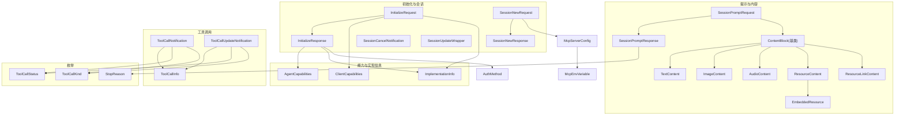
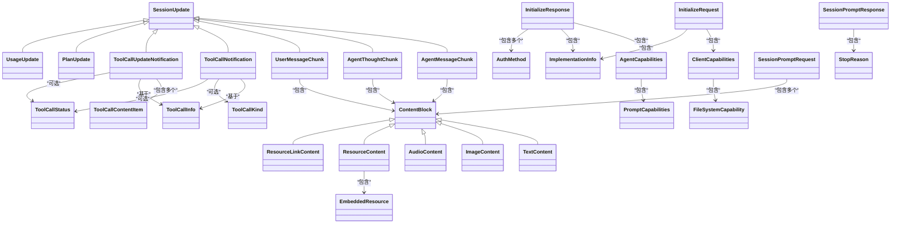
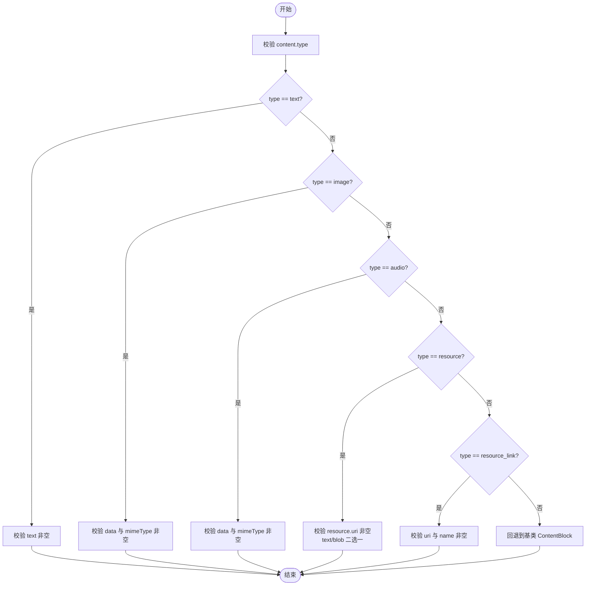
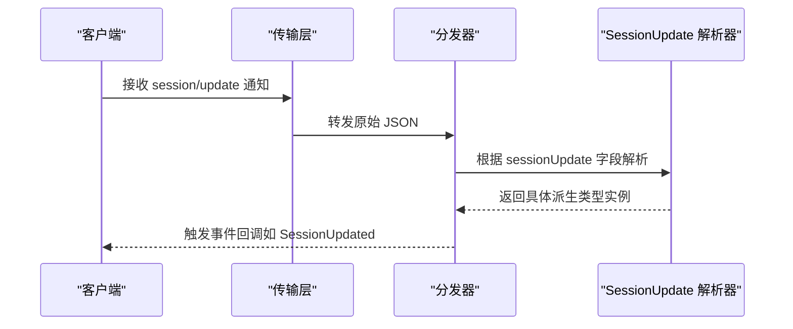
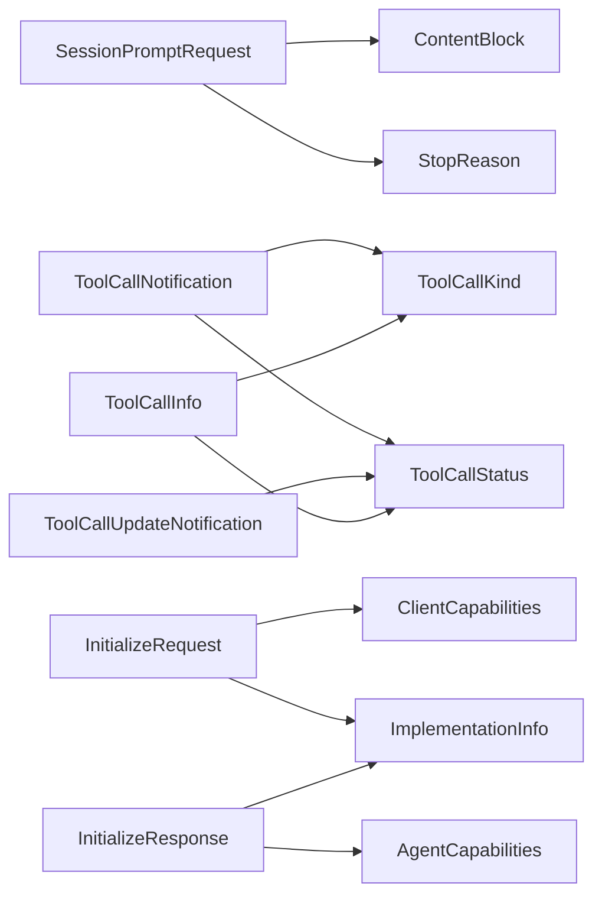

# 数据模型

<cite>
**本文引用的文件**
- [InitializeRequest.cs](file://Models/InitializeRequest.cs)
- [InitializeResponse.cs](file://Models/InitializeResponse.cs)
- [ContentBlock.cs](file://Models/ContentBlock.cs)
- [SessionPromptRequest.cs](file://Models/SessionPromptRequest.cs)
- [SessionUpdate.cs](file://Models/SessionUpdate.cs)
- [ToolCall.cs](file://Models/ToolCall.cs)
- [Capabilities.cs](file://Models/Capabilities.cs)
- [StopReason.cs](file://Models/Enums/StopReason.cs)
- [ToolCallKind.cs](file://Models/Enums/ToolCallKind.cs)
- [ToolCallStatus.cs](file://Models/Enums/ToolCallStatus.cs)
- [SessionNewRequest.cs](file://Models/SessionNewRequest.cs)
- [SessionCancelNotification.cs](file://Models/SessionCancelNotification.cs)
- [SessionUpdateWrapper.cs](file://Models/SessionUpdateWrapper.cs)
- [RequestPermissionRequest.cs](file://Models/RequestPermissionRequest.cs)
- [JsonOptions.cs](file://Infrastructure/JsonOptions.cs)
</cite>

## 更新摘要
**所做更改**
- 更新了 ContentBlock、SessionUpdate、SessionNewRequest、SessionUpdateWrapper 的英文文档，增强了多态类型判别和规格合规性说明
- 改进了 JSON 序列化配置中关于元数据属性顺序的处理说明
- 增强了多态解析的容错机制描述

## 目录
1. [简介](#简介)
2. [项目结构](#项目结构)
3. [核心组件](#核心组件)
4. [架构总览](#架构总览)
5. [详细组件分析](#详细组件分析)
6. [依赖关系分析](#依赖关系分析)
7. [性能考虑](#性能考虑)
8. [故障排查指南](#故障排查指南)
9. [结论](#结论)
10. [附录](#附录)

## 简介
本文件系统化梳理并文档化该代码库中的数据模型，覆盖初始化、会话、提示内容、工具调用、能力声明与枚举等。重点说明：
- 所有数据类与结构的属性、数据类型、验证规则与约束条件
- 对象之间的关系与继承层次结构
- JSON 序列化与反序列化的配置选项
- 完整示例数据与使用场景
- 枚举类型的定义与使用（StopReason、ToolCallKind、ToolCallStatus）

**更新** 本次更新重点关注多态类型判别的改进和规格合规性增强，特别是在 ContentBlock、SessionUpdate、SessionNewRequest 和 SessionUpdateWrapper 中的实现。

## 项目结构
数据模型集中在 Models 命名空间下，按职责划分：
- 初始化与会话：InitializeRequest/Response、SessionNewRequest/Response、SessionCancelNotification、SessionUpdateWrapper
- 提示与内容：SessionPromptRequest/Response、ContentBlock 及其派生类型
- 工具调用：ToolCallInfo、ToolCall 相关通知与更新
- 能力与实现信息：ClientCapabilities、AgentCapabilities、ImplementationInfo
- 枚举：StopReason、ToolCallKind、ToolCallStatus
- JSON 序列化全局配置：Infrastructure.JsonOptions

图表来源
- [InitializeRequest.cs:1-16](file://Models/InitializeRequest.cs#L1-L16)
- [InitializeResponse.cs:1-28](file://Models/InitializeResponse.cs#L1-L28)
- [SessionNewRequest.cs:1-45](file://Models/SessionNewRequest.cs#L1-L45)
- [SessionCancelNotification.cs:1-10](file://Models/SessionCancelNotification.cs#L1-L10)
- [SessionUpdateWrapper.cs:1-17](file://Models/SessionUpdateWrapper.cs#L1-L17)
- [SessionPromptRequest.cs:1-20](file://Models/SessionPromptRequest.cs#L1-L20)
- [ContentBlock.cs:1-79](file://Models/ContentBlock.cs#L1-L79)
- [ToolCall.cs:1-22](file://Models/ToolCall.cs#L1-L22)
- [SessionUpdate.cs:1-119](file://Models/SessionUpdate.cs#L1-L119)
- [Capabilities.cs:1-65](file://Models/Capabilities.cs#L1-L65)
- [StopReason.cs:1-19](file://Models/Enums/StopReason.cs#L1-L19)
- [ToolCallKind.cs:1-27](file://Models/Enums/ToolCallKind.cs#L1-L27)
- [ToolCallStatus.cs:1-17](file://Models/Enums/ToolCallStatus.cs#L1-L17)

章节来源
- [InitializeRequest.cs:1-16](file://Models/InitializeRequest.cs#L1-L16)
- [InitializeResponse.cs:1-28](file://Models/InitializeResponse.cs#L1-L28)
- [SessionNewRequest.cs:1-45](file://Models/SessionNewRequest.cs#L1-L45)
- [SessionCancelNotification.cs:1-10](file://Models/SessionCancelNotification.cs#L1-L10)
- [SessionUpdateWrapper.cs:1-17](file://Models/SessionUpdateWrapper.cs#L1-L17)
- [SessionPromptRequest.cs:1-20](file://Models/SessionPromptRequest.cs#L1-L20)
- [ContentBlock.cs:1-79](file://Models/ContentBlock.cs#L1-L79)
- [ToolCall.cs:1-22](file://Models/ToolCall.cs#L1-L22)
- [SessionUpdate.cs:1-119](file://Models/SessionUpdate.cs#L1-L119)
- [Capabilities.cs:1-65](file://Models/Capabilities.cs#L1-L65)
- [StopReason.cs:1-19](file://Models/Enums/StopReason.cs#L1-L19)
- [ToolCallKind.cs:1-27](file://Models/Enums/ToolCallKind.cs#L1-L27)
- [ToolCallStatus.cs:1-17](file://Models/Enums/ToolCallStatus.cs#L1-L17)

## 核心组件
本节对关键数据模型进行概览性说明，包括用途、关键字段与约束要点。

- InitializeRequest / InitializeResponse
  - 用于客户端与 Agent 的握手阶段，声明协议版本、客户端/代理能力与实现信息。
  - 字段包含协议版本、客户端能力、客户端实现信息；响应包含代理能力、代理实现信息与认证方法列表。
  - 可选字段在写入时若为 null 将被忽略。

- SessionNewRequest / SessionNewResponse
  - 创建新会话，要求提供工作目录与 MCP 服务器配置数组（即使为空也需发送）。
  - 返回会话标识。
  - **更新** 根据 ACP 规范，mcpServers 是必需数组字段，当省略时必须发送空数组以避免参数验证错误。

- SessionCancelNotification
  - 取消指定会话的通知消息。

- SessionPromptRequest / SessionPromptResponse
  - 提交多模态提示内容（文本、图像、音频、资源等），返回停止原因。

- ContentBlock 及派生类型
  - 通过 type 字段进行多态判别，支持文本、图像、音频、内嵌资源、资源链接等。
  - **更新** 采用 JsonPolymorphic 特性，未知类型将回退到基类以避免解析错误，提升向后兼容性。

- SessionUpdate 及派生类型
  - 通过 sessionUpdate 字段进行多态判别，支持代理消息片段、思考片段、用户消息片段、工具调用通知与更新、计划更新、用量更新等。
  - **更新** 实现了完整的规格合规性，未知类型处理策略确保系统稳定性。

- ToolCall 相关
  - ToolCallInfo 描述工具调用的基本信息（ID、标题、类型、状态）。
  - ToolCallNotification 与 ToolCallUpdateNotification 用于流式推送工具调用状态与内容。

- Capabilities 与 ImplementationInfo
  - ClientCapabilities 声明客户端能力（文件系统、终端等）。
  - AgentCapabilities 声明代理能力（加载会话、提示能力等）。
  - ImplementationInfo 描述实现名称、标题与版本。

- 枚举
  - StopReason：停止原因（结束轮次、最大令牌数、最大轮次请求、拒绝、取消）。
  - ToolCallKind：工具调用种类（读、编辑、删除、移动、搜索、执行、思考、抓取、其他）。
  - ToolCallStatus：工具调用状态（待处理、进行中、已完成、失败）。

章节来源
- [InitializeRequest.cs:1-16](file://Models/InitializeRequest.cs#L1-L16)
- [InitializeResponse.cs:1-28](file://Models/InitializeResponse.cs#L1-L28)
- [SessionNewRequest.cs:1-45](file://Models/SessionNewRequest.cs#L1-L45)
- [SessionCancelNotification.cs:1-10](file://Models/SessionCancelNotification.cs#L1-L10)
- [SessionPromptRequest.cs:1-20](file://Models/SessionPromptRequest.cs#L1-L20)
- [ContentBlock.cs:1-79](file://Models/ContentBlock.cs#L1-L79)
- [SessionUpdate.cs:1-119](file://Models/SessionUpdate.cs#L1-L119)
- [ToolCall.cs:1-22](file://Models/ToolCall.cs#L1-L22)
- [Capabilities.cs:1-65](file://Models/Capabilities.cs#L1-L65)
- [StopReason.cs:1-19](file://Models/Enums/StopReason.cs#L1-L19)
- [ToolCallKind.cs:1-27](file://Models/Enums/ToolCallKind.cs#L1-L27)
- [ToolCallStatus.cs:1-17](file://Models/Enums/ToolCallStatus.cs#L1-L17)

## 架构总览
下图展示数据模型之间的继承与组合关系，以及 JSON 多态判别字段的分布。

图表来源
- [ContentBlock.cs:1-79](file://Models/ContentBlock.cs#L1-L79)
- [SessionUpdate.cs:1-119](file://Models/SessionUpdate.cs#L1-L119)
- [InitializeRequest.cs:1-16](file://Models/InitializeRequest.cs#L1-L16)
- [InitializeResponse.cs:1-28](file://Models/InitializeResponse.cs#L1-L28)
- [Capabilities.cs:1-65](file://Models/Capabilities.cs#L1-L65)
- [SessionPromptRequest.cs:1-20](file://Models/SessionPromptRequest.cs#L1-L20)
- [ToolCall.cs:1-22](file://Models/ToolCall.cs#L1-L22)
- [StopReason.cs:1-19](file://Models/Enums/StopReason.cs#L1-L19)
- [ToolCallKind.cs:1-27](file://Models/Enums/ToolCallKind.cs#L1-L27)
- [ToolCallStatus.cs:1-17](file://Models/Enums/ToolCallStatus.cs#L1-L17)

## 详细组件分析

### 初始化与能力模型
- InitializeRequest
  - 字段：协议版本（整数）、客户端能力（可选）、客户端实现信息（可选）
  - 约束：默认协议版本为 1；可选字段在写入时为 null 则忽略
- InitializeResponse
  - 字段：协议版本、代理能力（可选）、代理实现信息（可选）、认证方法列表（可选）
  - 约束：认证方法包含 id 与 name
- ClientCapabilities
  - 字段：文件系统能力（可选）、终端能力（布尔，可选）
- FileSystemCapability
  - 字段：读取文本文件（布尔，可选）、写入文本文件（布尔，可选）
- AgentCapabilities
  - 字段：加载会话（布尔，可选）、提示能力（可选）
- PromptCapabilities
  - 字段：图像（布尔，可选）、音频（布尔，可选）、内嵌上下文（布尔，可选）
- ImplementationInfo
  - 字段：名称（必填）、标题（可选）、版本（必填）

章节来源
- [InitializeRequest.cs:1-16](file://Models/InitializeRequest.cs#L1-L16)
- [InitializeResponse.cs:1-28](file://Models/InitializeResponse.cs#L1-L28)
- [Capabilities.cs:1-65](file://Models/Capabilities.cs#L1-L65)

### 会话管理模型
- SessionNewRequest
  - 字段：当前工作目录（cwd，必填）、MCP 服务器配置数组（必填，可为空数组）
  - 约束：MCP 服务器配置包含名称、命令、参数与环境变量列表
  - **更新** 根据 ACP 规范，mcpServers 是必需字段，必须显式设置为空数组而非省略
- SessionNewResponse
  - 字段：会话标识（sessionId，必填）
- SessionCancelNotification
  - 字段：会话标识（sessionId，必填）

章节来源
- [SessionNewRequest.cs:1-45](file://Models/SessionNewRequest.cs#L1-L45)
- [SessionCancelNotification.cs:1-10](file://Models/SessionCancelNotification.cs#L1-L10)

### 提示与内容模型
- SessionPromptRequest
  - 字段：会话标识（sessionId，必填）、提示内容列表（prompt，必填，至少一个元素）
- SessionPromptResponse
  - 字段：停止原因（stopReason，必填，枚举）
- ContentBlock 及派生类型
  - 多态判别字段：type
  - **更新** 使用 JsonPolymorphic 特性实现类型判别，UnknownDerivedTypeHandling 设置为 FallBackToBaseType 以增强兼容性
  - TextContent：文本字段（text，必填）
  - ImageContent：数据（data，必填）、MIME 类型（mimeType，必填）
  - AudioContent：数据（data，必填）、MIME 类型（mimeType，必填）
  - ResourceContent：内嵌资源（resource，可选）
  - ResourceLinkContent：URI（uri，必填）、名称（name，必填）、MIME 类型（可选）
  - EmbeddedResource：URI（uri，必填）、文本或二进制（text/blob，二选一）、MIME 类型（可选）

图表来源
- [ContentBlock.cs:1-79](file://Models/ContentBlock.cs#L1-L79)

章节来源
- [SessionPromptRequest.cs:1-20](file://Models/SessionPromptRequest.cs#L1-L20)
- [ContentBlock.cs:1-79](file://Models/ContentBlock.cs#L1-L79)

### 会话更新与工具调用模型
- SessionUpdate 基类
  - 多态判别字段：sessionUpdate
  - **更新** 使用 JsonPolymorphic 特性，IgnoreUnrecognizedTypeDiscriminators 设置为 true 以增强兼容性
  - 公共字段：sessionId（字符串）
- 派生类型
  - AgentMessageChunk：messageId（可选）、content（可选）
  - AgentThoughtChunk：content（可选）
  - UserMessageChunk：messageId（可选）、content（可选）
  - ToolCallNotification：toolCallId（必填）、title（必填）、kind（可选）、status（可选）
  - ToolCallUpdateNotification：toolCallId（必填）、status（可选）、content（可选，列表）
  - PlanUpdate：entries（列表）
  - UsageUpdate：used（长整型）、size（长整型）
- ToolCallContentItem
  - 字段：type（字符串）、content（可选）
- ToolCallInfo
  - 字段：toolCallId（必填）、title（必填）、kind（可选）、status（可选）
- **更新** SessionUpdateParams 包装器用于 session/update 通知，包含 sessionId 和 polymorphic SessionUpdate 字段

图表来源
- [SessionUpdate.cs:1-119](file://Models/SessionUpdate.cs#L1-L119)
- [SessionUpdateWrapper.cs:1-17](file://Models/SessionUpdateWrapper.cs#L1-L17)

章节来源
- [SessionUpdate.cs:1-119](file://Models/SessionUpdate.cs#L1-L119)
- [ToolCall.cs:1-22](file://Models/ToolCall.cs#L1-L22)
- [SessionUpdateWrapper.cs:1-17](file://Models/SessionUpdateWrapper.cs#L1-L17)

### 权限请求模型
- RequestPermissionRequest
  - 字段：sessionId（必填）、toolCall（可选）、options（列表，必填）
- PermissionOption
  - 字段：optionId（必填）、name（必填）、kind（必填）
- RequestPermissionResponse
  - 字段：outcome（必填）
- PermissionOutcome
  - 字段：outcomeType（默认 cancelled）、optionId（可选）
  - 静态方法：Cancelled()、Selected(optionId)

章节来源
- [RequestPermissionRequest.cs:1-47](file://Models/RequestPermissionRequest.cs#L1-L47)

## 依赖关系分析
- 枚举依赖
  - StopReason 被 SessionPromptResponse 引用
  - ToolCallKind 与 ToolCallStatus 被 ToolCallNotification、ToolCallUpdateNotification、ToolCallInfo 引用
- 内容块依赖
  - SessionPromptRequest 与多个 SessionUpdate 派生类型引用 ContentBlock 及其派生类型
- 能力与实现信息
  - InitializeRequest/Response 分别引用 ClientCapabilities、AgentCapabilities、ImplementationInfo
- JSON 多态
  - ContentBlock 使用 type 作为判别字段
  - SessionUpdate 使用 sessionUpdate 作为判别字段
  - **更新** 两个多态类型都实现了 UnknownDerivedTypeHandling.FallBackToBaseType 策略

图表来源
- [SessionPromptRequest.cs:1-20](file://Models/SessionPromptRequest.cs#L1-L20)
- [ContentBlock.cs:1-79](file://Models/ContentBlock.cs#L1-L79)
- [StopReason.cs:1-19](file://Models/Enums/StopReason.cs#L1-L19)
- [ToolCallKind.cs:1-27](file://Models/Enums/ToolCallKind.cs#L1-L27)
- [ToolCallStatus.cs:1-17](file://Models/Enums/ToolCallStatus.cs#L1-L17)
- [ToolCall.cs:1-22](file://Models/ToolCall.cs#L1-L22)
- [InitializeRequest.cs:1-16](file://Models/InitializeRequest.cs#L1-L16)
- [InitializeResponse.cs:1-28](file://Models/InitializeResponse.cs#L1-L28)
- [Capabilities.cs:1-65](file://Models/Capabilities.cs#L1-L65)

## 性能考虑
- 多态解析开销
  - ContentBlock 与 SessionUpdate 的多态解析依赖判别字段，建议确保字段存在且值有效，避免回退到基类带来的额外分支判断
  - **更新** 新的 UnknownDerivedTypeHandling 策略减少了未知类型的处理开销
- 大对象与流式更新
  - 工具调用内容与消息片段可能频繁推送，建议在应用层做增量合并与去重，减少 UI 渲染压力
- 序列化配置
  - 默认忽略 null 字段可减少负载大小；保持紧凑输出（WriteIndented=false）有助于降低网络开销
  - **更新** AllowOutOfOrderMetadataProperties 设置允许元数据属性出现在任意位置，提高解析灵活性

## 故障排查指南
- JSON 字段缺失或类型不匹配
  - 检查必需字段是否填写（如 sessionId、prompt、type 等）
  - 确认枚举值是否在允许范围内（StopReason、ToolCallKind、ToolCallStatus）
- 多态解析失败
  - 当 type 或 sessionUpdate 的值不在已知映射中，会回退到基类；检查服务端是否发送了新的类型而未更新客户端映射
  - **更新** 新的容错机制确保未知类型不会导致解析错误，而是安全地回退到基类
- 空值处理
  - 许多可选字段在写入时会被忽略；反序列化时未出现的字段将为 null，需在业务逻辑中做空值保护
- **新增** ACP 规范合规性问题
  - SessionNewRequest 中的 mcpServers 字段必须显式设置为空数组，不能省略

章节来源
- [ContentBlock.cs:1-79](file://Models/ContentBlock.cs#L1-L79)
- [SessionUpdate.cs:1-119](file://Models/SessionUpdate.cs#L1-L119)
- [SessionNewRequest.cs:1-45](file://Models/SessionNewRequest.cs#L1-L45)
- [StopReason.cs:1-19](file://Models/Enums/StopReason.cs#L1-L19)
- [ToolCallKind.cs:1-27](file://Models/Enums/ToolCallKind.cs#L1-L27)
- [ToolCallStatus.cs:1-17](file://Models/Enums/ToolCallStatus.cs#L1-L17)

## 结论
本数据模型围绕 ACP 协议的初始化、会话、提示与工具调用展开，采用强类型与 JSON 多态设计，具备良好的可扩展性与健壮性。通过统一的枚举与能力声明，客户端与 Agent 能够安全地协商功能与行为。遵循本文档的约束与最佳实践，可有效提升系统的稳定性与可维护性。

**更新** 本次更新显著增强了多态类型判别的兼容性和规格合规性，特别是通过 JsonPolymorphic 特性和 UnknownDerivedTypeHandling 策略，使系统能够更好地处理未来扩展和新类型。

## 附录

### JSON 序列化与反序列化配置
- 全局选项
  - 属性名大小写不敏感
  - 写入时忽略 null 字段
  - 紧凑输出（无缩进）
  - **更新** 允许元数据属性（如多态判别字段）出现在任意位置（AllowOutOfOrderMetadataProperties = true）
- 转换器
  - 自定义 JSON-RPC 消息转换器
  - 字符串枚举转换器（JsonStringEnumConverter）

章节来源
- [JsonOptions.cs:1-28](file://Infrastructure/JsonOptions.cs#L1-L28)

### 枚举定义与使用
- StopReason
  - 取值：end_turn、max_tokens、max_turn_requests、refusal、cancelled
  - 使用场景：SessionPromptResponse 的 stopReason 字段
- ToolCallKind
  - 取值：read、edit、delete、move、search、execute、think、fetch、other
  - 使用场景：ToolCallNotification、ToolCallUpdateNotification、ToolCallInfo 的 kind 字段
- ToolCallStatus
  - 取值：pending、in_progress、completed、failed
  - 使用场景：ToolCallNotification、ToolCallUpdateNotification、ToolCallInfo 的 status 字段

章节来源
- [StopReason.cs:1-19](file://Models/Enums/StopReason.cs#L1-L19)
- [ToolCallKind.cs:1-27](file://Models/Enums/ToolCallKind.cs#L1-L27)
- [ToolCallStatus.cs:1-17](file://Models/Enums/ToolCallStatus.cs#L1-L17)

### 示例数据与使用场景
- 初始化握手
  - 客户端发送 InitializeRequest（包含协议版本、客户端能力与实现信息）
  - Agent 返回 InitializeResponse（包含协议版本、代理能力、实现信息与认证方法）
- 创建会话
  - 客户端发送 SessionNewRequest（cwd 与 mcpServers，mcpServers 必须显式设置为空数组）
  - Agent 返回 SessionNewResponse（sessionId）
- 发送提示
  - 客户端发送 SessionPromptRequest（sessionId 与 prompt 列表，包含文本、图像、音频或资源）
  - Agent 返回 SessionPromptResponse（stopReason）
- 流式更新
  - Agent 推送 SessionUpdate 派生类型（消息片段、思考片段、工具调用通知与更新、计划与用量更新）
  - 客户端根据 sessionUpdate 字段解析具体类型并更新界面
  - **更新** 使用 SessionUpdateParams 包装器处理 session/update 通知
- 工具调用
  - 通过 ToolCallNotification 与 ToolCallUpdateNotification 传递工具调用状态与内容
  - ToolCallInfo 用于描述工具调用的基本信息

章节来源
- [InitializeRequest.cs:1-16](file://Models/InitializeRequest.cs#L1-L16)
- [InitializeResponse.cs:1-28](file://Models/InitializeResponse.cs#L1-L28)
- [SessionNewRequest.cs:1-45](file://Models/SessionNewRequest.cs#L1-L45)
- [SessionPromptRequest.cs:1-20](file://Models/SessionPromptRequest.cs#L1-L20)
- [SessionUpdate.cs:1-119](file://Models/SessionUpdate.cs#L1-L119)
- [ToolCall.cs:1-22](file://Models/ToolCall.cs#L1-L22)
- [SessionUpdateWrapper.cs:1-17](file://Models/SessionUpdateWrapper.cs#L1-L17)