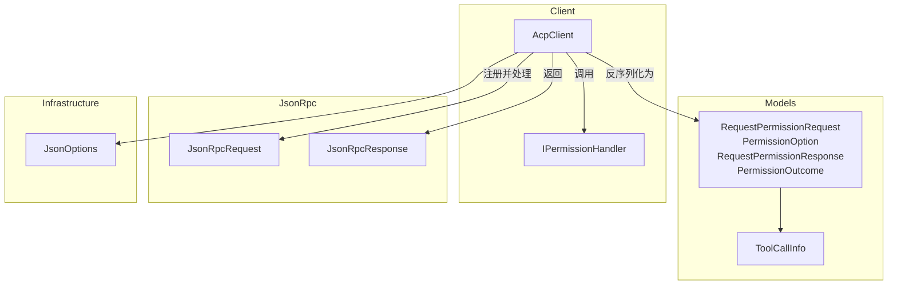
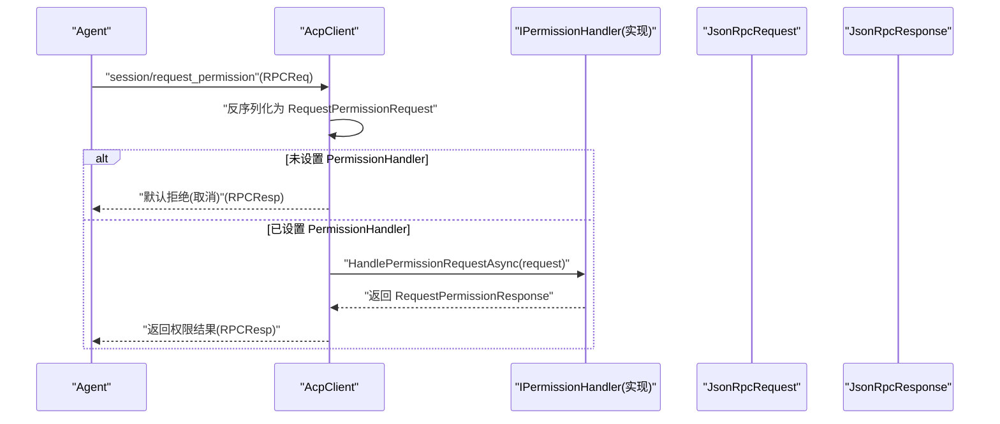
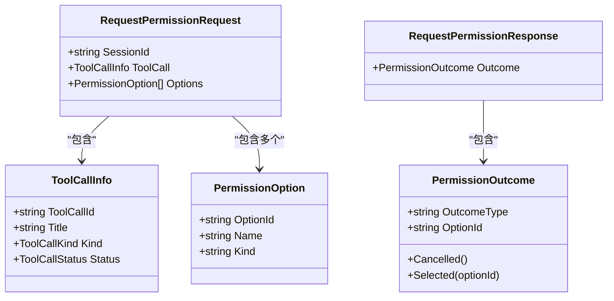
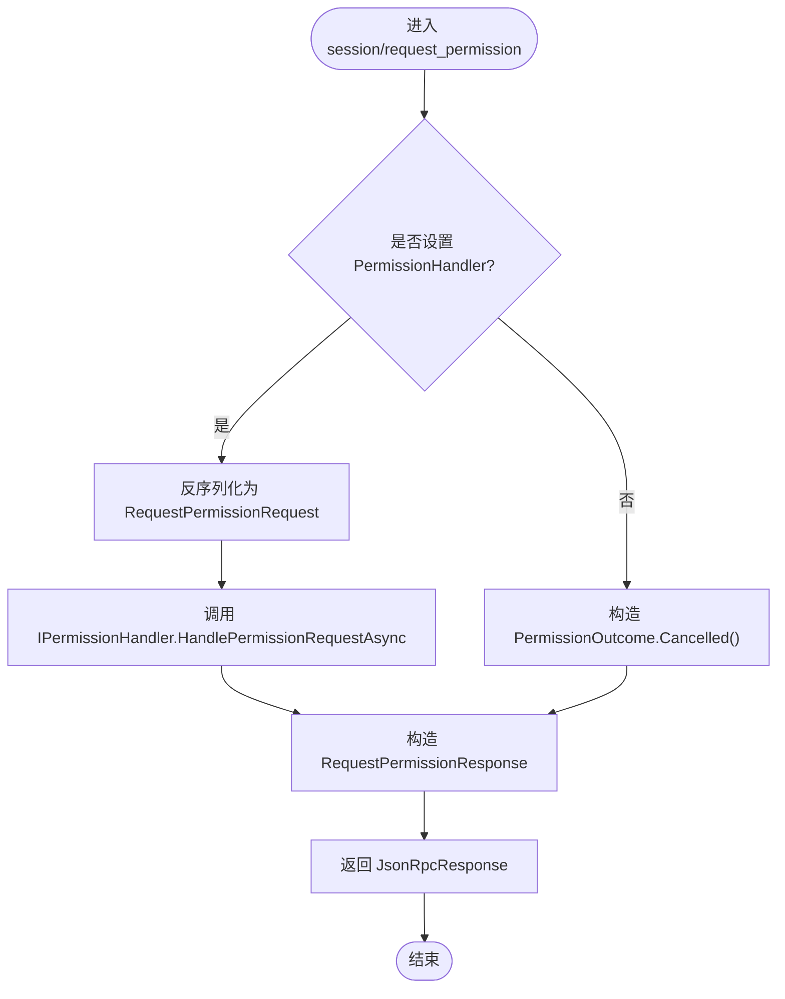
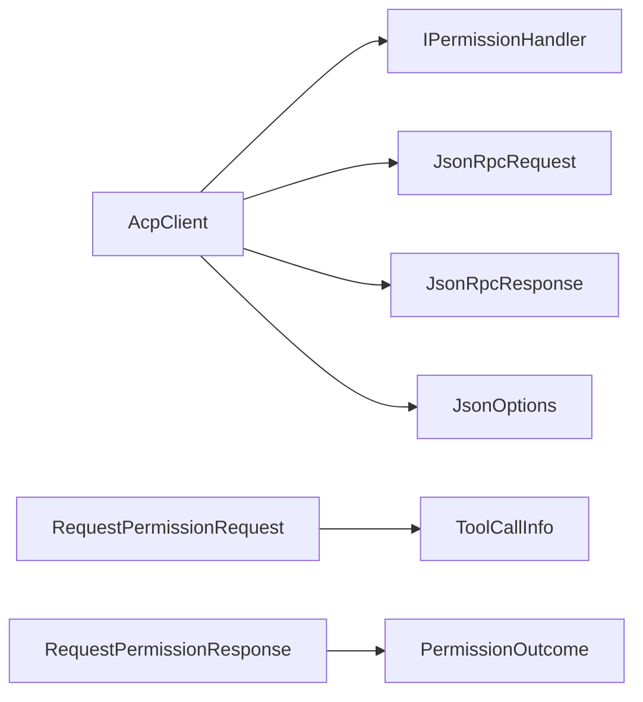

# 权限模型

<cite>
**本文引用的文件**   
- [RequestPermissionRequest.cs](file://Models/RequestPermissionRequest.cs)
- [ToolCall.cs](file://Models/ToolCall.cs)
- [IPermissionHandler.cs](file://Client/IPermissionHandler.cs)
- [AcpClient.cs](file://Client/AcpClient.cs)
- [JsonRpcRequest.cs](file://JsonRpc/JsonRpcRequest.cs)
- [JsonRpcResponse.cs](file://JsonRpc/JsonRpcResponse.cs)
- [JsonOptions.cs](file://Infrastructure/JsonOptions.cs)
</cite>

## 目录
1. [简介](#简介)
2. [项目结构](#项目结构)
3. [核心组件](#核心组件)
4. [架构总览](#架构总览)
5. [详细组件分析](#详细组件分析)
6. [依赖关系分析](#依赖关系分析)
7. [性能考虑](#性能考虑)
8. [故障排查指南](#故障排查指南)
9. [结论](#结论)
10. [附录](#附录)

## 简介
本文件围绕“权限请求”相关数据模型与处理流程进行系统化说明，重点包括：
- RequestPermissionRequest 类的属性与权限请求格式
- 权限类型、资源标识符与权限级别的定义与使用方式
- 权限请求的处理流程与响应格式
- 权限控制的实现示例与安全最佳实践
- 权限验证与授权检查的参考实现路径

该能力通过 JSON-RPC 机制在 Agent 与客户端之间传递，由 AcpClient 统一注册并分发到 IPermissionHandler 的具体实现（通常由 UI 层提供），最终返回标准化的权限结果。

## 项目结构
与权限模型直接相关的代码分布在 Models、Client、JsonRpc、Infrastructure 四个子目录中：
- Models：定义权限请求/响应数据结构与工具调用信息
- Client：定义权限处理器接口与客户端对权限请求的分发逻辑
- JsonRpc：定义 JSON-RPC 的请求/响应载体
- Infrastructure：定义统一的 JSON 序列化选项

图表来源
- [RequestPermissionRequest.cs:5-46](file://Models/RequestPermissionRequest.cs#L5-L46)
- [ToolCall.cs:6-21](file://Models/ToolCall.cs#L6-L21)
- [AcpClient.cs:74-99](file://Client/AcpClient.cs#L74-L99)
- [JsonRpcRequest.cs:7-18](file://JsonRpc/JsonRpcRequest.cs#L7-L18)
- [JsonRpcResponse.cs:7-19](file://JsonRpc/JsonRpcResponse.cs#L7-L19)
- [JsonOptions.cs:15-26](file://Infrastructure/JsonOptions.cs#L15-L26)

章节来源
- [RequestPermissionRequest.cs:5-46](file://Models/RequestPermissionRequest.cs#L5-L46)
- [ToolCall.cs:6-21](file://Models/ToolCall.cs#L6-L21)
- [AcpClient.cs:74-99](file://Client/AcpClient.cs#L74-L99)
- [JsonRpcRequest.cs:7-18](file://JsonRpc/JsonRpcRequest.cs#L7-L18)
- [JsonRpcResponse.cs:7-19](file://JsonRpc/JsonRpcResponse.cs#L7-L19)
- [JsonOptions.cs:15-26](file://Infrastructure/JsonOptions.cs#L15-L26)

## 核心组件
- RequestPermissionRequest：表示一次权限请求，包含会话标识、工具调用上下文以及可选的权限选项集合。
- PermissionOption：表示一个可选择的权限项，包含唯一标识、名称和种类（kind）。
- RequestPermissionResponse：表示权限请求的响应，包含一个 PermissionOutcome。
- PermissionOutcome：表示最终的权限决定，支持“取消”或“选择某选项”。
- ToolCallInfo：描述触发权限请求的工具调用上下文，如工具调用 ID、标题、类型与状态。
- IPermissionHandler：UI 层实现的权限处理接口，负责阻塞等待用户决策并返回结果。
- AcpClient：注册 session/request_permission 方法，将请求反序列化为模型并委派给 IPermissionHandler。
- JsonRpcRequest/JsonRpcResponse：JSON-RPC 2.0 的请求与响应载体。
- JsonOptions：全局 JSON 序列化配置，确保枚举与字段按约定序列化。

章节来源
- [RequestPermissionRequest.cs:5-46](file://Models/RequestPermissionRequest.cs#L5-L46)
- [ToolCall.cs:6-21](file://Models/ToolCall.cs#L6-L21)
- [IPermissionHandler.cs:9-16](file://Client/IPermissionHandler.cs#L9-L16)
- [AcpClient.cs:74-99](file://Client/AcpClient.cs#L74-L99)
- [JsonRpcRequest.cs:7-18](file://JsonRpc/JsonRpcRequest.cs#L7-L18)
- [JsonRpcResponse.cs:7-19](file://JsonRpc/JsonRpcResponse.cs#L7-L19)
- [JsonOptions.cs:15-26](file://Infrastructure/JsonOptions.cs#L15-L26)

## 架构总览
权限请求从 Agent 侧发起，经 JSON-RPC 到达 AcpClient，再由 AcpClient 委派给 IPermissionHandler 的实现（通常为 UI 对话框）获取用户决策，最后以标准化响应返回。

图表来源
- [AcpClient.cs:74-99](file://Client/AcpClient.cs#L74-L99)
- [JsonRpcRequest.cs:7-18](file://JsonRpc/JsonRpcRequest.cs#L7-L18)
- [JsonRpcResponse.cs:7-19](file://JsonRpc/JsonRpcResponse.cs#L7-L19)
- [RequestPermissionRequest.cs:5-46](file://Models/RequestPermissionRequest.cs#L5-L46)

## 详细组件分析

### 数据模型与权限请求格式
- RequestPermissionRequest
  - SessionId：当前会话标识，用于关联上下文。
  - ToolCall：触发权限请求的工具调用上下文，包含 toolCallId、title、kind、status。
  - Options：可选的权限选项列表，每个选项包含 optionId、name、kind。
- PermissionOption
  - OptionId：选项唯一标识，供后续选择时引用。
  - Name：面向用户的可读名称。
  - Kind：选项的种类，用于区分不同语义（例如读取、写入等）。
- RequestPermissionResponse
  - Outcome：权限结果对象。
- PermissionOutcome
  - OutcomeType：结果类型，支持 "cancelled"（取消）与 "selected"（选择）。
  - OptionId：当 OutcomeType 为 "selected" 时，携带被选中的选项标识。

图表来源
- [RequestPermissionRequest.cs:5-46](file://Models/RequestPermissionRequest.cs#L5-L46)
- [ToolCall.cs:6-21](file://Models/ToolCall.cs#L6-L21)

章节来源
- [RequestPermissionRequest.cs:5-46](file://Models/RequestPermissionRequest.cs#L5-L46)
- [ToolCall.cs:6-21](file://Models/ToolCall.cs#L6-L21)

### 权限类型、资源标识符与权限级别
- 权限类型（Kind）
  - 在 PermissionOption.Kind 中表示选项的类别，可用于区分读、写、执行等不同操作语义。
  - 在 ToolCallInfo.Kind 中表示工具调用的类型（如 read/edit/delete/move/search/execute/think/fetch/other），有助于判断风险等级。
- 资源标识符
  - 通过 ToolCallInfo.ToolCallId 唯一标识一次工具调用；SessionId 标识会话上下文。
  - 若需要更细粒度的资源标识（如文件路径、命令参数），应在具体业务扩展中补充字段，并在 UI 层展示给用户。
- 权限级别
  - 当前模型未内置“权限级别”字段，建议基于 Kind 与业务策略映射出级别（例如 execute > delete > edit > read）。
  - 可在 IPermissionHandler 实现中根据 Kind 与上下文动态计算级别并决定是否放行。

章节来源
- [RequestPermissionRequest.cs:5-46](file://Models/RequestPermissionRequest.cs#L5-L46)
- [ToolCall.cs:6-21](file://Models/ToolCall.cs#L6-L21)

### 权限请求处理流程与响应格式
- 处理流程
  - AcpClient 在初始化时注册 "session/request_permission" 请求处理器。
  - 收到请求后，尝试反序列化为 RequestPermissionRequest。
  - 若未设置 PermissionHandler，则直接返回“取消”结果。
  - 若已设置 PermissionHandler，则调用其 HandlePermissionRequestAsync 阻塞等待用户决策。
  - 将返回的 RequestPermissionResponse 序列化为 JSON-RPC 响应返回。
- 响应格式
  - RequestPermissionResponse.Outcome.OutcomeType 为 "cancelled" 或 "selected"。
  - 当为 "selected" 时，需携带 OptionId 指明所选选项。

图表来源
- [AcpClient.cs:74-99](file://Client/AcpClient.cs#L74-L99)
- [RequestPermissionRequest.cs:5-46](file://Models/RequestPermissionRequest.cs#L5-L46)

章节来源
- [AcpClient.cs:74-99](file://Client/AcpClient.cs#L74-L99)
- [RequestPermissionRequest.cs:5-46](file://Models/RequestPermissionRequest.cs#L5-L46)

### 权限控制实现示例（思路与参考路径）
- 基本实现要点
  - 在应用启动时注入 IPermissionHandler 的具体实现（例如显示确认对话框）。
  - 在 HandlePermissionRequestAsync 中：
    - 校验 SessionId 与 ToolCallId 的有效性（防重放、越权）。
    - 根据 ToolCallInfo.Kind 与 PermissionOption.Kind 判定风险级别。
    - 结合用户策略（白名单、黑名单、时间窗口、频率限制）做出决策。
    - 返回 PermissionOutcome.Selected(optionId) 或 PermissionOutcome.Cancelled()。
- 参考实现位置
  - 权限处理器接口定义：[IPermissionHandler.cs:9-16](file://Client/IPermissionHandler.cs#L9-L16)
  - 权限请求分发与默认拒绝逻辑：[AcpClient.cs:74-99](file://Client/AcpClient.cs#L74-L99)
  - 模型定义：[RequestPermissionRequest.cs:5-46](file://Models/RequestPermissionRequest.cs#L5-L46)

章节来源
- [IPermissionHandler.cs:9-16](file://Client/IPermissionHandler.cs#L9-L16)
- [AcpClient.cs:74-99](file://Client/AcpClient.cs#L74-L99)
- [RequestPermissionRequest.cs:5-46](file://Models/RequestPermissionRequest.cs#L5-L46)

### 安全最佳实践
- 最小权限原则：仅暴露必要的选项与资源，避免过度授权。
- 显式确认：高风险操作（如 execute、delete）必须要求用户明确选择。
- 输入校验：严格校验 SessionId、ToolCallId、OptionId 的格式与有效性。
- 防重放与会话隔离：确保每次请求绑定唯一会话与调用上下文。
- 审计与日志：记录权限请求、决策依据与结果，便于事后追溯。
- 超时与降级：长时间无响应的请求应自动拒绝，避免阻塞。
- 策略可配置：允许运行时调整策略（如临时放开某类操作）。

[本节为通用指导，不直接分析具体文件]

### 权限验证与授权检查的代码示例（参考路径）
- 验证入口
  - 在 IPermissionHandler 实现中接收 RequestPermissionRequest，提取 SessionId、ToolCallId、Options。
- 授权检查
  - 基于 ToolCallInfo.Kind 与 PermissionOption.Kind 映射风险级别。
  - 结合用户策略（如角色、资源白名单）进行决策。
- 返回结果
  - 选择某个选项：PermissionOutcome.Selected(optionId)。
  - 拒绝或取消：PermissionOutcome.Cancelled()。

参考路径
- 权限处理器接口：[IPermissionHandler.cs:9-16](file://Client/IPermissionHandler.cs#L9-L16)
- 权限请求模型：[RequestPermissionRequest.cs:5-46](file://Models/RequestPermissionRequest.cs#L5-L46)
- 工具调用信息：[ToolCall.cs:6-21](file://Models/ToolCall.cs#L6-L21)

章节来源
- [IPermissionHandler.cs:9-16](file://Client/IPermissionHandler.cs#L9-L16)
- [RequestPermissionRequest.cs:5-46](file://Models/RequestPermissionRequest.cs#L5-L46)
- [ToolCall.cs:6-21](file://Models/ToolCall.cs#L6-L21)

## 依赖关系分析
- AcpClient 依赖 IPermissionHandler 完成权限决策。
- AcpClient 依赖 JsonRpcRequest/JsonRpcResponse 进行通信。
- 所有模型均依赖 JsonOptions 提供的序列化配置（枚举转换、忽略空值等）。

图表来源
- [AcpClient.cs:74-99](file://Client/AcpClient.cs#L74-L99)
- [JsonRpcRequest.cs:7-18](file://JsonRpc/JsonRpcRequest.cs#L7-L18)
- [JsonRpcResponse.cs:7-19](file://JsonRpc/JsonRpcResponse.cs#L7-L19)
- [JsonOptions.cs:15-26](file://Infrastructure/JsonOptions.cs#L15-L26)
- [RequestPermissionRequest.cs:5-46](file://Models/RequestPermissionRequest.cs#L5-L46)
- [ToolCall.cs:6-21](file://Models/ToolCall.cs#L6-L21)

章节来源
- [AcpClient.cs:74-99](file://Client/AcpClient.cs#L74-L99)
- [JsonRpcRequest.cs:7-18](file://JsonRpc/JsonRpcRequest.cs#L7-L18)
- [JsonRpcResponse.cs:7-19](file://JsonRpc/JsonRpcResponse.cs#L7-L19)
- [JsonOptions.cs:15-26](file://Infrastructure/JsonOptions.cs#L15-L26)
- [RequestPermissionRequest.cs:5-46](file://Models/RequestPermissionRequest.cs#L5-L46)
- [ToolCall.cs:6-21](file://Models/ToolCall.cs#L6-L21)

## 性能考虑
- 反序列化开销：RequestPermissionRequest 与 Response 较小，影响有限；保持 JsonOptions 的轻量配置。
- 阻塞等待：IPermissionHandler 可能阻塞 UI 线程，建议使用异步与超时控制，避免主线程卡顿。
- 并发与隔离：同一会话内并发权限请求需保证顺序与一致性，避免竞态条件。
- 日志与监控：减少高频日志输出，仅在关键节点记录，避免 I/O 瓶颈。

[本节为通用指导，不直接分析具体文件]

## 故障排查指南
- 未设置 PermissionHandler
  - 现象：权限请求直接返回“取消”。
  - 排查：确认 AcpClient.PermissionHandler 是否已赋值。
  - 参考：[AcpClient.cs:74-99](file://Client/AcpClient.cs#L74-L99)
- JSON 反序列化失败
  - 现象：请求参数无法解析为 RequestPermissionRequest。
  - 排查：检查 JSON 字段名是否与模型一致，确认 JsonOptions 配置正确。
  - 参考：[JsonOptions.cs:15-26](file://Infrastructure/JsonOptions.cs#L15-L26)
- 权限结果异常
  - 现象：OutcomeType 非预期或缺少 OptionId。
  - 排查：确认 IPermissionHandler 返回值是否符合规范。
  - 参考：[RequestPermissionRequest.cs:29-46](file://Models/RequestPermissionRequest.cs#L29-L46)

章节来源
- [AcpClient.cs:74-99](file://Client/AcpClient.cs#L74-L99)
- [JsonOptions.cs:15-26](file://Infrastructure/JsonOptions.cs#L15-L26)
- [RequestPermissionRequest.cs:29-46](file://Models/RequestPermissionRequest.cs#L29-L46)

## 结论
本权限模型通过简洁的数据结构与清晰的职责划分，实现了 Agent 与客户端之间的权限协商机制。AcpClient 作为中枢负责协议适配与分发，IPermissionHandler 作为可扩展的决策点承载具体策略与交互。建议在实现中遵循最小权限、显式确认、输入校验、审计与超时等安全最佳实践，以确保系统的安全性与可用性。

[本节为总结性内容，不直接分析具体文件]

## 附录
- 术语
  - 会话（Session）：一次交互的生命周期标识。
  - 工具调用（ToolCall）：触发权限请求的操作上下文。
  - 权限选项（PermissionOption）：可供用户选择的权限项。
  - 权限结果（PermissionOutcome）：最终的授权决定。
- 扩展建议
  - 增加资源标识字段（如 path、command）以增强上下文。
  - 引入权限级别枚举，便于策略引擎统一处理。
  - 增加审计事件与追踪 ID，提升可观测性。

[本节为概念性内容，不直接分析具体文件]