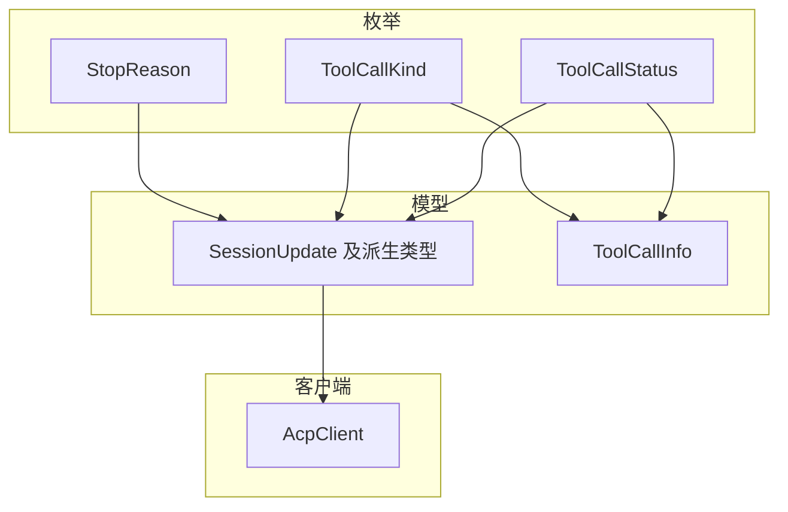
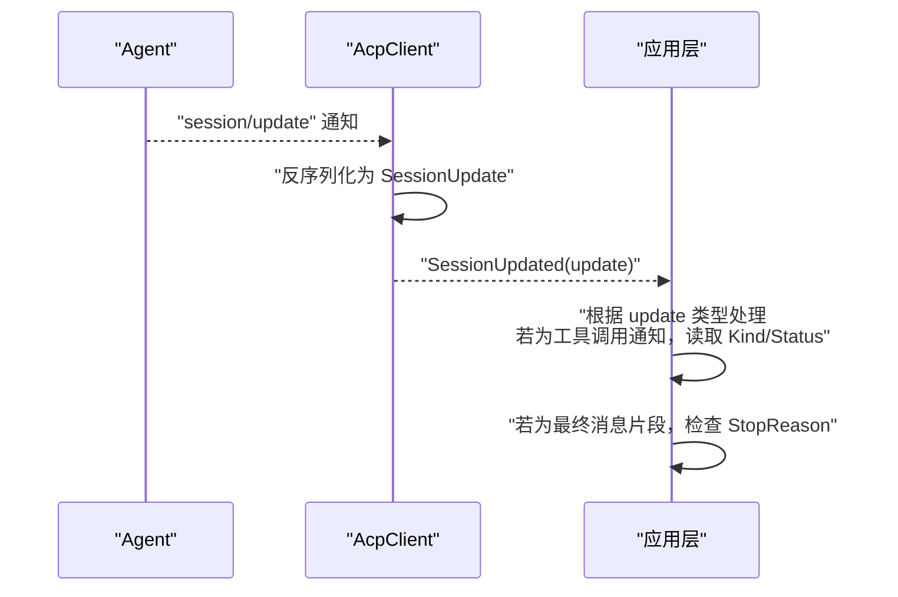
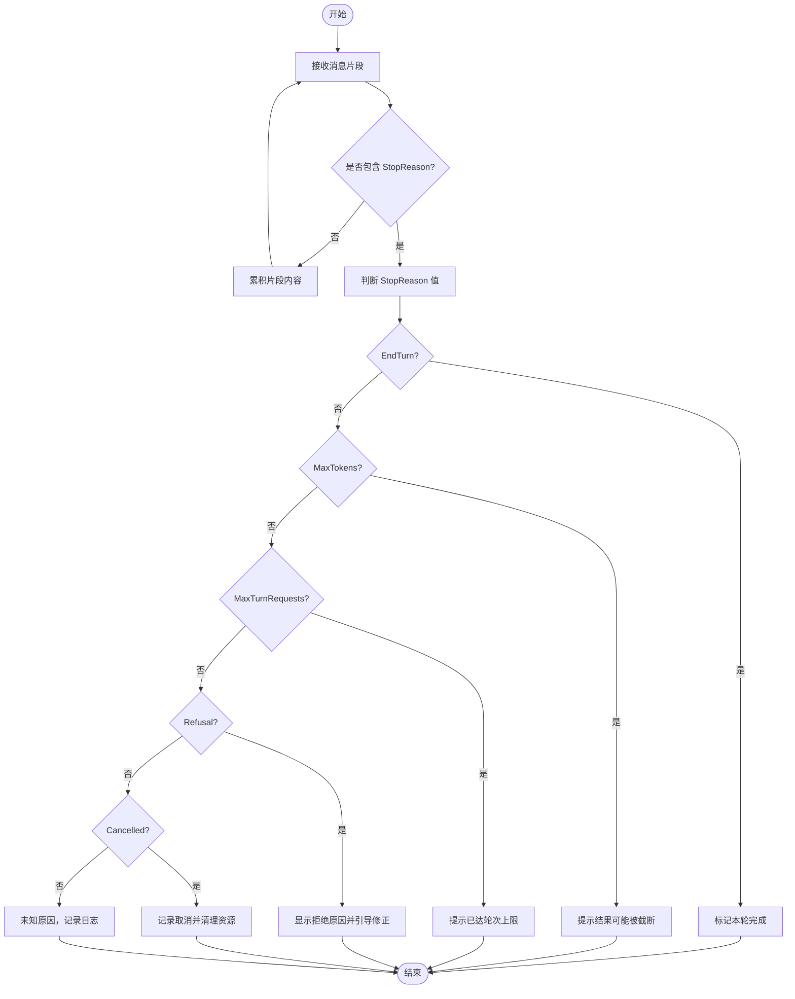
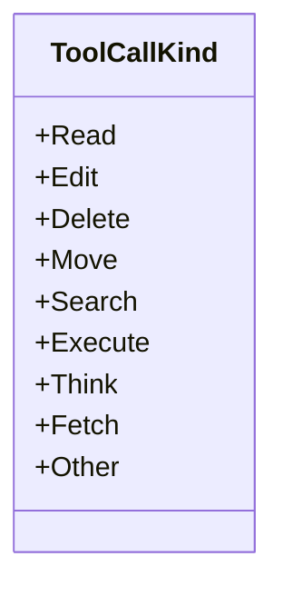
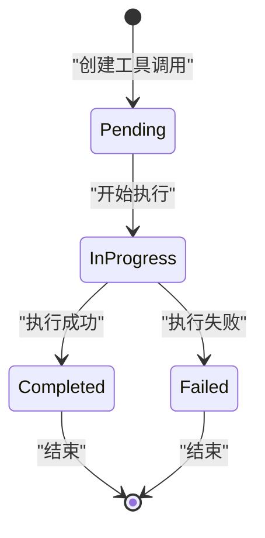
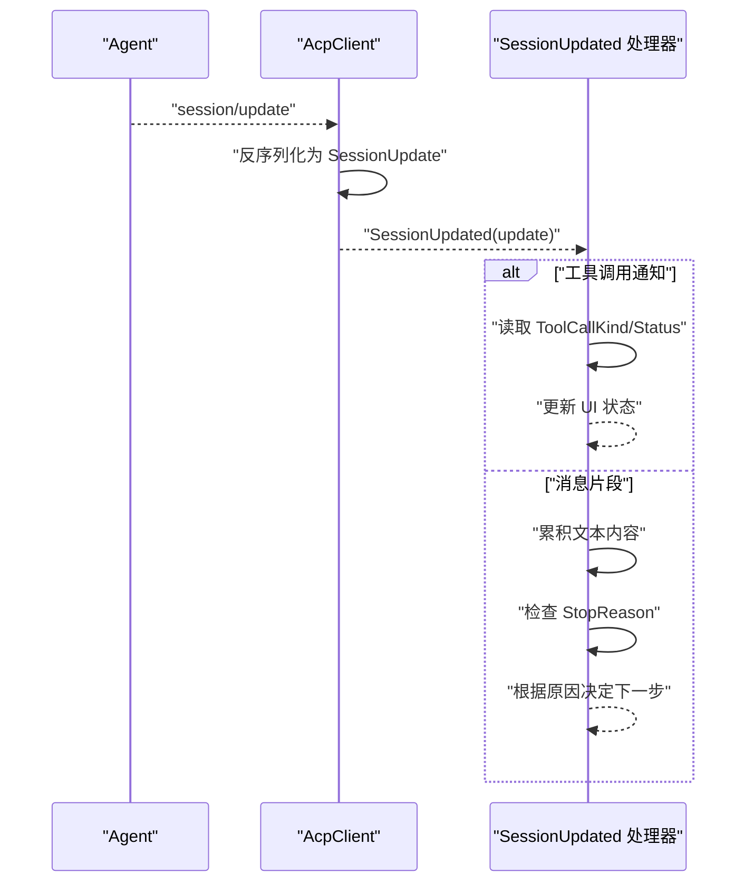
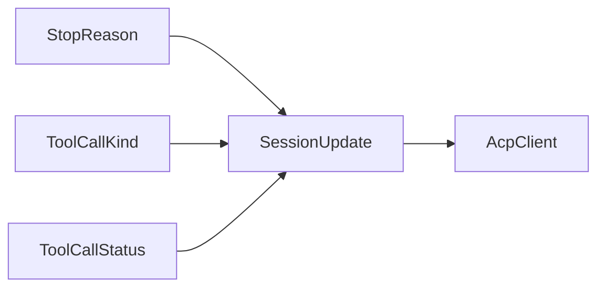

# 枚举定义

<cite>
**本文引用的文件**   
- [StopReason.cs](file://Models/Enums/StopReason.cs)
- [ToolCallKind.cs](file://Models/Enums/ToolCallKind.cs)
- [ToolCallStatus.cs](file://Models/Enums/ToolCallStatus.cs)
- [SessionUpdate.cs](file://Models/SessionUpdate.cs)
- [ToolCall.cs](file://Models/ToolCall.cs)
- [AcpClient.cs](file://Client/AcpClient.cs)
- [README.md](file://README.md)
</cite>

## 目录
1. [简介](#简介)
2. [项目结构](#项目结构)
3. [核心组件](#核心组件)
4. [架构总览](#架构总览)
5. [详细组件分析](#详细组件分析)
6. [依赖关系分析](#依赖关系分析)
7. [性能考虑](#性能考虑)
8. [故障排查指南](#故障排查指南)
9. [结论](#结论)
10. [附录](#附录)

## 简介
本文件聚焦于代码库中的枚举类型，尤其是 StopReason 的完整说明与使用方式。同时涵盖 ToolCallKind 与 ToolCallStatus 两个相关枚举，解释其含义、适用场景、触发条件以及在流式响应中的应用模式与最佳实践。文档面向不同技术背景的读者，提供从概念到实现的渐进式说明，并给出流程图和序列图以辅助理解。

## 项目结构
- 枚举定义位于 Models/Enums 目录下，采用 JSON 字符串序列化策略，便于与 Agent 端进行协议交互。
- 会话更新模型位于 Models/SessionUpdate.cs，包含多种流式更新类型（如消息片段、工具调用通知等）。
- 客户端实现位于 Client/AcpClient.cs，负责注册 session/update 通知处理器，并将流式数据通过事件推送给上层。

图表来源
- [StopReason.cs:1-19](file://Models/Enums/StopReason.cs#L1-L19)
- [ToolCallKind.cs:1-27](file://Models/Enums/ToolCallKind.cs#L1-L27)
- [ToolCallStatus.cs:1-17](file://Models/Enums/ToolCallStatus.cs#L1-L17)
- [SessionUpdate.cs:1-119](file://Models/SessionUpdate.cs#L1-L119)
- [ToolCall.cs:1-22](file://Models/ToolCall.cs#L1-L22)
- [AcpClient.cs:1-361](file://Client/AcpClient.cs#L1-L361)

章节来源
- [README.md:1-99](file://README.md#L1-L99)

## 核心组件
- StopReason：表示一次对话轮次或请求的停止原因，用于标识 Agent 为何结束当前输出或处理流程。
- ToolCallKind：描述工具调用的种类（如 read、edit、execute 等），帮助上层对不同类型的工具调用进行差异化处理。
- ToolCallStatus：描述工具调用的生命周期状态（pending、in_progress、completed、failed），用于跟踪工具执行进度。

章节来源
- [StopReason.cs:1-19](file://Models/Enums/StopReason.cs#L1-L19)
- [ToolCallKind.cs:1-27](file://Models/Enums/ToolCallKind.cs#L1-L27)
- [ToolCallStatus.cs:1-17](file://Models/Enums/ToolCallStatus.cs#L1-L17)

## 架构总览
在 ACP 协议中，Agent 会通过 session/update 通知推送流式更新。客户端 AcpClient 订阅该通知，反序列化为 SessionUpdate 及其派生类型，并通过 SessionUpdated 事件向应用层传递。StopReason 通常出现在最终的消息片段或会话结束信号中，指示本轮对话的终止原因；ToolCallKind 与 ToolCallStatus 则伴随工具调用通知出现，用于展示工具类型与执行状态。

图表来源
- [AcpClient.cs:64-72](file://Client/AcpClient.cs#L64-L72)
- [SessionUpdate.cs:1-119](file://Models/SessionUpdate.cs#L1-L119)

## 详细组件分析

### StopReason 枚举详解
StopReason 用于标记一轮对话或请求的结束原因，常见值包括：
- EndTurn：正常结束当前轮次，Agent 已完成回答或等待用户输入。
- MaxTokens：达到最大令牌限制，输出被截断。
- MaxTurnRequests：达到最大轮次请求限制，系统强制结束。
- Refusal：拒绝继续处理（例如安全策略或权限不足）。
- Cancelled：被外部取消（如用户主动中断）。

使用场景与触发条件
- EndTurn：当 Agent 完成内容生成且无需进一步操作时返回。
- MaxTokens：当生成的 token 数超过上限时返回，常用于控制成本与延迟。
- MaxTurnRequests：当会话轮次达到上限时返回，防止无限循环。
- Refusal：当内容或行为违反策略时被返回，需提示用户调整输入。
- Cancelled：当上层调用取消或进程退出时返回，应清理资源并提示用户。

判断与处理逻辑示例（概念性）
- 收到最终消息片段后，检查 StopReason：
  - 若为 EndTurn：可认为本轮完成，准备下一轮输入。
  - 若为 MaxTokens：提示用户结果可能不完整，建议缩短输入或增加限制。
  - 若为 MaxTurnRequests：提示已达到轮次上限，建议拆分任务。
  - 若为 Refusal：显示拒绝原因，引导用户修改请求。
  - 若为 Cancelled：记录取消事件，释放资源并允许重试。

流式响应中的应用模式与最佳实践
- 在流式接收过程中，累积文本片段直到出现带有 StopReason 的最终片段。
- 对于工具调用相关的通知，优先处理 ToolCallKind/Status，再结合 StopReason 决定整体流程。
- 遇到 MaxTokens 或 MaxTurnRequests 时，应在 UI 上明确提示，避免用户误解为错误。
- 遇到 Refusal 或 Cancelled 时，应提供可操作的反馈（如重新提交、修改参数）。

章节来源
- [StopReason.cs:1-19](file://Models/Enums/StopReason.cs#L1-L19)

### ToolCallKind 枚举详解
ToolCallKind 描述工具调用的类型，常见值包括：
- Read：读取文件或数据源。
- Edit：编辑现有内容。
- Delete：删除内容。
- Move：移动或重命名。
- Search：搜索信息。
- Execute：执行命令或脚本。
- Think：思考或推理步骤。
- Fetch：获取远程资源。
- Other：其他未分类类型。

使用场景与触发条件
- 当 Agent 需要访问文件系统、执行命令或检索外部资源时，会发出相应类型的工具调用。
- 不同类型对应不同的权限与安全策略，UI 层应根据 Kind 展示合适的确认对话框或提示信息。

判断与处理逻辑示例（概念性）
- 收到 ToolCallNotification 后，读取 Kind：
  - 若为 Execute：可能需要用户授权执行命令。
  - 若为 Read/Edit/Delete：需要文件系统权限，提示用户确认路径与操作。
  - 若为 Think/Fetch/Search：通常为只读或计算型操作，风险较低但仍需展示意图。

流式响应中的应用模式与最佳实践
- 在工具调用通知中，先展示 Kind 对应的标题与意图，再根据 Status 更新进度。
- 对高风险操作（如 Execute、Delete）要求显式用户确认，避免误操作。
- 对未知 Kind 值，应降级为“Other”并记录日志以便后续扩展。

图表来源
- [ToolCallKind.cs:1-27](file://Models/Enums/ToolCallKind.cs#L1-L27)

章节来源
- [ToolCallKind.cs:1-27](file://Models/Enums/ToolCallKind.cs#L1-L27)

### ToolCallStatus 枚举详解
ToolCallStatus 描述工具调用的生命周期状态，常见值包括：
- Pending：已创建但未开始执行。
- InProgress：正在执行中。
- Completed：执行成功完成。
- Failed：执行失败，需查看错误信息。

使用场景与触发条件
- 工具调用从创建到完成的整个过程中，状态会逐步变化，供 UI 实时反馈。
- 失败状态应附带错误详情，便于用户重试或调整参数。

判断与处理逻辑示例（概念性）
- 收到 ToolCallUpdateNotification 后，读取 Status：
  - Pending：显示“等待中”。
  - InProgress：显示“进行中”，并可展示部分输出。
  - Completed：显示“完成”，并可汇总结果。
  - Failed：显示“失败”，并提供错误信息与重试选项。

流式响应中的应用模式与最佳实践
- 将状态变化映射为 UI 进度条或状态标签，提升用户体验。
- 对 Failed 状态，应提供“查看详情”和“重试”按钮，增强可恢复性。
- 对长时间运行的工具调用，应支持用户取消操作。

图表来源
- [ToolCallStatus.cs:1-17](file://Models/Enums/ToolCallStatus.cs#L1-L17)

章节来源
- [ToolCallStatus.cs:1-17](file://Models/Enums/ToolCallStatus.cs#L1-L17)

### 流式响应中的综合处理流程
在 AcpClient 中，session/update 通知被统一处理并转换为 SessionUpdate 对象，随后通过 SessionUpdated 事件推送。应用层可根据 update 的具体类型（如 AgentMessageChunk、ToolCallNotification、ToolCallUpdateNotification）进行差异化处理，并结合 StopReason、ToolCallKind、ToolCallStatus 做出决策。

图表来源
- [AcpClient.cs:64-72](file://Client/AcpClient.cs#L64-L72)
- [SessionUpdate.cs:1-119](file://Models/SessionUpdate.cs#L1-L119)

章节来源
- [AcpClient.cs:64-72](file://Client/AcpClient.cs#L64-L72)
- [SessionUpdate.cs:1-119](file://Models/SessionUpdate.cs#L1-L119)

## 依赖关系分析
- StopReason、ToolCallKind、ToolCallStatus 均通过 JsonStringEnumConverter 进行序列化，确保与 Agent 端的字符串值一致。
- SessionUpdate 及其派生类型承载了流式更新的数据结构，其中 ToolCallNotification 与 ToolCallUpdateNotification 引用 ToolCallKind 与 ToolCallStatus。
- AcpClient 负责订阅 session/update 通知，并将数据传递给应用层，形成完整的流式处理链路。

图表来源
- [StopReason.cs:1-19](file://Models/Enums/StopReason.cs#L1-L19)
- [ToolCallKind.cs:1-27](file://Models/Enums/ToolCallKind.cs#L1-L27)
- [ToolCallStatus.cs:1-17](file://Models/Enums/ToolCallStatus.cs#L1-L17)
- [SessionUpdate.cs:1-119](file://Models/SessionUpdate.cs#L1-L119)
- [AcpClient.cs:64-72](file://Client/AcpClient.cs#L64-L72)

章节来源
- [SessionUpdate.cs:1-119](file://Models/SessionUpdate.cs#L1-L119)
- [AcpClient.cs:64-72](file://Client/AcpClient.cs#L64-L72)

## 性能考虑
- 流式处理应避免阻塞，及时释放临时对象，减少 GC 压力。
- 对长轮次或大量工具调用的场景，建议使用批处理或节流机制，避免 UI 频繁刷新。
- 对 StopReason 的判断应在最后一条片段中进行，避免中间片段的误判。

## 故障排查指南
- 若 StopReason 未出现：检查 session/update 通知是否完整到达，确认反序列化是否正确。
- 若 ToolCallStatus 始终为 Pending：确认工具调用是否被正确触发，检查权限与资源可用性。
- 若 ToolCallKind 为 Unknown：检查 Agent 端是否发送了新类型，必要时扩展枚举并兼容旧版本。

章节来源
- [AcpClient.cs:64-72](file://Client/AcpClient.cs#L64-L72)
- [SessionUpdate.cs:1-119](file://Models/SessionUpdate.cs#L1-L119)

## 结论
StopReason、ToolCallKind、ToolCallStatus 三个枚举构成了 ACP 流式响应的核心语义。通过合理判断与处理这些枚举值，可以实现稳定、可观测、用户友好的 Agent 交互体验。建议在应用层建立统一的处理框架，集中管理状态转换与用户提示，确保在不同场景下的一致性与健壮性。

## 附录
- 参考快速开始与 API 概览，了解如何在项目中集成 ACP 客户端与事件处理。

章节来源
- [README.md:1-99](file://README.md#L1-L99)