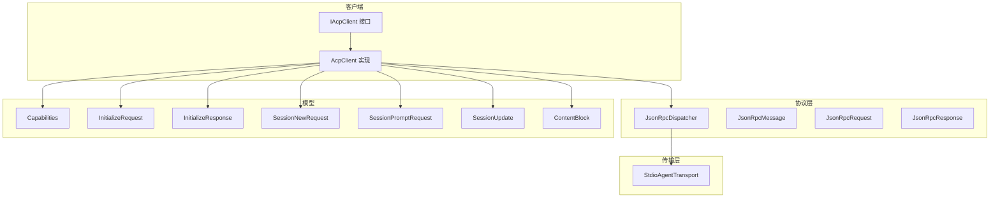
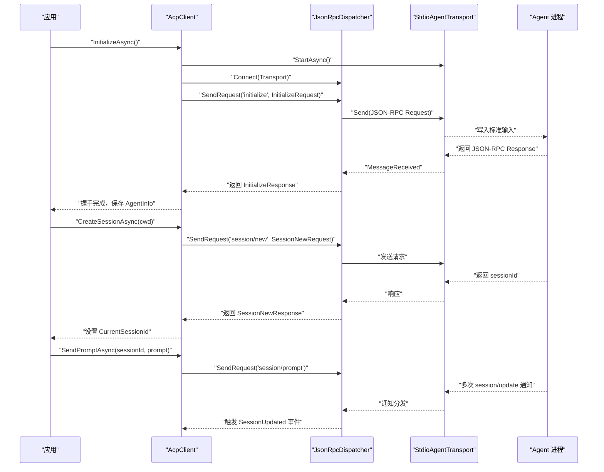
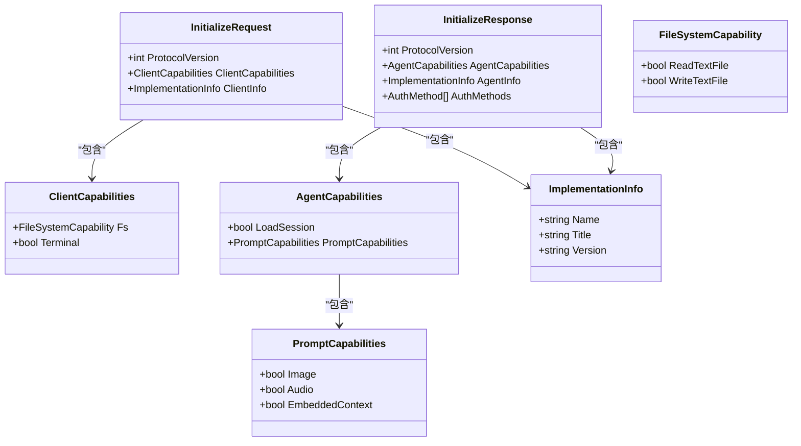
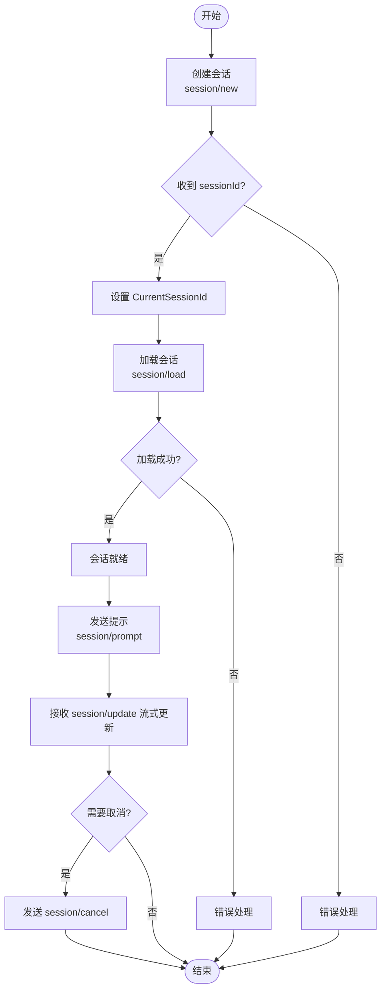
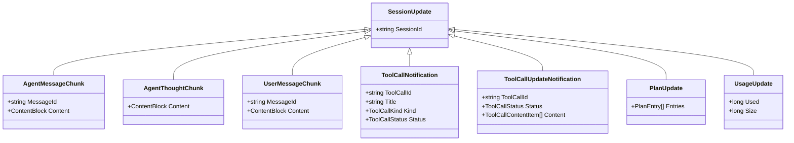
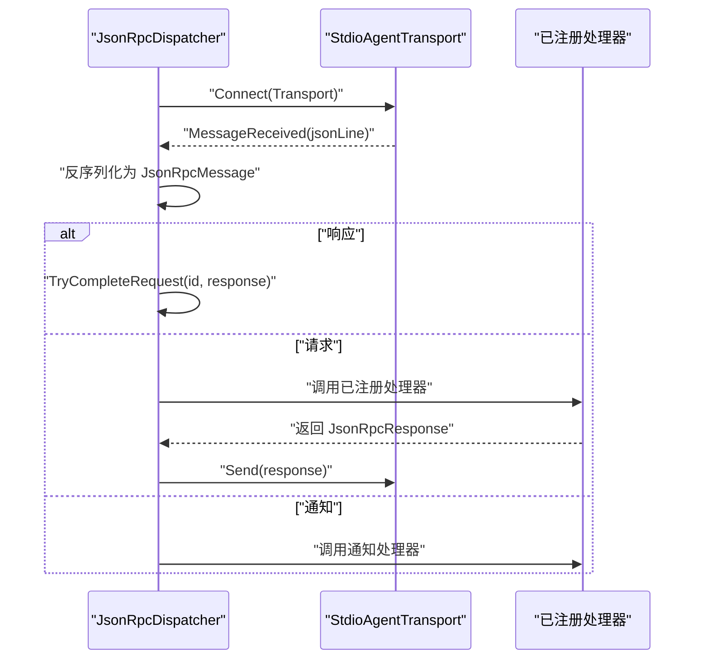
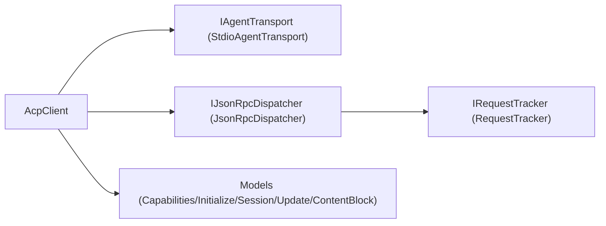

# ACP协议详解

<cite>
**本文引用的文件**   
- [README.md](file://README.md)
- [AcpClient.cs](file://Client/AcpClient.cs)
- [IAcpClient.cs](file://Client/IAcpClient.cs)
- [StdioAgentTransport.cs](file://Transport/StdioAgentTransport.cs)
- [JsonRpcDispatcher.cs](file://Protocol/JsonRpcDispatcher.cs)
- [JsonRpcMessage.cs](file://JsonRpc/JsonRpcMessage.cs)
- [JsonRpcRequest.cs](file://JsonRpc/JsonRpcRequest.cs)
- [JsonRpcResponse.cs](file://JsonRpc/JsonRpcResponse.cs)
- [Capabilities.cs](file://Models/Capabilities.cs)
- [InitializeRequest.cs](file://Models/InitializeRequest.cs)
- [InitializeResponse.cs](file://Models/InitializeResponse.cs)
- [SessionNewRequest.cs](file://Models/SessionNewRequest.cs)
- [SessionPromptRequest.cs](file://Models/SessionPromptRequest.cs)
- [SessionUpdate.cs](file://Models/SessionUpdate.cs)
- [ContentBlock.cs](file://Models/ContentBlock.cs)
</cite>

## 目录
1. [简介](#简介)
2. [项目结构](#项目结构)
3. [核心组件](#核心组件)
4. [架构总览](#架构总览)
5. [详细组件分析](#详细组件分析)
6. [依赖关系分析](#依赖关系分析)
7. [性能考量](#性能考量)
8. [故障排查指南](#故障排查指南)
9. [结论](#结论)
10. [附录](#附录)

## 简介
本文件为 ACP（Agent Client Protocol）协议的完整技术文档，面向开发者深入解释通信模型、消息格式与生命周期管理。重点涵盖：
- 初始化握手流程（InitializeRequest / InitializeResponse）
- 能力协商机制（Capabilities 对象及其扩展方式）
- 会话生命周期（创建、加载、销毁）
- 完整的协议流程图与数据交换示例
- 传输层（stdio）、JSON-RPC 分发器与客户端实现的关系

## 项目结构
该库采用分层组织：
- Transport（传输层）：基于子进程 stdio 的 I/O 通道
- Protocol（协议层）：JSON-RPC 2.0 请求/响应/通知的分发与追踪
- Models（数据模型）：ACP 协议所需的请求、响应、能力与流式更新等类型
- Client（客户端）：封装握手、会话、提示发送、事件回调与扩展点
- Infrastructure（基础设施）：JSON 序列化选项与服务注册扩展

图表来源
- [AcpClient.cs:12-45](file://Client/AcpClient.cs#L12-L45)
- [JsonRpcDispatcher.cs:9-25](file://Protocol/JsonRpcDispatcher.cs#L9-L25)
- [StdioAgentTransport.cs:8-28](file://Transport/StdioAgentTransport.cs#L8-L28)
- [Capabilities.cs:5-65](file://Models/Capabilities.cs#L5-L65)
- [InitializeRequest.cs:5-16](file://Models/InitializeRequest.cs#L5-L16)
- [InitializeResponse.cs:5-28](file://Models/InitializeResponse.cs#L5-L28)
- [SessionNewRequest.cs:5-45](file://Models/SessionNewRequest.cs#L5-L45)
- [SessionPromptRequest.cs:6-20](file://Models/SessionPromptRequest.cs#L6-L20)
- [SessionUpdate.cs:18-22](file://Models/SessionUpdate.cs#L18-L22)
- [ContentBlock.cs:15-17](file://Models/ContentBlock.cs#L15-L17)

章节来源
- [README.md:1-99](file://README.md#L1-L99)

## 核心组件
- 传输层 StdioAgentTransport：通过启动子进程并使用标准输入输出进行 JSON 行式通信，提供消息接收、发送、进程退出事件。
- 协议层 JsonRpcDispatcher：负责 JSON-RPC 2.0 的请求/响应/通知路由、请求跟踪与超时完成、以及方法处理器注册。
- 客户端 AcpClient：封装 ACP 协议交互，包括初始化握手、会话管理、提示发送、事件订阅与扩展方法注册。
- 数据模型：包含能力协商、初始化、会话、提示与流式更新等结构化类型。

章节来源
- [StdioAgentTransport.cs:30-93](file://Transport/StdioAgentTransport.cs#L30-L93)
- [JsonRpcDispatcher.cs:27-84](file://Protocol/JsonRpcDispatcher.cs#L27-L84)
- [AcpClient.cs:47-182](file://Client/AcpClient.cs#L47-L182)
- [Capabilities.cs:5-65](file://Models/Capabilities.cs#L5-L65)

## 架构总览
ACP 客户端通过 stdio 与 Agent 进程通信，使用 JSON-RPC 2.0 作为消息格式。客户端在初始化阶段发起握手并协商能力；随后创建或加载会话，发送提示并接收流式更新；最终通过关闭传输和分发器完成清理。

图表来源
- [AcpClient.cs:47-182](file://Client/AcpClient.cs#L47-L182)
- [JsonRpcDispatcher.cs:27-84](file://Protocol/JsonRpcDispatcher.cs#L27-L84)
- [StdioAgentTransport.cs:30-93](file://Transport/StdioAgentTransport.cs#L30-L93)

## 详细组件分析

### 初始化握手与能力协商
- 客户端构造 InitializeRequest，包含协议版本、客户端能力（文件系统读写、终端开关等）与客户端信息（名称、标题、版本）。
- 通过 JSON-RPC 调用 initialize 方法，等待 InitializeResponse，其中包含协议版本、Agent 能力（如是否支持 loadSession、promptCapabilities）与认证方法列表。
- 客户端记录 AgentInfo 并检查协议版本兼容性。

图表来源
- [InitializeRequest.cs:5-16](file://Models/InitializeRequest.cs#L5-L16)
- [InitializeResponse.cs:5-28](file://Models/InitializeResponse.cs#L5-L28)
- [Capabilities.cs:5-65](file://Models/Capabilities.cs#L5-L65)

章节来源
- [AcpClient.cs:149-182](file://Client/AcpClient.cs#L149-L182)
- [InitializeRequest.cs:5-16](file://Models/InitializeRequest.cs#L5-L16)
- [InitializeResponse.cs:5-28](file://Models/InitializeResponse.cs#L5-L28)
- [Capabilities.cs:5-65](file://Models/Capabilities.cs#L5-L65)

### 会话生命周期管理
- 创建会话：调用 session/new，传入当前工作目录与 MCP 服务器配置（默认空数组），返回 sessionId。
- 加载会话：调用 session/load，传入目标 sessionId、cwd 与 mcpServers（示例为空数组），成功后设置 CurrentSessionId。
- 取消会话：发送 session/cancel 通知以取消正在进行的提示处理。
- 销毁会话：通过 ShutdownAsync 断开分发器并停止传输，释放资源。

图表来源
- [AcpClient.cs:184-224](file://Client/AcpClient.cs#L184-L224)
- [SessionNewRequest.cs:5-45](file://Models/SessionNewRequest.cs#L5-L45)

章节来源
- [AcpClient.cs:184-224](file://Client/AcpClient.cs#L184-L224)
- [SessionNewRequest.cs:5-45](file://Models/SessionNewRequest.cs#L5-L45)

### 提示发送与流式更新
- 发送提示：调用 session/prompt，携带 sessionId 与 ContentBlock 列表（文本、图像、音频、资源等）。
- 流式更新：Agent 通过 session/update 通知推送多种更新类型（代理消息片段、思考片段、用户消息片段、工具调用通知、计划更新、用量更新等）。
- 客户端将更新反序列化为 SessionUpdate 派生类型并通过 SessionUpdated 事件回调给上层。

图表来源
- [SessionUpdate.cs:18-119](file://Models/SessionUpdate.cs#L18-L119)

章节来源
- [AcpClient.cs:207-224](file://Client/AcpClient.cs#L207-L224)
- [SessionPromptRequest.cs:6-20](file://Models/SessionPromptRequest.cs#L6-L20)
- [SessionUpdate.cs:18-119](file://Models/SessionUpdate.cs#L18-L119)

### 传输层与 JSON-RPC 分发器
- StdioAgentTransport：启动子进程，读取标准输出与错误流，按行解析 JSON 消息，触发 MessageReceived 事件；支持发送 JSON 行到标准输入；进程退出时触发 ProcessExited。
- JsonRpcDispatcher：连接传输层后监听消息，区分请求、响应与通知；对请求执行已注册的处理器并回写响应；对通知分发给对应处理器；维护待完成请求集合以同步返回结果。

图表来源
- [JsonRpcDispatcher.cs:86-122](file://Protocol/JsonRpcDispatcher.cs#L86-L122)
- [StdioAgentTransport.cs:95-118](file://Transport/StdioAgentTransport.cs#L95-L118)

章节来源
- [StdioAgentTransport.cs:30-93](file://Transport/StdioAgentTransport.cs#L30-L93)
- [JsonRpcDispatcher.cs:27-84](file://Protocol/JsonRpcDispatcher.cs#L27-L84)

### 内容块与多态序列化
- ContentBlock 使用 type 字段作为多态判别器，支持 text、image、audio、resource、resource_link 等类型。
- 当 Agent 发送未知类型时，默认回退到基类型以避免解析错误，提升向前兼容性。

章节来源
- [ContentBlock.cs:1-79](file://Models/ContentBlock.cs#L1-L79)

## 依赖关系分析
- AcpClient 依赖 IAgentTransport 与 IJsonRpcDispatcher，用于底层通信与消息分发。
- JsonRpcDispatcher 依赖 IRequestTracker（默认实现 RequestTracker）来管理请求生命周期。
- 所有模型类型通过 System.Text.Json 进行序列化与反序列化，使用 JsonOptions.Default。
- 传输层与分发器之间通过事件解耦，降低耦合度。

图表来源
- [AcpClient.cs:12-45](file://Client/AcpClient.cs#L12-L45)
- [JsonRpcDispatcher.cs:9-25](file://Protocol/JsonRpcDispatcher.cs#L9-L25)
- [StdioAgentTransport.cs:8-28](file://Transport/StdioAgentTransport.cs#L8-L28)

章节来源
- [AcpClient.cs:12-45](file://Client/AcpClient.cs#L12-L45)
- [JsonRpcDispatcher.cs:9-25](file://Protocol/JsonRpcDispatcher.cs#L9-L25)

## 性能考量
- 流式更新：session/update 通知以事件形式推送，避免阻塞主线程；建议上层异步处理以减少延迟。
- 进程 I/O：Stdio 行式读写需保证 UTF-8 编码与正确换行；大量小消息可能带来上下文切换开销，建议在应用层做批处理或缓冲。
- JSON 序列化：使用 System.Text.Json 的预编译选项可减少反射开销；对于高频路径可考虑复用序列化上下文。
- 请求跟踪：并发请求由分发器统一管理，注意避免过多未完成的请求导致内存增长。

[本节为通用指导，不直接分析具体文件]

## 故障排查指南
- 初始化失败：检查 transport 是否成功启动、dispatcher 是否正确连接、initialize 请求是否被 Agent 正确处理。
- 会话创建失败：确认 cwd 有效、mcpServers 配置符合规范（至少为空数组）。
- 提示无响应：检查 session/prompt 参数是否正确；确认 session/update 事件是否被订阅与处理。
- 权限/文件/终端请求未处理：确保已设置 PermissionHandler、FileSystemHandler、TerminalHandler 并正确实现。
- 进程退出：监听 AgentProcessExited 事件，根据退出码判断异常原因并做恢复或告警。

章节来源
- [AcpClient.cs:74-147](file://Client/AcpClient.cs#L74-L147)
- [StdioAgentTransport.cs:137-145](file://Transport/StdioAgentTransport.cs#L137-L145)

## 结论
本库实现了 ACP 协议的客户端侧完整栈：从 stdio 传输、JSON-RPC 分发到高层会话与提示交互。通过能力协商与流式更新，客户端能够与 Agent 进行灵活且可扩展的协作。开发者可通过注册自定义处理器扩展协议能力，同时利用事件驱动模型构建高响应性的应用。

[本节为总结性内容，不直接分析具体文件]

## 附录

### 协议流程图与数据交换示例
- 初始化握手：
  - 客户端发送 initialize 请求（包含 protocolVersion、clientCapabilities、clientInfo）。
  - Agent 返回 initialize 响应（包含 protocolVersion、agentCapabilities、agentInfo、authMethods）。
- 会话创建：
  - 客户端发送 session/new（包含 cwd、mcpServers）。
  - Agent 返回 sessionId。
- 提示发送与流式更新：
  - 客户端发送 session/prompt（包含 sessionId、prompt 内容块）。
  - Agent 推送多条 session/update 通知（消息片段、工具调用、计划、用量等）。
- 取消与会话结束：
  - 客户端发送 session/cancel 通知。
  - 客户端调用 ShutdownAsync 断开传输与分发器。

章节来源
- [AcpClient.cs:47-224](file://Client/AcpClient.cs#L47-L224)
- [SessionNewRequest.cs:5-45](file://Models/SessionNewRequest.cs#L5-L45)
- [SessionPromptRequest.cs:6-20](file://Models/SessionPromptRequest.cs#L6-L20)
- [SessionUpdate.cs:18-119](file://Models/SessionUpdate.cs#L18-L119)