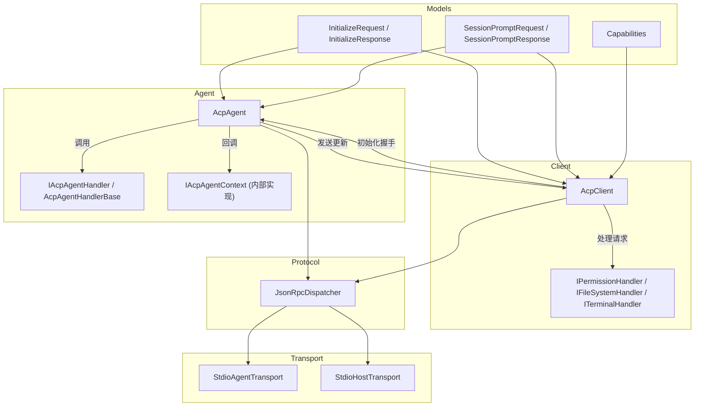
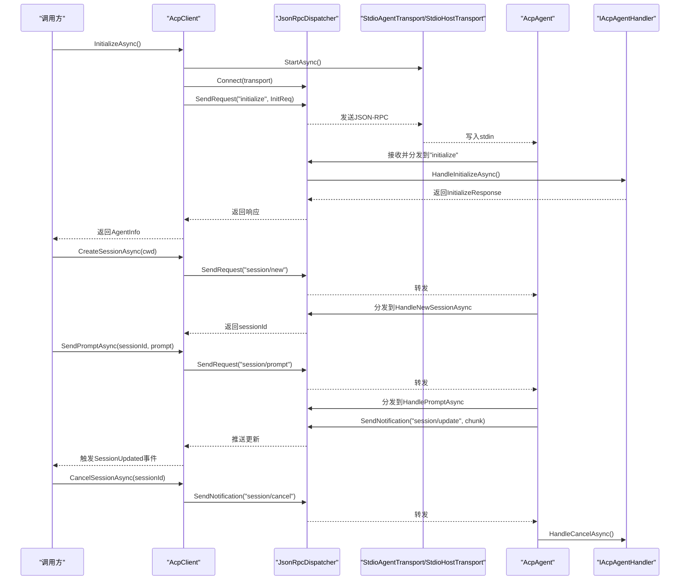
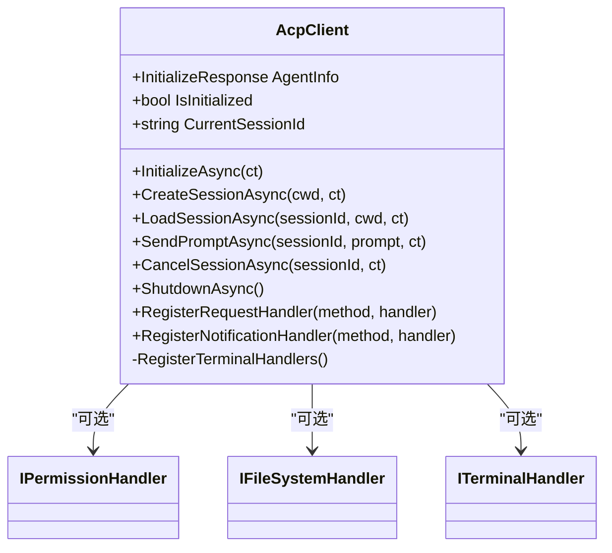
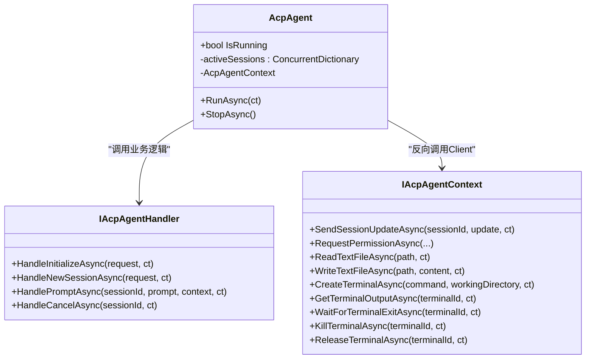
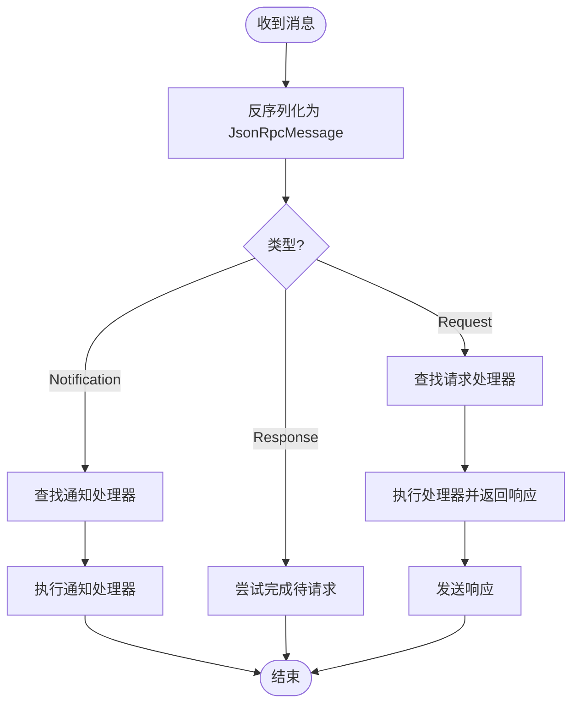
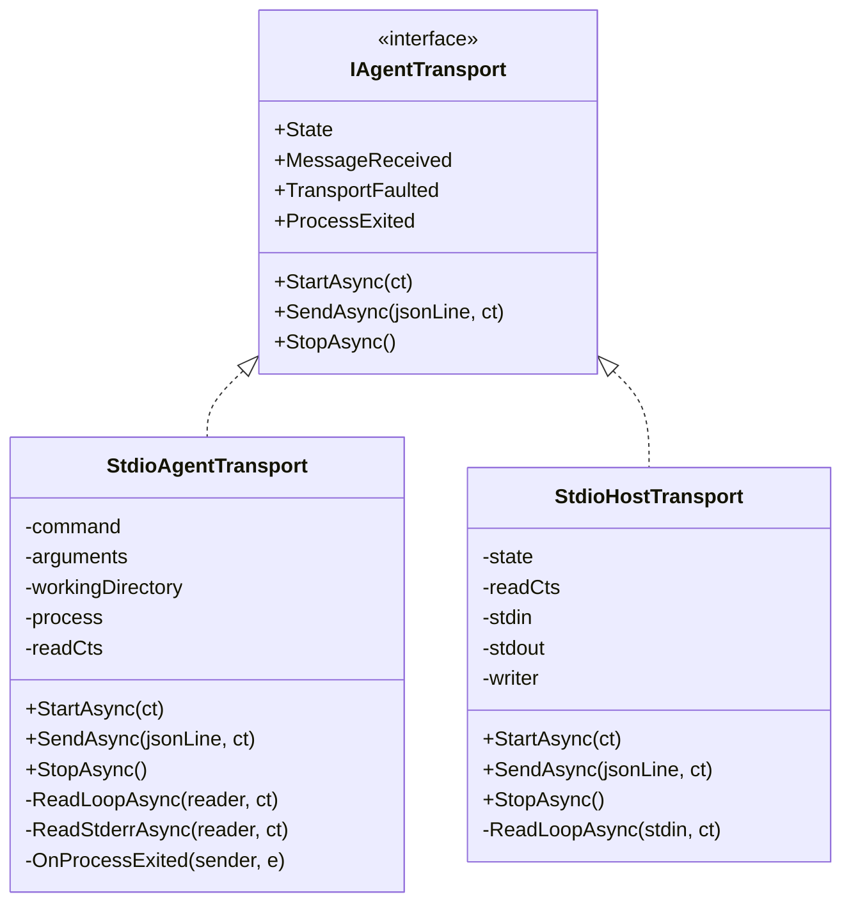
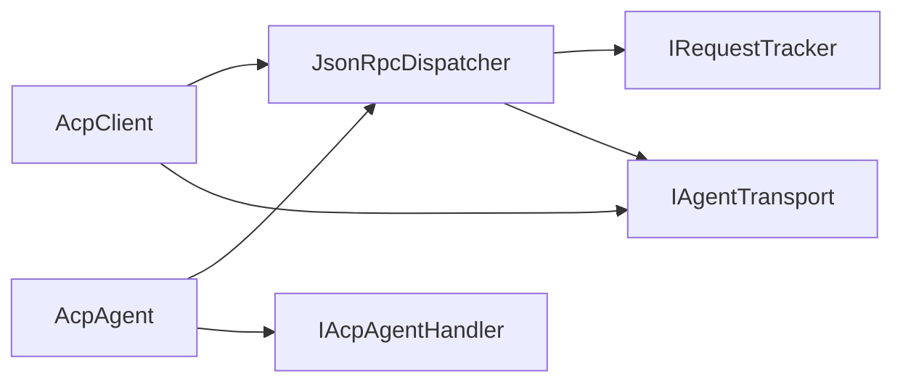

# Agent框架

<cite>
**本文引用的文件**   
- [README.md](file://README.md)
- [Agentic.ACPLibrary.csproj](file://Agentic.ACPLibrary.csproj)
- [Agent/AcpAgent.cs](file://Agent/AcpAgent.cs)
- [Agent/IAcpAgent.cs](file://Agent/IAcpAgent.cs)
- [Agent/IAcpAgentHandler.cs](file://Agent/IAcpAgentHandler.cs)
- [Agent/AcpAgentHandlerBase.cs](file://Agent/AcpAgentHandlerBase.cs)
- [Client/AcpClient.cs](file://Client/AcpClient.cs)
- [Client/IAcpClient.cs](file://Client/IAcpClient.cs)
- [Client/IFileSystemHandler.cs](file://Client/IFileSystemHandler.cs)
- [Protocol/JsonRpcDispatcher.cs](file://Protocol/JsonRpcDispatcher.cs)
- [Transport/StdioAgentTransport.cs](file://Transport/StdioAgentTransport.cs)
- [Transport/StdioHostTransport.cs](file://Transport/StdioHostTransport.cs)
- [Models/InitializeRequest.cs](file://Models/InitializeRequest.cs)
- [Models/Capabilities.cs](file://Models/Capabilities.cs)
- [Models/SessionPromptRequest.cs](file://Models/SessionPromptRequest.cs)
- [Infrastructure/ServiceCollectionExtensions.cs](file://Infrastructure/ServiceCollectionExtensions.cs)
- [samples/MockAgent/MockAgentHandler.cs](file://samples/MockAgent/MockAgentHandler.cs)
</cite>

## 目录
1. [简介](#简介)
2. [项目结构](#项目结构)
3. [核心组件](#核心组件)
4. [架构总览](#架构总览)
5. [详细组件分析](#详细组件分析)
6. [依赖关系分析](#依赖关系分析)
7. [性能考量](#性能考量)
8. [故障排查指南](#故障排查指南)
9. [结论](#结论)
10. [附录](#附录)

## 简介
本仓库实现了一个 .NET 的 ACP（Agent Client Protocol）库，支持通过 JSON-RPC over stdio 的双向通信：
- 客户端（Client）：启动并驱动一个符合 ACP 的 Agent（例如 IDE 或桌面主机）。
- Agent：构建你自己的 ACP 兼容 Agent，供客户端连接。

同一进程应仅作为 Client 或 Agent 之一运行，不可同时扮演两者。该库提供传输抽象、JSON-RPC 分发、会话管理以及可扩展的处理器接口，便于快速搭建 ACP 生态中的两端应用。

## 项目结构
整体采用分层与按功能域组织的方式：
- Agent：Agent 端核心实现、接口与基类
- Client：Client 端核心实现与扩展点（权限、文件系统、终端）
- Protocol：JSON-RPC 分发与请求追踪
- Transport：基于 stdio 的传输实现（子进程与宿主 stdin/stdout）
- Models：协议数据模型与枚举
- Infrastructure：依赖注入扩展与 JSON 选项
- samples：示例（MockAgent、TestClient）

图表来源
- [Client/AcpClient.cs:1-120](file://Client/AcpClient.cs#L1-L120)
- [Agent/AcpAgent.cs:1-120](file://Agent/AcpAgent.cs#L1-L120)
- [Protocol/JsonRpcDispatcher.cs:1-60](file://Protocol/JsonRpcDispatcher.cs#L1-L60)
- [Transport/StdioAgentTransport.cs:1-60](file://Transport/StdioAgentTransport.cs#L1-L60)
- [Transport/StdioHostTransport.cs:1-40](file://Transport/StdioHostTransport.cs#L1-L40)
- [Models/InitializeRequest.cs:1-16](file://Models/InitializeRequest.cs#L1-L16)
- [Models/Capabilities.cs:1-40](file://Models/Capabilities.cs#L1-L40)
- [Models/SessionPromptRequest.cs:1-20](file://Models/SessionPromptRequest.cs#L1-L20)

章节来源
- [README.md:1-120](file://README.md#L1-L120)
- [Agentic.ACPLibrary.csproj:1-36](file://Agentic.ACPLibrary.csproj#L1-L36)

## 核心组件
- AcpClient：ACP 客户端默认实现，负责建立传输、注册通知与请求处理器、完成 initialize 握手、创建/加载会话、发送 prompt、取消会话、关闭等。
- AcpAgent：ACP Agent 默认实现，监听 Client 请求，分发给用户实现的 IAcpAgentHandler，并通过 IAcpAgentContext 反向调用 Client。
- JsonRpcDispatcher：JSON-RPC 消息分发器，维护请求-响应匹配、通知路由、序列化与反序列化。
- StdioAgentTransport / StdioHostTransport：分别用于“客户端侧启动子进程”和“Agent 自身使用 stdin/stdout”。
- 模型层：InitializeRequest/Response、Capabilities、SessionPromptRequest/Response 等。
- 扩展点：IPermissionHandler、IFileSystemHandler、ITerminalHandler；以及自定义方法注册。

章节来源
- [Client/AcpClient.cs:1-200](file://Client/AcpClient.cs#L1-L200)
- [Agent/AcpAgent.cs:1-180](file://Agent/AcpAgent.cs#L1-L180)
- [Protocol/JsonRpcDispatcher.cs:1-124](file://Protocol/JsonRpcDispatcher.cs#L1-L124)
- [Transport/StdioAgentTransport.cs:1-150](file://Transport/StdioAgentTransport.cs#L1-L150)
- [Transport/StdioHostTransport.cs:1-91](file://Transport/StdioHostTransport.cs#L1-L91)
- [Models/InitializeRequest.cs:1-16](file://Models/InitializeRequest.cs#L1-L16)
- [Models/Capabilities.cs:1-65](file://Models/Capabilities.cs#L1-L65)
- [Models/SessionPromptRequest.cs:1-20](file://Models/SessionPromptRequest.cs#L1-L20)

## 架构总览
下图展示了 Client 与 Agent 之间的端到端交互流程，包括初始化握手、会话创建、提示发送与流式更新、以及取消机制。

图表来源
- [Client/AcpClient.cs:48-182](file://Client/AcpClient.cs#L48-L182)
- [Agent/AcpAgent.cs:44-179](file://Agent/AcpAgent.cs#L44-L179)
- [Protocol/JsonRpcDispatcher.cs:27-64](file://Protocol/JsonRpcDispatcher.cs#L27-L64)
- [Transport/StdioAgentTransport.cs:30-71](file://Transport/StdioAgentTransport.cs#L30-L71)
- [Transport/StdioHostTransport.cs:23-46](file://Transport/StdioHostTransport.cs#L23-L46)

## 详细组件分析

### AcpClient（客户端）
- 职责：启动传输、连接分发器、注册 session/update 通知与 fs/terminal 请求处理器、执行 initialize 握手、会话管理与提示发送、取消与关闭。
- 关键点：
  - 通过事件 SessionUpdated 推送流式更新。
  - 将 Agent 发起的请求委派给 IPermissionHandler、IFileSystemHandler、ITerminalHandler。
  - 支持扩展自定义方法与通知处理器。

图表来源
- [Client/AcpClient.cs:1-200](file://Client/AcpClient.cs#L1-L200)
- [Client/IFileSystemHandler.cs:1-14](file://Client/IFileSystemHandler.cs#L1-L14)

章节来源
- [Client/AcpClient.cs:1-361](file://Client/AcpClient.cs#L1-L361)
- [Client/IAcpClient.cs:1-59](file://Client/IAcpClient.cs#L1-L59)
- [Client/IFileSystemHandler.cs:1-14](file://Client/IFileSystemHandler.cs#L1-L14)

### AcpAgent（Agent 端）
- 职责：启动传输、连接分发器、注册 initialize/session/new/session/prompt/session/cancel 处理器，维护活跃会话的取消令牌，通过 IAcpAgentContext 反向调用 Client。
- 关键点：
  - 使用并发字典管理活跃会话的 CancellationTokenSource。
  - 收到 session/cancel 后调用 HandleCancelAsync 并取消对应会话任务。
  - 内部 AcpAgentContext 封装了向 Client 发送 session/update、请求权限、读写文件、终端操作等方法。

图表来源
- [Agent/AcpAgent.cs:1-309](file://Agent/AcpAgent.cs#L1-L309)
- [Agent/IAcpAgentHandler.cs:1-26](file://Agent/IAcpAgentHandler.cs#L1-L26)

章节来源
- [Agent/AcpAgent.cs:1-309](file://Agent/AcpAgent.cs#L1-L309)
- [Agent/IAcpAgent.cs:1-17](file://Agent/IAcpAgent.cs#L1-L17)
- [Agent/IAcpAgentHandler.cs:1-26](file://Agent/IAcpAgentHandler.cs#L1-L26)
- [Agent/AcpAgentHandlerBase.cs:1-30](file://Agent/AcpAgentHandlerBase.cs#L1-L30)

### JsonRpcDispatcher（JSON-RPC 分发器）
- 职责：维护请求-响应匹配、注册请求与通知处理器、序列化/反序列化、消息路由。
- 关键点：
  - 使用 IRequestTracker 管理待完成的请求。
  - OnMessageReceivedAsync 根据消息类型分发到相应处理器。
  - 支持 Disconnect 清理订阅与未完成请求。

图表来源
- [Protocol/JsonRpcDispatcher.cs:86-124](file://Protocol/JsonRpcDispatcher.cs#L86-L124)

章节来源
- [Protocol/JsonRpcDispatcher.cs:1-124](file://Protocol/JsonRpcDispatcher.cs#L1-L124)

### 传输层（StdioAgentTransport / StdioHostTransport）
- StdioAgentTransport：以子进程方式启动 Agent，重定向标准输入输出，异步读取 stdout 并触发 MessageReceived，stderr 用于诊断。
- StdioHostTransport：Agent 自身进程直接绑定 Console 的 stdin/stdout，进行行级读写。

图表来源
- [Transport/StdioAgentTransport.cs:1-150](file://Transport/StdioAgentTransport.cs#L1-L150)
- [Transport/StdioHostTransport.cs:1-91](file://Transport/StdioHostTransport.cs#L1-L91)

章节来源
- [Transport/StdioAgentTransport.cs:1-150](file://Transport/StdioAgentTransport.cs#L1-L150)
- [Transport/StdioHostTransport.cs:1-91](file://Transport/StdioHostTransport.cs#L1-L91)

### 模型与能力声明
- InitializeRequest/Response：包含协议版本、客户端信息与能力声明。
- Capabilities：描述客户端与 Agent 的能力（如文件系统、终端、提示能力等）。
- SessionPromptRequest/Response：会话提示请求与停止原因。

章节来源
- [Models/InitializeRequest.cs:1-16](file://Models/InitializeRequest.cs#L1-L16)
- [Models/Capabilities.cs:1-65](file://Models/Capabilities.cs#L1-L65)
- [Models/SessionPromptRequest.cs:1-20](file://Models/SessionPromptRequest.cs#L1-L20)

### 示例：MockAgent
- MockAgentHandler 演示了最小可用的 Agent 实现，支持拒绝、延迟与流式回复，便于测试客户端行为。

章节来源
- [samples/MockAgent/MockAgentHandler.cs:1-108](file://samples/MockAgent/MockAgentHandler.cs#L1-L108)

## 依赖关系分析
- AcpClient 依赖 IAgentTransport、IJsonRpcDispatcher、ILogger 与模型层。
- AcpAgent 依赖 IAgentTransport、IJsonRpcDispatcher、IAcpAgentHandler 与模型层。
- JsonRpcDispatcher 依赖 IRequestTracker 与 IAgentTransport。
- 传输层实现解耦于上层逻辑，便于替换为其他传输（如 TCP、WebSocket）。

图表来源
- [Client/AcpClient.cs:1-120](file://Client/AcpClient.cs#L1-L120)
- [Agent/AcpAgent.cs:1-120](file://Agent/AcpAgent.cs#L1-L120)
- [Protocol/JsonRpcDispatcher.cs:1-60](file://Protocol/JsonRpcDispatcher.cs#L1-L60)

章节来源
- [Client/AcpClient.cs:1-200](file://Client/AcpClient.cs#L1-L200)
- [Agent/AcpAgent.cs:1-180](file://Agent/AcpAgent.cs#L1-L180)
- [Protocol/JsonRpcDispatcher.cs:1-124](file://Protocol/JsonRpcDispatcher.cs#L1-L124)

## 性能考量
- 传输层采用异步行级读写，避免阻塞主线程；注意 UTF-8 BOM 问题，确保首行不被破坏。
- 请求-响应匹配通过 IRequestTracker 管理，避免内存泄漏；断开时应取消所有待完成请求。
- 活跃会话使用并发字典存储取消令牌，取消时需遍历并释放资源。
- 日志与诊断输出应走 stderr，避免污染 JSON-RPC 通道。

[本节为通用指导，不直接分析具体文件]

## 故障排查指南
- 初始化失败：检查 transport 是否成功启动、dispatcher 是否正确连接、initialize 参数是否符合协议。
- 无 session/update 事件：确认客户端已注册 session/update 通知处理器，且 Agent 正确发送更新。
- 权限/文件/终端请求未处理：确保在 InitializeAsync 前设置对应的 Handler。
- 进程退出：监听 AgentProcessExited 或 ProcessExited 事件，捕获异常并记录日志。
- 取消无效：检查 session/cancel 是否被正确发送，Agent 是否调用 HandleCancelAsync 并取消对应 cts。

章节来源
- [Client/AcpClient.cs:48-182](file://Client/AcpClient.cs#L48-L182)
- [Agent/AcpAgent.cs:154-179](file://Agent/AcpAgent.cs#L154-L179)
- [Transport/StdioAgentTransport.cs:73-96](file://Transport/StdioAgentTransport.cs#L73-L96)
- [Transport/StdioHostTransport.cs:48-58](file://Transport/StdioHostTransport.cs#L48-L58)

## 结论
该框架以清晰的职责划分与松耦合设计实现了 ACP 协议的客户端与 Agent 端，提供了标准化的传输、分发与模型定义，并通过可扩展的处理器接口满足权限、文件与终端等场景需求。借助 DI 扩展与示例工程，开发者可以快速搭建稳定可靠的 ACP 应用。

[本节为总结性内容，不直接分析具体文件]

## 附录
- 依赖注入：可使用 ServiceCollectionExtensions 快速注册 Client 或 Agent 服务。
- 扩展点：可通过 RegisterRequestHandler/RegisterNotificationHandler 添加自定义方法。
- 示例：参考 samples/MockAgent 与 README 的快速开始。

章节来源
- [Infrastructure/ServiceCollectionExtensions.cs:1-40](file://Infrastructure/ServiceCollectionExtensions.cs#L1-L40)
- [README.md:1-193](file://README.md#L1-L193)