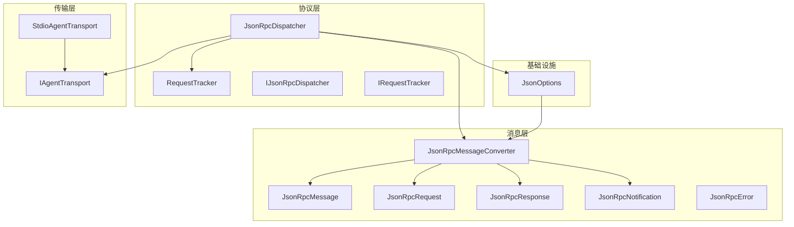
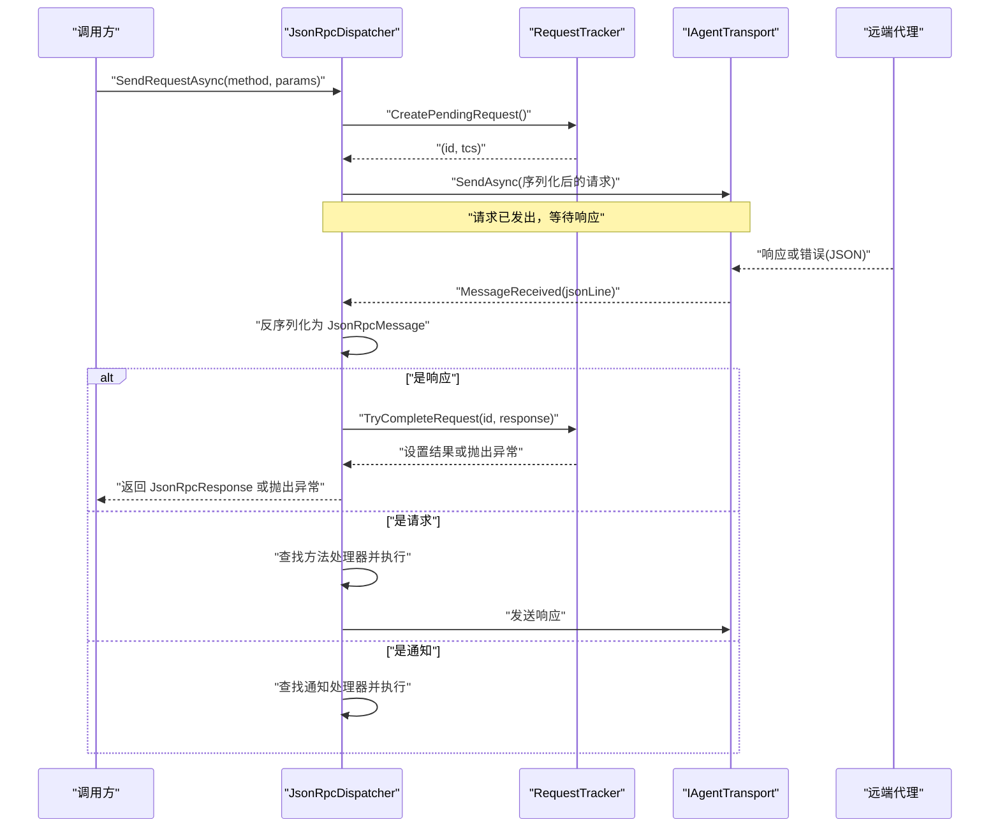
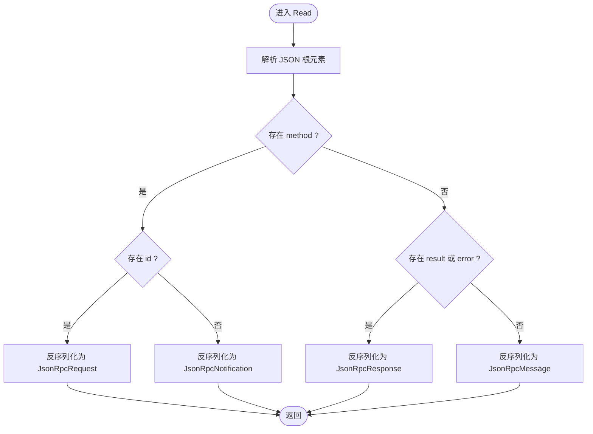
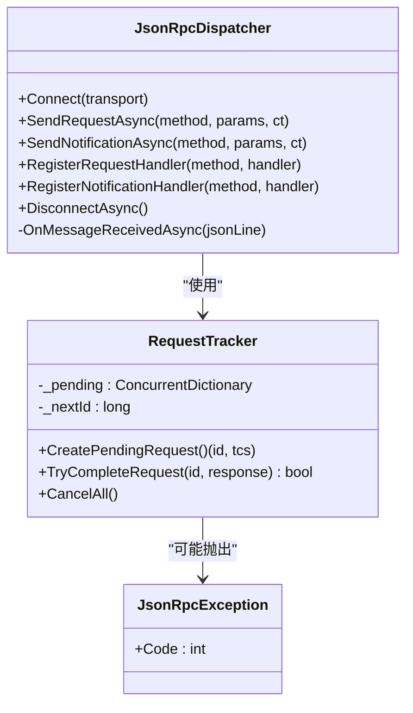
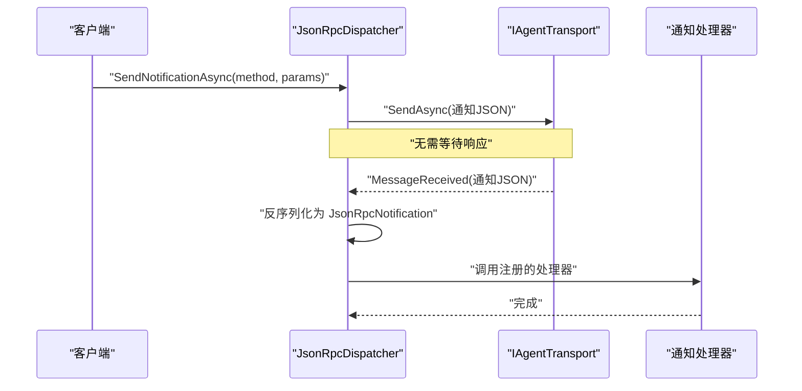
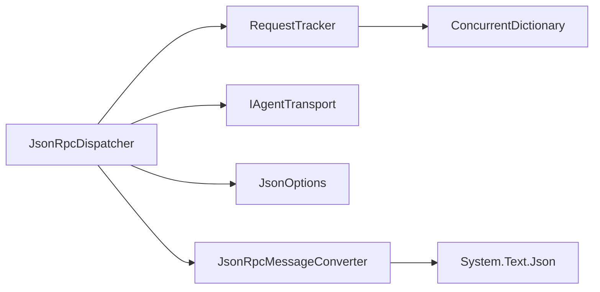

# JSON-RPC实现

<cite>
**本文引用的文件**   
- [JsonRpcMessage.cs](file://JsonRpc/JsonRpcMessage.cs)
- [JsonRpcRequest.cs](file://JsonRpc/JsonRpcRequest.cs)
- [JsonRpcResponse.cs](file://JsonRpc/JsonRpcResponse.cs)
- [JsonRpcNotification.cs](file://JsonRpc/JsonRpcNotification.cs)
- [JsonRpcError.cs](file://JsonRpc/JsonRpcError.cs)
- [JsonRpcMessageConverter.cs](file://JsonRpc/JsonRpcMessageConverter.cs)
- [IJsonRpcDispatcher.cs](file://Protocol/IJsonRpcDispatcher.cs)
- [JsonRpcDispatcher.cs](file://Protocol/JsonRpcDispatcher.cs)
- [IRequestTracker.cs](file://Protocol/IRequestTracker.cs)
- [RequestTracker.cs](file://Protocol/RequestTracker.cs)
- [JsonOptions.cs](file://Infrastructure/JsonOptions.cs)
- [IAgentTransport.cs](file://Transport/IAgentTransport.cs)
- [StdioAgentTransport.cs](file://Transport/StdioAgentTransport.cs)
- [README.md](file://README.md)
- [InitializeRequest.cs](file://Models/InitializeRequest.cs)
- [InitializeResponse.cs](file://Models/InitializeResponse.cs)
- [SessionNewRequest.cs](file://Models/SessionNewRequest.cs)
- [SessionPromptRequest.cs](file://Models/SessionPromptRequest.cs)
</cite>

## 目录
1. [简介](#简介)
2. [项目结构](#项目结构)
3. [核心组件](#核心组件)
4. [架构总览](#架构总览)
5. [详细组件分析](#详细组件分析)
6. [依赖关系分析](#依赖关系分析)
7. [性能考量](#性能考量)
8. [故障排查指南](#故障排查指南)
9. [结论](#结论)
10. [附录](#附录)

## 简介
本文件围绕库中 JSON-RPC 2.0 协议的实现进行系统化文档化，覆盖消息类型定义、请求/响应模式与通知机制、错误处理策略、序列化配置以及实际使用示例。该实现基于 .NET System.Text.Json，通过自定义转换器区分消息类型，并使用调度器与传输层解耦，便于扩展与测试。

## 项目结构
JSON-RPC 相关代码主要分布在以下命名空间：
- JsonRpc：消息模型与自定义转换器
- Protocol：调度器、请求跟踪器与接口
- Infrastructure：JSON 序列化选项（包含转换器注册）
- Transport：传输抽象与 stdio 实现
- Models：业务模型（作为 Params 的载荷）

图表来源
- [JsonRpcDispatcher.cs:1-124](file://Protocol/JsonRpcDispatcher.cs#L1-L124)
- [RequestTracker.cs:1-52](file://Protocol/RequestTracker.cs#L1-L52)
- [JsonRpcMessageConverter.cs:1-73](file://JsonRpc/JsonRpcMessageConverter.cs#L1-L73)
- [JsonOptions.cs:1-28](file://Infrastructure/JsonOptions.cs#L1-L28)
- [IAgentTransport.cs:1-39](file://Transport/IAgentTransport.cs#L1-L39)
- [StdioAgentTransport.cs:1-147](file://Transport/StdioAgentTransport.cs#L1-L147)

章节来源
- [README.md:1-99](file://README.md#L1-L99)

## 核心组件
- 消息基类与派生类型：用于区分请求、响应与通知
- 自定义转换器：根据字段存在性自动识别消息类型
- 调度器：负责发送请求/通知、分发接收到的消息、匹配响应ID
- 请求跟踪器：管理待完成请求的 ID 与 TaskCompletionSource
- 传输抽象：统一 I/O 通道（如 stdio），屏蔽底层细节
- JSON 选项：集中配置序列化行为并注册转换器

章节来源
- [JsonRpcMessage.cs:1-14](file://JsonRpc/JsonRpcMessage.cs#L1-L14)
- [JsonRpcRequest.cs:1-19](file://JsonRpc/JsonRpcRequest.cs#L1-L19)
- [JsonRpcResponse.cs:1-20](file://JsonRpc/JsonRpcResponse.cs#L1-L20)
- [JsonRpcNotification.cs:1-16](file://JsonRpc/JsonRpcNotification.cs#L1-L16)
- [JsonRpcError.cs:1-19](file://JsonRpc/JsonRpcError.cs#L1-L19)
- [JsonRpcMessageConverter.cs:1-73](file://JsonRpc/JsonRpcMessageConverter.cs#L1-L73)
- [IJsonRpcDispatcher.cs:1-14](file://Protocol/IJsonRpcDispatcher.cs#L1-L14)
- [JsonRpcDispatcher.cs:1-124](file://Protocol/JsonRpcDispatcher.cs#L1-L124)
- [IRequestTracker.cs:1-11](file://Protocol/IRequestTracker.cs#L1-L11)
- [RequestTracker.cs:1-52](file://Protocol/RequestTracker.cs#L1-L52)
- [JsonOptions.cs:1-28](file://Infrastructure/JsonOptions.cs#L1-L28)
- [IAgentTransport.cs:1-39](file://Transport/IAgentTransport.cs#L1-L39)
- [StdioAgentTransport.cs:1-147](file://Transport/StdioAgentTransport.cs#L1-L147)

## 架构总览
下图展示了从调用方到传输层的完整调用链，包括请求发送、消息分发、响应匹配与异常传播。

图表来源
- [JsonRpcDispatcher.cs:27-47](file://Protocol/JsonRpcDispatcher.cs#L27-L47)
- [JsonRpcDispatcher.cs:86-122](file://Protocol/JsonRpcDispatcher.cs#L86-L122)
- [RequestTracker.cs:11-30](file://Protocol/RequestTracker.cs#L11-L30)
- [IAgentTransport.cs:12-15](file://Transport/IAgentTransport.cs#L12-L15)

## 详细组件分析

### 消息类型与用途
- JsonRpcMessage：基础消息类型，固定 jsonrpc 版本为 "2.0"
- JsonRpcRequest：请求，包含 id、method、可选 params
- JsonRpcResponse：响应，包含 id，且 result 与 error 二选一
- JsonRpcNotification：通知，包含 method、可选 params，无 id
- JsonRpcError：错误对象，包含 code、message、可选 data

这些类型通过 System.Text.Json 的属性名映射与忽略空值策略进行序列化/反序列化。

章节来源
- [JsonRpcMessage.cs:6-13](file://JsonRpc/JsonRpcMessage.cs#L6-L13)
- [JsonRpcRequest.cs:6-18](file://JsonRpc/JsonRpcRequest.cs#L6-L18)
- [JsonRpcResponse.cs:6-19](file://JsonRpc/JsonRpcResponse.cs#L6-L19)
- [JsonRpcNotification.cs:6-15](file://JsonRpc/JsonRpcNotification.cs#L6-L15)
- [JsonRpcError.cs:6-18](file://JsonRpc/JsonRpcError.cs#L6-L18)

### 自定义转换器：按字段识别消息类型
JsonRpcMessageConverter 在 Read 时检查根节点是否存在 method、id、result、error 等字段，从而将原始 JSON 反序列化为具体类型；Write 时根据运行时类型选择对应序列化路径，并通过内部选项移除自身以避免递归。

图表来源
- [JsonRpcMessageConverter.cs:11-32](file://JsonRpc/JsonRpcMessageConverter.cs#L11-L32)

章节来源
- [JsonRpcMessageConverter.cs:1-73](file://JsonRpc/JsonRpcMessageConverter.cs#L1-L73)

### 请求/响应模式与ID管理
- 发送请求：调度器创建待完成请求（分配唯一 id），构造 JsonRpcRequest 并序列化后通过传输发送，随后等待 TaskCompletionSource 完成
- 接收响应：收到 JSON 行后反序列化为 JsonRpcMessage，若为响应则通过 id 匹配并设置结果或异常
- 取消与清理：断开连接时取消所有待完成请求

图表来源
- [JsonRpcDispatcher.cs:16-84](file://Protocol/JsonRpcDispatcher.cs#L16-L84)
- [RequestTracker.cs:11-39](file://Protocol/RequestTracker.cs#L11-L39)
- [RequestTracker.cs:43-51](file://Protocol/RequestTracker.cs#L43-L51)

章节来源
- [JsonRpcDispatcher.cs:27-47](file://Protocol/JsonRpcDispatcher.cs#L27-L47)
- [JsonRpcDispatcher.cs:86-122](file://Protocol/JsonRpcDispatcher.cs#L86-L122)
- [RequestTracker.cs:11-30](file://Protocol/RequestTracker.cs#L11-L30)
- [RequestTracker.cs:43-51](file://Protocol/RequestTracker.cs#L43-L51)

### 通知机制与工作流
- 发送通知：构造 JsonRpcNotification（无 id），序列化后直接发送，不等待响应
- 接收通知：反序列化为 JsonRpcNotification 后，查找对应方法处理器并异步执行

图表来源
- [JsonRpcDispatcher.cs:49-64](file://Protocol/JsonRpcDispatcher.cs#L49-L64)
- [JsonRpcDispatcher.cs:110-115](file://Protocol/JsonRpcDispatcher.cs#L110-L115)

章节来源
- [JsonRpcDispatcher.cs:49-64](file://Protocol/JsonRpcDispatcher.cs#L49-L64)
- [JsonRpcDispatcher.cs:110-115](file://Protocol/JsonRpcDispatcher.cs#L110-L115)

### 错误处理策略与错误代码
- 服务端错误：当响应包含 error 字段时，RequestTracker 会抛出 JsonRpcException，携带 code 与 message
- 客户端异常：未连接时发送请求会抛出 InvalidOperationException
- 反序列化失败：当前实现捕获异常并忽略（建议在生产环境记录日志）

最佳实践：
- 始终检查响应中的 error 字段（尽管框架已转换为异常）
- 对自定义处理器抛出的异常进行包装，确保错误码符合约定
- 在断开连接或超时场景下，合理取消待完成请求

章节来源
- [RequestTracker.cs:19-30](file://Protocol/RequestTracker.cs#L19-L30)
- [JsonRpcDispatcher.cs:29-31](file://Protocol/JsonRpcDispatcher.cs#L29-L31)
- [JsonRpcDispatcher.cs:118-121](file://Protocol/JsonRpcDispatcher.cs#L118-L121)

### 序列化与反序列化配置
- 属性名大小写不敏感
- 写入时忽略 null 值
- 紧凑输出（非缩进）
- 允许元数据属性乱序
- 注册 JsonRpcMessageConverter 与 JsonStringEnumConverter

这些配置集中在 JsonOptions.Default 中，供调度器与转换器复用。

章节来源
- [JsonOptions.cs:13-26](file://Infrastructure/JsonOptions.cs#L13-L26)
- [JsonRpcMessageConverter.cs:57-71](file://JsonRpc/JsonRpcMessageConverter.cs#L57-L71)

### 传输层集成
- IAgentTransport：定义发送、接收事件、生命周期与状态
- StdioAgentTransport：基于子进程标准输入/输出实现，支持启动、停止、读取与错误事件

章节来源
- [IAgentTransport.cs:1-39](file://Transport/IAgentTransport.cs#L1-L39)
- [StdioAgentTransport.cs:1-147](file://Transport/StdioAgentTransport.cs#L1-L147)

## 依赖关系分析
- JsonRpcDispatcher 依赖 IRequestTracker、IAgentTransport 与 JsonOptions
- RequestTracker 维护并发字典以跟踪待完成请求
- JsonRpcMessageConverter 依赖 System.Text.Json 并避免递归
- 传输层与协议层通过事件与接口解耦

图表来源
- [JsonRpcDispatcher.cs:1-124](file://Protocol/JsonRpcDispatcher.cs#L1-L124)
- [RequestTracker.cs:1-52](file://Protocol/RequestTracker.cs#L1-L52)
- [JsonRpcMessageConverter.cs:1-73](file://JsonRpc/JsonRpcMessageConverter.cs#L1-L73)
- [JsonOptions.cs:1-28](file://Infrastructure/JsonOptions.cs#L1-L28)

章节来源
- [JsonRpcDispatcher.cs:1-124](file://Protocol/JsonRpcDispatcher.cs#L1-L124)
- [RequestTracker.cs:1-52](file://Protocol/RequestTracker.cs#L1-L52)
- [JsonRpcMessageConverter.cs:1-73](file://JsonRpc/JsonRpcMessageConverter.cs#L1-L73)
- [JsonOptions.cs:1-28](file://Infrastructure/JsonOptions.cs#L1-L28)

## 性能考量
- 使用 ConcurrentDictionary 与原子递增保证高并发下的请求跟踪性能
- TaskCreationOptions.RunContinuationsAsynchronously 减少同步上下文开销
- 紧凑 JSON 输出与忽略 null 值降低网络负载
- 自定义转换器避免重复解析，提升反序列化效率

[本节为通用指导，不涉及具体文件分析]

## 故障排查指南
常见问题与定位要点：
- 未连接即发送请求：检查是否先调用 Connect 并成功建立传输
- 响应未到达：确认远端是否正确返回包含 id 的响应
- 反序列化失败：检查 JSON 是否符合 JSON-RPC 2.0 规范，确认字段名与类型
- 处理器未触发：确认方法名注册正确且大小写一致
- 进程退出：监听 ProcessExited 事件并记录退出码

章节来源
- [JsonRpcDispatcher.cs:29-31](file://Protocol/JsonRpcDispatcher.cs#L29-L31)
- [JsonRpcDispatcher.cs:118-121](file://Protocol/JsonRpcDispatcher.cs#L118-L121)
- [StdioAgentTransport.cs:137-145](file://Transport/StdioAgentTransport.cs#L137-L145)

## 结论
该 JSON-RPC 2.0 实现通过清晰的消息模型、灵活的转换器与可插拔的传输层，提供了稳定高效的请求/响应与通知机制。配合统一的 JSON 配置与完善的错误处理，能够满足 ACP 协议的实际需求，并具备良好的可扩展性与可维护性。

[本节为总结，不涉及具体文件分析]

## 附录

### JSON-RPC 消息示例
以下为常见消息结构的示例（字段顺序与空白不影响解析）：

- 请求
{
  "jsonrpc": "2.0",
  "id": 1,
  "method": "session/prompt",
  "params": {
    "sessionId": "abc123",
    "prompt": [
      {"type": "text", "text": "你好！"}
    ]
  }
}

- 响应（成功）
{
  "jsonrpc": "2.0",
  "id": 1,
  "result": {
    "stopReason": "end_turn"
  }
}

- 响应（错误）
{
  "jsonrpc": "2.0",
  "id": 1,
  "error": {
    "code": -32600,
    "message": "Invalid params",
    "data": {
      "details": "缺少必要字段"
    }
  }
}

- 通知
{
  "jsonrpc": "2.0",
  "method": "session/update",
  "params": {
    "sessionId": "abc123",
    "content": "部分文本片段"
  }
}

章节来源
- [SessionPromptRequest.cs:6-19](file://Models/SessionPromptRequest.cs#L6-L19)
- [InitializeRequest.cs:5-15](file://Models/InitializeRequest.cs#L5-L15)
- [InitializeResponse.cs:5-18](file://Models/InitializeResponse.cs#L5-L18)
- [SessionNewRequest.cs:5-19](file://Models/SessionNewRequest.cs#L5-L19)

### 错误代码与最佳实践
- 标准错误码参考：-32700（解析错误）、-32600（无效请求）、-32601（方法不存在）、-32603（内部错误）
- 自定义错误码：建议使用负数区间，并在 data 中提供结构化信息
- 最佳实践：
  - 在处理器中捕获异常并返回合适的错误对象
  - 对长耗时操作使用 CancellationToken 支持取消
  - 记录关键事件以便问题追踪

章节来源
- [JsonRpcError.cs:6-18](file://JsonRpc/JsonRpcError.cs#L6-L18)
- [RequestTracker.cs:19-30](file://Protocol/RequestTracker.cs#L19-L30)