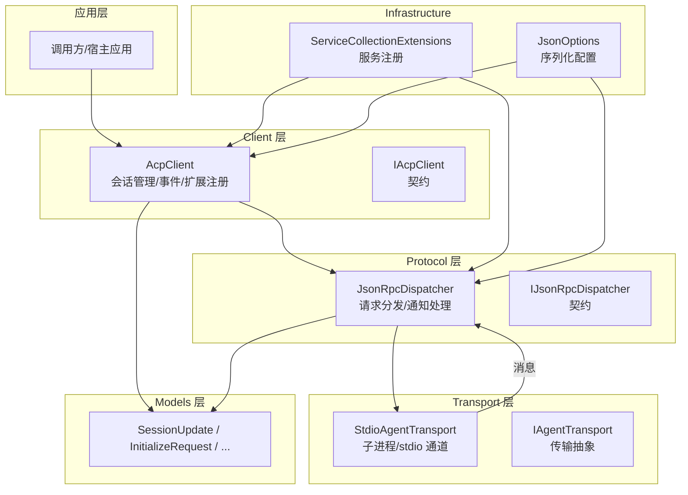
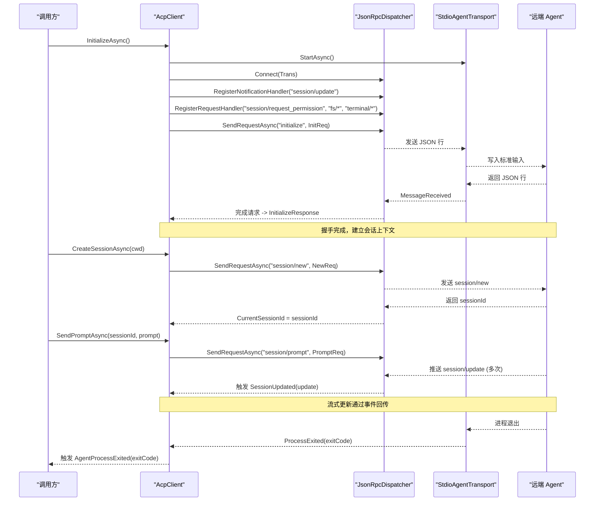
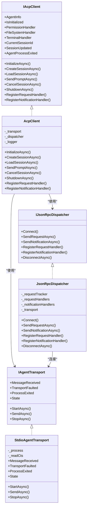
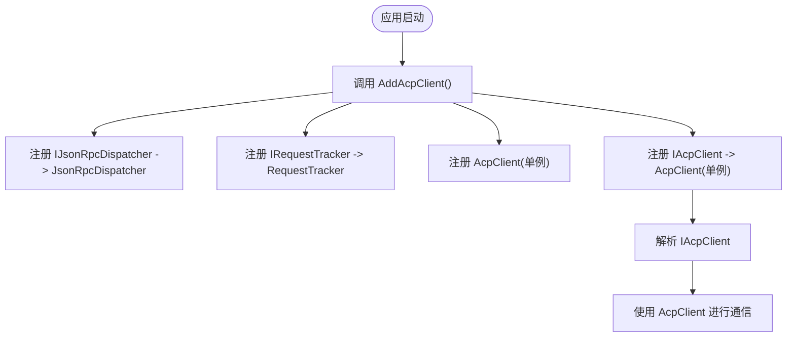
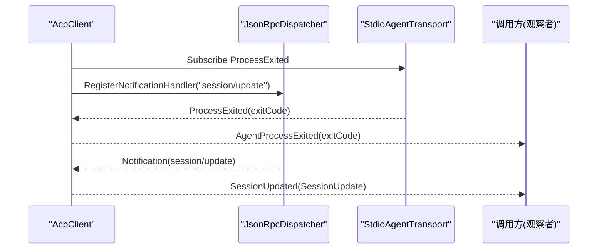
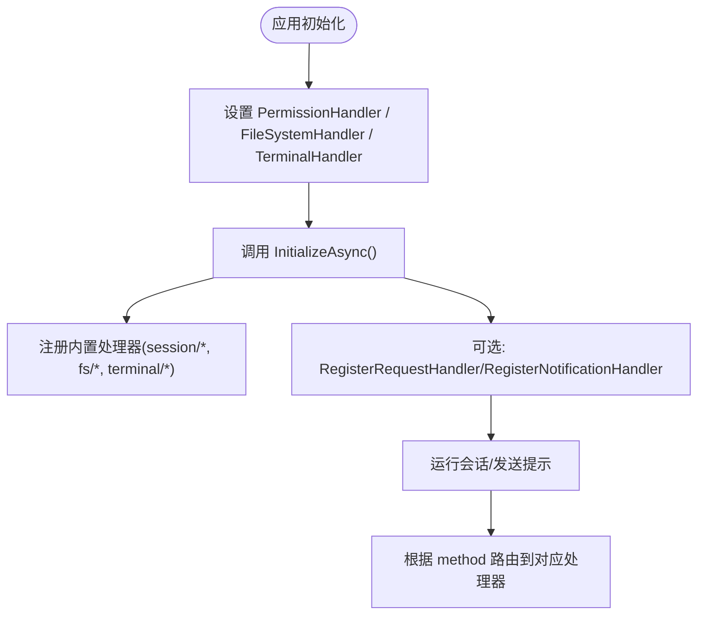
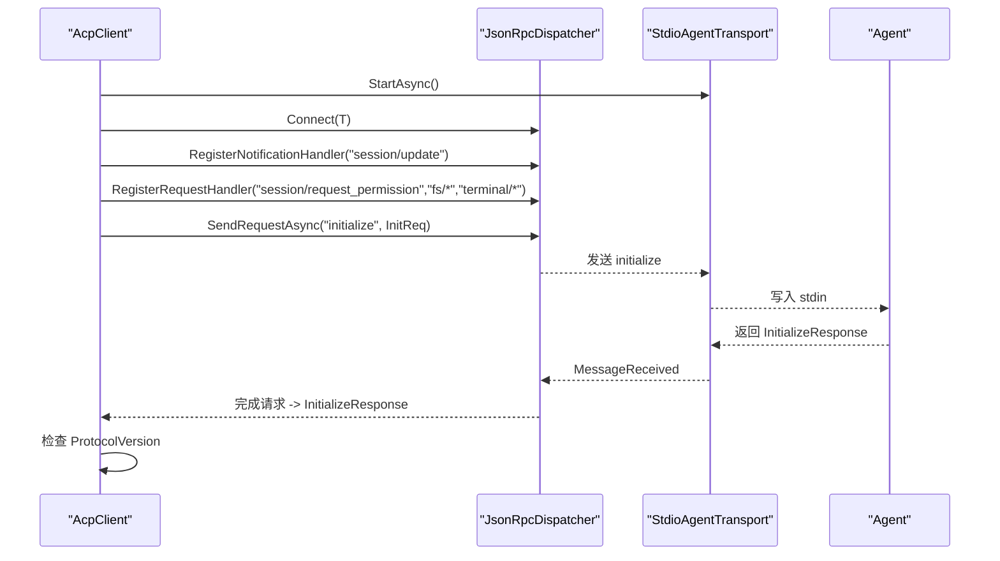
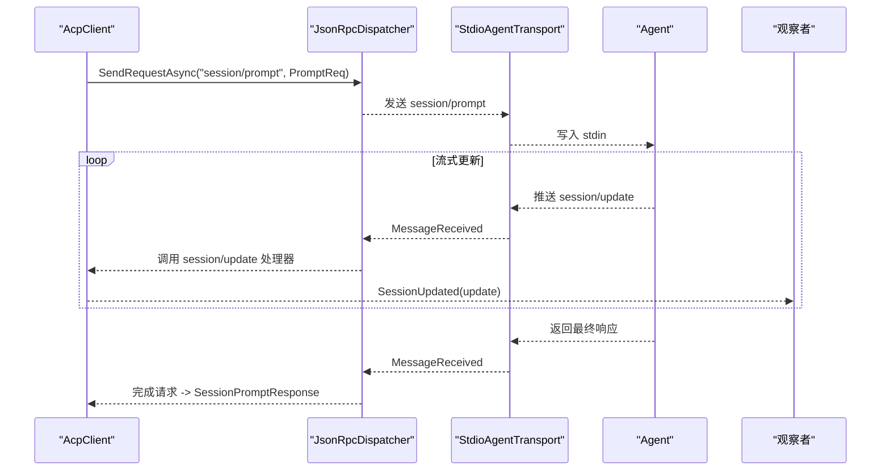
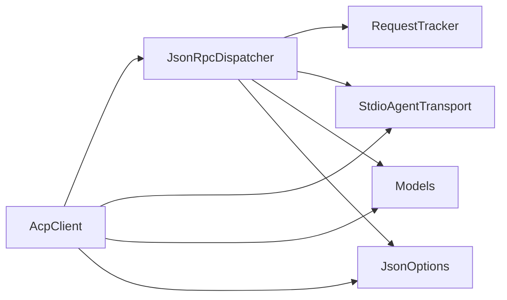

# 架构模式

<cite>
**本文引用的文件**   
- [README.md](file://README.md)
- [AcpClient.cs](file://Client/AcpClient.cs)
- [IAcpClient.cs](file://Client/IAcpClient.cs)
- [IPermissionHandler.cs](file://Client/IPermissionHandler.cs)
- [IFileSystemHandler.cs](file://Client/IFileSystemHandler.cs)
- [ITerminalHandler.cs](file://Client/ITerminalHandler.cs)
- [ServiceCollectionExtensions.cs](file://Infrastructure/ServiceCollectionExtensions.cs)
- [JsonOptions.cs](file://Infrastructure/JsonOptions.cs)
- [JsonRpcDispatcher.cs](file://Protocol/JsonRpcDispatcher.cs)
- [IJsonRpcDispatcher.cs](file://Protocol/IJsonRpcDispatcher.cs)
- [StdioAgentTransport.cs](file://Transport/StdioAgentTransport.cs)
- [IAgentTransport.cs](file://Transport/IAgentTransport.cs)
- [SessionUpdate.cs](file://Models/SessionUpdate.cs)
- [InitializeRequest.cs](file://Models/InitializeRequest.cs)
- [JsonRpcMessage.cs](file://JsonRpc/JsonRpcMessage.cs)
</cite>

## 目录
1. [简介](#简介)
2. [项目结构](#项目结构)
3. [核心组件](#核心组件)
4. [架构总览](#架构总览)
5. [详细组件分析](#详细组件分析)
6. [依赖关系分析](#依赖关系分析)
7. [性能考量](#性能考量)
8. [故障排查指南](#故障排查指南)
9. [结论](#结论)
10. [附录](#附录)

## 简介
本文件面向 Agentic.ACPLibrary 的架构模式，系统性阐述客户端-服务器架构、依赖注入、事件驱动与观察者模式、分层设计（Client、Protocol、Transport、Models）以及扩展点与插件机制。文档通过架构图与交互时序图帮助读者快速理解系统结构与数据流，并提供可操作的扩展指导。

## 项目结构
库采用清晰的分层组织：
- Client：对外暴露的客户端契约与默认实现，封装会话生命周期、事件与扩展注册。
- Protocol：JSON-RPC 分发器与请求跟踪，屏蔽协议细节。
- Transport：传输抽象与基于 stdio 的实现，负责子进程管理与消息收发。
- Models：协议模型与枚举，包含会话更新、初始化请求等数据结构。
- Infrastructure：通用基础设施（JSON 序列化选项、DI 扩展）。
- JsonRpc：JSON-RPC 基础消息类型与转换器。

**图表来源** 
- [AcpClient.cs:1-361](file://Client/AcpClient.cs#L1-L361)
- [JsonRpcDispatcher.cs:1-124](file://Protocol/JsonRpcDispatcher.cs#L1-L124)
- [StdioAgentTransport.cs:1-147](file://Transport/StdioAgentTransport.cs#L1-L147)
- [ServiceCollectionExtensions.cs:1-23](file://Infrastructure/ServiceCollectionExtensions.cs#L1-L23)
- [JsonOptions.cs:1-28](file://Infrastructure/JsonOptions.cs#L1-L28)

**章节来源**
- [README.md:1-99](file://README.md#L1-L99)

## 核心组件
- AcpClient：客户端门面，负责启动传输、握手、会话创建/加载、发送提示、取消会话、关闭；订阅并转发事件；注册内置与自定义处理器。
- JsonRpcDispatcher：JSON-RPC 请求/响应/通知的分发器，维护待完成请求与回调，按方法名路由到已注册的处理器。
- StdioAgentTransport：基于子进程的 stdio 传输，管理进程生命周期、读取输出/错误流、发送 JSON 行、抛出退出事件。
- 模型层：SessionUpdate 及其派生类型用于流式更新；InitializeRequest/Response 用于握手；其他协议相关模型。
- 基础设施：JsonOptions 提供统一的序列化配置；ServiceCollectionExtensions 提供 DI 注册扩展。

**章节来源**
- [AcpClient.cs:1-361](file://Client/AcpClient.cs#L1-L361)
- [JsonRpcDispatcher.cs:1-124](file://Protocol/JsonRpcDispatcher.cs#L1-L124)
- [StdioAgentTransport.cs:1-147](file://Transport/StdioAgentTransport.cs#L1-L147)
- [SessionUpdate.cs:1-119](file://Models/SessionUpdate.cs#L1-L119)
- [InitializeRequest.cs:1-16](file://Models/InitializeRequest.cs#L1-L16)
- [JsonOptions.cs:1-28](file://Infrastructure/JsonOptions.cs#L1-L28)
- [ServiceCollectionExtensions.cs:1-23](file://Infrastructure/ServiceCollectionExtensions.cs#L1-L23)

## 架构总览
系统采用“客户端-服务器”模式：
- 客户端（AcpClient）通过协议层（JsonRpcDispatcher）与传输层（StdioAgentTransport）与远端 Agent 通信。
- 传输层以子进程方式运行 Agent，使用标准输入/输出进行 JSON-RPC 消息交换。
- 协议层将收到的 JSON-RPC 消息解析为 Request/Response/Notification，并按方法名分发给已注册的处理器。
- 模型层定义所有跨进程的数据结构，支持多态反序列化（如 SessionUpdate）。
- 基础设施提供统一序列化选项与 DI 容器集成。

**图表来源** 
- [AcpClient.cs:48-182](file://Client/AcpClient.cs#L48-L182)
- [JsonRpcDispatcher.cs:27-84](file://Protocol/JsonRpcDispatcher.cs#L27-L84)
- [StdioAgentTransport.cs:30-93](file://Transport/StdioAgentTransport.cs#L30-L93)

## 详细组件分析

### 客户端-服务器架构与分层职责
- Client 层（AcpClient/IAcpClient）：面向应用的入口，封装会话生命周期、事件与扩展点；不直接操作网络或进程。
- Protocol 层（JsonRpcDispatcher/IJsonRpcDispatcher）：协议编排与分发，屏蔽 JSON-RPC 细节；维护请求-响应匹配与通知路由。
- Transport 层（StdioAgentTransport/IAgentTransport）：与 Agent 进程通信，管理生命周期与 IO；对上层仅暴露行级 JSON 消息。
- Models 层：纯数据契约，避免业务逻辑泄漏到传输与协议层。
- Infrastructure：集中化配置（序列化选项）与依赖注入扩展，降低耦合。

**图表来源** 
- [IAcpClient.cs:1-59](file://Client/IAcpClient.cs#L1-L59)
- [AcpClient.cs:1-361](file://Client/AcpClient.cs#L1-L361)
- [IJsonRpcDispatcher.cs:1-14](file://Protocol/IJsonRpcDispatcher.cs#L1-L14)
- [JsonRpcDispatcher.cs:1-124](file://Protocol/JsonRpcDispatcher.cs#L1-L124)
- [IAgentTransport.cs:1-39](file://Transport/IAgentTransport.cs#L1-L39)
- [StdioAgentTransport.cs:1-147](file://Transport/StdioAgentTransport.cs#L1-L147)

**章节来源**
- [AcpClient.cs:1-361](file://Client/AcpClient.cs#L1-L361)
- [JsonRpcDispatcher.cs:1-124](file://Protocol/JsonRpcDispatcher.cs#L1-L124)
- [StdioAgentTransport.cs:1-147](file://Transport/StdioAgentTransport.cs#L1-L147)

### 依赖注入与服务注册解析
- 通过 ServiceCollectionExtensions.AddAcpClient 将以下服务注册到 DI 容器：
  - IJsonRpcDispatcher -> JsonRpcDispatcher（瞬态）
  - IRequestTracker -> RequestTracker（瞬态）
  - AcpClient（单例）
  - IAcpClient 映射到 AcpClient（单例）
- 调用方在应用启动时调用 AddAcpClient，即可从容器中解析 IAcpClient 并使用。

**图表来源** 
- [ServiceCollectionExtensions.cs:14-21](file://Infrastructure/ServiceCollectionExtensions.cs#L14-L21)

**章节来源**
- [ServiceCollectionExtensions.cs:1-23](file://Infrastructure/ServiceCollectionExtensions.cs#L1-L23)

### 事件驱动与观察者模式
- 事件源：
  - AcpClient.SessionUpdated：当收到 session/update 通知时触发，参数为 SessionUpdate 派生对象。
  - AcpClient.AgentProcessExited：当底层进程退出时触发，参数为退出码。
- 事件订阅：
  - AcpClient 在 InitializeAsync 中订阅 _transport.ProcessExited，并转发为 AgentProcessExited。
  - AcpClient 在 InitializeAsync 中注册 "session/update" 通知处理器，反序列化为 SessionUpdateParams 后触发 SessionUpdated。
- 观察者模式体现：
  - 调用方通过 += 订阅事件，解耦业务逻辑与协议处理。
  - 多个观察者可同时订阅同一事件，互不影响。

**图表来源** 
- [AcpClient.cs:56-72](file://Client/AcpClient.cs#L56-L72)
- [StdioAgentTransport.cs:137-145](file://Transport/StdioAgentTransport.cs#L137-L145)

**章节来源**
- [AcpClient.cs:31-35](file://Client/AcpClient.cs#L31-L35)
- [AcpClient.cs:56-72](file://Client/AcpClient.cs#L56-L72)

### 分层架构与职责分离
- Client 层：
  - 会话生命周期管理（创建/加载/取消/关闭）。
  - 事件桥接（Transport -> Client 事件）。
  - 内置处理器注册（权限、文件系统、终端）。
  - 扩展点注册（自定义请求/通知处理器）。
- Protocol 层：
  - JSON-RPC 请求-响应匹配（请求 ID 追踪）。
  - 通知分发（按方法名路由）。
  - 与传输层解耦（仅依赖 IAgentTransport）。
- Transport 层：
  - 子进程生命周期管理（启动/停止/退出）。
  - 标准输入/输出读写（行级 JSON 消息）。
  - 异常与状态事件（TransportFaulted、ProcessExited）。
- Models 层：
  - 协议数据契约（InitializeRequest、SessionUpdate 等）。
  - 多态反序列化（sessionUpdate 作为鉴别器）。

**章节来源**
- [AcpClient.cs:148-182](file://Client/AcpClient.cs#L148-L182)
- [JsonRpcDispatcher.cs:86-122](file://Protocol/JsonRpcDispatcher.cs#L86-L122)
- [StdioAgentTransport.cs:30-93](file://Transport/StdioAgentTransport.cs#L30-L93)
- [SessionUpdate.cs:8-17](file://Models/SessionUpdate.cs#L8-L17)

### 扩展点与插件机制
- 自定义请求处理器：
  - 通过 AcpClient.RegisterRequestHandler(method, handler) 注册任意方法名的请求处理器。
  - 处理器接收 JsonRpcRequest，返回 JsonRpcResponse。
- 自定义通知处理器：
  - 通过 AcpClient.RegisterNotificationHandler(method, handler) 注册任意方法名的通知处理器。
  - 处理器接收 JsonRpcNotification。
- 内置扩展点：
  - 权限处理：IPermissionHandler（session/request_permission）。
  - 文件系统：IFileSystemHandler（fs/read_text_file、fs/write_text_file）。
  - 终端：ITerminalHandler（terminal/create、terminal/output、terminal/wait_for_exit、terminal/kill、terminal/release）。
- 扩展流程：
  - 在 InitializeAsync 之前设置 Handler 接口实例。
  - 在 InitializeAsync 之后仍可注册自定义处理器，覆盖或补充协议行为。

**图表来源** 
- [AcpClient.cs:74-147](file://Client/AcpClient.cs#L74-L147)
- [AcpClient.cs:243-248](file://Client/AcpClient.cs#L243-L248)

**章节来源**
- [AcpClient.cs:74-147](file://Client/AcpClient.cs#L74-L147)
- [AcpClient.cs:243-248](file://Client/AcpClient.cs#L243-L248)
- [IPermissionHandler.cs:1-17](file://Client/IPermissionHandler.cs#L1-L17)
- [IFileSystemHandler.cs:1-14](file://Client/IFileSystemHandler.cs#L1-L14)
- [ITerminalHandler.cs:1-23](file://Client/ITerminalHandler.cs#L1-L23)

### 关键流程时序图

#### 初始化握手与协议版本检查

**图表来源** 
- [AcpClient.cs:48-182](file://Client/AcpClient.cs#L48-L182)
- [JsonRpcDispatcher.cs:27-47](file://Protocol/JsonRpcDispatcher.cs#L27-L47)
- [StdioAgentTransport.cs:61-68](file://Transport/StdioAgentTransport.cs#L61-L68)

#### 会话提示与流式更新

**图表来源** 
- [AcpClient.cs:208-216](file://Client/AcpClient.cs#L208-L216)
- [AcpClient.cs:64-72](file://Client/AcpClient.cs#L64-L72)
- [JsonRpcDispatcher.cs:86-122](file://Protocol/JsonRpcDispatcher.cs#L86-L122)

## 依赖关系分析
- AcpClient 依赖 IJsonRpcDispatcher 与 IAgentTransport，并通过事件与处理器扩展能力。
- JsonRpcDispatcher 依赖 IRequestTracker 与 IAgentTransport，内部维护方法名到处理器的映射。
- StdioAgentTransport 依赖 .NET 进程 API，暴露事件给上层。
- Models 被 Client 与 Protocol 共同消费，保持协议一致性。
- Infrastructure 提供全局序列化选项与 DI 扩展，减少重复配置。

**图表来源** 
- [AcpClient.cs:1-361](file://Client/AcpClient.cs#L1-L361)
- [JsonRpcDispatcher.cs:1-124](file://Protocol/JsonRpcDispatcher.cs#L1-L124)
- [StdioAgentTransport.cs:1-147](file://Transport/StdioAgentTransport.cs#L1-L147)
- [JsonOptions.cs:1-28](file://Infrastructure/JsonOptions.cs#L1-L28)

**章节来源**
- [AcpClient.cs:1-361](file://Client/AcpClient.cs#L1-L361)
- [JsonRpcDispatcher.cs:1-124](file://Protocol/JsonRpcDispatcher.cs#L1-L124)
- [StdioAgentTransport.cs:1-147](file://Transport/StdioAgentTransport.cs#L1-L147)

## 性能考量
- 序列化优化：
  - 使用统一的 JsonOptions，避免重复创建 JsonSerializerOptions。
  - 启用属性大小写不敏感与忽略 null，减少无效字段传输。
- 异步 IO：
  - 传输层使用异步读取 stdout/stderr，避免阻塞主线程。
  - 请求-响应通过 TaskCompletionSource 等待，非轮询。
- 并发安全：
  - 处理器映射使用并发字典，保证高并发下的注册与查找安全。
- 资源管理：
  - 进程退出时清理读取循环与事件订阅，避免内存泄漏。
- 可扩展性：
  - 处理器注册与事件订阅允许按需扩展，避免不必要的逻辑开销。

[本节为通用指导，不直接分析具体文件]

## 故障排查指南
- 未连接传输：
  - 现象：调用 SendRequestAsync/SendNotificationAsync 抛出“未连接到传输”。
  - 原因：未在 InitializeAsync 中调用 Connect。
  - 处理：确保先调用 _transport.StartAsync 再 _dispatcher.Connect。
- 处理器缺失：
  - 现象：权限/文件/终端请求返回“不可用”错误。
  - 原因：未设置对应的 Handler 接口实例。
  - 处理：在 InitializeAsync 前设置 PermissionHandler/FileSystemHandler/TerminalHandler。
- 进程提前退出：
  - 现象：AgentProcessExited 触发，后续请求失败。
  - 原因：子进程崩溃或被外部终止。
  - 处理：捕获退出码，记录日志，必要时重启传输。
- 反序列化失败：
  - 现象：OnMessageReceived 捕获异常但无响应。
  - 原因：消息格式不符合预期或缺少必要字段。
  - 处理：检查 JsonOptions 配置与模型定义，增加调试日志。

**章节来源**
- [JsonRpcDispatcher.cs:27-31](file://Protocol/JsonRpcDispatcher.cs#L27-L31)
- [AcpClient.cs:74-147](file://Client/AcpClient.cs#L74-L147)
- [StdioAgentTransport.cs:137-145](file://Transport/StdioAgentTransport.cs#L137-L145)
- [JsonRpcDispatcher.cs:118-122](file://Protocol/JsonRpcDispatcher.cs#L118-L122)

## 结论
Agentic.ACPLibrary 通过清晰的层次划分与松耦合设计，实现了稳健的客户端-服务器通信。依赖注入简化了服务装配，事件驱动与观察者模式提升了可扩展性与可维护性。模型层的统一契约确保了跨进程数据的一致性。通过扩展点与插件机制，开发者可以灵活定制权限、文件与终端行为，满足多样化场景需求。

[本节为总结性内容，不直接分析具体文件]

## 附录
- 快速开始参考：参见 README 中的示例代码路径。
- 扩展实践：
  - 自定义请求/通知处理器：参考 AcpClient 的 RegisterRequestHandler/RegisterNotificationHandler。
  - 自定义传输：实现 IAgentTransport，替换 StdioAgentTransport。
  - 自定义模型：扩展 SessionUpdate 派生类型，配合 JsonPolymorphic 配置。

**章节来源**
- [README.md:8-33](file://README.md#L8-L33)
- [AcpClient.cs:243-248](file://Client/AcpClient.cs#L243-L248)
- [SessionUpdate.cs:8-17](file://Models/SessionUpdate.cs#L8-L17)