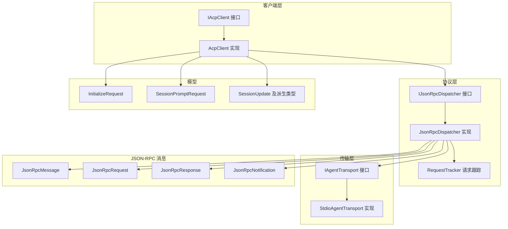
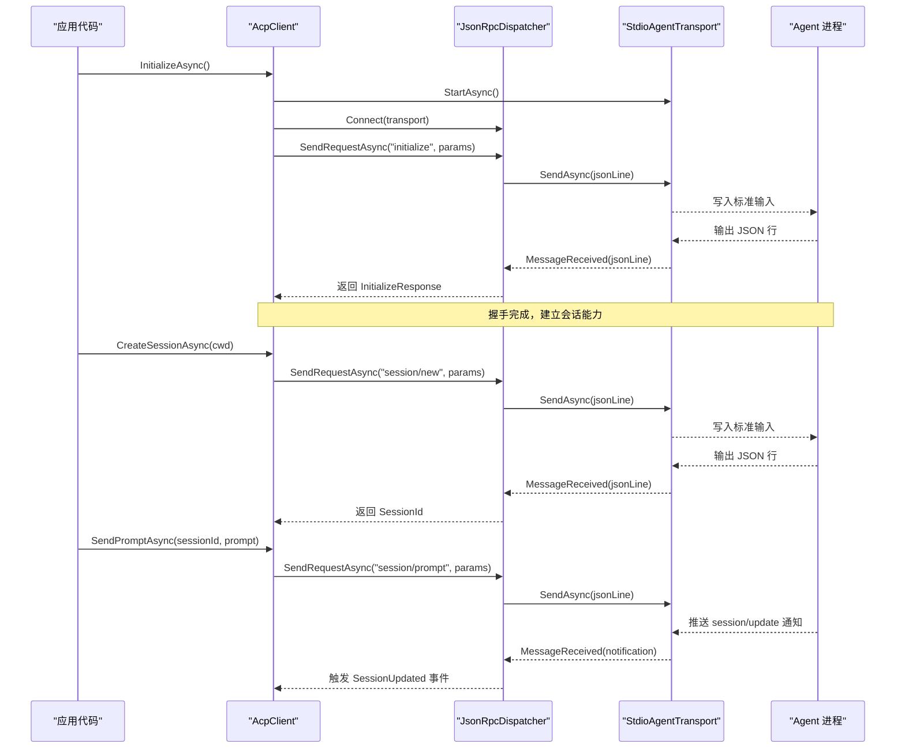
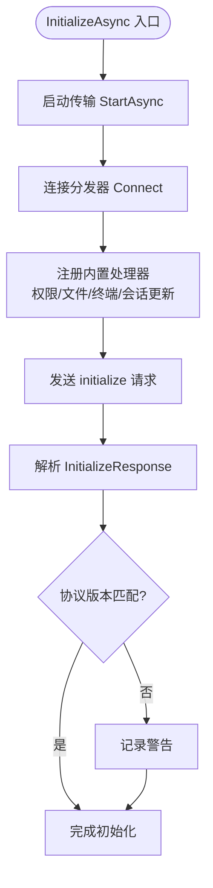
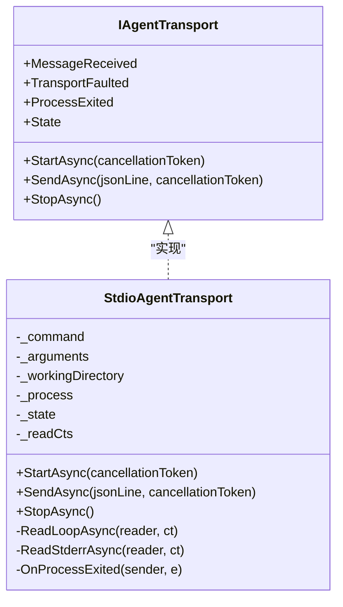
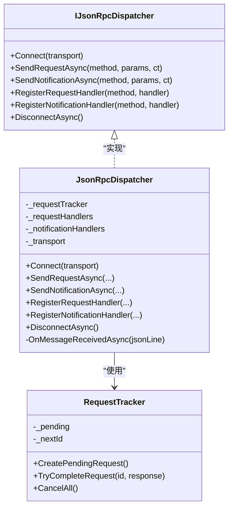
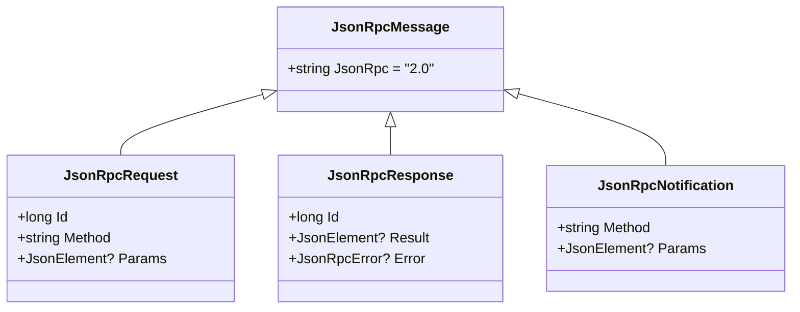
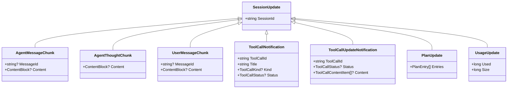
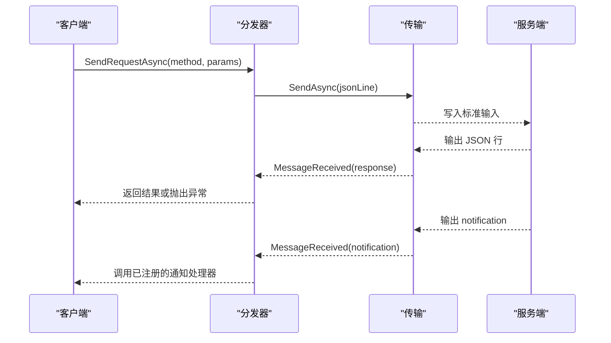
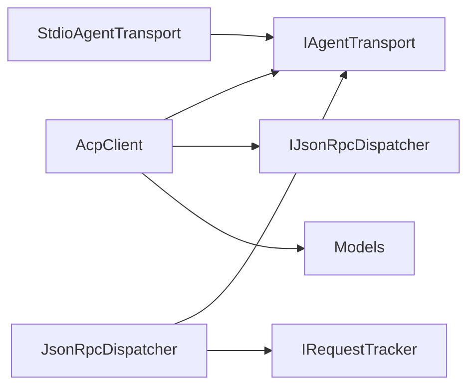

# 核心概念

<cite>
**本文引用的文件**   
- [README.md](file://README.md)
- [AcpClient.cs](file://Client/AcpClient.cs)
- [IAcpClient.cs](file://Client/IAcpClient.cs)
- [IPermissionHandler.cs](file://Client/IPermissionHandler.cs)
- [JsonRpcMessage.cs](file://JsonRpc/JsonRpcMessage.cs)
- [JsonRpcRequest.cs](file://JsonRpc/JsonRpcRequest.cs)
- [JsonRpcResponse.cs](file://JsonRpc/JsonRpcResponse.cs)
- [JsonRpcNotification.cs](file://JsonRpc/JsonRpcNotification.cs)
- [JsonRpcDispatcher.cs](file://Protocol/JsonRpcDispatcher.cs)
- [IJsonRpcDispatcher.cs](file://Protocol/IJsonRpcDispatcher.cs)
- [RequestTracker.cs](file://Protocol/RequestTracker.cs)
- [StdioAgentTransport.cs](file://Transport/StdioAgentTransport.cs)
- [IAgentTransport.cs](file://Transport/IAgentTransport.cs)
- [InitializeRequest.cs](file://Models/InitializeRequest.cs)
- [SessionPromptRequest.cs](file://Models/SessionPromptRequest.cs)
- [SessionUpdate.cs](file://Models/SessionUpdate.cs)
</cite>

## 目录
1. [简介](#简介)
2. [项目结构](#项目结构)
3. [核心组件](#核心组件)
4. [架构总览](#架构总览)
5. [详细组件分析](#详细组件分析)
6. [依赖关系分析](#依赖关系分析)
7. [性能考量](#性能考量)
8. [故障排查指南](#故障排查指南)
9. [结论](#结论)
10. [附录](#附录)

## 简介
本文件面向 Agentic.ACPLibrary 的核心概念，系统阐述 ACP（Agent Client Protocol）协议在库中的实现与工作机制。内容涵盖：
- Agent Client Protocol 的通信模型、消息格式与生命周期管理
- JSON-RPC 2.0 规范在本库的实现：请求/响应模式、通知机制与错误处理
- 进程间通信（IPC）基于标准输入/输出的工作原理
- 客户端-服务器架构模式：连接管理、会话管理与异步编程模型
- 架构图与数据流图，帮助初学者理解并指导有经验的开发者进行扩展与优化

## 项目结构
库采用分层与职责分离的设计：
- Client：对外暴露的客户端接口与默认实现，封装初始化、会话、提示发送等高层 API
- Transport：传输抽象与基于 stdio 的子进程实现，负责进程启动、读写与生命周期
- Protocol：JSON-RPC 分发器与请求跟踪，负责消息路由、回调注册与等待完成
- JsonRpc：JSON-RPC 2.0 消息类型定义（请求、响应、通知、基础消息）
- Models：ACP 协议的数据模型（初始化、会话、更新、工具调用等）
- Infrastructure：序列化选项与服务扩展（用于统一 JSON 配置）

**图表来源** 
- [IAcpClient.cs:1-59](file://Client/IAcpClient.cs#L1-L59)
- [AcpClient.cs:1-361](file://Client/AcpClient.cs#L1-L361)
- [IJsonRpcDispatcher.cs:1-14](file://Protocol/IJsonRpcDispatcher.cs#L1-L14)
- [JsonRpcDispatcher.cs:1-124](file://Protocol/JsonRpcDispatcher.cs#L1-L124)
- [RequestTracker.cs:1-52](file://Protocol/RequestTracker.cs#L1-L52)
- [IAgentTransport.cs:1-39](file://Transport/IAgentTransport.cs#L1-L39)
- [StdioAgentTransport.cs:1-147](file://Transport/StdioAgentTransport.cs#L1-L147)
- [JsonRpcMessage.cs:1-14](file://JsonRpc/JsonRpcMessage.cs#L1-L14)
- [JsonRpcRequest.cs:1-19](file://JsonRpc/JsonRpcRequest.cs#L1-L19)
- [JsonRpcResponse.cs:1-20](file://JsonRpc/JsonRpcResponse.cs#L1-L20)
- [JsonRpcNotification.cs:1-16](file://JsonRpc/JsonRpcNotification.cs#L1-L16)
- [InitializeRequest.cs:1-16](file://Models/InitializeRequest.cs#L1-L16)
- [SessionPromptRequest.cs:1-20](file://Models/SessionPromptRequest.cs#L1-L20)
- [SessionUpdate.cs:1-119](file://Models/SessionUpdate.cs#L1-L119)

**章节来源**
- [README.md:1-99](file://README.md#L1-L99)

## 核心组件
- AcpClient：ACP 客户端默认实现，负责启动传输、建立连接、握手初始化、会话创建/加载、发送提示、取消会话、事件订阅与自定义方法扩展
- IAgentTransport / StdioAgentTransport：传输抽象与基于子进程 stdio 的实现，负责进程生命周期、消息收发与异常/退出事件
- IJsonRpcDispatcher / JsonRpcDispatcher：JSON-RPC 分发器，负责消息序列化/反序列化、请求/响应匹配、通知分发与回调注册
- RequestTracker：请求跟踪器，维护待完成的请求与 TaskCompletionSource，支持超时/取消与异常传播
- JSON-RPC 消息类型：基础消息、请求、响应、通知，严格遵循 JSON-RPC 2.0 字段约定
- 模型：InitializeRequest、SessionPromptRequest、SessionUpdate 及其派生类型，承载 ACP 协议数据

**章节来源**
- [AcpClient.cs:1-361](file://Client/AcpClient.cs#L1-L361)
- [IAgentTransport.cs:1-39](file://Transport/IAgentTransport.cs#L1-L39)
- [StdioAgentTransport.cs:1-147](file://Transport/StdioAgentTransport.cs#L1-L147)
- [IJsonRpcDispatcher.cs:1-14](file://Protocol/IJsonRpcDispatcher.cs#L1-L14)
- [JsonRpcDispatcher.cs:1-124](file://Protocol/JsonRpcDispatcher.cs#L1-L124)
- [RequestTracker.cs:1-52](file://Protocol/RequestTracker.cs#L1-L52)
- [JsonRpcMessage.cs:1-14](file://JsonRpc/JsonRpcMessage.cs#L1-L14)
- [JsonRpcRequest.cs:1-19](file://JsonRpc/JsonRpcRequest.cs#L1-L19)
- [JsonRpcResponse.cs:1-20](file://JsonRpc/JsonRpcResponse.cs#L1-L20)
- [JsonRpcNotification.cs:1-16](file://JsonRpc/JsonRpcNotification.cs#L1-L16)
- [InitializeRequest.cs:1-16](file://Models/InitializeRequest.cs#L1-L16)
- [SessionPromptRequest.cs:1-20](file://Models/SessionPromptRequest.cs#L1-L20)
- [SessionUpdate.cs:1-119](file://Models/SessionUpdate.cs#L1-L119)

## 架构总览
ACP 库采用“客户端-传输-协议分发”的分层架构：
- 客户端层提供高层 API（初始化、会话、提示），屏蔽底层细节
- 传输层通过 stdio 与外部 Agent 进程通信，负责进程管理与 IO
- 协议层将 JSON-RPC 2.0 消息路由到对应处理器，并管理请求/响应匹配与通知分发

**图表来源** 
- [AcpClient.cs:47-182](file://Client/AcpClient.cs#L47-L182)
- [JsonRpcDispatcher.cs:27-64](file://Protocol/JsonRpcDispatcher.cs#L27-L64)
- [StdioAgentTransport.cs:30-68](file://Transport/StdioAgentTransport.cs#L30-L68)

**章节来源**
- [AcpClient.cs:47-182](file://Client/AcpClient.cs#L47-L182)
- [JsonRpcDispatcher.cs:27-64](file://Protocol/JsonRpcDispatcher.cs#L27-L64)
- [StdioAgentTransport.cs:30-68](file://Transport/StdioAgentTransport.cs#L30-L68)

## 详细组件分析

### AcpClient：客户端与生命周期管理
- 职责
  - 启动传输并与分发器连接
  - 注册内置处理器：权限请求、文件系统读写、终端操作、会话更新通知
  - 发起 initialize 握手，保存 AgentInfo，校验协议版本
  - 创建/加载会话，发送提示，取消会话
  - 暴露事件：SessionUpdated、AgentProcessExited
  - 支持扩展：注册自定义请求/通知处理器
- 关键流程
  - InitializeAsync：启动传输、连接分发器、注册处理器、发送 initialize 请求、解析结果
  - CreateSessionAsync/LoadSessionAsync：创建或加载会话，设置 CurrentSessionId
  - SendPromptAsync：发送提示并等待最终响应；流式更新通过 SessionUpdated 事件推送
  - CancelSessionAsync：发送 session/cancel 通知
  - ShutdownAsync：断开分发器并停止传输

**图表来源** 
- [AcpClient.cs:47-182](file://Client/AcpClient.cs#L47-L182)

**章节来源**
- [AcpClient.cs:47-182](file://Client/AcpClient.cs#L47-L182)
- [IAcpClient.cs:1-59](file://Client/IAcpClient.cs#L1-L59)

### 传输层：StdioAgentTransport 与 IPC
- 职责
  - 启动子进程，重定向标准输入/输出/错误
  - 读取标准输出为 JSON 行，触发 MessageReceived
  - 发送 JSON 行到标准输入
  - 监听进程退出事件，触发 ProcessExited
  - 优雅停止：关闭输入、等待退出或强制终止
- 关键点
  - UTF-8 编码确保跨平台一致性
  - 后台任务循环读取输出与错误流
  - 状态机：Created → Starting → Running → Stopping → Stopped/Faulted

**图表来源** 
- [IAgentTransport.cs:1-39](file://Transport/IAgentTransport.cs#L1-L39)
- [StdioAgentTransport.cs:1-147](file://Transport/StdioAgentTransport.cs#L1-L147)

**章节来源**
- [StdioAgentTransport.cs:30-93](file://Transport/StdioAgentTransport.cs#L30-L93)
- [StdioAgentTransport.cs:95-147](file://Transport/StdioAgentTransport.cs#L95-L147)

### 协议层：JSON-RPC 2.0 分发与请求跟踪
- 职责
  - 将 JSON-RPC 请求序列化为 JSON 行并通过传输发送
  - 接收 JSON 行，反序列化为消息，按类型分发：
    - 响应：匹配请求 ID，完成对应的 TaskCompletionSource
    - 请求：查找已注册的处理器并执行，返回响应
    - 通知：查找已注册的处理器并执行
  - 提供 Disconnect 清理资源与取消所有待完成请求
- 请求跟踪
  - 使用并发字典维护 pending 请求与 TCS
  - TryCompleteRequest 根据响应设置结果或抛出异常
  - CancelAll 取消所有挂起请求

**图表来源** 
- [IJsonRpcDispatcher.cs:1-14](file://Protocol/IJsonRpcDispatcher.cs#L1-L14)
- [JsonRpcDispatcher.cs:1-124](file://Protocol/JsonRpcDispatcher.cs#L1-L124)
- [RequestTracker.cs:1-52](file://Protocol/RequestTracker.cs#L1-L52)

**章节来源**
- [JsonRpcDispatcher.cs:27-64](file://Protocol/JsonRpcDispatcher.cs#L27-L64)
- [JsonRpcDispatcher.cs:86-122](file://Protocol/JsonRpcDispatcher.cs#L86-L122)
- [RequestTracker.cs:11-39](file://Protocol/RequestTracker.cs#L11-L39)

### JSON-RPC 2.0 消息模型
- 基础消息：固定 jsonrpc="2.0"
- 请求：包含 id、method、可选 params
- 响应：包含 id、result 或 error
- 通知：包含 method、可选 params，无 id

**图表来源** 
- [JsonRpcMessage.cs:1-14](file://JsonRpc/JsonRpcMessage.cs#L1-L14)
- [JsonRpcRequest.cs:1-19](file://JsonRpc/JsonRpcRequest.cs#L1-L19)
- [JsonRpcResponse.cs:1-20](file://JsonRpc/JsonRpcResponse.cs#L1-L20)
- [JsonRpcNotification.cs:1-16](file://JsonRpc/JsonRpcNotification.cs#L1-L16)

**章节来源**
- [JsonRpcMessage.cs:1-14](file://JsonRpc/JsonRpcMessage.cs#L1-L14)
- [JsonRpcRequest.cs:1-19](file://JsonRpc/JsonRpcRequest.cs#L1-L19)
- [JsonRpcResponse.cs:1-20](file://JsonRpc/JsonRpcResponse.cs#L1-L20)
- [JsonRpcNotification.cs:1-16](file://JsonRpc/JsonRpcNotification.cs#L1-L16)

### 模型与数据流：会话更新与工具调用
- SessionUpdate 作为多态基类，使用 sessionUpdate 字段作为判别器
- 派生类型包括：
  - AgentMessageChunk、AgentThoughtChunk、UserMessageChunk
  - ToolCallNotification、ToolCallUpdateNotification
  - PlanUpdate、UsageUpdate
- 数据流：Agent 推送 session/update 通知 → 分发器反序列化 → AcpClient 触发 SessionUpdated 事件

**图表来源** 
- [SessionUpdate.cs:1-119](file://Models/SessionUpdate.cs#L1-L119)

**章节来源**
- [SessionUpdate.cs:1-119](file://Models/SessionUpdate.cs#L1-L119)

### 请求/响应与通知时序
- 请求/响应：客户端发送请求，分发器等待响应并匹配 id，完成后返回结果或抛出异常
- 通知：客户端或服务端发送通知，无需等待响应

**图表来源** 
- [JsonRpcDispatcher.cs:27-64](file://Protocol/JsonRpcDispatcher.cs#L27-L64)
- [JsonRpcDispatcher.cs:86-122](file://Protocol/JsonRpcDispatcher.cs#L86-L122)

**章节来源**
- [JsonRpcDispatcher.cs:27-64](file://Protocol/JsonRpcDispatcher.cs#L27-L64)
- [JsonRpcDispatcher.cs:86-122](file://Protocol/JsonRpcDispatcher.cs#L86-L122)

## 依赖关系分析
- AcpClient 依赖 IAgentTransport 与 IJsonRpcDispatcher
- JsonRpcDispatcher 依赖 IRequestTracker 与 IAgentTransport
- StdioAgentTransport 依赖操作系统进程管理能力
- 模型与枚举用于承载 ACP 协议数据

**图表来源** 
- [AcpClient.cs:1-361](file://Client/AcpClient.cs#L1-L361)
- [JsonRpcDispatcher.cs:1-124](file://Protocol/JsonRpcDispatcher.cs#L1-L124)
- [StdioAgentTransport.cs:1-147](file://Transport/StdioAgentTransport.cs#L1-L147)

**章节来源**
- [AcpClient.cs:1-361](file://Client/AcpClient.cs#L1-L361)
- [JsonRpcDispatcher.cs:1-124](file://Protocol/JsonRpcDispatcher.cs#L1-L124)
- [StdioAgentTransport.cs:1-147](file://Transport/StdioAgentTransport.cs#L1-L147)

## 性能考量
- 异步 IO：传输层使用后台任务循环读取标准输出/错误，避免阻塞主线程
- 并发安全：请求跟踪器使用并发字典与原子递增，保证高并发下的正确性
- 序列化优化：统一使用 System.Text.Json 与共享 JsonOptions，减少重复配置开销
- 资源释放：ShutdownAsync 与 DisposeAsync 确保及时断开连接与停止进程，防止资源泄漏
- 错误隔离：分发器对反序列化与处理器异常进行捕获，避免影响整体稳定性

[本节为通用指导，不直接分析具体文件]

## 故障排查指南
- 常见问题
  - 传输未运行：发送前检查 State 是否为 Running，否则抛出无效操作异常
  - 协议版本不匹配：初始化后记录警告，建议升级客户端或 Agent
  - 处理器未注册：权限/文件/终端处理器为空时返回特定错误码
  - 进程意外退出：监听 AgentProcessExited 事件，获取退出码并做恢复策略
- 调试建议
  - 启用日志：记录初始化、会话创建、提示发送与事件触发
  - 捕获 TransportFaulted：监控底层 IO 异常
  - 检查 JSON 行格式：确保符合 JSON-RPC 2.0 规范

**章节来源**
- [StdioAgentTransport.cs:61-68](file://Transport/StdioAgentTransport.cs#L61-L68)
- [AcpClient.cs:176-179](file://Client/AcpClient.cs#L176-L179)
- [AcpClient.cs:102-144](file://Client/AcpClient.cs#L102-L144)
- [AcpClient.cs:250-359](file://Client/AcpClient.cs#L250-L359)

## 结论
Agentic.ACPLibrary 以清晰的层次结构与明确的职责划分实现了 ACP 协议：
- 客户端层提供易用的高层 API
- 传输层通过 stdio 实现可靠的进程间通信
- 协议层严格遵循 JSON-RPC 2.0，支持请求/响应与通知
- 模型层覆盖会话与工具调用的完整数据流
该设计既适合初学者快速上手，也为高级用户提供了扩展点与优化空间。

[本节为总结，不直接分析具体文件]

## 附录
- 快速开始参考：参见 README 示例，展示如何创建传输、分发器与客户端，并完成初始化与会话
- 扩展点：通过 RegisterRequestHandler 与 RegisterNotificationHandler 注册自定义方法
- 事件驱动：利用 SessionUpdated 与 AgentProcessExited 构建响应式 UI

**章节来源**
- [README.md:6-33](file://README.md#L6-L33)
- [README.md:55-70](file://README.md#L55-L70)
- [README.md:95-99](file://README.md#L95-L99)