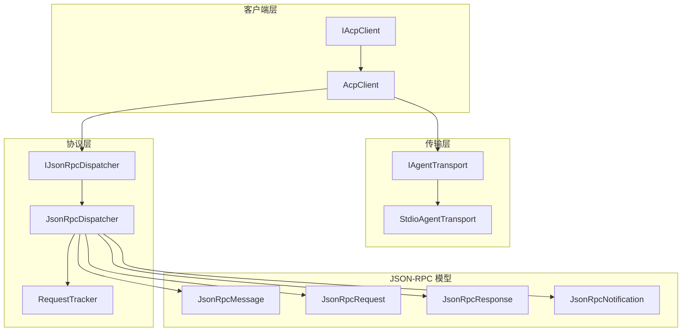
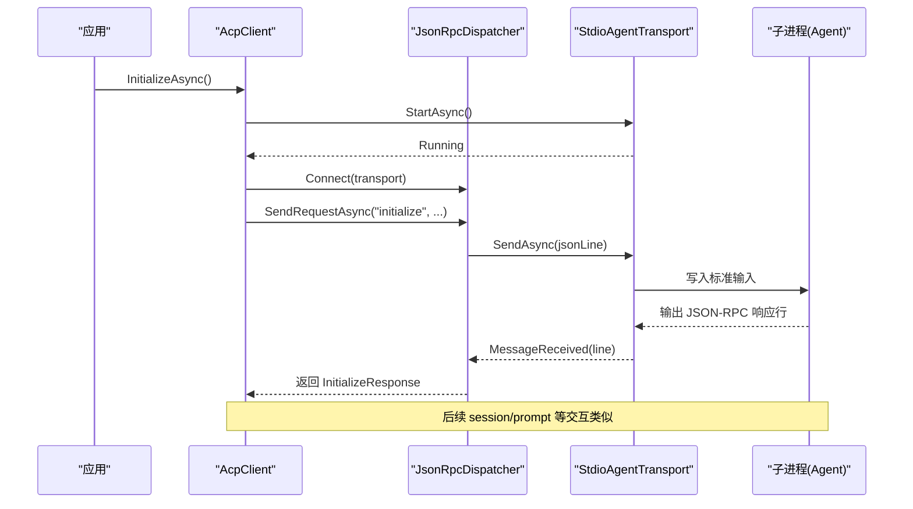
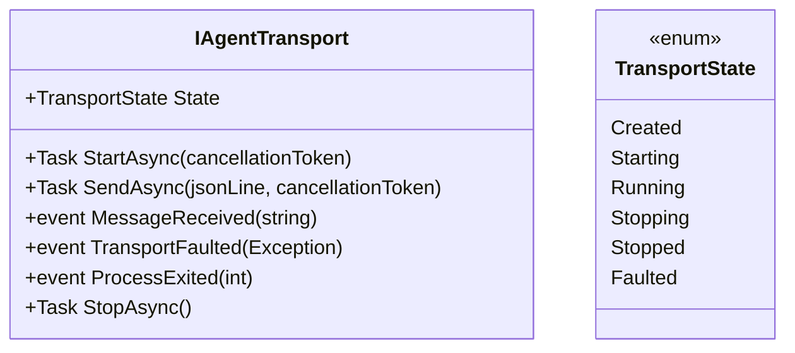
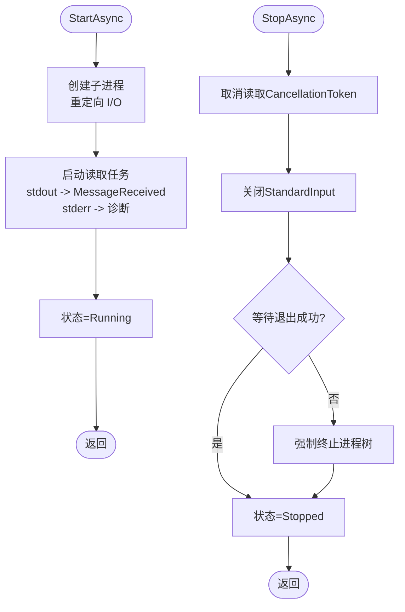
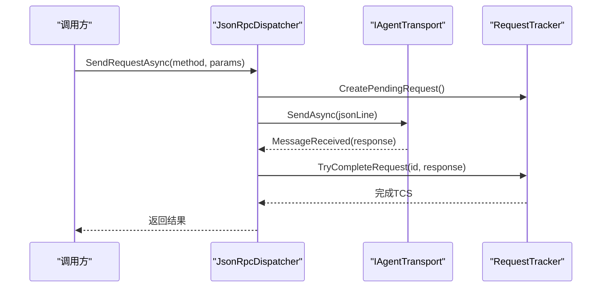
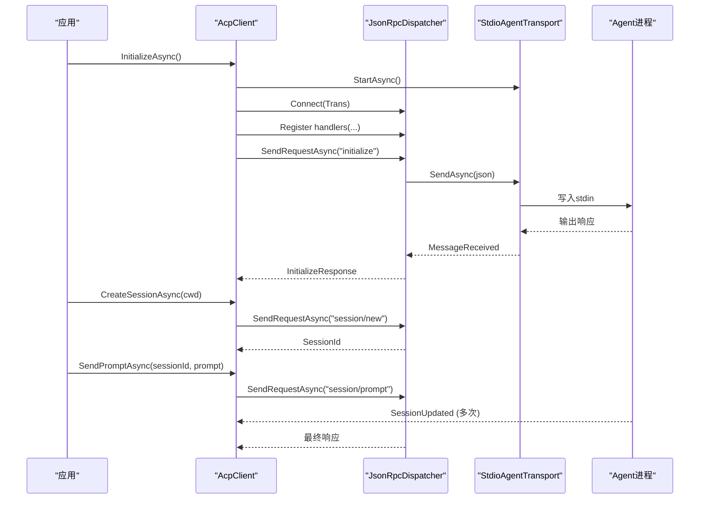
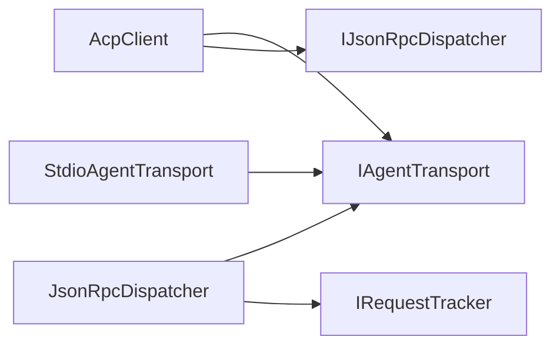

# 进程间通信机制

<cite>
**本文引用的文件**   
- [Transport/IAgentTransport.cs](file://Transport/IAgentTransport.cs)
- [Transport/StdioAgentTransport.cs](file://Transport/StdioAgentTransport.cs)
- [Protocol/IJsonRpcDispatcher.cs](file://Protocol/IJsonRpcDispatcher.cs)
- [Protocol/JsonRpcDispatcher.cs](file://Protocol/JsonRpcDispatcher.cs)
- [Protocol/RequestTracker.cs](file://Protocol/RequestTracker.cs)
- [Client/AcpClient.cs](file://Client/AcpClient.cs)
- [Client/IAcpClient.cs](file://Client/IAcpClient.cs)
- [JsonRpc/JsonRpcMessage.cs](file://JsonRpc/JsonRpcMessage.cs)
- [JsonRpc/JsonRpcRequest.cs](file://JsonRpc/JsonRpcRequest.cs)
- [JsonRpc/JsonRpcResponse.cs](file://JsonRpc/JsonRpcResponse.cs)
- [JsonRpc/JsonRpcNotification.cs](file://JsonRpc/JsonRpcNotification.cs)
- [Infrastructure/ServiceCollectionExtensions.cs](file://Infrastructure/ServiceCollectionExtensions.cs)
- [README.md](file://README.md)
</cite>

## 目录
1. [简介](#简介)
2. [项目结构](#项目结构)
3. [核心组件](#核心组件)
4. [架构总览](#架构总览)
5. [详细组件分析](#详细组件分析)
6. [依赖关系分析](#依赖关系分析)
7. [性能与背压](#性能与背压)
8. [故障排除与调试](#故障排除与调试)
9. [结论](#结论)
10. [附录：自定义传输实现指南](#附录自定义传输实现指南)

## 简介
本库实现了基于标准输入/输出（stdio）的进程间通信（IPC），用于与符合 ACP（Agent Client Protocol）的 Agent 进程进行 JSON-RPC 消息交换。核心目标包括：
- 通过子进程 stdio 建立可靠的 I/O 通道，管理进程生命周期
- 提供 IAgentTransport 抽象，统一不同传输实现（如 stdio、mock）
- 在 JsonRpcDispatcher 中实现异步请求/响应与通知分发
- 支持事件驱动的会话更新与权限/文件系统/终端等扩展点
- 为自定义传输层提供清晰的扩展点与最佳实践

## 项目结构
仓库采用按功能域分层的组织方式：
- Transport：传输抽象与 stdio 实现
- Protocol：JSON-RPC 分发器与请求跟踪
- Client：ACP 客户端封装与业务编排
- JsonRpc：JSON-RPC 2.0 消息模型
- Infrastructure：依赖注入与配置扩展
- Models：协议数据模型与枚举

图表来源
- [Transport/IAgentTransport.cs:1-39](file://Transport/IAgentTransport.cs#L1-L39)
- [Transport/StdioAgentTransport.cs:1-147](file://Transport/StdioAgentTransport.cs#L1-L147)
- [Protocol/IJsonRpcDispatcher.cs:1-14](file://Protocol/IJsonRpcDispatcher.cs#L1-L14)
- [Protocol/JsonRpcDispatcher.cs:1-124](file://Protocol/JsonRpcDispatcher.cs#L1-L124)
- [Protocol/RequestTracker.cs:1-52](file://Protocol/RequestTracker.cs#L1-L52)
- [Client/IAcpClient.cs:1-59](file://Client/IAcpClient.cs#L1-L59)
- [Client/AcpClient.cs:1-361](file://Client/AcpClient.cs#L1-L361)
- [JsonRpc/JsonRpcMessage.cs:1-14](file://JsonRpc/JsonRpcMessage.cs#L1-L14)
- [JsonRpc/JsonRpcRequest.cs:1-19](file://JsonRpc/JsonRpcRequest.cs#L1-L19)
- [JsonRpc/JsonRpcResponse.cs:1-20](file://JsonRpc/JsonRpcResponse.cs#L1-L20)
- [JsonRpc/JsonRpcNotification.cs:1-16](file://JsonRpc/JsonRpcNotification.cs#L1-L16)

章节来源
- [README.md:1-99](file://README.md#L1-L99)

## 核心组件
- IAgentTransport：定义传输抽象，包含启动、发送、接收事件、错误事件、进程退出事件、停止与状态。
- StdioAgentTransport：基于子进程的 stdio 实现，负责进程创建、I/O 流读取、错误处理与优雅关闭。
- IJsonRpcDispatcher/JsonRpcDispatcher：将传输抽象与 JSON-RPC 语义解耦，负责序列化、请求跟踪、分发与反序列化。
- RequestTracker：并发安全的请求 ID 到 TaskCompletionSource 映射，完成或取消等待的任务。
- AcpClient：面向用户的客户端封装，编排初始化、会话、提示、取消、以及注册各类处理器。

章节来源
- [Transport/IAgentTransport.cs:1-39](file://Transport/IAgentTransport.cs#L1-L39)
- [Transport/StdioAgentTransport.cs:1-147](file://Transport/StdioAgentTransport.cs#L1-L147)
- [Protocol/IJsonRpcDispatcher.cs:1-14](file://Protocol/IJsonRpcDispatcher.cs#L1-L14)
- [Protocol/JsonRpcDispatcher.cs:1-124](file://Protocol/JsonRpcDispatcher.cs#L1-L124)
- [Protocol/RequestTracker.cs:1-52](file://Protocol/RequestTracker.cs#L1-L52)
- [Client/IAcpClient.cs:1-59](file://Client/IAcpClient.cs#L1-L59)
- [Client/AcpClient.cs:1-361](file://Client/AcpClient.cs#L1-L361)

## 架构总览
下图展示了从应用调用到子进程 I/O 的端到端流程，涵盖启动、握手、请求/响应与通知。

图表来源
- [Client/AcpClient.cs:48-182](file://Client/AcpClient.cs#L48-L182)
- [Protocol/JsonRpcDispatcher.cs:27-47](file://Protocol/JsonRpcDispatcher.cs#L27-L47)
- [Transport/StdioAgentTransport.cs:30-68](file://Transport/StdioAgentTransport.cs#L30-L68)

## 详细组件分析

### IAgentTransport 接口设计
- 职责边界
  - 生命周期：StartAsync/StopAsync 控制传输启动与停止
  - 消息通道：SendAsync 发送单行 JSON；MessageReceived 事件上报原始 JSON 行
  - 异常与退出：TransportFaulted 上报底层错误；ProcessExited 上报进程退出码
  - 状态：State 暴露 Created/Starting/Running/Stopping/Stopped/Faulted
- 扩展点
  - 通过事件驱动的消息接收，避免阻塞式轮询
  - 通过 State 与事件组合，便于上层做状态机与重试策略
  - 可替换实现（如 mock、TCP、命名管道）

图表来源
- [Transport/IAgentTransport.cs:1-39](file://Transport/IAgentTransport.cs#L1-L39)

章节来源
- [Transport/IAgentTransport.cs:1-39](file://Transport/IAgentTransport.cs#L1-L39)

### StdioAgentTransport 实现要点
- 子进程管理
  - 使用 ProcessStartInfo 重定向 stdin/stdout/stderr，UTF-8 编码
  - 启动后开启两个后台读取任务：标准输出（消息）、标准错误（诊断）
  - 订阅 Exited 事件以同步进程退出状态并触发 ProcessExited 事件
- I/O 流处理
  - ReadLoopAsync 逐行读取 stdout，过滤空行，非空则触发 MessageReceived
  - ReadStderrAsync 仅消费 stderr 行，不处理内容（可用于诊断）
  - SendAsync 校验运行态，写入 StandardInput 并 Flush
- 错误恢复与关闭
  - StopAsync 先取消读取循环，尝试优雅关闭输入并等待退出；超时则强制 Kill
  - 读取异常时触发 TransportFaulted；正常取消视为正常关闭
  - OnProcessExited 设置状态为 Stopped 并上报退出码

图表来源
- [Transport/StdioAgentTransport.cs:30-93](file://Transport/StdioAgentTransport.cs#L30-L93)
- [Transport/StdioAgentTransport.cs:95-135](file://Transport/StdioAgentTransport.cs#L95-L135)
- [Transport/StdioAgentTransport.cs:137-146](file://Transport/StdioAgentTransport.cs#L137-L146)

章节来源
- [Transport/StdioAgentTransport.cs:1-147](file://Transport/StdioAgentTransport.cs#L1-L147)

### JsonRpcDispatcher 与请求跟踪
- 连接与事件绑定
  - Connect 绑定 transport.MessageReceived，进入消息分发管线
- 请求/响应
  - SendRequestAsync 生成唯一 id，创建 Pending TCS，序列化请求并通过 transport.SendAsync 发送
  - 收到响应后由 RequestTracker.TryCompleteRequest 完成对应 TCS
- 通知
  - SendNotificationAsync 直接序列化并发送，无需等待
- 分发逻辑
  - OnMessageReceivedAsync 反序列化为 JsonRpcMessage，根据类型路由：
    - Response：完成请求
    - Request：查找已注册的 handler，执行并回写响应
    - Notification：查找已注册的 notification handler，执行
- 断开清理
  - DisconnectAsync 解除事件订阅并取消所有待处理请求

图表来源
- [Protocol/JsonRpcDispatcher.cs:27-47](file://Protocol/JsonRpcDispatcher.cs#L27-L47)
- [Protocol/JsonRpcDispatcher.cs:86-122](file://Protocol/JsonRpcDispatcher.cs#L86-L122)
- [Protocol/RequestTracker.cs:11-30](file://Protocol/RequestTracker.cs#L11-L30)

章节来源
- [Protocol/IJsonRpcDispatcher.cs:1-14](file://Protocol/IJsonRpcDispatcher.cs#L1-L14)
- [Protocol/JsonRpcDispatcher.cs:1-124](file://Protocol/JsonRpcDispatcher.cs#L1-L124)
- [Protocol/RequestTracker.cs:1-52](file://Protocol/RequestTracker.cs#L1-L52)

### AcpClient 业务流程
- 初始化
  - StartAsync 启动传输，Connect 绑定分发器，订阅进程退出事件
  - 注册内置 handlers：session/update、权限、文件系统、终端
  - 发送 initialize 请求，解析 InitializeResponse，记录 Agent 信息
- 会话与提示
  - CreateSessionAsync/LoadSessionAsync 管理会话上下文
  - SendPromptAsync 发送提示并等待响应；流式更新通过 SessionUpdated 事件推送
  - CancelSessionAsync 发送取消通知
- 关闭
  - ShutdownAsync 断开分发器并停止传输

图表来源
- [Client/AcpClient.cs:48-182](file://Client/AcpClient.cs#L48-L182)
- [Client/AcpClient.cs:184-224](file://Client/AcpClient.cs#L184-L224)

章节来源
- [Client/IAcpClient.cs:1-59](file://Client/IAcpClient.cs#L1-L59)
- [Client/AcpClient.cs:1-361](file://Client/AcpClient.cs#L1-L361)

## 依赖关系分析
- 模块耦合
  - AcpClient 依赖 IAgentTransport 与 IJsonRpcDispatcher，屏蔽底层细节
  - JsonRpcDispatcher 依赖 IRequestTracker 与 IAgentTransport，解耦 I/O 与协议
  - StdioAgentTransport 仅依赖系统进程与 I/O API，无上层耦合
- 外部依赖
  - System.Diagnostics.Process 用于子进程管理
  - System.Text.Json 用于 JSON 序列化/反序列化
  - Microsoft.Extensions.Logging 用于日志（可选）

图表来源
- [Client/AcpClient.cs:1-45](file://Client/AcpClient.cs#L1-L45)
- [Protocol/JsonRpcDispatcher.cs:1-25](file://Protocol/JsonRpcDispatcher.cs#L1-L25)
- [Transport/StdioAgentTransport.cs:1-28](file://Transport/StdioAgentTransport.cs#L1-L28)

章节来源
- [Infrastructure/ServiceCollectionExtensions.cs:1-23](file://Infrastructure/ServiceCollectionExtensions.cs#L1-L23)

## 性能与背压
- 异步 I/O
  - 使用 async/await 与 CancellationToken 避免阻塞线程，提高吞吐
  - 读取 stdout/stderr 分别独立任务，降低相互影响
- 背压控制现状
  - 当前实现未对出站队列做显式限流；SendAsync 直接写入 StandardInput
  - 若上游发送速率超过下游处理能力，可能导致内存增长或阻塞
- 建议优化
  - 在 StdioAgentTransport 增加有界队列与背压信号（如基于 Channel<T>）
  - 在 JsonRpcDispatcher 对高频率通知做节流或批处理
  - 监控队列长度与丢弃率，结合指标告警

[本节为通用指导，不直接分析具体文件]

## 故障排除与调试
- 常见问题定位
  - 进程未启动或立即退出：检查 StartAsync 参数、工作目录、权限与路径
  - 消息未到达：确认 UTF-8 编码、换行分隔、是否过滤空行
  - 请求无响应：检查 RequestTracker 是否被取消、ID 冲突、分发器未 Connect
  - 资源泄漏：确保 ShutdownAsync 调用，释放事件订阅与进程句柄
- 调试技巧
  - 启用日志：为 AcpClient 注入 ILogger，观察初始化、会话与事件
  - 捕获 TransportFaulted 与 ProcessExited 事件，记录异常与退出码
  - 临时将 stderr 输出到控制台，辅助定位子进程问题
  - 使用最小化 repro 用例，逐步缩小范围

章节来源
- [Transport/StdioAgentTransport.cs:95-135](file://Transport/StdioAgentTransport.cs#L95-L135)
- [Client/AcpClient.cs:55-61](file://Client/AcpClient.cs#L55-L61)
- [Protocol/JsonRpcDispatcher.cs:76-84](file://Protocol/JsonRpcDispatcher.cs#L76-L84)

## 结论
该库通过清晰的分层与事件驱动模型，实现了稳定高效的 stdio IPC。IAgentTransport 抽象使传输可替换，JsonRpcDispatcher 将协议与 I/O 解耦，AcpClient 提供易用的业务编排。建议在高频场景引入背压与监控，进一步提升鲁棒性与可观测性。

[本节为总结，不直接分析具体文件]

## 附录：自定义传输实现指南
- 设计原则
  - 严格遵循 IAgentTransport 契约：StartAsync/StopAsync、SendAsync、事件与状态
  - 保证消息行式边界（每行一个完整 JSON），UTF-8 编码
  - 正确处理取消令牌与异常，避免悬挂任务
- 推荐实现步骤
  - 维护内部状态机，与 TransportState 一致
  - 使用异步 I/O 与 CancellationToken，避免阻塞
  - 对出站消息进行必要的缓冲与顺序保证
  - 在底层错误时触发 TransportFaulted，并在进程/连接结束时触发 ProcessExited
- 最佳实践
  - 提供单元测试覆盖启动、发送、接收、错误与关闭路径
  - 暴露可观测指标（发送/接收计数、错误率、延迟）
  - 与现有 JsonRpcDispatcher 集成前，先用 mock 验证协议兼容性

章节来源
- [Transport/IAgentTransport.cs:1-39](file://Transport/IAgentTransport.cs#L1-L39)
- [Transport/StdioAgentTransport.cs:1-147](file://Transport/StdioAgentTransport.cs#L1-L147)
- [Protocol/JsonRpcDispatcher.cs:1-124](file://Protocol/JsonRpcDispatcher.cs#L1-L124)
- [README.md:53-70](file://README.md#L53-L70)