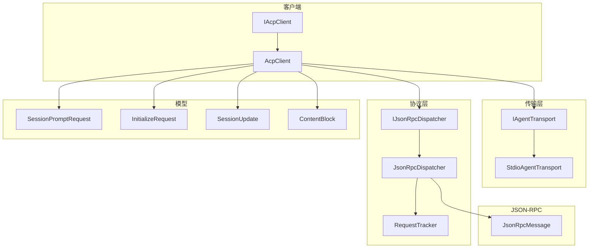
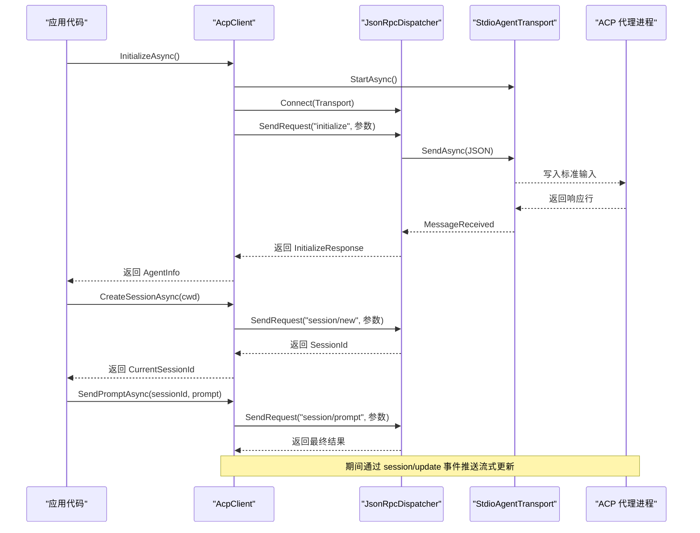
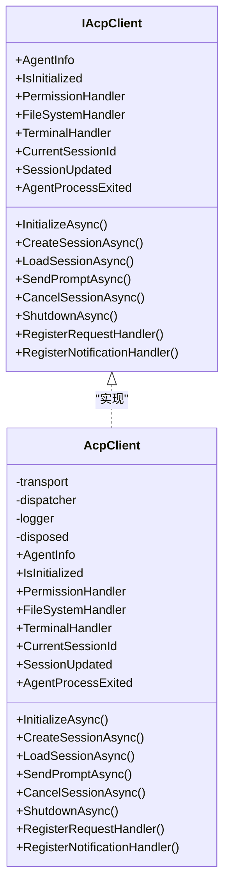
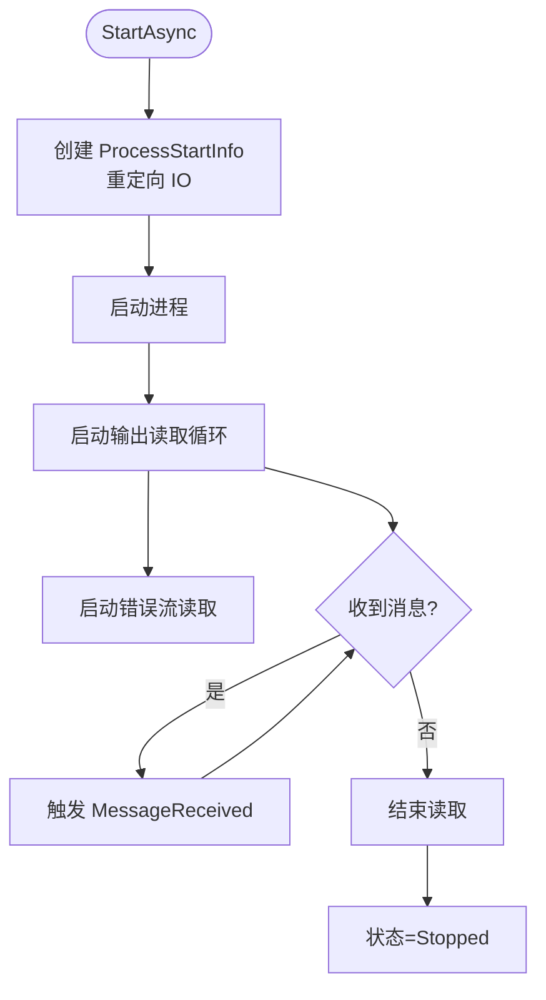
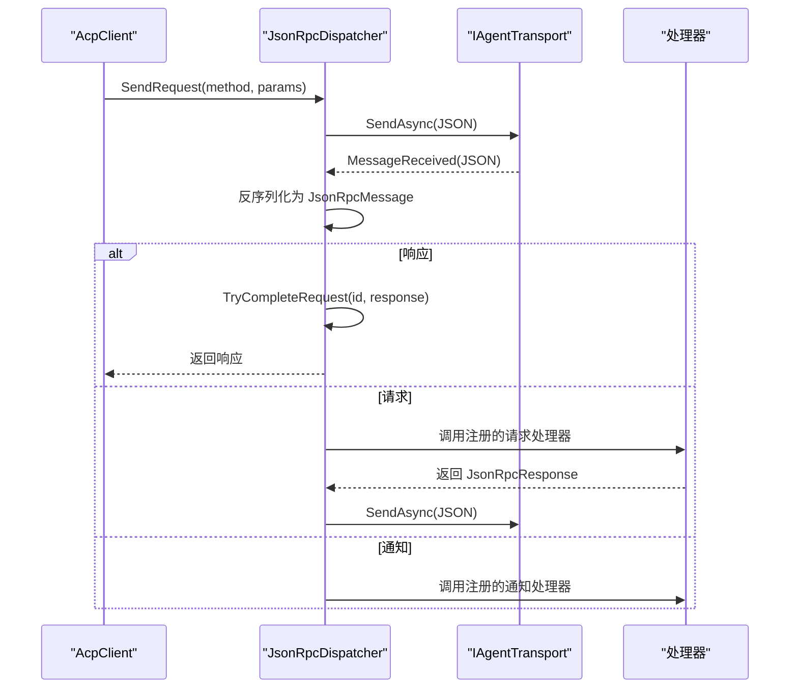
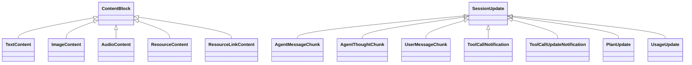
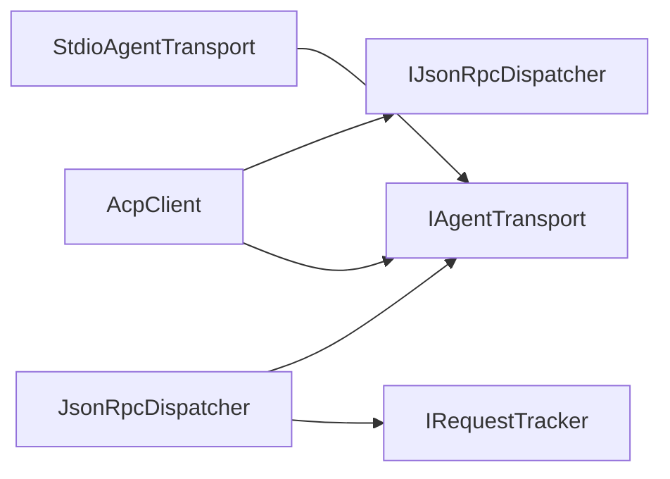

# 项目概述

<cite>
**本文引用的文件**   
- [README.md](file://README.md)
- [Agentic.ACPLibrary.csproj](file://Agentic.ACPLibrary.csproj)
- [Client/AcpClient.cs](file://Client/AcpClient.cs)
- [Client/IAcpClient.cs](file://Client/IAcpClient.cs)
- [Client/IFileSystemHandler.cs](file://Client/IFileSystemHandler.cs)
- [Client/IPermissionHandler.cs](file://Client/IPermissionHandler.cs)
- [Client/ITerminalHandler.cs](file://Client/ITerminalHandler.cs)
- [Infrastructure/ServiceCollectionExtensions.cs](file://Infrastructure/ServiceCollectionExtensions.cs)
- [JsonRpc/JsonRpcMessage.cs](file://JsonRpc/JsonRpcMessage.cs)
- [Protocol/JsonRpcDispatcher.cs](file://Protocol/JsonRpcDispatcher.cs)
- [Transport/StdioAgentTransport.cs](file://Transport/StdioAgentTransport.cs)
- [Models/SessionPromptRequest.cs](file://Models/SessionPromptRequest.cs)
- [Models/InitializeRequest.cs](file://Models/InitializeRequest.cs)
- [Models/SessionUpdate.cs](file://Models/SessionUpdate.cs)
- [Models/ContentBlock.cs](file://Models/ContentBlock.cs)
</cite>

## 目录
1. [简介](#简介)
2. [项目结构](#项目结构)
3. [核心组件](#核心组件)
4. [架构总览](#架构总览)
5. [详细组件分析](#详细组件分析)
6. [依赖关系分析](#依赖关系分析)
7. [性能考量](#性能考量)
8. [故障排查指南](#故障排查指南)
9. [结论](#结论)
10. [附录：快速开始](#附录快速开始)

## 简介
Agentic.ACPLibrary 是一个基于 .NET 的 Agent Client Protocol（ACP）客户端库，用于通过 stdio 与 JSON-RPC 协议与符合 ACP 标准的智能代理进行通信。其核心目标是为 .NET 应用提供稳定、可扩展且易于集成的 ACP 客户端能力，包括传输抽象、JSON-RPC 分发、会话管理、流式更新事件以及可扩展的请求/通知处理器体系。

技术栈要点：
- 运行时与框架：C# .NET 10.0
- 序列化：System.Text.Json（启用多态类型判别与未知类型回退策略）
- 依赖注入：Microsoft.Extensions.DependencyInjection.Abstractions
- 日志：Microsoft.Extensions.Logging.Abstractions

主要功能特性：
- 基于子进程 stdio 的传输层实现
- JSON-RPC 2.0 请求/响应与通知分发
- 初始化握手、会话创建/加载、提示发送与取消
- 流式 session/update 事件推送（文本、思考、工具调用、计划、用量等）
- 可扩展处理器：权限、文件系统、终端
- 自定义方法注册（请求与通知）

## 项目结构
项目采用分层与按职责划分相结合的目录组织方式：
- Client：客户端契约与默认实现，以及可插拔处理器接口
- Transport：传输抽象与 stdio 实现
- Protocol：JSON-RPC 分发器与请求跟踪
- JsonRpc：JSON-RPC 消息模型与转换器
- Models：ACP 协议数据模型（枚举、请求/响应、流式更新、内容块等）
- Infrastructure：DI 扩展与 JSON 选项配置

图表来源 
- [Client/IAcpClient.cs:1-59](file://Client/IAcpClient.cs#L1-L59)
- [Client/AcpClient.cs:1-361](file://Client/AcpClient.cs#L1-L361)
- [Transport/StdioAgentTransport.cs:1-147](file://Transport/StdioAgentTransport.cs#L1-L147)
- [Protocol/JsonRpcDispatcher.cs:1-124](file://Protocol/JsonRpcDispatcher.cs#L1-L124)
- [JsonRpc/JsonRpcMessage.cs:1-14](file://JsonRpc/JsonRpcMessage.cs#L1-L14)
- [Models/SessionPromptRequest.cs:1-20](file://Models/SessionPromptRequest.cs#L1-L20)
- [Models/InitializeRequest.cs:1-16](file://Models/InitializeRequest.cs#L1-L16)
- [Models/SessionUpdate.cs:1-119](file://Models/SessionUpdate.cs#L1-L119)
- [Models/ContentBlock.cs:1-79](file://Models/ContentBlock.cs#L1-L79)

章节来源
- [README.md:1-99](file://README.md#L1-L99)
- [Agentic.ACPLibrary.csproj:1-34](file://Agentic.ACPLibrary.csproj#L1-L34)

## 核心组件
- AcpClient：默认客户端实现，负责启动传输、建立连接、完成 initialize 握手、会话生命周期管理、发送提示与取消、订阅 session/update 事件、暴露处理器属性并转发到对应处理器。
- IAgentTransport / StdioAgentTransport：传输抽象与基于子进程的标准输入输出实现，负责进程生命周期、消息收发与错误处理。
- IJsonRpcDispatcher / JsonRpcDispatcher：JSON-RPC 分发器，封装请求/响应匹配、通知路由、处理器注册与反序列化处理。
- 处理器接口：IPermissionHandler、IFileSystemHandler、ITerminalHandler，分别处理权限、文件系统与终端相关请求。
- 模型：InitializeRequest、SessionPromptRequest、SessionUpdate 及其派生类型、ContentBlock 及其派生类型，描述 ACP 协议的数据结构与流式更新。

章节来源
- [Client/AcpClient.cs:1-361](file://Client/AcpClient.cs#L1-L361)
- [Client/IAcpClient.cs:1-59](file://Client/IAcpClient.cs#L1-L59)
- [Transport/StdioAgentTransport.cs:1-147](file://Transport/StdioAgentTransport.cs#L1-L147)
- [Protocol/JsonRpcDispatcher.cs:1-124](file://Protocol/JsonRpcDispatcher.cs#L1-L124)
- [Client/IPermissionHandler.cs:1-17](file://Client/IPermissionHandler.cs#L1-L17)
- [Client/IFileSystemHandler.cs:1-14](file://Client/IFileSystemHandler.cs#L1-L14)
- [Client/ITerminalHandler.cs:1-23](file://Client/ITerminalHandler.cs#L1-L23)
- [Models/InitializeRequest.cs:1-16](file://Models/InitializeRequest.cs#L1-L16)
- [Models/SessionPromptRequest.cs:1-20](file://Models/SessionPromptRequest.cs#L1-L20)
- [Models/SessionUpdate.cs:1-119](file://Models/SessionUpdate.cs#L1-L119)
- [Models/ContentBlock.cs:1-79](file://Models/ContentBlock.cs#L1-L79)

## 架构总览
整体架构遵循“传输抽象 + 协议分发 + 业务客户端”的分层设计，结合 DI 与事件机制实现松耦合与高可扩展性。

图表来源 
- [Client/AcpClient.cs:48-182](file://Client/AcpClient.cs#L48-L182)
- [Protocol/JsonRpcDispatcher.cs:27-64](file://Protocol/JsonRpcDispatcher.cs#L27-L64)
- [Transport/StdioAgentTransport.cs:30-68](file://Transport/StdioAgentTransport.cs#L30-L68)

## 详细组件分析

### AcpClient 与 IAcpClient
- 职责：封装 ACP 客户端的全部对外能力，包括初始化、会话管理、提示发送、取消、关闭、事件订阅与自定义处理器注册。
- 关键行为：
  - InitializeAsync：启动传输、连接分发器、注册内置处理器（权限、文件系统、终端）、发送 initialize 请求并解析响应。
  - CreateSessionAsync / LoadSessionAsync：创建或加载会话，维护 CurrentSessionId。
  - SendPromptAsync：发送提示并等待最终响应；流式更新通过 SessionUpdated 事件推送。
  - CancelSessionAsync：发送取消通知。
  - ShutdownAsync：断开分发器并停止传输。
- 扩展点：RegisterRequestHandler / RegisterNotificationHandler 允许注册自定义方法处理逻辑。

图表来源 
- [Client/IAcpClient.cs:1-59](file://Client/IAcpClient.cs#L1-L59)
- [Client/AcpClient.cs:1-361](file://Client/AcpClient.cs#L1-L361)

章节来源
- [Client/IAcpClient.cs:1-59](file://Client/IAcpClient.cs#L1-L59)
- [Client/AcpClient.cs:1-361](file://Client/AcpClient.cs#L1-L361)

### 传输层：StdioAgentTransport
- 职责：以子进程方式运行 ACP 代理，管理标准输入/输出/错误流，提供消息发送与接收事件。
- 关键行为：
  - StartAsync：创建并启动进程，启动读取循环，设置状态为 Running。
  - SendAsync：向标准输入写入 JSON 行并刷新。
  - StopAsync：优雅关闭，超时后强制终止进程树。
  - 事件：MessageReceived、TransportFaulted、ProcessExited。
- 健壮性：对 EOF、取消令牌、异常进行捕获与上报。

图表来源 
- [Transport/StdioAgentTransport.cs:30-93](file://Transport/StdioAgentTransport.cs#L30-L93)

章节来源
- [Transport/StdioAgentTransport.cs:1-147](file://Transport/StdioAgentTransport.cs#L1-L147)

### 协议分发：JsonRpcDispatcher
- 职责：将 JSON-RPC 消息路由到对应的请求/通知处理器，管理请求-响应的关联与完成。
- 关键行为：
  - Connect：绑定传输的消息事件。
  - SendRequestAsync：生成唯一 Id，发送请求并等待响应。
  - SendNotificationAsync：发送无响应的通知。
  - RegisterRequestHandler / RegisterNotificationHandler：注册处理器。
  - DisconnectAsync：解绑事件并取消所有挂起请求。
- 内部机制：使用并发字典存储处理器，使用 RequestTracker 管理待完成请求。

图表来源 
- [Protocol/JsonRpcDispatcher.cs:27-124](file://Protocol/JsonRpcDispatcher.cs#L27-L124)

章节来源
- [Protocol/JsonRpcDispatcher.cs:1-124](file://Protocol/JsonRpcDispatcher.cs#L1-L124)

### 模型与多态序列化
- ContentBlock：支持 text/image/audio/resource/resource_link 等多态类型，使用 type 字段作为判别器，未知类型回退到基类以避免兼容性问题。
- SessionUpdate：支持 agent_message_chunk、agent_thought_chunk、user_message_chunk、tool_call、tool_call_update、plan、usage_update 等，使用 sessionUpdate 字段作为判别器。
- InitializeRequest / SessionPromptRequest：定义握手与会话提示的核心数据结构。

图表来源 
- [Models/ContentBlock.cs:1-79](file://Models/ContentBlock.cs#L1-L79)
- [Models/SessionUpdate.cs:1-119](file://Models/SessionUpdate.cs#L1-L119)

章节来源
- [Models/ContentBlock.cs:1-79](file://Models/ContentBlock.cs#L1-L79)
- [Models/SessionUpdate.cs:1-119](file://Models/SessionUpdate.cs#L1-L119)
- [Models/InitializeRequest.cs:1-16](file://Models/InitializeRequest.cs#L1-L16)
- [Models/SessionPromptRequest.cs:1-20](file://Models/SessionPromptRequest.cs#L1-L20)

### 处理器接口与扩展
- IPermissionHandler：处理 session/request_permission，由 UI 层实现用户交互。
- IFileSystemHandler：处理 fs/read_text_file 与 fs/write_text_file。
- ITerminalHandler：处理 terminal/create、terminal/output、terminal/wait_for_exit、terminal/kill、terminal/release。
- 在 AcpClient.InitializeAsync 中自动注册这些方法的处理器，若未提供实现则返回错误或取消结果。

章节来源
- [Client/IPermissionHandler.cs:1-17](file://Client/IPermissionHandler.cs#L1-L17)
- [Client/IFileSystemHandler.cs:1-14](file://Client/IFileSystemHandler.cs#L1-L14)
- [Client/ITerminalHandler.cs:1-23](file://Client/ITerminalHandler.cs#L1-L23)
- [Client/AcpClient.cs:74-147](file://Client/AcpClient.cs#L74-L147)

## 依赖关系分析
- 运行时依赖：.NET 10.0
- 第三方包：
  - Microsoft.Extensions.DependencyInjection.Abstractions：服务注册与获取
  - System.Text.Json：高性能 JSON 序列化与多态支持
  - Microsoft.Extensions.Logging.Abstractions：日志抽象
- 内部依赖：
  - AcpClient 依赖 IAgentTransport 与 IJsonRpcDispatcher
  - JsonRpcDispatcher 依赖 IRequestTracker 与 IAgentTransport
  - StdioAgentTransport 依赖系统进程 API

图表来源 
- [Client/AcpClient.cs:1-361](file://Client/AcpClient.cs#L1-L361)
- [Protocol/JsonRpcDispatcher.cs:1-124](file://Protocol/JsonRpcDispatcher.cs#L1-L124)
- [Transport/StdioAgentTransport.cs:1-147](file://Transport/StdioAgentTransport.cs#L1-L147)

章节来源
- [Agentic.ACPLibrary.csproj:1-34](file://Agentic.ACPLibrary.csproj#L1-L34)

## 性能考量
- 序列化性能：使用 System.Text.Json 的 SerializeToElement 与预置 JsonOptions，减少分配与提升吞吐。
- 异步与并发：传输读取循环与消息处理均为异步，避免阻塞主线程；请求跟踪使用并发容器保证线程安全。
- 资源管理：实现 IAsyncDisposable，确保正确释放传输与分发器资源。
- 流式更新：通过事件推送 session/update，避免轮询开销。

[本节为通用指导，不直接分析具体文件]

## 故障排查指南
- 传输未运行：调用 SendAsync 前需确保 StartAsync 成功且状态为 Running。
- 处理器缺失：未实现 PermissionHandler/FileSystemHandler/TerminalHandler 时，对应请求会返回错误或取消结果。
- 协议版本不匹配：Initialize 响应中的 ProtocolVersion 与客户端不一致时会记录警告。
- 进程退出：监听 AgentProcessExited 事件以处理代理进程意外退出。
- 反序列化失败：JSON-RPC 消息反序列化失败会被忽略，建议检查服务端消息格式。

章节来源
- [Transport/StdioAgentTransport.cs:60-93](file://Transport/StdioAgentTransport.cs#L60-L93)
- [Client/AcpClient.cs:175-182](file://Client/AcpClient.cs#L175-L182)
- [Protocol/JsonRpcDispatcher.cs:117-122](file://Protocol/JsonRpcDispatcher.cs#L117-L122)

## 结论
Agentic.ACPLibrary 提供了面向 ACP 的完整 .NET 客户端能力，涵盖传输、协议分发、会话管理与可扩展处理器体系。通过清晰的层次划分与事件驱动模型，开发者可以便捷地集成 ACP 代理，构建具备权限控制、文件访问与终端能力的智能应用。

[本节为总结性内容，不直接分析具体文件]

## 附录：快速开始
以下流程展示了基本的初始化、会话创建与提示发送步骤（概念性说明，不包含代码片段）：
- 创建传输：使用 StdioAgentTransport 指定代理命令与参数。
- 创建分发器与客户端：实例化 JsonRpcDispatcher 与 AcpClient，并注入日志。
- 初始化：调用 InitializeAsync 启动传输并完成握手，获取 AgentInfo。
- 创建会话：调用 CreateSessionAsync 传入工作目录，获得 CurrentSessionId。
- 发送提示：构造 ContentBlock 列表，调用 SendPromptAsync 发送提示，并通过 SessionUpdated 事件接收流式更新。
- 可选：实现 IPermissionHandler、IFileSystemHandler、ITerminalHandler 并在 InitializeAsync 之前赋值给客户端。
- 扩展：使用 RegisterRequestHandler / RegisterNotificationHandler 注册自定义方法处理逻辑。

章节来源
- [README.md:6-33](file://README.md#L6-L33)
- [Client/AcpClient.cs:48-182](file://Client/AcpClient.cs#L48-L182)
- [Client/IAcpClient.cs:35-51](file://Client/IAcpClient.cs#L35-L51)
- [Transport/StdioAgentTransport.cs:23-58](file://Transport/StdioAgentTransport.cs#L23-L58)
- [Protocol/JsonRpcDispatcher.cs:16-25](file://Protocol/JsonRpcDispatcher.cs#L16-L25)