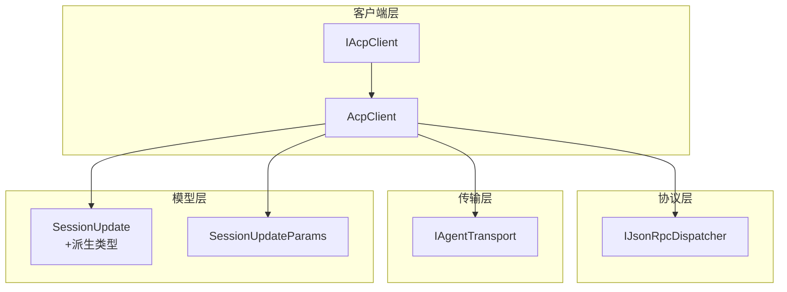
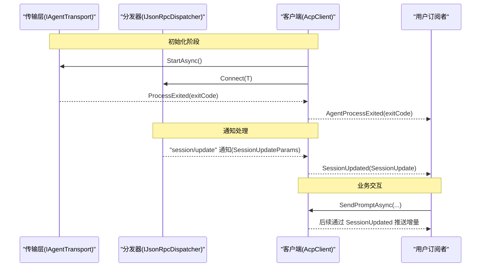
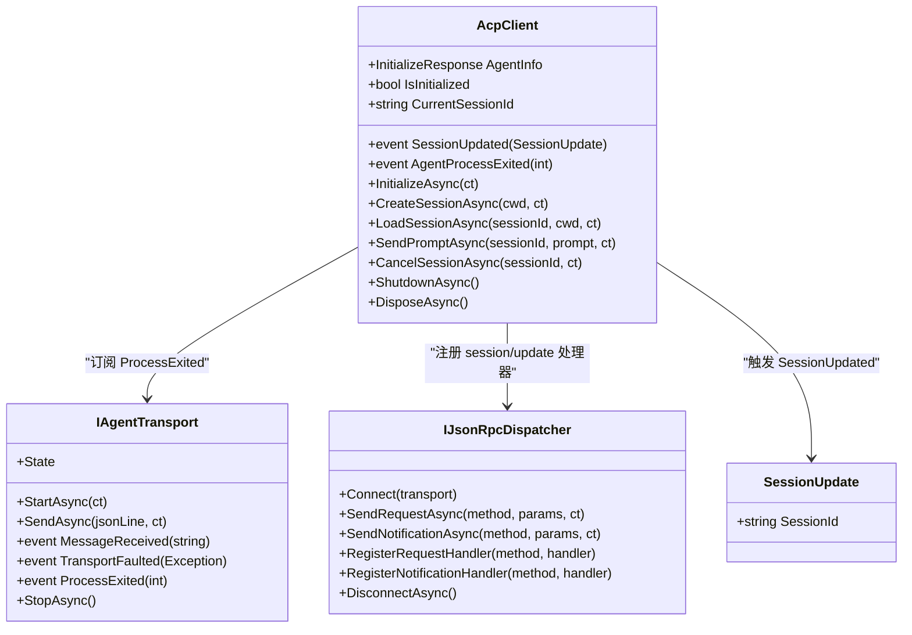
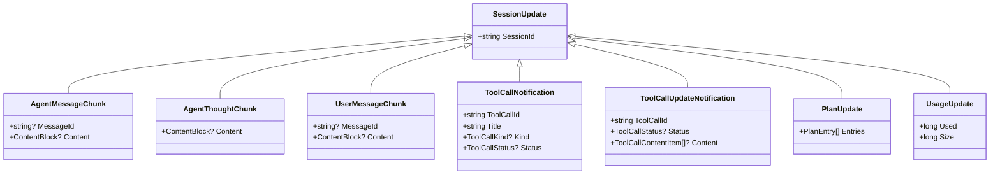
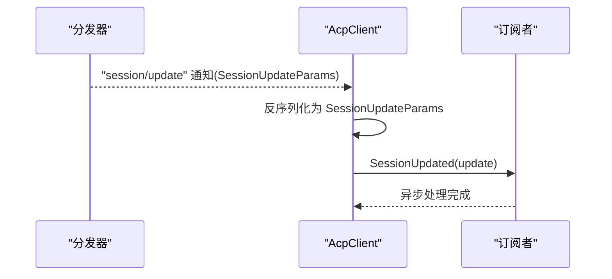
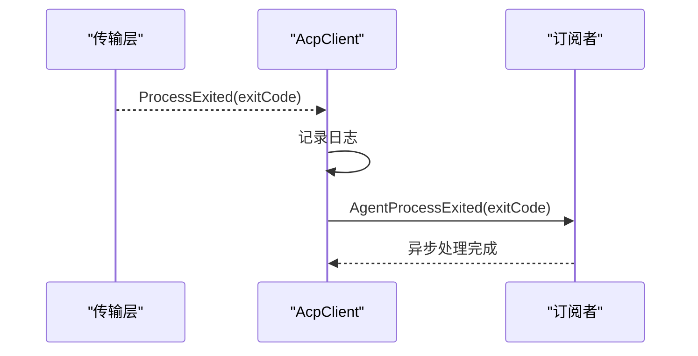
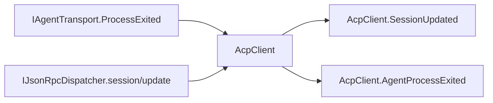

# 事件处理

<cite>
**本文引用的文件**   
- [AcpClient.cs](file://Client/AcpClient.cs)
- [IAcpClient.cs](file://Client/IAcpClient.cs)
- [SessionUpdate.cs](file://Models/SessionUpdate.cs)
- [SessionUpdateWrapper.cs](file://Models/SessionUpdateWrapper.cs)
- [IAgentTransport.cs](file://Transport/IAgentTransport.cs)
- [IJsonRpcDispatcher.cs](file://Protocol/IJsonRpcDispatcher.cs)
- [README.md](file://README.md)
</cite>

## 目录
1. [简介](#简介)
2. [项目结构](#项目结构)
3. [核心组件](#核心组件)
4. [架构总览](#架构总览)
5. [详细组件分析](#详细组件分析)
6. [依赖关系分析](#依赖关系分析)
7. [性能考虑](#性能考虑)
8. [故障排查指南](#故障排查指南)
9. [结论](#结论)
10. [附录](#附录)

## 简介
本文件围绕 ACP 客户端的事件驱动编程模式，深入解析 AcpClient 的事件系统，重点覆盖 SessionUpdated 与 AgentProcessExited 两个关键事件的触发时机、使用方式与最佳实践。文档同时给出异步事件处理的异常处理、取消令牌使用、性能优化建议，以及事件订阅管理、内存泄漏预防与资源清理策略。最后提供复杂场景示例（多会话事件处理、事件优先级管理、错误恢复）与调试技巧（事件日志记录与性能监控）。

## 项目结构
该库采用分层组织：
- Client：客户端实现与对外契约（AcpClient、IAcpClient）
- Models：协议数据模型（SessionUpdate 及其派生类型、工具调用等）
- Transport：传输抽象（IAgentTransport 及 StdioAgentTransport）
- Protocol：JSON-RPC 分发器（IJsonRpcDispatcher 及默认实现）
- Infrastructure：序列化选项与服务扩展
- JsonRpc：消息结构与转换器

图表来源 
- [IAcpClient.cs:1-59](file://Client/IAcpClient.cs#L1-L59)
- [AcpClient.cs:1-361](file://Client/AcpClient.cs#L1-L361)
- [IJsonRpcDispatcher.cs:1-14](file://Protocol/IJsonRpcDispatcher.cs#L1-L14)
- [IAgentTransport.cs:1-39](file://Transport/IAgentTransport.cs#L1-L39)
- [SessionUpdate.cs:1-119](file://Models/SessionUpdate.cs#L1-L119)
- [SessionUpdateWrapper.cs:1-17](file://Models/SessionUpdateWrapper.cs#L1-L17)

章节来源
- [README.md:1-99](file://README.md#L1-L99)

## 核心组件
- AcpClient：ACP 客户端主类，负责初始化、会话管理、请求发送与事件派发。暴露两个关键事件：
  - SessionUpdated：在收到 session/update 通知时触发，携带 SessionUpdate 派生对象（如文本片段、工具调用状态、用量更新等）。
  - AgentProcessExited：当底层进程退出时触发，参数为退出码。
- IAgentTransport：定义传输抽象，包含 MessageReceived、TransportFaulted、ProcessExited 等事件，AcpClient 通过订阅 ProcessExited 转发为 AgentProcessExited。
- IJsonRpcDispatcher：JSON-RPC 分发器，支持注册请求与通知处理器；AcpClient 在此注册 session/update 的通知处理器以触发 SessionUpdated。
- SessionUpdate 模型族：基于 JSON 多态的流式更新类型集合，用于承载不同业务语义的增量更新。

章节来源
- [AcpClient.cs:31-72](file://Client/AcpClient.cs#L31-L72)
- [IAgentTransport.cs:14-24](file://Transport/IAgentTransport.cs#L14-L24)
- [IJsonRpcDispatcher.cs:6-12](file://Protocol/IJsonRpcDispatcher.cs#L6-L12)
- [SessionUpdate.cs:1-119](file://Models/SessionUpdate.cs#L1-L119)
- [SessionUpdateWrapper.cs:1-17](file://Models/SessionUpdateWrapper.cs#L1-L17)

## 架构总览
下图展示了从传输层到应用层的完整事件流：传输层进程退出事件被 AcpClient 捕获并转发为 AgentProcessExited；session/update 通知经分发器路由到 AcpClient，再触发 SessionUpdated。

图表来源 
- [AcpClient.cs:47-72](file://Client/AcpClient.cs#L47-L72)
- [IAgentTransport.cs:14-24](file://Transport/IAgentTransport.cs#L14-L24)
- [IJsonRpcDispatcher.cs:6-12](file://Protocol/IJsonRpcDispatcher.cs#L6-L12)

## 详细组件分析

### AcpClient 事件系统
- SessionUpdated 触发路径
  - 分发器收到 "session/update" 通知后，反序列化为 SessionUpdateParams，提取 Update 字段（SessionUpdate 派生类型），若存在订阅者则异步调用 SessionUpdated。
  - 适用场景：流式文本输出、工具调用生命周期、计划更新、用量统计等。
- AgentProcessExited 触发路径
  - 传输层 ProcessExited 事件被 AcpClient 订阅，内部记录日志并转发给外部订阅者。
  - 适用场景：进程崩溃、异常退出、优雅关闭后的最终通知。

图表来源 
- [AcpClient.cs:12-72](file://Client/AcpClient.cs#L12-L72)
- [IAgentTransport.cs:1-39](file://Transport/IAgentTransport.cs#L1-L39)
- [IJsonRpcDispatcher.cs:1-14](file://Protocol/IJsonRpcDispatcher.cs#L1-L14)
- [SessionUpdate.cs:1-22](file://Models/SessionUpdate.cs#L1-L22)

章节来源
- [AcpClient.cs:47-72](file://Client/AcpClient.cs#L47-L72)
- [IAgentTransport.cs:14-24](file://Transport/IAgentTransport.cs#L14-L24)
- [IJsonRpcDispatcher.cs:6-12](file://Protocol/IJsonRpcDispatcher.cs#L6-L12)
- [SessionUpdate.cs:1-119](file://Models/SessionUpdate.cs#L1-L119)

### SessionUpdate 模型族
- 基类 SessionUpdate 通过 JSON 多态字段 sessionUpdate 区分具体类型，未知类型回退到基类以避免解析失败。
- 常见派生类型：
  - AgentMessageChunk：代理消息片段（含 messageId、content）
  - AgentThoughtChunk：代理思考片段（content）
  - UserMessageChunk：用户消息片段（messageId、content）
  - ToolCallNotification / ToolCallUpdateNotification：工具调用启动与状态更新
  - PlanUpdate：计划条目列表（entries）
  - UsageUpdate：用量统计（used、size）

图表来源 
- [SessionUpdate.cs:1-119](file://Models/SessionUpdate.cs#L1-L119)

章节来源
- [SessionUpdate.cs:1-119](file://Models/SessionUpdate.cs#L1-L119)

### 事件触发时序（SessionUpdated）

图表来源 
- [AcpClient.cs:64-72](file://Client/AcpClient.cs#L64-L72)
- [SessionUpdateWrapper.cs:1-17](file://Models/SessionUpdateWrapper.cs#L1-L17)

章节来源
- [AcpClient.cs:64-72](file://Client/AcpClient.cs#L64-L72)

### 事件触发时序（AgentProcessExited）

图表来源 
- [AcpClient.cs:56-61](file://Client/AcpClient.cs#L56-L61)
- [IAgentTransport.cs:20-24](file://Transport/IAgentTransport.cs#L20-L24)

章节来源
- [AcpClient.cs:56-61](file://Client/AcpClient.cs#L56-L61)
- [IAgentTransport.cs:20-24](file://Transport/IAgentTransport.cs#L20-L24)

## 依赖关系分析
- AcpClient 依赖 IAgentTransport 获取进程生命周期事件，依赖 IJsonRpcDispatcher 进行 JSON-RPC 通信与通知分发。
- SessionUpdate 模型族由 JSON 多态驱动，避免未来新增类型导致解析失败。
- 事件传播链：
  - 传输层 ProcessExited → AcpClient.AgentProcessExited
  - 分发器 "session/update" → AcpClient.SessionUpdated

图表来源 
- [AcpClient.cs:56-72](file://Client/AcpClient.cs#L56-L72)
- [IAgentTransport.cs:20-24](file://Transport/IAgentTransport.cs#L20-L24)
- [IJsonRpcDispatcher.cs:6-12](file://Protocol/IJsonRpcDispatcher.cs#L6-L12)

章节来源
- [AcpClient.cs:56-72](file://Client/AcpClient.cs#L56-L72)
- [IAgentTransport.cs:20-24](file://Transport/IAgentTransport.cs#L20-L24)
- [IJsonRpcDispatcher.cs:6-12](file://Protocol/IJsonRpcDispatcher.cs#L6-L12)

## 性能考虑
- 事件处理应轻量且非阻塞：
  - 将耗时操作放入后台任务或线程池，避免阻塞事件分发线程。
  - 对高频 SessionUpdated 事件做批处理或节流，减少 UI 重绘与序列化开销。
- 取消令牌的使用：
  - 所有异步方法均接受 CancellationToken，应在长时间运行的事件处理中检查并响应取消信号，及时释放资源。
- 异常隔离：
  - 单个订阅者的异常不应影响其他订阅者；建议在每个订阅者内捕获异常并记录，必要时降级处理。
- 内存与对象分配：
  - 复用缓冲区与对象池（如字符串、字节数组），避免频繁 GC。
  - 对大对象（如图片、音频）按需加载与裁剪。
- 日志级别控制：
  - 生产环境降低 Debug 级别日志，仅保留必要信息，避免 I/O 瓶颈。

[本节为通用指导，不直接分析具体文件]

## 故障排查指南
- 事件未触发
  - 确认已在 InitializeAsync 之前完成事件订阅。
  - 检查分发器是否正确连接传输层，以及 "session/update" 是否已注册通知处理器。
- 进程退出事件丢失
  - 确保订阅了传输层的 ProcessExited，并在 AcpClient 中正确转发为 AgentProcessExited。
- 事件处理异常
  - 在每个订阅者内捕获异常，记录上下文（sessionId、updateType、时间戳），避免级联失败。
- 性能问题定位
  - 启用结构化日志，记录事件到达与处理耗时。
  - 使用性能计数器或采样器统计事件吞吐与延迟。
- 资源清理
  - 在 ShutdownAsync 或 DisposeAsync 中确保断开分发器与停止传输层。
  - 取消所有正在进行的异步操作，释放句柄与缓存。

章节来源
- [AcpClient.cs:226-240](file://Client/AcpClient.cs#L226-L240)
- [IAgentTransport.cs:20-24](file://Transport/IAgentTransport.cs#L20-L24)
- [IJsonRpcDispatcher.cs:6-12](file://Protocol/IJsonRpcDispatcher.cs#L6-L12)

## 结论
AcpClient 的事件系统以简洁、可扩展的方式将传输层与协议层事件统一暴露给上层应用。通过 SessionUpdated 与 AgentProcessExited，开发者可以构建高可靠、低耦合的异步事件驱动应用。遵循本文的最佳实践（异常隔离、取消令牌、性能优化、资源清理），可在复杂场景中保持系统的稳定性与可维护性。

[本节为总结性内容，不直接分析具体文件]

## 附录

### 异步事件处理最佳实践
- 异常处理
  - 在订阅者内 try/catch，记录异常与上下文，避免中断其他订阅者。
  - 对不可恢复错误进行告警与降级。
- 取消令牌
  - 在长时间运行任务中定期检查 CancellationToken.IsCancellationRequested。
  - 在等待 I/O 或网络操作时传递 ct，确保快速响应取消。
- 性能优化
  - 批量聚合高频事件，减少 UI 刷新与序列化次数。
  - 使用无锁数据结构或并发安全队列进行事件缓冲。
  - 避免在事件回调中进行同步阻塞操作。

[本节为通用指导，不直接分析具体文件]

### 事件订阅管理与内存泄漏预防
- 订阅管理
  - 使用弱引用或容器统一管理订阅者，便于集中注销。
  - 在对象生命周期结束时主动移除事件订阅。
- 内存泄漏预防
  - 避免在事件回调中持有长生命周期对象的强引用。
  - 谨慎使用静态事件或全局单例中的事件，防止意外驻留。
- 资源清理策略
  - 在 ShutdownAsync/DisposeAsync 中按顺序断开分发器与传输层。
  - 取消所有待处理任务，释放文件句柄、网络连接与缓存。

[本节为通用指导，不直接分析具体文件]

### 复杂场景示例
- 多会话事件处理
  - 根据 SessionUpdate.SessionId 路由到对应会话上下文。
  - 为每个会话维护独立的状态机与缓冲区，避免交叉污染。
- 事件优先级管理
  - 将关键事件（如工具调用失败）优先处理，普通事件（如文本片段）批量合并。
  - 使用优先级队列或分通道处理不同粒度的事件。
- 错误恢复机制
  - 对瞬态错误实施重试与退避策略。
  - 在会话级设置超时与熔断，避免雪崩效应。

[本节为概念性说明，不直接分析具体文件]

### 调试技巧
- 事件日志记录
  - 记录事件类型、会话ID、时间戳、处理耗时与异常堆栈。
  - 使用相关 ID（如 toolCallId、messageId）关联上下游日志。
- 性能监控
  - 统计事件吞吐、平均延迟、P95/P99 延迟。
  - 监控内存占用与 GC 频率，识别热点对象。
- 可视化追踪
  - 将事件流导出为时序图，辅助定位瓶颈与异常路径。

[本节为通用指导，不直接分析具体文件]