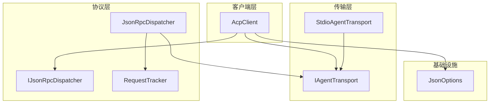
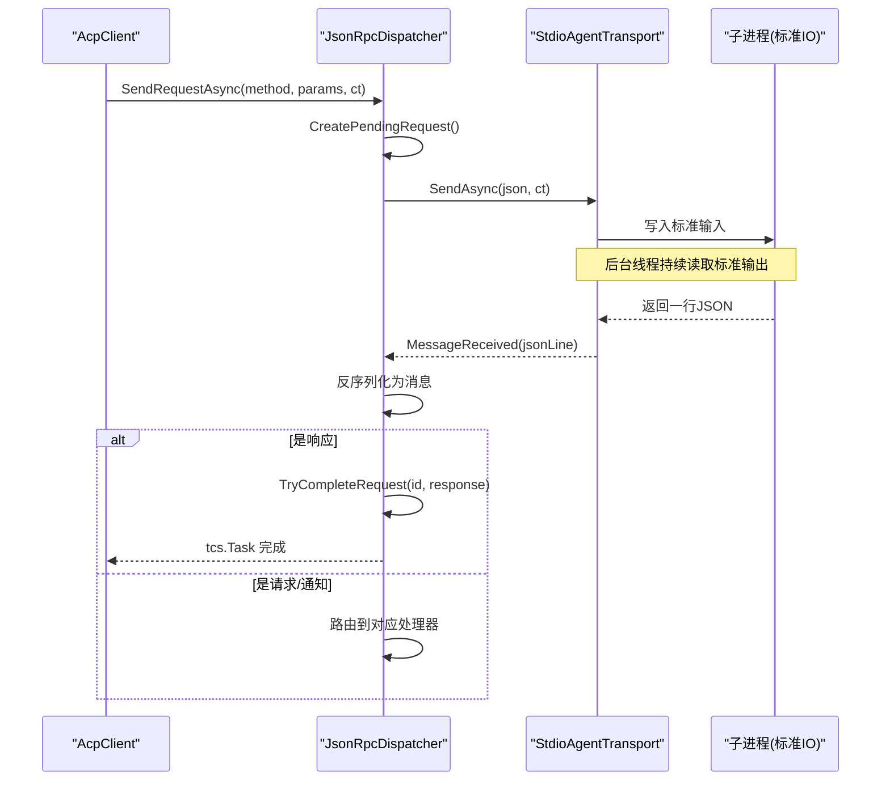
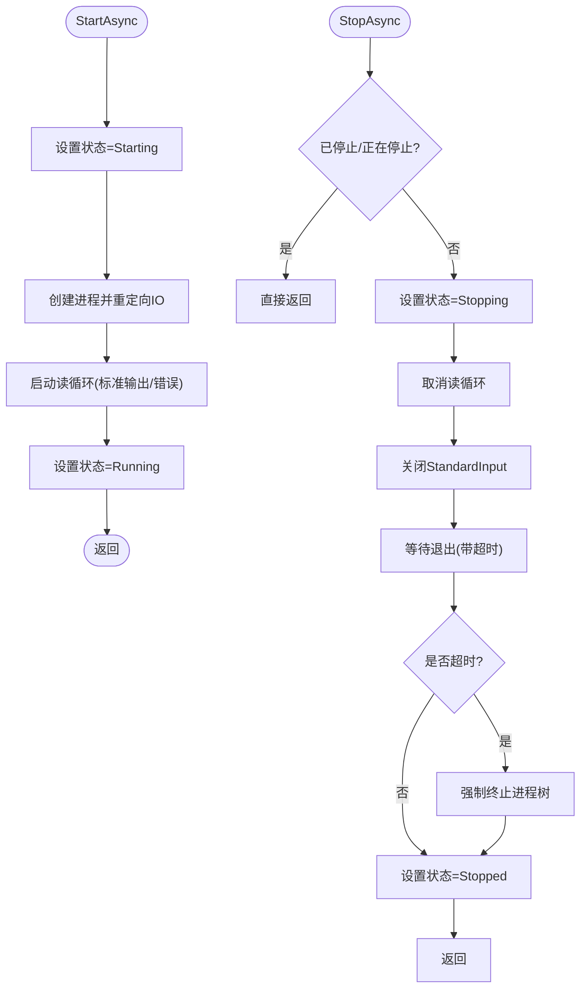
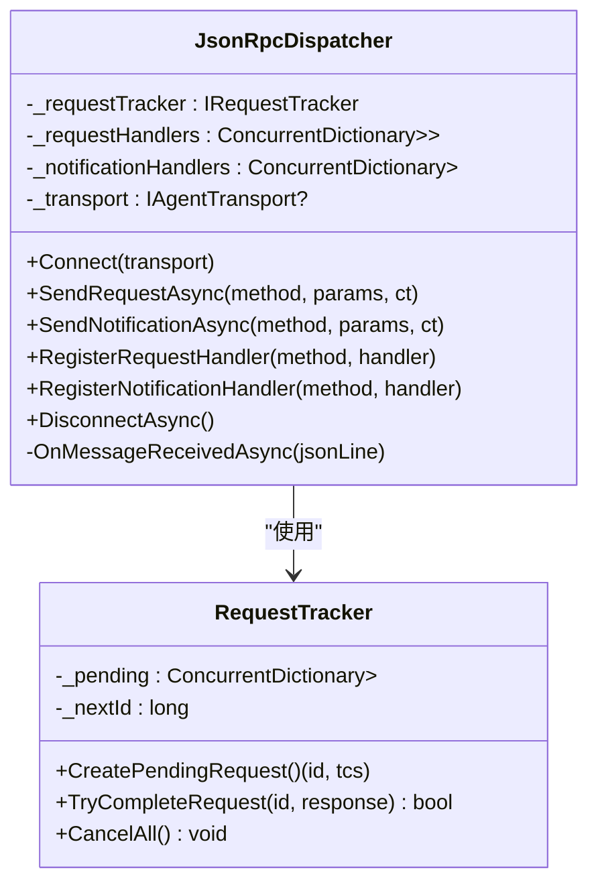
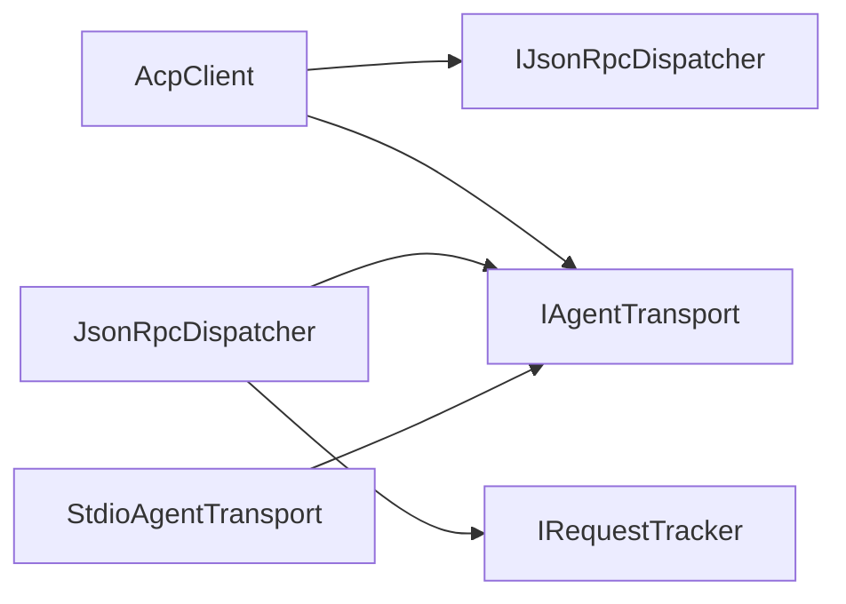

# 性能优化

<cite>
**本文引用的文件**   
- [IAgentTransport.cs](file://Transport/IAgentTransport.cs)
- [StdioAgentTransport.cs](file://Transport/StdioAgentTransport.cs)
- [AcpClient.cs](file://Client/AcpClient.cs)
- [JsonRpcDispatcher.cs](file://Protocol/JsonRpcDispatcher.cs)
- [RequestTracker.cs](file://Protocol/RequestTracker.cs)
- [IJsonRpcDispatcher.cs](file://Protocol/IJsonRpcDispatcher.cs)
- [JsonOptions.cs](file://Infrastructure/JsonOptions.cs)
- [README.md](file://README.md)
</cite>

## 目录
1. [简介](#简介)
2. [项目结构](#项目结构)
3. [核心组件](#核心组件)
4. [架构总览](#架构总览)
5. [详细组件分析](#详细组件分析)
6. [依赖关系分析](#依赖关系分析)
7. [性能考量与调优建议](#性能考量与调优建议)
8. [故障排查指南](#故障排查指南)
9. [结论](#结论)
10. [附录](#附录)

## 简介
本文件聚焦于 Agentic.ACPLibrary 的性能优化，围绕连接与复用策略、内存管理、异步编程、并发控制、监控与瓶颈分析等方面展开。重点覆盖 IAgentTransport 的实现优化与连接生命周期管理，以及 JsonRpcDispatcher 的请求分发与等待机制、请求跟踪与取消传播等关键路径。文档同时提供面向实践的可操作建议，帮助在高吞吐、低延迟场景下获得稳定且高效的运行表现。

## 项目结构
该库采用分层组织：
- Transport：传输抽象与实现（stdio）
- Protocol：JSON-RPC 分发与请求跟踪
- Client：客户端编排与事件处理
- Infrastructure：序列化选项与扩展
- Models/JsonRpc：协议模型与消息类型

图表来源
- [IAgentTransport.cs:1-39](file://Transport/IAgentTransport.cs#L1-L39)
- [StdioAgentTransport.cs:1-147](file://Transport/StdioAgentTransport.cs#L1-L147)
- [IJsonRpcDispatcher.cs:1-14](file://Protocol/IJsonRpcDispatcher.cs#L1-L14)
- [JsonRpcDispatcher.cs:1-124](file://Protocol/JsonRpcDispatcher.cs#L1-L124)
- [RequestTracker.cs:1-52](file://Protocol/RequestTracker.cs#L1-L52)
- [JsonOptions.cs:1-28](file://Infrastructure/JsonOptions.cs#L1-L28)

章节来源
- [README.md:1-99](file://README.md#L1-L99)

## 核心组件
- IAgentTransport：定义传输的启动、发送、接收事件、停止与状态。
- StdioAgentTransport：基于子进程 stdio 的具体实现，负责进程生命周期、输入输出流读取与异常上报。
- JsonRpcDispatcher：负责 JSON-RPC 请求/通知的分发、响应匹配与反序列化处理。
- RequestTracker：维护待完成请求的 TaskCompletionSource，支持按 ID 完成与批量取消。
- AcpClient：编排初始化握手、会话创建/加载、提示发送、事件订阅与资源释放。
- JsonOptions：集中配置 System.Text.Json 序列化选项，避免重复创建开销。

章节来源
- [IAgentTransport.cs:1-39](file://Transport/IAgentTransport.cs#L1-L39)
- [StdioAgentTransport.cs:1-147](file://Transport/StdioAgentTransport.cs#L1-L147)
- [JsonRpcDispatcher.cs:1-124](file://Protocol/JsonRpcDispatcher.cs#L1-L124)
- [RequestTracker.cs:1-52](file://Protocol/RequestTracker.cs#L1-L52)
- [AcpClient.cs:1-361](file://Client/AcpClient.cs#L1-L361)
- [JsonOptions.cs:1-28](file://Infrastructure/JsonOptions.cs#L1-L28)

## 架构总览
下图展示了从客户端发起请求到传输层写入、再到响应回传并匹配的关键调用链。

图表来源
- [JsonRpcDispatcher.cs:27-47](file://Protocol/JsonRpcDispatcher.cs#L27-L47)
- [JsonRpcDispatcher.cs:86-122](file://Protocol/JsonRpcDispatcher.cs#L86-L122)
- [StdioAgentTransport.cs:61-68](file://Transport/StdioAgentTransport.cs#L61-L68)
- [StdioAgentTransport.cs:95-118](file://Transport/StdioAgentTransport.cs#L95-L118)
- [RequestTracker.cs:11-30](file://Protocol/RequestTracker.cs#L11-L30)

## 详细组件分析

### IAgentTransport 与 StdioAgentTransport：连接与生命周期
- 状态机：Created → Starting → Running → Stopping → Stopped/Faulted。
- 启动流程：创建子进程、重定向 IO、启动读循环（标准输出/错误）、设置退出事件。
- 发送流程：校验运行态，写入 StandardInput 并 Flush。
- 停止流程：取消读循环、优雅关闭输入、超时后强制终止进程树。
- 事件：MessageReceived、TransportFaulted、ProcessExited。

优化要点
- 使用 CancellationToken 贯穿 StartAsync/SendAsync/StopAsync，确保快速响应取消。
- 读循环使用独立任务，避免阻塞主线程；对 EOF 和异常进行区分处理。
- 进程退出时更新状态并触发事件，便于上层清理与告警。

图表来源
- [StdioAgentTransport.cs:30-59](file://Transport/StdioAgentTransport.cs#L30-L59)
- [StdioAgentTransport.cs:70-93](file://Transport/StdioAgentTransport.cs#L70-L93)
- [StdioAgentTransport.cs:95-135](file://Transport/StdioAgentTransport.cs#L95-L135)
- [StdioAgentTransport.cs:137-146](file://Transport/StdioAgentTransport.cs#L137-L146)

章节来源
- [IAgentTransport.cs:1-39](file://Transport/IAgentTransport.cs#L1-L39)
- [StdioAgentTransport.cs:1-147](file://Transport/StdioAgentTransport.cs#L1-L147)

### JsonRpcDispatcher：请求分发与响应匹配
- 连接：绑定 transport.MessageReceived 回调。
- 发送请求：生成唯一 id，创建 TCS，序列化并发送；等待 TCS 完成或取消。
- 接收消息：反序列化后根据类型分派（响应/请求/通知），响应通过 TryCompleteRequest 唤醒等待方。
- 断开：解绑事件并取消所有挂起请求。

优化要点
- 使用 ConcurrentDictionary 存储处理器映射，保证高并发注册与查找无锁化。
- 使用 Interlocked 自增 id，避免锁竞争。
- TCS 使用 RunContinuationsAsynchronously 降低同步上下文切换开销。
- 反序列化失败或处理器异常被捕获，避免中断整体读循环。

图表来源
- [JsonRpcDispatcher.cs:1-124](file://Protocol/JsonRpcDispatcher.cs#L1-L124)
- [RequestTracker.cs:1-52](file://Protocol/RequestTracker.cs#L1-L52)

章节来源
- [JsonRpcDispatcher.cs:1-124](file://Protocol/JsonRpcDispatcher.cs#L1-L124)
- [RequestTracker.cs:1-52](file://Protocol/RequestTracker.cs#L1-L52)

### AcpClient：会话与事件编排
- 初始化：启动传输、连接分发器、订阅进程退出与 session/update 通知、注册权限/文件系统/终端处理器、执行 initialize 握手。
- 会话：创建/加载会话、发送提示、取消进行中会话。
- 生命周期：ShutdownAsync 断开分发器并停止传输；DisposeAsync 抑制终结。

优化要点
- 将外部处理器（权限、文件、终端）作为可插拔接口，避免在核心路径中引入额外耦合。
- 统一使用 CancellationToken 传递取消信号，确保端到端可取消。
- 日志记录关键节点，便于定位性能问题。

章节来源
- [AcpClient.cs:1-361](file://Client/AcpClient.cs#L1-L361)

### JsonOptions：序列化性能
- 单例 JsonSerializerOptions，避免重复构造带来的 GC 压力。
- 启用大小写不敏感、忽略 null、紧凑输出、允许元数据属性乱序，提升兼容性与吞吐。
- 注册自定义转换器以支持 JSON-RPC 多态消息。

章节来源
- [JsonOptions.cs:1-28](file://Infrastructure/JsonOptions.cs#L1-L28)

## 依赖关系分析
- AcpClient 依赖 IJsonRpcDispatcher 与 IAgentTransport。
- JsonRpcDispatcher 依赖 IRequestTracker 与 IAgentTransport。
- StdioAgentTransport 依赖 .NET Process 与 IO 流。
- 所有组件通过接口松耦合，便于替换与测试。

图表来源
- [AcpClient.cs:1-361](file://Client/AcpClient.cs#L1-L361)
- [JsonRpcDispatcher.cs:1-124](file://Protocol/JsonRpcDispatcher.cs#L1-L124)
- [StdioAgentTransport.cs:1-147](file://Transport/StdioAgentTransport.cs#L1-L147)

章节来源
- [IJsonRpcDispatcher.cs:1-14](file://Protocol/IJsonRpcDispatcher.cs#L1-L14)
- [IAgentTransport.cs:1-39](file://Transport/IAgentTransport.cs#L1-L39)

## 性能考量与调优建议

### 连接池与复用策略
- 当前设计为“每实例一连接”：每个 AcpClient 持有单个 IAgentTransport，适合典型桌面/服务场景。
- 若需高并发多会话：
  - 在应用层维护多个 AcpClient 实例，共享底层进程（通过共享 IAgentTransport 不可行，因为接口未暴露内部进程句柄）。更合理的是进程内多实例或多进程策略。
  - 对于跨进程通信，保持“一对一”的进程与传输通道，避免在传输层做复杂连接池，减少上下文切换与锁竞争。
- 建议：
  - 将 AcpClient 的生命周期与业务会话绑定，避免频繁创建销毁带来的进程启动开销。
  - 使用对象池（如 ArrayPool/ArrayPool<byte>）缓存临时缓冲区，减少分配。

章节来源
- [AcpClient.cs:1-361](file://Client/AcpClient.cs#L1-L361)
- [StdioAgentTransport.cs:1-147](file://Transport/StdioAgentTransport.cs#L1-L147)

### IAgentTransport 实现优化与连接生命周期
- 启动阶段：
  - 预分配必要的缓冲与数组，减少运行时分配。
  - 使用 Encoding.UTF8 明确编码，避免默认编码检测开销。
- 读写阶段：
  - 读循环使用 ReadLineAsync，避免阻塞；对空行过滤以减少无效处理。
  - 对 stderr 读取忽略异常，防止诊断流影响主路径。
- 停止阶段：
  - 先尝试优雅关闭并等待退出，超时后强制终止，确保资源回收。
- 建议：
  - 增加连接健康检查与自动重连策略（在应用层封装），提高鲁棒性。
  - 对长时间运行的进程，定期统计 IO 吞吐与延迟，发现退化。

章节来源
- [StdioAgentTransport.cs:30-59](file://Transport/StdioAgentTransport.cs#L30-L59)
- [StdioAgentTransport.cs:61-68](file://Transport/StdioAgentTransport.cs#L61-L68)
- [StdioAgentTransport.cs:70-93](file://Transport/StdioAgentTransport.cs#L70-L93)
- [StdioAgentTransport.cs:95-135](file://Transport/StdioAgentTransport.cs#L95-L135)

### 内存管理最佳实践
- 对象池化：
  - 重用字符串与字节缓冲（ArrayPool），避免高频分配。
  - 对频繁创建的中间对象（如请求参数包装）考虑复用或轻量结构。
- 垃圾回收优化：
  - 使用 JsonOptions 单例，避免重复构造。
  - 尽量使用 Span/Memory 减少拷贝（在 IO 层谨慎使用，注意生命周期）。
  - 避免在热路径中使用装箱与反射。
- 内存泄漏预防：
  - 确保 DisposeAsync/ShutdownAsync 正确释放事件订阅与进程句柄。
  - 在取消时及时清理未完成请求（RequestTracker.CancelAll）。
  - 避免在事件回调中持有长生命周期引用。

章节来源
- [JsonOptions.cs:1-28](file://Infrastructure/JsonOptions.cs#L1-L28)
- [RequestTracker.cs:32-39](file://Protocol/RequestTracker.cs#L32-L39)
- [AcpClient.cs:226-240](file://Client/AcpClient.cs#L226-L240)

### 异步编程优化技巧
- Task 并行度控制：
  - 限制并发请求数（令牌桶/信号量），避免背压不足导致内存膨胀。
  - 对 CPU 密集任务使用 Task.Run，对 IO 密集任务使用 async/await 非阻塞。
- CancellationToken 使用：
  - 在所有 I/O 与长耗时操作中透传 ct，确保快速取消。
  - 在事件回调中谨慎使用 CancellationToken.None，必要时改为传入的 ct。
- 超时处理：
  - 使用 WaitAsync(ct) 或 CancellationTokenSource 设置超时，避免无限等待。
  - 对网络/进程 IO 设置合理的超时阈值，结合重试与降级。

章节来源
- [JsonRpcDispatcher.cs:27-47](file://Protocol/JsonRpcDispatcher.cs#L27-L47)
- [StdioAgentTransport.cs:70-93](file://Transport/StdioAgentTransport.cs#L70-L93)
- [AcpClient.cs:47-182](file://Client/AcpClient.cs#L47-L182)

### 并发处理策略
- 线程安全保证：
  - 使用 ConcurrentDictionary 存储处理器映射，避免锁争用。
  - 使用 Interlocked 生成唯一 id，避免全局锁。
- 锁粒度：
  - 最小化临界区范围，避免在事件回调中执行耗时操作。
  - 将耗时逻辑下沉到专用线程或任务，保持事件处理快速返回。
- 死锁预防：
  - 避免在回调中再次获取相同锁；使用异步原语替代同步阻塞。
  - 严格区分请求处理与响应匹配路径，防止循环依赖。

章节来源
- [JsonRpcDispatcher.cs:1-124](file://Protocol/JsonRpcDispatcher.cs#L1-L124)
- [RequestTracker.cs:1-52](file://Protocol/RequestTracker.cs#L1-L52)

### 性能监控工具与瓶颈分析
- 推荐工具：
  - dotnet-counters：实时查看 GC、线程、CPU 指标。
  - dotnet-trace/dotnet-dump：采集性能轨迹与堆转储，定位热点与内存峰值。
  - Application Insights / OpenTelemetry：分布式追踪与指标上报。
- 关键指标：
  - 请求延迟分布（P50/P95/P99）、吞吐量、错误率。
  - GC 次数与暂停时间、堆大小变化。
  - 线程池队列长度与活跃线程数。
- 分析方法：
  - 对比不同负载下的指标曲线，识别拐点。
  - 结合代码路径（如反序列化、IO 读写）定位热点。
  - 针对慢查询进行采样与复现，验证优化效果。

[本节为通用指导，无需源码引用]

### 调优建议清单
- 预热：首次启动后执行一次轻量握手，减少冷启动延迟。
- 批处理：合并小消息或批量发送，降低系统调用次数。
- 缓冲：合理设置缓冲区大小，平衡内存与延迟。
- 超时与重试：为不稳定环节设置退避重试，避免雪崩。
- 资源上限：限制并发与队列长度，保护系统稳定性。
- 观测：接入指标与日志，建立基线与告警。

[本节为通用指导，无需源码引用]

## 故障排查指南
- 常见问题
  - 进程未启动或意外退出：检查 StartAsync 返回值与 ProcessExited 事件。
  - 消息丢失或乱序：确认读循环未被取消，MessageReceived 未被异常中断。
  - 请求无响应：检查 RequestTracker 是否有对应 pending 请求，是否存在超时或取消。
  - 内存持续增长：检查是否未释放事件订阅、未调用 ShutdownAsync/DisposeAsync。
- 定位步骤
  - 启用详细日志，记录关键节点时间与异常。
  - 使用 dotnet-trace 抓取热点方法栈。
  - 使用 dotnet-dump 分析堆对象分布，定位泄漏点。
- 恢复策略
  - 自动重连：在检测到进程退出后重建传输与分发器。
  - 降级模式：在不可用时返回友好错误，避免级联失败。

章节来源
- [StdioAgentTransport.cs:70-93](file://Transport/StdioAgentTransport.cs#L70-L93)
- [StdioAgentTransport.cs:95-135](file://Transport/StdioAgentTransport.cs#L95-L135)
- [JsonRpcDispatcher.cs:86-122](file://Protocol/JsonRpcDispatcher.cs#L86-L122)
- [AcpClient.cs:226-240](file://Client/AcpClient.cs#L226-L240)

## 结论
通过对传输层、协议分发层与客户端层的深入分析，明确了连接生命周期、请求匹配、事件处理与资源释放的关键路径。结合对象池化、异步取消、并发控制与监控手段，可在保证稳定性的前提下显著提升吞吐与延迟表现。建议在应用层完善连接复用与健康检查，配合完善的观测体系，持续迭代优化。

[本节为总结，无需源码引用]

## 附录
- 快速开始参考：见 README 中的示例代码，用于搭建基础用法与扩展点。
- 扩展点：通过 RegisterRequestHandler/RegisterNotificationHandler 注入自定义逻辑，避免修改核心代码。

章节来源
- [README.md:1-99](file://README.md#L1-L99)