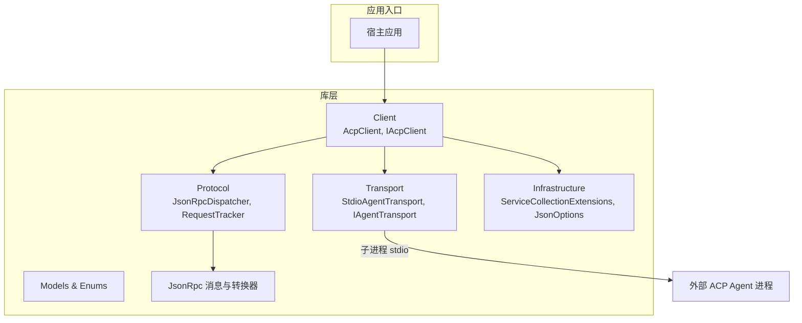
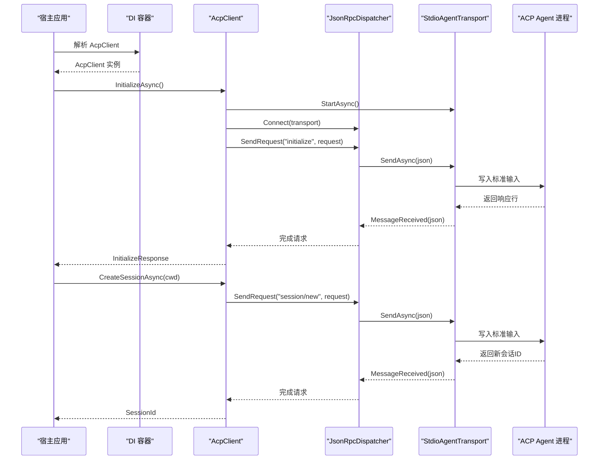
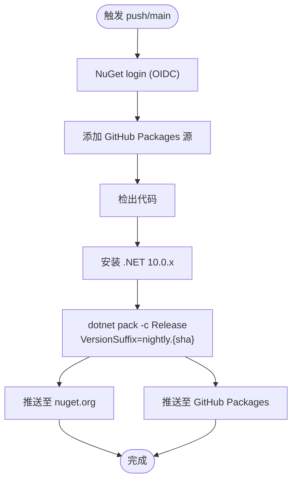
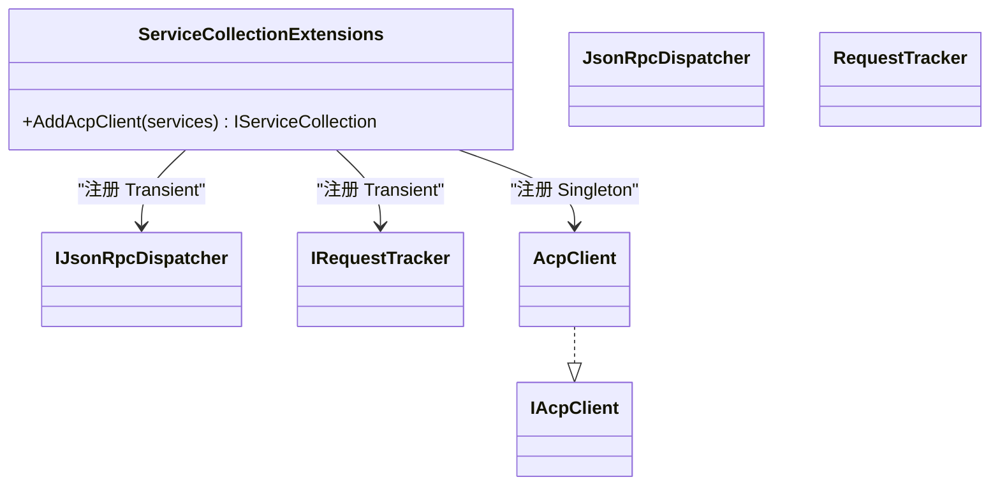
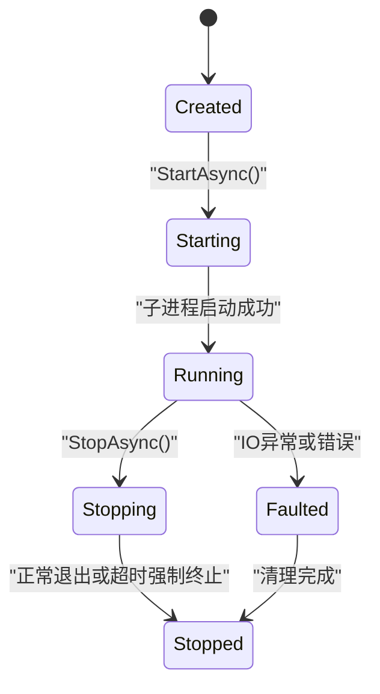
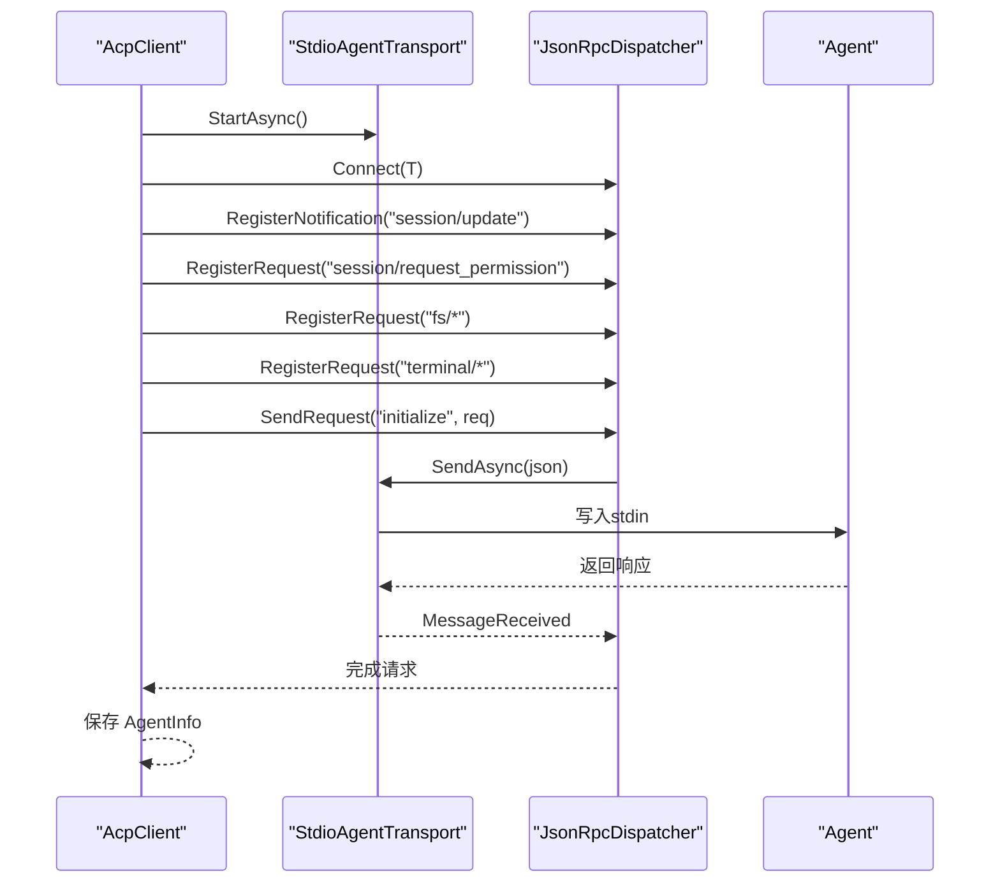
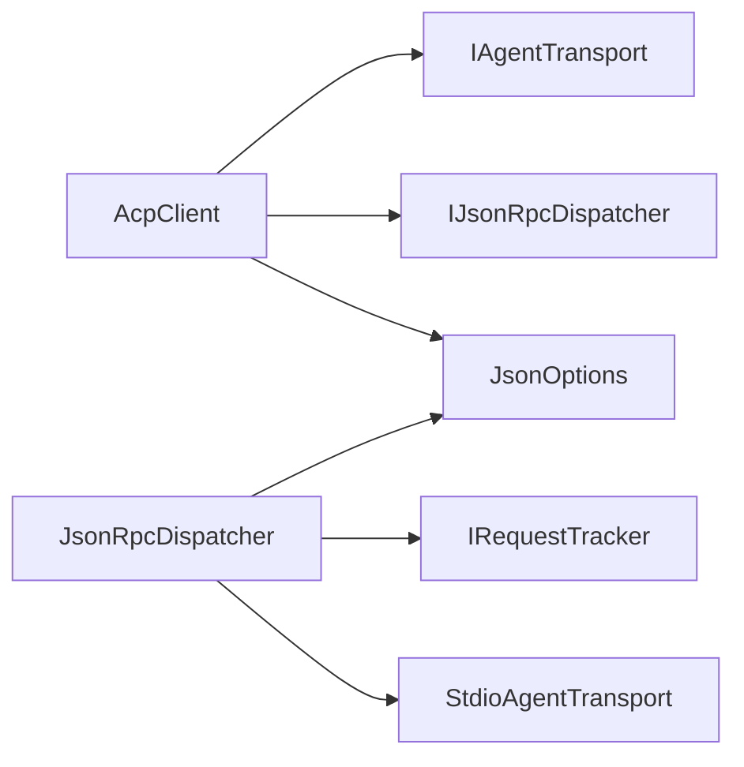

# 生产部署

<cite>
**本文引用的文件**   
- [Agentic.ACPLibrary.csproj](file://Agentic.ACPLibrary.csproj)
- [nuget.yml](file://.github/workflows/nuget.yml)
- [README.md](file://README.md)
- [ServiceCollectionExtensions.cs](file://Infrastructure/ServiceCollectionExtensions.cs)
- [JsonOptions.cs](file://Infrastructure/JsonOptions.cs)
- [AcpClient.cs](file://Client/AcpClient.cs)
- [IAcpClient.cs](file://Client/IAcpClient.cs)
- [JsonRpcDispatcher.cs](file://Protocol/JsonRpcDispatcher.cs)
- [StdioAgentTransport.cs](file://Transport/StdioAgentTransport.cs)
- [IAgentTransport.cs](file://Transport/IAgentTransport.cs)
</cite>

## 目录
1. [简介](#简介)
2. [项目结构](#项目结构)
3. [核心组件](#核心组件)
4. [架构总览](#架构总览)
5. [详细组件分析](#详细组件分析)
6. [依赖分析](#依赖分析)
7. [性能考虑](#性能考虑)
8. [故障排查指南](#故障排查指南)
9. [结论](#结论)
10. [附录](#附录)

## 简介
本文件面向生产环境，提供 Agentic.ACPLibrary 的完整部署与运维指南。内容涵盖：
- NuGet 包构建流程（项目配置、依赖管理、版本控制策略）
- CI/CD 流水线（自动化测试建议、代码质量检查、发布流程）
- 依赖注入容器配置（服务注册、生命周期、配置管理）
- 部署最佳实践（环境变量、配置文件、密钥管理）
- 容器化与微服务集成、云原生部署策略

该库是一个 .NET 客户端库，通过 JSON-RPC over stdio 与 ACP 兼容的 Agent 进程通信，提供会话管理、扩展处理器接口和可插拔传输抽象。

## 项目结构
仓库采用按功能域划分的目录组织方式：
- Client：ACP 客户端实现与契约
- Protocol：JSON-RPC 分发器与请求跟踪
- Transport：基于子进程 stdio 的传输实现与抽象
- Infrastructure：依赖注入扩展与 JSON 序列化选项
- Models/Enums：协议模型与枚举
- JsonRpc：JSON-RPC 消息类型与转换器
- .github/workflows：CI/CD 工作流
- nupkg：本地打包输出目录

图表来源
- [AcpClient.cs:1-361](file://Client/AcpClient.cs#L1-L361)
- [JsonRpcDispatcher.cs:1-124](file://Protocol/JsonRpcDispatcher.cs#L1-L124)
- [StdioAgentTransport.cs:1-147](file://Transport/StdioAgentTransport.cs#L1-L147)
- [ServiceCollectionExtensions.cs:1-23](file://Infrastructure/ServiceCollectionExtensions.cs#L1-L23)
- [JsonOptions.cs:1-28](file://Infrastructure/JsonOptions.cs#L1-L28)

章节来源
- [README.md:1-99](file://README.md#L1-L99)

## 核心组件
- AcpClient：ACP 客户端主类，负责启动传输、握手、会话管理与事件回调。
- JsonRpcDispatcher：JSON-RPC 请求/通知分发器，维护请求-响应关联与处理器路由。
- StdioAgentTransport：基于子进程的 stdio 传输，封装进程生命周期与 IO。
- ServiceCollectionExtensions：为 DI 容器注册 ACP 相关服务。
- JsonOptions：集中配置 System.Text.Json 行为，统一序列化策略。

章节来源
- [AcpClient.cs:1-361](file://Client/AcpClient.cs#L1-L361)
- [JsonRpcDispatcher.cs:1-124](file://Protocol/JsonRpcDispatcher.cs#L1-L124)
- [StdioAgentTransport.cs:1-147](file://Transport/StdioAgentTransport.cs#L1-L147)
- [ServiceCollectionExtensions.cs:1-23](file://Infrastructure/ServiceCollectionExtensions.cs#L1-L23)
- [JsonOptions.cs:1-28](file://Infrastructure/JsonOptions.cs#L1-L28)

## 架构总览
下图展示从宿主应用到 ACP Agent 的端到端调用序列，包括初始化、创建会话与发送提示的关键路径。

图表来源
- [AcpClient.cs:48-182](file://Client/AcpClient.cs#L48-L182)
- [JsonRpcDispatcher.cs:27-47](file://Protocol/JsonRpcDispatcher.cs#L27-L47)
- [StdioAgentTransport.cs:30-68](file://Transport/StdioAgentTransport.cs#L30-L68)

## 详细组件分析

### NuGet 包构建与发布（CI/CD）
- 目标框架与打包属性：
  - 目标框架：net10.0
  - 启用隐式 using、可空引用类型
  - IsPackable=true，定义 PackageId、VersionPrefix、Authors、Description、Tags、License、Readme、文档生成等
- 依赖项：
  - Microsoft.Extensions.DependencyInjection.Abstractions
  - System.Text.Json
  - Microsoft.Extensions.Logging.Abstractions
- CI/CD 流水线要点：
  - 触发条件：push 到 main 分支
  - 运行环境：windows-latest
  - 权限：id-token write（用于 OIDC 登录 NuGet）
  - 步骤：
    - NuGet login（使用变量 NUGET_USER）
    - GitHub Packages 源添加（使用 secrets.BOT_TOKEN）
    - checkout、setup-dotnet（dotnet-version: 10.0.x）
    - dotnet pack 生成 nightly 版本（VersionSuffix=nightly.${{ github.sha }}）
    - 推送至 nuget.org 与 GitHub Packages

图表来源
- [nuget.yml:1-33](file://.github/workflows/nuget.yml#L1-L33)
- [Agentic.ACPLibrary.csproj:1-34](file://Agentic.ACPLibrary.csproj#L1-L34)

章节来源
- [Agentic.ACPLibrary.csproj:1-34](file://Agentic.ACPLibrary.csproj#L1-L34)
- [nuget.yml:1-33](file://.github/workflows/nuget.yml#L1-L33)

### 依赖注入容器配置
- 服务注册：
  - IJsonRpcDispatcher -> JsonRpcDispatcher（Transient）
  - IRequestTracker -> RequestTracker（Transient）
  - AcpClient（Singleton），并暴露 IAcpClient 单例
- 生命周期：
  - 传输与分发器短生命周期，避免跨请求状态污染
  - 客户端长生命周期，便于复用会话与连接
- 使用方式：
  - 在宿主应用中调用 services.AddAcpClient() 完成注册

图表来源
- [ServiceCollectionExtensions.cs:9-22](file://Infrastructure/ServiceCollectionExtensions.cs#L9-L22)

章节来源
- [ServiceCollectionExtensions.cs:1-23](file://Infrastructure/ServiceCollectionExtensions.cs#L1-L23)

### JSON 序列化配置
- 统一 JsonSerializerOptions：
  - 属性名大小写不敏感
  - 写入时忽略 null
  - 非缩进输出
  - 允许元数据属性乱序（多态反序列化场景）
  - 注册 JsonRpcMessageConverter 与 JsonStringEnumConverter
- 使用位置：
  - 分发器与客户端在序列化/反序列化时均使用该选项

章节来源
- [JsonOptions.cs:1-28](file://Infrastructure/JsonOptions.cs#L1-L28)
- [JsonRpcDispatcher.cs:39-44](file://Protocol/JsonRpcDispatcher.cs#L39-L44)
- [AcpClient.cs:66-71](file://Client/AcpClient.cs#L66-L71)

### 传输与进程管理
- StdioAgentTransport：
  - 启动子进程，重定向 stdin/stdout/stderr
  - 后台读取 stdout 并通过 MessageReceived 事件上报
  - 监听 stderr 用于诊断
  - StopAsync 优雅关闭，超时后强制终止整个进程树
  - 进程退出时通过 ProcessExited 事件通知
- 状态机：Created -> Starting -> Running -> Stopping -> Stopped/Faulted

图表来源
- [StdioAgentTransport.cs:30-93](file://Transport/StdioAgentTransport.cs#L30-L93)
- [IAgentTransport.cs:30-38](file://Transport/IAgentTransport.cs#L30-L38)

章节来源
- [StdioAgentTransport.cs:1-147](file://Transport/StdioAgentTransport.cs#L1-L147)
- [IAgentTransport.cs:1-39](file://Transport/IAgentTransport.cs#L1-L39)

### 客户端初始化与工作流
- 初始化流程：
  - 启动传输、连接分发器、订阅事件
  - 注册内置 handler（权限、文件系统、终端）
  - 发送 initialize 请求，获取 AgentInfo
  - 校验协议版本并记录警告
- 会话与提示：
  - CreateSessionAsync：创建新会话并缓存 CurrentSessionId
  - SendPromptAsync：发送提示并等待响应，流式更新通过 SessionUpdated 事件
  - CancelSessionAsync：取消进行中的提示
- 资源释放：
  - ShutdownAsync：断开分发器、停止传输
  - DisposeAsync：确保释放

图表来源
- [AcpClient.cs:48-182](file://Client/AcpClient.cs#L48-L182)
- [JsonRpcDispatcher.cs:27-47](file://Protocol/JsonRpcDispatcher.cs#L27-L47)
- [StdioAgentTransport.cs:30-68](file://Transport/StdioAgentTransport.cs#L30-L68)

章节来源
- [AcpClient.cs:1-361](file://Client/AcpClient.cs#L1-L361)
- [IAcpClient.cs:1-59](file://Client/IAcpClient.cs#L1-L59)

## 依赖分析
- 运行时依赖：
  - Microsoft.Extensions.DependencyInjection.Abstractions：DI 抽象
  - System.Text.Json：高性能 JSON 序列化
  - Microsoft.Extensions.Logging.Abstractions：日志抽象
- 内部依赖关系：
  - AcpClient 依赖 IAgentTransport 与 IJsonRpcDispatcher
  - JsonRpcDispatcher 依赖 IRequestTracker 与 Transport
  - StdioAgentTransport 依赖系统进程 API
- 外部集成点：
  - 外部 ACP Agent 进程（通过 stdio 通信）
  - NuGet/GitHub Packages 源（CI/CD 发布）

图表来源
- [AcpClient.cs:1-361](file://Client/AcpClient.cs#L1-L361)
- [JsonRpcDispatcher.cs:1-124](file://Protocol/JsonRpcDispatcher.cs#L1-L124)
- [StdioAgentTransport.cs:1-147](file://Transport/StdioAgentTransport.cs#L1-L147)
- [JsonOptions.cs:1-28](file://Infrastructure/JsonOptions.cs#L1-L28)

章节来源
- [Agentic.ACPLibrary.csproj:22-26](file://Agentic.ACPLibrary.csproj#L22-L26)

## 性能考虑
- 序列化性能：
  - 使用 System.Text.Json 与预编译的 JsonSerializerOptions，减少重复开销
  - 禁止缩进输出，降低网络负载
- 并发与异步：
  - 所有 IO 操作均为异步，避免阻塞线程池
  - 请求-响应通过 TaskCompletionSource 关联，避免忙轮询
- 进程管理：
  - 后台读取 stdout/stderr，避免死锁
  - 优雅关闭与超时强制终止，防止僵尸进程
- 内存与对象生命周期：
  - 分发器与传输器短生命周期，客户端单例，避免频繁分配
  - 合理处理事件订阅与取消令牌，避免内存泄漏

[本节为通用指导，无需特定文件引用]

## 故障排查指南
- 常见问题定位：
  - 传输未运行：SendAsync 抛出“传输未运行”异常，需确认 StartAsync 已调用且状态为 Running
  - 分发器未连接：SendRequest/SendNotification 抛出“未连接到传输”，需先调用 Connect
  - 协议版本不匹配：InitializeResponse.ProtocolVersion != 1 时记录警告，需升级客户端或 Agent
  - 处理器缺失：权限/文件/终端处理器未设置时返回特定错误码，需在 InitializeAsync 前赋值
- 日志与诊断：
  - 使用 ILogger<AcpClient> 记录关键步骤与异常
  - StdioAgentTransport 的 stderr 可用于调试子进程问题
- 恢复策略：
  - 捕获 TransportFaulted 事件进行重试或降级
  - 进程退出后重新初始化并重建会话

章节来源
- [AcpClient.cs:102-144](file://Client/AcpClient.cs#L102-L144)
- [JsonRpcDispatcher.cs:29-31](file://Protocol/JsonRpcDispatcher.cs#L29-L31)
- [StdioAgentTransport.cs:62-68](file://Transport/StdioAgentTransport.cs#L62-L68)

## 结论
本库通过清晰的职责分离与可扩展的传输/分发机制，提供了稳定高效的 ACP 客户端能力。在生产环境中，应重点关注：
- 规范的 CI/CD 发布流程与版本策略
- 合理的 DI 生命周期与配置管理
- 健壮的进程与 IO 错误处理
- 安全的密钥与环境变量管理
- 容器化与云原生部署的最佳实践

[本节为总结性内容，无需特定文件引用]

## 附录

### NuGet 包构建与版本控制策略
- 版本策略：
  - 主干发布：使用 VersionPrefix 作为基础版本
  - Nightly 构建：通过 VersionSuffix 附加提交哈希，保证唯一性与可追溯性
- 打包参数：
  - -c Release：优化构建产物
  - -o ./nupkg：指定输出目录
- 发布源：
  - nuget.org：公共源，需要 API Key（OIDC）
  - GitHub Packages：私有源，需要 PAT/BOT_TOKEN

章节来源
- [Agentic.ACPLibrary.csproj:8-19](file://Agentic.ACPLibrary.csproj#L8-L19)
- [nuget.yml:27-32](file://.github/workflows/nuget.yml#L27-L32)

### CI/CD 流水线增强建议
- 自动化测试：
  - 在 pack 之前增加 dotnet test，确保用例通过
- 代码质量检查：
  - 引入 dotnet format、SonarQube、CodeQL 等工具
- 安全扫描：
  - 依赖漏洞扫描（如 dotnet audit）
- 制品归档：
  - 将 nupkg 上传到 GitHub Actions Artifacts，便于回滚与审计

章节来源
- [nuget.yml:1-33](file://.github/workflows/nuget.yml#L1-L33)

### 依赖注入与配置管理最佳实践
- 服务注册：
  - 使用 AddAcpClient 集中注册，避免分散配置
- 生命周期：
  - 客户端单例，传输与分发器瞬态，避免跨请求共享状态
- 配置管理：
  - 使用 IConfiguration 注入环境变量与 appsettings.*
  - 敏感信息通过环境变量或密钥管理服务注入
- 日志：
  - 使用 ILoggerFactory 创建 logger，避免硬编码 NullLogger

章节来源
- [ServiceCollectionExtensions.cs:14-21](file://Infrastructure/ServiceCollectionExtensions.cs#L14-L21)
- [AcpClient.cs:40-45](file://Client/AcpClient.cs#L40-L45)

### 环境变量与密钥管理
- 环境变量：
  - AGENT_COMMAND：Agent 可执行文件路径
  - AGENT_ARGS：启动参数
  - WORKING_DIRECTORY：工作目录
- 密钥管理：
  - NuGet API Key、GitHub PAT 等通过 CI/CD Secrets 管理
  - 运行时密钥通过环境变量或托管标识（Managed Identity）注入

章节来源
- [StdioAgentTransport.cs:23-28](file://Transport/StdioAgentTransport.cs#L23-L28)
- [nuget.yml:12-19](file://.github/workflows/nuget.yml#L12-L19)

### 容器化与微服务集成
- 容器镜像：
  - 使用多阶段构建，仅包含运行时与必要依赖
  - 最小化基础镜像（如 mcr.microsoft.com/dotnet/aspnet:10.0）
- 进程隔离：
  - 每个 ACP Agent 进程独立运行，避免相互影响
- 健康检查：
  - 暴露 /health 端点，检测传输与分发器状态
- 微服务集成：
  - 通过消息队列或服务网格与上游服务解耦
  - 使用配置中心统一管理环境变量与密钥

[本节为概念性指导，无需特定文件引用]

### 云原生部署策略
- 编排平台：
  - Kubernetes：Deployment、ConfigMap、Secret、HorizontalPodAutoscaler
- 弹性伸缩：
  - 基于 CPU/内存或自定义指标自动扩缩容
- 可观测性：
  - 结构化日志、指标采集（Prometheus）、分布式追踪（OpenTelemetry）
- 安全加固：
  - 只读根文件系统、非 root 用户运行、最小权限原则

[本节为概念性指导，无需特定文件引用]