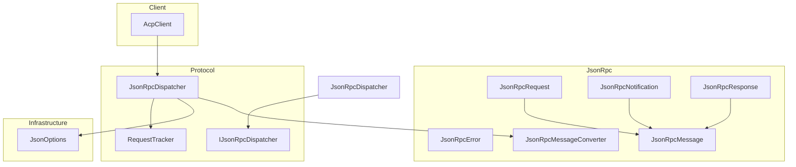
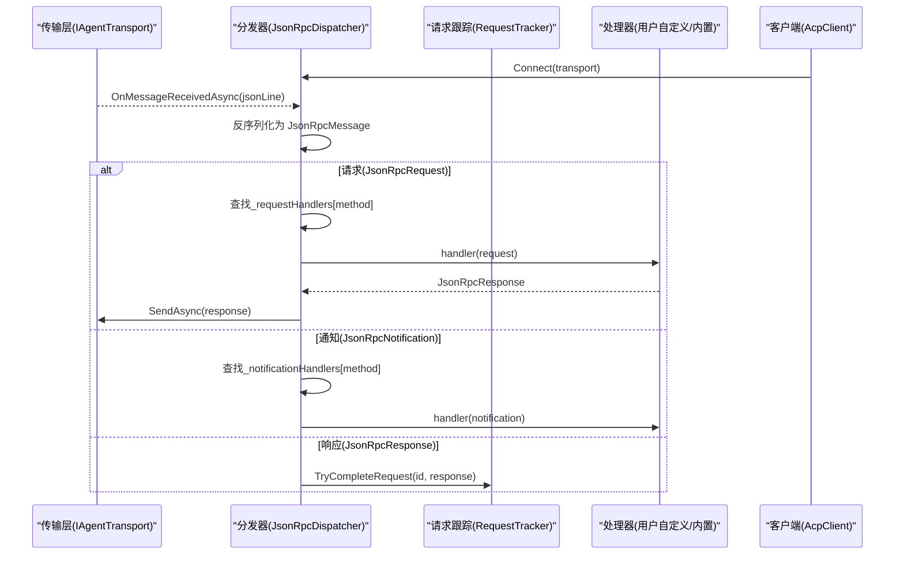
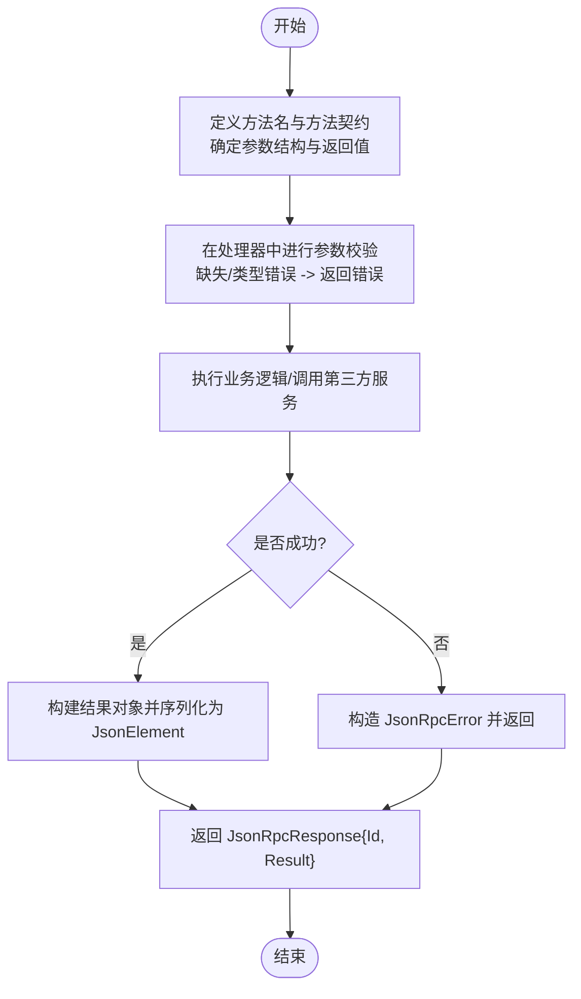
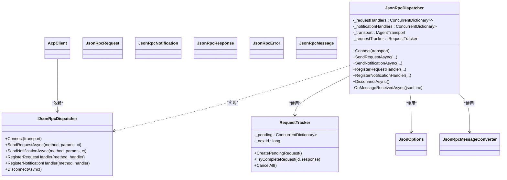

# 自定义方法

<cite>
**本文引用的文件**   
- [JsonRpcDispatcher.cs](file://Protocol/JsonRpcDispatcher.cs)
- [IJsonRpcDispatcher.cs](file://Protocol/IJsonRpcDispatcher.cs)
- [JsonRpcRequest.cs](file://JsonRpc/JsonRpcRequest.cs)
- [JsonRpcNotification.cs](file://JsonRpc/JsonRpcNotification.cs)
- [JsonRpcResponse.cs](file://JsonRpc/JsonRpcResponse.cs)
- [JsonRpcError.cs](file://JsonRpc/JsonRpcError.cs)
- [JsonRpcMessage.cs](file://JsonRpc/JsonRpcMessage.cs)
- [JsonRpcMessageConverter.cs](file://JsonRpc\JsonRpcMessageConverter.cs)
- [JsonOptions.cs](file://Infrastructure\JsonOptions.cs)
- [AcpClient.cs](file://Client\AcpClient.cs)
- [README.md](file://README.md)
</cite>

## 目录
1. [简介](#简介)
2. [项目结构](#项目结构)
3. [核心组件](#核心组件)
4. [架构总览](#架构总览)
5. [详细组件分析](#详细组件分析)
6. [依赖关系分析](#依赖关系分析)
7. [性能考量](#性能考量)
8. [故障排查指南](#故障排查指南)
9. [结论](#结论)
10. [附录：命名约定与版本兼容](#附录：命名约定与版本兼容)

## 简介
本文件面向需要在 ACP（Agent Client Protocol）客户端中扩展 JSON-RPC 能力的开发者，系统讲解如何注册自定义的 JSON-RPC 请求方法与通知处理器。重点围绕以下能力展开：
- 使用 RegisterRequestHandler 注册自定义请求处理器
- 使用 RegisterNotificationHandler 注册自定义通知处理器
- 处理器的函数签名、参数类型与返回值格式
- 参数校验、错误处理与响应格式化最佳实践
- 方法命名约定、版本兼容性与向后兼容性策略
- 实际应用场景：扩展 ACP 协议功能、集成第三方服务、实现业务逻辑

## 项目结构
本项目采用分层组织方式：
- JsonRpc：JSON-RPC 消息模型与序列化转换器
- Protocol：分发器与请求跟踪器，负责路由消息到处理器
- Client：ACP 客户端封装，提供初始化、会话管理与内置处理器注册示例
- Infrastructure：JSON 序列化选项与扩展
- Transport：传输抽象与 stdio 实现

图表来源
- [JsonRpcRequest.cs:1-19](file://JsonRpc/JsonRpcRequest.cs#L1-L19)
- [JsonRpcNotification.cs:1-16](file://JsonRpc/JsonRpcNotification.cs#L1-L16)
- [JsonRpcResponse.cs:1-20](file://JsonRpc/JsonRpcResponse.cs#L1-L20)
- [JsonRpcError.cs:1-19](file://JsonRpc/JsonRpcError.cs#L1-L19)
- [JsonRpcMessage.cs:1-14](file://JsonRpc/JsonRpcMessage.cs#L1-L14)
- [JsonRpcMessageConverter.cs:1-73](file://JsonRpc\JsonRpcMessageConverter.cs#L1-L73)
- [IJsonRpcDispatcher.cs:1-14](file://Protocol/IJsonRpcDispatcher.cs#L1-L14)
- [JsonRpcDispatcher.cs:1-124](file://Protocol/JsonRpcDispatcher.cs#L1-L124)
- [AcpClient.cs:1-361](file://Client\AcpClient.cs#L1-L361)
- [JsonOptions.cs:1-28](file://Infrastructure\JsonOptions.cs#L1-L28)

章节来源
- [README.md:1-99](file://README.md#L1-L99)

## 核心组件
- IJsonRpcDispatcher：定义连接、发送请求/通知、注册处理器、断开等能力
- JsonRpcDispatcher：实现分发器，维护请求与通知处理器映射，解析并路由消息
- JsonRpcRequest/JsonRpcNotification/JsonRpcResponse/JsonRpcError：标准 JSON-RPC 2.0 数据结构
- JsonRpcMessageConverter：根据字段存在性区分消息类型，避免递归转换
- JsonOptions：全局 JSON 序列化配置，包含大小写不敏感、忽略空值、允许元数据乱序等
- AcpClient：在初始化过程中注册内置处理器，并提供对外暴露的注册方法

章节来源
- [IJsonRpcDispatcher.cs:1-14](file://Protocol/IJsonRpcDispatcher.cs#L1-L14)
- [JsonRpcDispatcher.cs:1-124](file://Protocol/JsonRpcDispatcher.cs#L1-L124)
- [JsonRpcRequest.cs:1-19](file://JsonRpc/JsonRpcRequest.cs#L1-L19)
- [JsonRpcNotification.cs:1-16](file://JsonRpc/JsonRpcNotification.cs#L1-L16)
- [JsonRpcResponse.cs:1-20](file://JsonRpc/JsonRpcResponse.cs#L1-L20)
- [JsonRpcError.cs:1-19](file://JsonRpc/JsonRpcError.cs#L1-L19)
- [JsonRpcMessageConverter.cs:1-73](file://JsonRpc\JsonRpcMessageConverter.cs#L1-L73)
- [JsonOptions.cs:1-28](file://Infrastructure\JsonOptions.cs#L1-L28)
- [AcpClient.cs:1-361](file://Client\AcpClient.cs#L1-L361)

## 架构总览
下图展示了从消息接收到处理器调用的完整流程，以及自定义方法的注册位置。

图表来源
- [JsonRpcDispatcher.cs:86-122](file://Protocol/JsonRpcDispatcher.cs#L86-L122)
- [RequestTracker.cs:19-30](file://Protocol\RequestTracker.cs#L19-L30)

章节来源
- [JsonRpcDispatcher.cs:1-124](file://Protocol/JsonRpcDispatcher.cs#L1-L124)

## 详细组件分析

### 注册接口与处理器签名
- 注册请求处理器
  - 方法：RegisterRequestHandler(string method, Func<JsonRpcRequest, Task<JsonRpcResponse>> handler)
  - 说明：将 method 字符串与一个异步委托绑定；委托接收 JsonRpcRequest，返回 JsonRpcResponse
- 注册通知处理器
  - 方法：RegisterNotificationHandler(string method, Func<JsonRpcNotification, Task> handler)
  - 说明：将 method 字符串与一个异步委托绑定；委托接收 JsonRpcNotification，无返回值

处理器输入输出要点：
- 请求处理器输入为 JsonRpcRequest，包含 Id、Method、Params（JsonElement?）
- 通知处理器输入为 JsonRpcNotification，包含 Method、Params（JsonElement?）
- 请求处理器必须返回 JsonRpcResponse，包含 Id、Result（JsonElement?）或 Error（JsonRpcError?）

章节来源
- [IJsonRpcDispatcher.cs:10-11](file://Protocol/IJsonRpcDispatcher.cs#L10-L11)
- [JsonRpcDispatcher.cs:66-74](file://Protocol/JsonRpcDispatcher.cs#L66-L74)
- [JsonRpcRequest.cs:1-19](file://JsonRpc/JsonRpcRequest.cs#L1-L19)
- [JsonRpcNotification.cs:1-16](file://JsonRpc/JsonRpcNotification.cs#L1-L16)
- [JsonRpcResponse.cs:1-20](file://JsonRpc/JsonRpcResponse.cs#L1-L20)

### 参数解析与验证
- Params 类型为 JsonElement?，建议通过 System.Text.Json 的 GetProperty/TryGetProperty 进行强类型解析
- 推荐做法：
  - 先检查 Params 是否为 null
  - 对必填字段进行存在性与类型校验
  - 对可选字段使用 TryGetProperty，提供默认值
  - 遇到非法参数时，构造 JsonRpcError 返回，避免抛出异常导致未捕获

章节来源
- [AcpClient.cs:102-144](file://Client\AcpClient.cs#L102-L144)
- [AcpClient.cs:253-358](file://Client\AcpClient.cs#L253-L358)

### 错误处理与响应格式化
- 成功路径：返回 JsonRpcResponse 且设置 Result（JsonElement），通常使用 JsonSerializer.SerializeToElement 将对象序列化为 JsonElement
- 失败路径：返回 JsonRpcResponse 且设置 Error（JsonRpcError），包含 Code、Message、Data（可选）
- 常见错误码：-32601（方法不存在）、-32602（参数错误）、-32603（内部错误）等
- 注意：不要直接抛异常，应在处理器内统一转换为 Error 返回，便于调用方按 JSON-RPC 规范处理

章节来源
- [JsonRpcError.cs:1-19](file://JsonRpc/JsonRpcError.cs#L1-L19)
- [AcpClient.cs:102-144](file://Client\AcpClient.cs#L102-L144)
- [AcpClient.cs:253-358](file://Client\AcpClient.cs#L253-L358)

### 自定义方法创建步骤（示例流程）

[此图为概念流程图，无需代码来源]

### 实际应用场景

#### 场景一：扩展 ACP 协议功能
- 目标：在不修改核心协议的前提下，新增自定义方法以支持特定业务需求
- 步骤：
  - 选择唯一的方法名（遵循命名约定）
  - 使用 RegisterRequestHandler 注册处理器
  - 在处理器中解析 Params、执行逻辑、返回 Result 或 Error
- 参考：AcpClient 在 InitializeAsync 中注册了 session/update、session/request_permission、fs/*、terminal/* 等方法

章节来源
- [AcpClient.cs:64-144](file://Client\AcpClient.cs#L64-L144)
- [AcpClient.cs:253-358](file://Client\AcpClient.cs#L253-L358)

#### 场景二：集成第三方服务
- 目标：通过自定义方法封装第三方 API 调用
- 步骤：
  - 设计方法名与参数结构（如 serviceName/methodName）
  - 在处理器中调用第三方 SDK/HTTP 客户端
  - 将响应包装为 Result，或将异常转为 Error
- 注意事项：超时、重试、限流、日志记录

章节来源
- [JsonRpcDispatcher.cs:98-107](file://Protocol/JsonRpcDispatcher.cs#L98-L107)
- [JsonOptions.cs:1-28](file://Infrastructure\JsonOptions.cs#L1-L28)

#### 场景三：实现业务逻辑
- 目标：将领域逻辑暴露为 JSON-RPC 方法供 Agent 或其他客户端调用
- 步骤：
  - 定义方法名与参数（如 business/doAction）
  - 在处理器中执行业务编排、事务控制、权限校验
  - 返回结构化结果或错误信息

章节来源
- [AcpClient.cs:102-144](file://Client\AcpClient.cs#L102-L144)

### 通知处理器的使用
- 通知是无响应的单向消息，适合事件驱动场景（如状态更新、日志推送）
- 使用 RegisterNotificationHandler 注册，处理器仅消费 Params，无需返回
- 典型用法：订阅 session/update 或其他自定义通知通道

章节来源
- [AcpClient.cs:64-72](file://Client\AcpClient.cs#L64-L72)
- [JsonRpcDispatcher.cs:110-115](file://Protocol/JsonRpcDispatcher.cs#L110-L115)

## 依赖关系分析
- JsonRpcDispatcher 依赖：
  - IRequestTracker：管理请求生命周期与响应匹配
  - IAgentTransport：发送/接收 JSON 文本
  - JsonOptions：统一的序列化配置
  - JsonRpcMessageConverter：动态识别消息类型
- AcpClient 依赖：
  - IJsonRpcDispatcher：对外暴露注册与发送能力
  - 各 Handler 接口：权限、文件系统、终端等

图表来源
- [IJsonRpcDispatcher.cs:1-14](file://Protocol/IJsonRpcDispatcher.cs#L1-L14)
- [JsonRpcDispatcher.cs:1-124](file://Protocol/JsonRpcDispatcher.cs#L1-L124)
- [RequestTracker.cs:1-52](file://Protocol\RequestTracker.cs#L1-L52)
- [JsonRpcRequest.cs:1-19](file://JsonRpc/JsonRpcRequest.cs#L1-L19)
- [JsonRpcNotification.cs:1-16](file://JsonRpc/JsonRpcNotification.cs#L1-L16)
- [JsonRpcResponse.cs:1-20](file://JsonRpc/JsonRpcResponse.cs#L1-L20)
- [JsonRpcError.cs:1-19](file://JsonRpc/JsonRpcError.cs#L1-L19)
- [JsonRpcMessage.cs:1-14](file://JsonRpc/JsonRpcMessage.cs#L1-L14)
- [JsonRpcMessageConverter.cs:1-73](file://JsonRpc\JsonRpcMessageConverter.cs#L1-L73)
- [JsonOptions.cs:1-28](file://Infrastructure\JsonOptions.cs#L1-L28)
- [AcpClient.cs:1-361](file://Client\AcpClient.cs#L1-L361)

章节来源
- [JsonRpcDispatcher.cs:1-124](file://Protocol/JsonRpcDispatcher.cs#L1-L124)
- [RequestTracker.cs:1-52](file://Protocol\RequestTracker.cs#L1-L52)

## 性能考量
- 并发安全：处理器映射使用 ConcurrentDictionary，确保高并发下注册与查找安全
- 序列化优化：JsonOptions 启用属性名大小写不敏感、忽略空值、允许元数据乱序，减少无效字段与解析开销
- 异步处理：所有处理器均为异步委托，避免阻塞消息分发线程
- 内存管理：Params 使用 JsonElement 避免频繁对象分配，必要时再反序列化为具体类型
- 错误快速失败：参数校验尽早返回错误，降低后续处理成本

章节来源
- [JsonRpcDispatcher.cs:12-14](file://Protocol/JsonRpcDispatcher.cs#L12-L14)
- [JsonOptions.cs:15-26](file://Infrastructure\JsonOptions.cs#L15-L26)

## 故障排查指南
常见问题与定位方法：
- 方法未找到（-32601）
  - 检查是否正确调用 RegisterRequestHandler/RegisterNotificationHandler
  - 确认 method 名称一致（大小写敏感）
- 参数错误（-32602）
  - 在处理器中对 Params 进行严格校验，返回明确错误信息
- 内部错误（-32603）
  - 检查业务逻辑异常，统一转换为 JsonRpcError
- 反序列化失败
  - 检查 JsonOptions 配置与字段命名一致性
  - 查看 JsonRpcMessageConverter 的类型判断逻辑

章节来源
- [JsonRpcDispatcher.cs:118-121](file://Protocol/JsonRpcDispatcher.cs#L118-L121)
- [JsonRpcMessageConverter.cs:11-32](file://JsonRpc\JsonRpcMessageConverter.cs#L11-L32)
- [JsonOptions.cs:15-26](file://Infrastructure\JsonOptions.cs#L15-L26)

## 结论
通过 RegisterRequestHandler 与 RegisterNotificationHandler，开发者可以灵活扩展 ACP 客户端的 JSON-RPC 能力。遵循参数校验、错误处理与响应格式化的最佳实践，结合合理的命名约定与版本兼容策略，能够构建稳定、可维护且可扩展的自定义方法体系。

## 附录：命名约定与版本兼容

### 命名约定
- 使用小写字母与斜杠分隔的层次结构，如 custom/domain/action
- 避免与内置方法冲突（session/*、fs/*、terminal/*）
- 保持语义清晰，体现领域边界

### 版本兼容性与向后兼容
- 在处理器中检测参数是否存在，对缺失字段提供默认值或降级行为
- 对于新增字段，使用 TryGetProperty 读取，避免破坏旧客户端
- 对于废弃字段，保留解析但不强制使用，逐步迁移
- 在 initialize 阶段协商协议版本，客户端与服务器需保持一致

章节来源
- [AcpClient.cs:176-179](file://Client\AcpClient.cs#L176-L179)
- [JsonRpcRequest.cs:15-17](file://JsonRpc/JsonRpcRequest.cs#L15-L17)
- [JsonRpcNotification.cs:12-14](file://JsonRpc/JsonRpcNotification.cs#L12-L14)