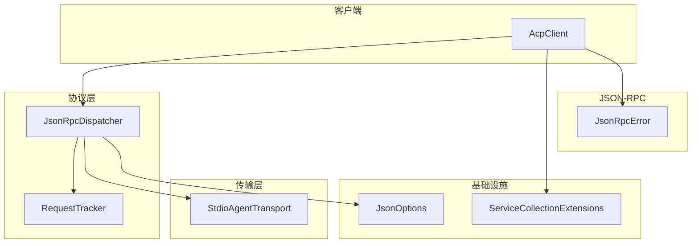
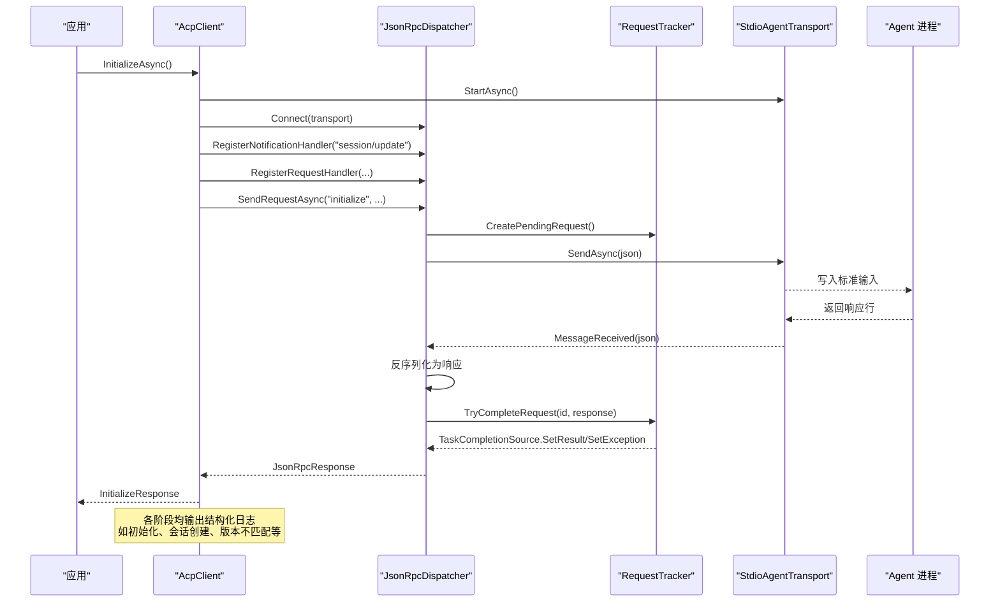
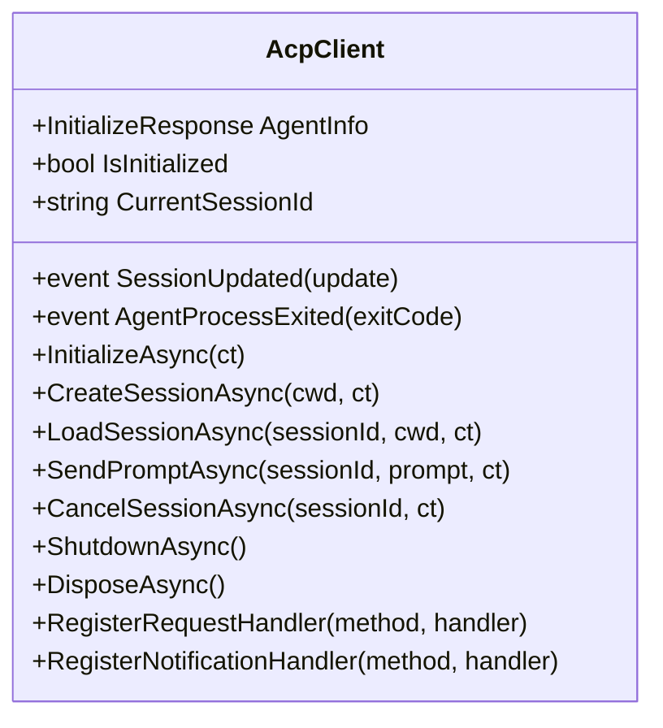
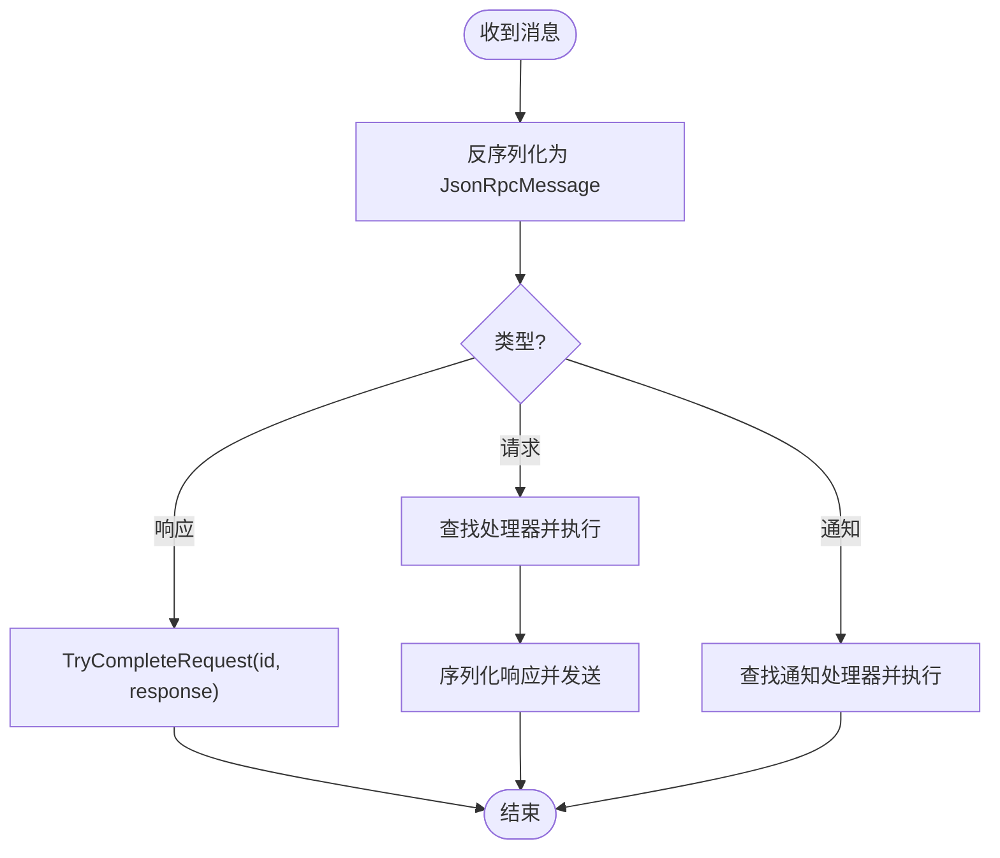
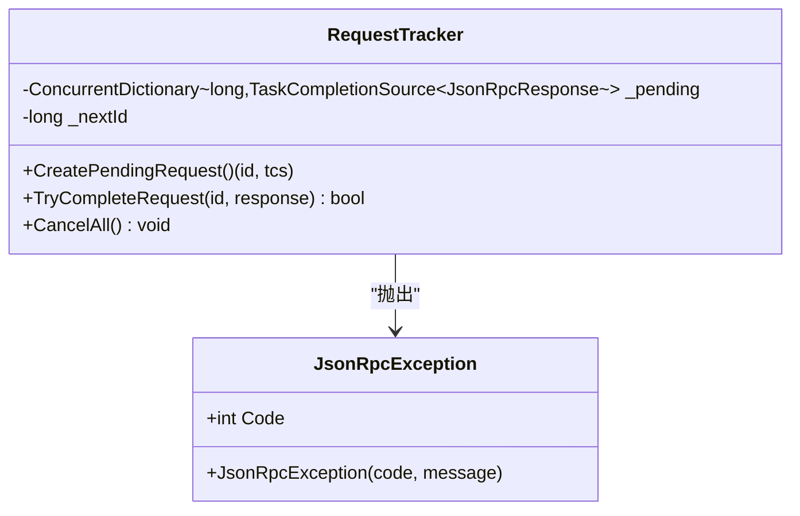
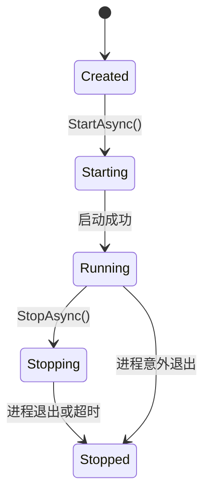
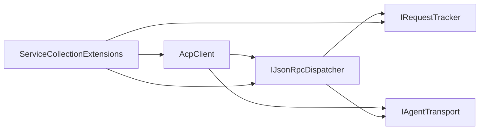

# 调试与监控

<cite>
**本文引用的文件**   
- [Agentic.ACPLibrary.csproj](file://Agentic.ACPLibrary.csproj)
- [README.md](file://README.md)
- [AcpClient.cs](file://Client/AcpClient.cs)
- [ServiceCollectionExtensions.cs](file://Infrastructure/ServiceCollectionExtensions.cs)
- [JsonOptions.cs](file://Infrastructure/JsonOptions.cs)
- [JsonRpcDispatcher.cs](file://Protocol/JsonRpcDispatcher.cs)
- [RequestTracker.cs](file://Protocol/RequestTracker.cs)
- [StdioAgentTransport.cs](file://Transport/StdioAgentTransport.cs)
- [JsonRpcError.cs](file://JsonRpc/JsonRpcError.cs)
</cite>

## 目录
1. [简介](#简介)
2. [项目结构](#项目结构)
3. [核心组件](#核心组件)
4. [架构总览](#架构总览)
5. [详细组件分析](#详细组件分析)
6. [依赖关系分析](#依赖关系分析)
7. [性能考量](#性能考量)
8. [故障排除指南](#故障排除指南)
9. [结论](#结论)
10. [附录](#附录)

## 简介
本文件面向使用 Agentic.ACPLibrary 的开发者，聚焦“调试与监控”主题。内容涵盖：
- 日志记录配置（Microsoft.Extensions.Logging）的使用、日志级别设置与结构化日志输出
- 调试技巧（断点、变量检查、调用栈分析）
- 监控方案（关键指标收集、健康检查、服务状态监控）
- 故障排除（常见错误模式、诊断方法、解决方案）
- 生产环境最佳实践（分布式追踪、性能指标、告警配置）

该库通过 stdio 子进程与 ACP Agent 通信，采用 JSON-RPC 2.0 协议，提供会话管理、事件通知和可扩展处理器接口。

## 项目结构
- Client：客户端实现与处理器接口定义
- Infrastructure：依赖注入扩展与 JSON 序列化选项
- Protocol：JSON-RPC 分发器与请求跟踪
- Transport：基于标准输入输出的传输实现
- JsonRpc：JSON-RPC 消息与错误模型
- Models：协议数据模型与枚举

图表来源
- [AcpClient.cs:1-361](file://Client/AcpClient.cs#L1-L361)
- [JsonRpcDispatcher.cs:1-124](file://Protocol/JsonRpcDispatcher.cs#L1-L124)
- [RequestTracker.cs:1-52](file://Protocol/RequestTracker.cs#L1-L52)
- [StdioAgentTransport.cs:1-147](file://Transport/StdioAgentTransport.cs#L1-L147)
- [ServiceCollectionExtensions.cs:1-23](file://Infrastructure/ServiceCollectionExtensions.cs#L1-L23)
- [JsonOptions.cs:1-28](file://Infrastructure/JsonOptions.cs#L1-L28)
- [JsonRpcError.cs:1-19](file://JsonRpc/JsonRpcError.cs#L1-L19)

章节来源
- [README.md:1-99](file://README.md#L1-L99)

## 核心组件
- AcpClient：ACP 客户端主入口，负责初始化握手、会话管理、事件订阅、处理器注册与生命周期控制；内置结构化日志记录。
- JsonRpcDispatcher：JSON-RPC 消息分发器，负责发送请求/通知、注册处理程序、接收并路由消息、完成待处理请求。
- RequestTracker：并发安全的请求跟踪器，维护待响应映射，支持取消与异常传播。
- StdioAgentTransport：基于子进程的标准输入输出传输，负责启动/停止 Agent 进程、读写行级 JSON 消息、暴露进程退出事件。
- ServiceCollectionExtensions：将 ACP 相关服务注册到 DI 容器。
- JsonOptions：全局 System.Text.Json 选项，包含转换器与忽略策略。
- JsonRpcError：JSON-RPC 错误对象模型。

章节来源
- [AcpClient.cs:1-361](file://Client/AcpClient.cs#L1-L361)
- [JsonRpcDispatcher.cs:1-124](file://Protocol/JsonRpcDispatcher.cs#L1-L124)
- [RequestTracker.cs:1-52](file://Protocol/RequestTracker.cs#L1-L52)
- [StdioAgentTransport.cs:1-147](file://Transport/StdioAgentTransport.cs#L1-L147)
- [ServiceCollectionExtensions.cs:1-23](file://Infrastructure/ServiceCollectionExtensions.cs#L1-L23)
- [JsonOptions.cs:1-28](file://Infrastructure/JsonOptions.cs#L1-L28)
- [JsonRpcError.cs:1-19](file://JsonRpc/JsonRpcError.cs#L1-L19)

## 架构总览
下图展示了从客户端发起请求到传输层与 Agent 进程的完整交互流程，以及日志记录在关键路径上的落点。

图表来源
- [AcpClient.cs:48-182](file://Client/AcpClient.cs#L48-L182)
- [JsonRpcDispatcher.cs:27-47](file://Protocol/JsonRpcDispatcher.cs#L27-L47)
- [RequestTracker.cs:11-30](file://Protocol/RequestTracker.cs#L11-L30)
- [StdioAgentTransport.cs:30-68](file://Transport/StdioAgentTransport.cs#L30-L68)

## 详细组件分析

### AcpClient：日志与事件
- 日志记录
  - 使用 Microsoft.Extensions.Logging 的 ILogger<AcpClient>，默认回退为 NullLogger，便于无配置运行。
  - 关键路径均输出结构化日志，包括初始化、会话创建/加载、提示发送、取消、关闭、协议版本不匹配、进程退出等。
- 事件与回调
  - SessionUpdated：流式更新事件（文本片段、工具调用通知等）。
  - AgentProcessExited：子进程退出事件，附带退出码。
- 处理器注册
  - 权限、文件系统、终端等处理器通过 dispatcher 注册，未实现时返回特定错误码。

图表来源
- [AcpClient.cs:12-45](file://Client/AcpClient.cs#L12-L45)
- [AcpClient.cs:48-233](file://Client/AcpClient.cs#L48-L233)

章节来源
- [AcpClient.cs:1-361](file://Client/AcpClient.cs#L1-L361)

### JsonRpcDispatcher：消息分发与请求跟踪
- 连接与断开：绑定/解绑 transport 的消息事件，清理待处理请求。
- 发送请求：生成唯一 id，创建 Pending TCS，序列化并发送，等待响应或超时取消。
- 分发消息：根据类型（请求/通知/响应）路由到对应处理器或完成请求。
- 错误处理：反序列化失败或处理器异常被捕获并忽略（当前实现），上层可通过日志与异常观察问题。

图表来源
- [JsonRpcDispatcher.cs:86-122](file://Protocol/JsonRpcDispatcher.cs#L86-L122)
- [JsonRpcDispatcher.cs:27-47](file://Protocol/JsonRpcDispatcher.cs#L27-L47)

章节来源
- [JsonRpcDispatcher.cs:1-124](file://Protocol/JsonRpcDispatcher.cs#L1-L124)

### RequestTracker：并发安全与异常传播
- 并发字典维护 pending 请求，原子递增 id。
- 成功完成设置结果，错误则抛出 JsonRpcException（含 code 与 message）。
- 取消全部请求用于优雅关闭。

图表来源
- [RequestTracker.cs:1-52](file://Protocol/RequestTracker.cs#L1-L52)

章节来源
- [RequestTracker.cs:1-52](file://Protocol/RequestTracker.cs#L1-L52)

### StdioAgentTransport：进程与 I/O 监控
- 启动：创建子进程，重定向 stdin/stdout/stderr，启动读取循环。
- 发送：向标准输入写入 JSON 行并刷新。
- 停止：取消读取任务，尝试优雅退出，必要时强制终止整个进程树。
- 事件：MessageReceived、TransportFaulted、ProcessExited。
- 诊断：stderr 目前仅读取不处理，可用于外部诊断。

图表来源
- [StdioAgentTransport.cs:30-93](file://Transport/StdioAgentTransport.cs#L30-L93)
- [StdioAgentTransport.cs:95-145](file://Transport/StdioAgentTransport.cs#L95-L145)

章节来源
- [StdioAgentTransport.cs:1-147](file://Transport/StdioAgentTransport.cs#L1-L147)

### 基础设施：DI 与 JSON 选项
- ServiceCollectionExtensions：注册 JsonRpcDispatcher、RequestTracker、AcpClient（单例）。
- JsonOptions：统一 System.Text.Json 行为，启用大小写不敏感、忽略 null、紧凑输出、允许元数据属性乱序，并注册自定义转换器。

章节来源
- [ServiceCollectionExtensions.cs:1-23](file://Infrastructure/ServiceCollectionExtensions.cs#L1-L23)
- [JsonOptions.cs:1-28](file://Infrastructure/JsonOptions.cs#L1-L28)

## 依赖关系分析
- AcpClient 依赖：IAgentTransport、IJsonRpcDispatcher、ILogger<AcpClient>。
- JsonRpcDispatcher 依赖：IRequestTracker、IAgentTransport、System.Text.Json。
- StdioAgentTransport 依赖：System.Diagnostics.Process、System.IO。
- 基础设施：ServiceCollectionExtensions 聚合上述组件进行 DI 注册。

图表来源
- [AcpClient.cs:12-45](file://Client/AcpClient.cs#L12-L45)
- [JsonRpcDispatcher.cs:9-25](file://Protocol/JsonRpcDispatcher.cs#L9-L25)
- [ServiceCollectionExtensions.cs:14-21](file://Infrastructure/ServiceCollectionExtensions.cs#L14-L21)

章节来源
- [Agentic.ACPLibrary.csproj:22-26](file://Agentic.ACPLibrary.csproj#L22-L26)

## 性能考量
- 序列化开销：所有 JSON 操作使用统一的 JsonOptions，避免重复配置；建议在生产环境中缓存 JsonSerializerOptions（已实现为静态 Default）。
- 异步 I/O：传输层使用异步读取循环与 TaskCompletionSource，避免阻塞线程；注意合理设置取消令牌以避免资源泄漏。
- 并发安全：RequestTracker 使用 ConcurrentDictionary 与原子 id 生成，保证高并发下的正确性。
- 日志影响：在高吞吐场景下，建议按需调整日志级别，减少不必要的 Info/Debug 输出。

[本节为通用指导，无需引用具体文件]

## 故障排除指南

### 日志记录配置（Microsoft.Extensions.Logging）
- 注入方式
  - 通过构造函数注入 ILogger<AcpClient>；若未提供，将回退为 NullLogger，确保无配置也能运行。
- 日志级别
  - 初始化、会话创建/加载、提示发送、取消、关闭等使用 Information；
  - 协议版本不匹配、进程退出使用 Warning；
  - 发送提示等高频路径使用 Debug。
- 结构化日志
  - 使用占位符参数（如 {ExitCode}、{SessionId}、{AgentName}），便于集中采集与查询。

章节来源
- [AcpClient.cs:40-45](file://Client/AcpClient.cs#L40-L45)
- [AcpClient.cs:48-182](file://Client/AcpClient.cs#L48-L182)
- [AcpClient.cs:208-233](file://Client/AcpClient.cs#L208-L233)

### 调试技巧
- 断点设置
  - 在 AcpClient.InitializeAsync、SendPromptAsync、JsonRpcDispatcher.OnMessageReceivedAsync、StdioAgentTransport.ReadLoopAsync 处设置断点，观察消息收发与状态变化。
- 变量检查
  - 检查 CurrentSessionId、IsInitialized、Transport.State、_disposed 等关键字段。
  - 查看 RequestTracker 的 pending 集合是否堆积，判断是否存在未完成的请求。
- 调用栈分析
  - 当出现 JsonRpcException 时，检查堆栈定位是请求发送、响应解析还是处理器执行阶段出错。
  - 关注 TransportFaulted 事件抛出的异常，排查 I/O 或编码问题。

章节来源
- [JsonRpcDispatcher.cs:86-122](file://Protocol/JsonRpcDispatcher.cs#L86-L122)
- [RequestTracker.cs:19-30](file://Protocol/RequestTracker.cs#L19-L30)
- [StdioAgentTransport.cs:95-118](file://Transport/StdioAgentTransport.cs#L95-L118)

### 监控方案
- 关键指标收集
  - 请求计数与延迟：可在 JsonRpcDispatcher.SendRequestAsync 前后埋点，统计平均/分位延迟与成功率。
  - 会话状态：AcpClient.CurrentSessionId、IsInitialized 作为健康态指标。
  - 传输状态：StdioAgentTransport.State 与 ProcessExited 事件频率。
- 健康检查
  - 暴露 /health 端点（由宿主应用实现），内部调用 AcpClient.IsInitialized 与最近一次会话创建是否成功。
- 服务状态监控
  - 订阅 AgentProcessExited 事件，记录退出码并触发告警；结合系统进程监控（如 Windows 任务管理器或进程守护）确保自动恢复。

章节来源
- [AcpClient.cs:18-21](file://Client/AcpClient.cs#L18-L21)
- [AcpClient.cs:56-61](file://Client/AcpClient.cs#L56-L61)
- [StdioAgentTransport.cs:17-22](file://Transport/StdioAgentTransport.cs#L17-L22)

### 常见错误模式与解决方案
- 协议版本不匹配
  - 现象：Initialize 后记录警告，提示 client=1 与 agent 版本不一致。
  - 解决：升级或降级 Agent 以匹配客户端协议版本。
- 处理器未实现
  - 现象：fs/read_text_file、fs/write_text_file、terminal/* 返回“不可用”错误码。
  - 解决：实现对应的 IFileSystemHandler/ITerminalHandler 并在初始化前赋值。
- 传输未运行
  - 现象：SendAsync 抛出“传输未运行”异常。
  - 解决：确保先调用 StartAsync 且 State 为 Running。
- 请求未完成或堆积
  - 现象：RequestTracker 中 pending 数量持续增长。
  - 解决：检查 OnMessageReceivedAsync 是否正确分发响应；确认网络/stdio 通道是否正常；增加超时与重试策略。

章节来源
- [AcpClient.cs:175-179](file://Client/AcpClient.cs#L175-L179)
- [AcpClient.cs:102-144](file://Client/AcpClient.cs#L102-L144)
- [AcpClient.cs:250-358](file://Client/AcpClient.cs#L250-L358)
- [JsonRpcDispatcher.cs:27-47](file://Protocol/JsonRpcDispatcher.cs#L27-L47)
- [StdioAgentTransport.cs:61-68](file://Transport/StdioAgentTransport.cs#L61-L68)

### 生产环境监控最佳实践
- 分布式追踪
  - 为每次请求分配 TraceId/SpanId，贯穿 AcpClient -> JsonRpcDispatcher -> Transport -> Agent，便于链路追踪。
- 性能指标收集
  - 使用 OpenTelemetry 或类似框架，对 SendRequestAsync、OnMessageReceivedAsync、ReadLoopAsync 等关键路径打点。
- 告警配置
  - 针对以下阈值设置告警：
    - 进程退出率突增（AgentProcessExited 频率）
    - 请求失败率升高（JsonRpcException 比例）
    - 延迟 P95/P99 超过阈值
    - 会话创建失败率
- 可观测性集成
  - 将结构化日志输出到集中式日志平台（如 ELK、Splunk），按级别与字段索引，便于检索与关联分析。

[本节为通用指导，无需引用具体文件]

## 结论
本库通过清晰的层次划分与结构化日志，为调试与监控提供了良好基础。借助 DI 与事件机制，可以在不侵入业务逻辑的前提下，接入日志、指标与追踪体系。建议在生产环境中完善健康检查、指标采集与告警规则，并结合分布式追踪提升端到端可观测性。

[本节为总结，无需引用具体文件]

## 附录

### 快速开始中的日志与监控要点
- 在应用启动时配置 ILoggerFactory（或宿主提供的日志框架），确保 AcpClient 能输出结构化日志。
- 在 InitializeAsync 成功后，记录 Agent 名称与版本信息，便于后续关联分析。
- 订阅 SessionUpdated 与 AgentProcessExited 事件，实时获取流式更新与进程状态。

章节来源
- [README.md:8-33](file://README.md#L8-L33)
- [AcpClient.cs:31-35](file://Client/AcpClient.cs#L31-L35)