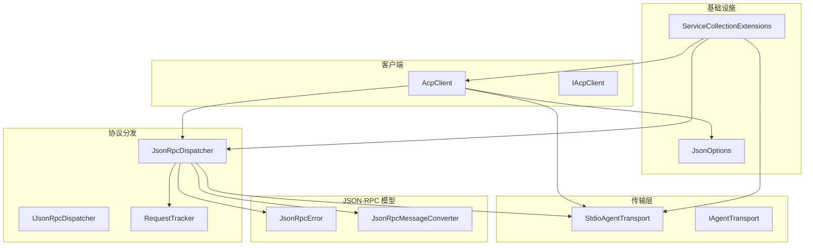
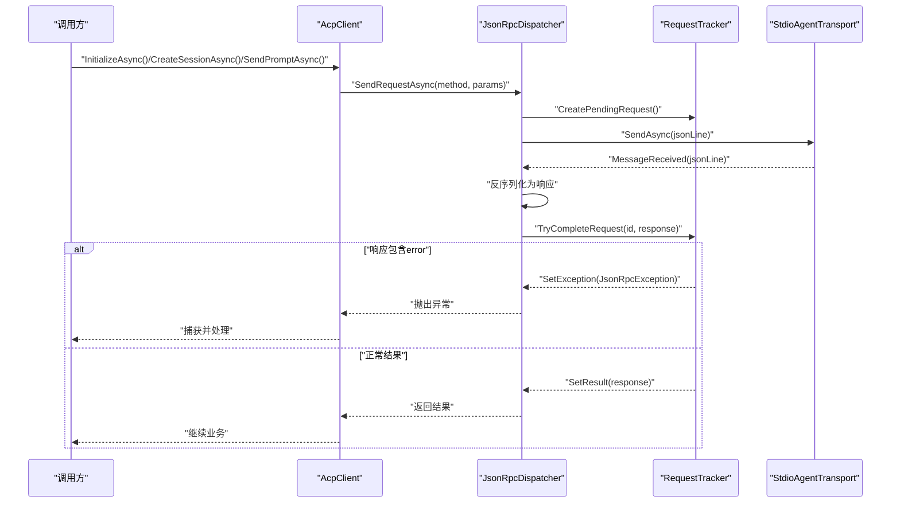
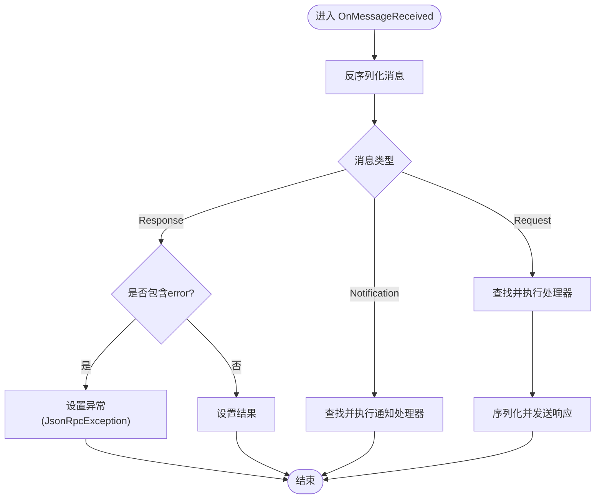
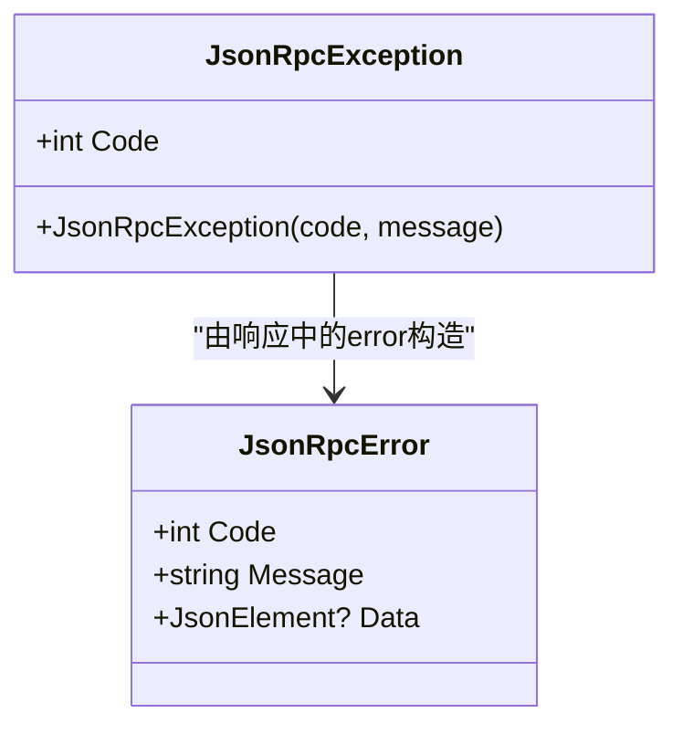
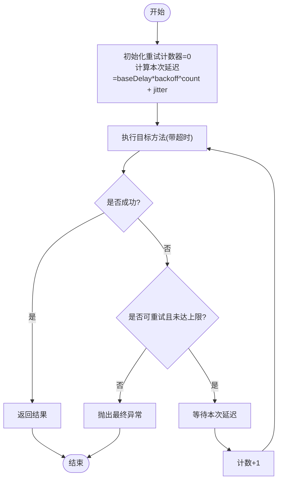
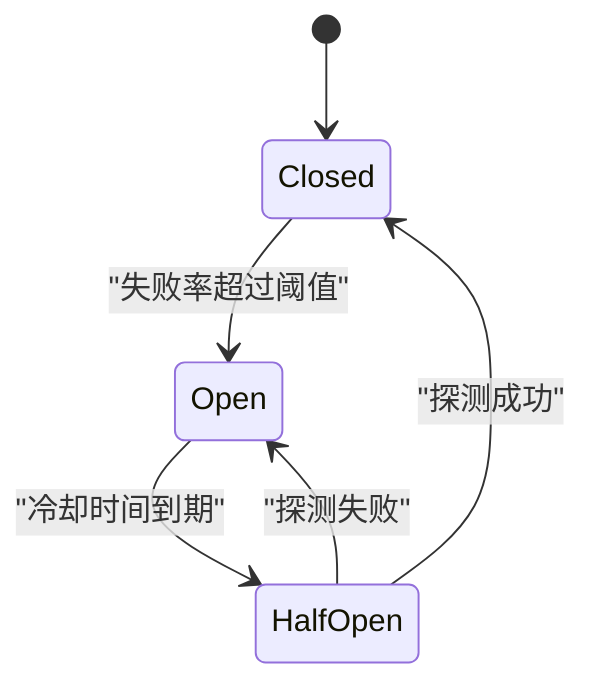
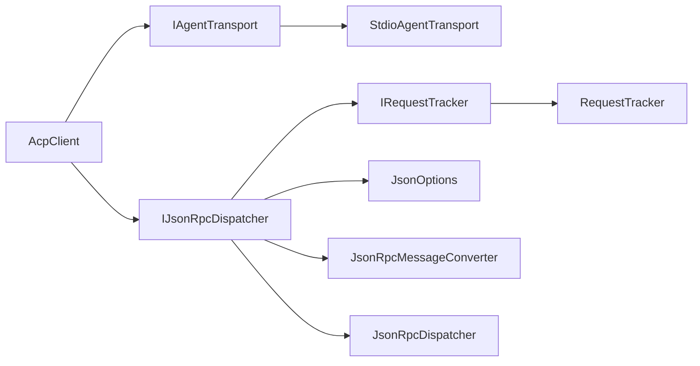

# 错误恢复

<cite>
**本文引用的文件**   
- [AcpClient.cs](file://Client/AcpClient.cs)
- [IAcpClient.cs](file://Client/IAcpClient.cs)
- [JsonRpcDispatcher.cs](file://Protocol/JsonRpcDispatcher.cs)
- [IJsonRpcDispatcher.cs](file://Protocol/IJsonRpcDispatcher.cs)
- [RequestTracker.cs](file://Protocol/RequestTracker.cs)
- [StdioAgentTransport.cs](file://Transport/StdioAgentTransport.cs)
- [IAgentTransport.cs](file://Transport/IAgentTransport.cs)
- [JsonRpcError.cs](file://JsonRpc/JsonRpcError.cs)
- [JsonRpcMessageConverter.cs](file://JsonRpc/JsonRpcMessageConverter.cs)
- [JsonOptions.cs](file://Infrastructure/JsonOptions.cs)
- [ServiceCollectionExtensions.cs](file://Infrastructure/ServiceCollectionExtensions.cs)
- [README.md](file://README.md)
</cite>

## 目录
1. [简介](#简介)
2. [项目结构](#项目结构)
3. [核心组件](#核心组件)
4. [架构总览](#架构总览)
5. [详细组件分析](#详细组件分析)
6. [依赖关系分析](#依赖关系分析)
7. [性能考量](#性能考量)
8. [故障排查指南](#故障排查指南)
9. [结论](#结论)
10. [附录](#附录)

## 简介
本文件围绕该代码库的错误恢复机制进行系统化说明，重点覆盖：
- 异常分类与传播路径（JSON-RPC 错误对象、自定义异常、传输层异常）
- 重试策略设计（指数退避、重试条件、最大重试次数）
- 熔断模式实现（状态管理、半开状态、恢复机制）
- 容错设计模式（优雅降级、服务隔离、批量操作回滚）
- 测试策略（错误恢复测试、故障注入）

当前仓库已具备基础的错误建模与传播能力（如 JSON-RPC 错误对象、请求跟踪器抛出自定义异常、传输层事件），但尚未内置重试、熔断等高级容错逻辑。本文将基于现有实现给出扩展方案与最佳实践，帮助在不侵入核心协议的前提下增强系统的健壮性。

## 项目结构
从错误恢复视角看，关键模块职责如下：
- 传输层（Transport）：负责子进程 stdio 通信、生命周期管理与底层异常事件上报
- 分发层（Dispatcher）：负责消息路由、请求-响应匹配、反序列化与处理回调
- 客户端（Client）：对外暴露会话与提示接口，注册处理器并处理业务侧错误
- 基础设施（Infrastructure）：JSON 序列化选项与 DI 注册
- 模型与协议（Models/JsonRpc）：JSON-RPC 错误对象、消息转换器

图表来源
- [AcpClient.cs:1-361](file://Client/AcpClient.cs#L1-L361)
- [JsonRpcDispatcher.cs:1-124](file://Protocol/JsonRpcDispatcher.cs#L1-L124)
- [RequestTracker.cs:1-52](file://Protocol/RequestTracker.cs#L1-L52)
- [StdioAgentTransport.cs:1-147](file://Transport/StdioAgentTransport.cs#L1-L147)
- [JsonRpcError.cs:1-19](file://JsonRpc/JsonRpcError.cs#L1-L19)
- [JsonRpcMessageConverter.cs:1-73](file://JsonRpc/JsonRpcMessageConverter.cs#L1-L73)
- [JsonOptions.cs:1-28](file://Infrastructure/JsonOptions.cs#L1-L28)
- [ServiceCollectionExtensions.cs:1-23](file://Infrastructure/ServiceCollectionExtensions.cs#L1-L23)

章节来源
- [README.md:1-99](file://README.md#L1-L99)

## 核心组件
- 传输层（StdioAgentTransport）
  - 启动/停止子进程，读写标准输入输出
  - 通过事件上报消息到达、传输故障、进程退出
  - 在读取循环中捕获异常并通过 TransportFaulted 事件上报
- 分发层（JsonRpcDispatcher）
  - 连接传输层，订阅消息事件
  - 发送请求/通知，使用 RequestTracker 维护待完成请求
  - 收到响应后根据 Error 字段抛出 JsonRpcException
  - 对反序列化或处理器异常进行吞掉式处理（便于稳定运行）
- 请求跟踪器（RequestTracker）
  - 并发字典维护 pending 请求的 TaskCompletionSource
  - 将响应中的 error 转换为 JsonRpcException 并设置到 TCS
  - 支持取消全部待处理请求
- 客户端（AcpClient）
  - 初始化握手、创建/加载会话、发送提示、取消会话
  - 注册各类处理器（权限、文件系统、终端），未提供时返回特定 JSON-RPC 错误码
  - 订阅 Agent 进程退出事件并向上游通知

章节来源
- [StdioAgentTransport.cs:1-147](file://Transport/StdioAgentTransport.cs#L1-L147)
- [JsonRpcDispatcher.cs:1-124](file://Protocol/JsonRpcDispatcher.cs#L1-L124)
- [RequestTracker.cs:1-52](file://Protocol/RequestTracker.cs#L1-L52)
- [AcpClient.cs:1-361](file://Client/AcpClient.cs#L1-L361)

## 架构总览
下图展示一次典型请求的生命周期与错误传播路径：

图表来源
- [AcpClient.cs:48-182](file://Client/AcpClient.cs#L48-L182)
- [JsonRpcDispatcher.cs:27-47](file://Protocol/JsonRpcDispatcher.cs#L27-L47)
- [RequestTracker.cs:11-30](file://Protocol/RequestTracker.cs#L11-L30)
- [StdioAgentTransport.cs:30-68](file://Transport/StdioAgentTransport.cs#L30-L68)

## 详细组件分析

### 异常分类与传播
- 传输层异常
  - 读取循环捕获任意异常并通过 TransportFaulted 事件上报，避免阻塞主流程
  - 进程退出通过 ProcessExited 事件上报退出码
- 协议层异常
  - 分发层在收到响应后，若存在 error 字段，则通过 RequestTracker 抛出 JsonRpcException
  - 反序列化失败或处理器异常被捕获并忽略，确保分发稳定性
- 客户端异常
  - 当处理器未配置时，返回特定的 JSON-RPC 错误（如 -32601），由上层决定重试或降级

图表来源
- [JsonRpcDispatcher.cs:86-122](file://Protocol/JsonRpcDispatcher.cs#L86-L122)
- [RequestTracker.cs:19-30](file://Protocol/RequestTracker.cs#L19-L30)

章节来源
- [JsonRpcDispatcher.cs:86-122](file://Protocol/JsonRpcDispatcher.cs#L86-L122)
- [RequestTracker.cs:19-30](file://Protocol/RequestTracker.cs#L19-L30)
- [AcpClient.cs:102-144](file://Client/AcpClient.cs#L102-L144)

### 自定义异常定义
- JsonRpcError：JSON-RPC 2.0 错误对象，包含 code、message、data
- JsonRpcException：封装 JSON-RPC 错误码与消息，用于在 .NET 层传播

图表来源
- [JsonRpcError.cs:7-18](file://JsonRpc/JsonRpcError.cs#L7-L18)
- [RequestTracker.cs:43-51](file://Protocol/RequestTracker.cs#L43-L51)

章节来源
- [JsonRpcError.cs:1-19](file://JsonRpc/JsonRpcError.cs#L1-L19)
- [RequestTracker.cs:43-51](file://Protocol/RequestTracker.cs#L43-L51)

### 重试策略（建议实现）
当前库未内置重试逻辑，建议在调用层封装通用重试器，结合以下要点：
- 指数退避算法
  - 基础延迟 baseDelayMs，每次重试乘以 backoffFactor
  - 加入抖动 jitter，防止雪崩
- 重试条件判断
  - 仅对可重试错误（如网络超时、临时失败、HTTP 5xx）重试
  - 对于不可重试错误（参数错误、权限拒绝）直接失败
- 最大重试次数限制
  - maxRetries 控制上限，避免无限重试
- 取消令牌与超时
  - 遵循 CancellationToken，避免悬挂任务
  - 外层设置整体超时，内层单次调用设置较短超时

[本节为概念性流程图，不映射具体源码]

### 熔断模式（建议实现）
当前库未内置熔断器，建议在调用链上引入熔断器，保护下游不稳定服务：
- 状态管理
  - Closed：正常放行，统计失败率/连续失败数
  - Open：快速失败，不再调用下游
  - HalfOpen：允许少量探测请求，成功则回到 Closed，失败则回到 Open
- 阈值与时间窗口
  - 失败率阈值、最小样本数、滑动窗口大小
  - Open 状态的冷却时间
- 恢复机制
  - HalfOpen 探测成功后重置统计
  - 失败则延长冷却时间或增加阈值

[本节为概念性状态图，不映射具体源码]

### 容错设计模式
- 优雅降级
  - 当 Agent 不可用或功能缺失时，返回默认结果或本地缓存数据
  - 例如：未配置 FileSystemHandler/TerminalHandler 时返回 -32601 错误，上层可降级为只读模式
- 服务隔离
  - 不同业务域使用独立会话/通道，避免相互影响
  - 通过独立的 Transport/Dispatcher 实例隔离资源
- 批量操作回滚
  - 对写操作采用事务性包装，失败时按逆序回滚
  - 记录操作日志以便审计与人工修复

章节来源
- [AcpClient.cs:102-144](file://Client/AcpClient.cs#L102-L144)
- [AcpClient.cs:250-359](file://Client/AcpClient.cs#L250-L359)

## 依赖关系分析
- AcpClient 依赖 IAgentTransport 与 IJsonRpcDispatcher
- JsonRpcDispatcher 依赖 IRequestTracker、JsonOptions、JsonRpcMessageConverter
- StdioAgentTransport 实现 IAgentTransport，提供进程生命周期与 IO 流
- ServiceCollectionExtensions 统一注册上述服务

图表来源
- [ServiceCollectionExtensions.cs:14-21](file://Infrastructure/ServiceCollectionExtensions.cs#L14-L21)
- [AcpClient.cs:40-45](file://Client/AcpClient.cs#L40-L45)
- [JsonRpcDispatcher.cs:16-19](file://Protocol/JsonRpcDispatcher.cs#L16-L19)
- [StdioAgentTransport.cs:8-28](file://Transport/StdioAgentTransport.cs#L8-L28)

章节来源
- [ServiceCollectionExtensions.cs:1-23](file://Infrastructure/ServiceCollectionExtensions.cs#L1-L23)

## 性能考量
- 反序列化优化
  - 使用 JsonOptions.Default，关闭缩进、忽略 null、允许乱序元数据
  - 自定义转换器避免递归，减少分配
- 异步与取消
  - 所有 IO 操作均支持 CancellationToken，避免阻塞
  - 使用 TaskCreationOptions.RunContinuationsAsynchronously 降低同步上下文压力
- 事件驱动
  - 传输层通过事件上报，避免轮询开销
- 内存与并发
  - RequestTracker 使用并发字典，避免锁竞争
  - 合理设置超时与最大并发，防止资源耗尽

章节来源
- [JsonOptions.cs:13-26](file://Infrastructure/JsonOptions.cs#L13-L26)
- [RequestTracker.cs:11-16](file://Protocol/RequestTracker.cs#L11-L16)
- [StdioAgentTransport.cs:95-118](file://Transport/StdioAgentTransport.cs#L95-L118)

## 故障排查指南
- 常见问题定位
  - 传输层无消息：检查 TransportFaulted 事件与进程退出码
  - 请求无响应：检查 RequestTracker 是否被取消或超时
  - 处理器未配置：检查 AcpClient 中对应 Handler 是否赋值
- 日志与诊断
  - 启用 ILogger，记录初始化、会话创建、提示发送与错误信息
  - 关注 stderr 输出（当前未处理，可后续接入）
- 恢复步骤
  - 重启传输层（StopAsync -> StartAsync）
  - 重新建立会话（CreateSessionAsync）
  - 对可重试错误实施指数退避重试

章节来源
- [StdioAgentTransport.cs:120-135](file://Transport/StdioAgentTransport.cs#L120-L135)
- [AcpClient.cs:56-61](file://Client/AcpClient.cs#L56-L61)
- [JsonRpcDispatcher.cs:118-121](file://Protocol/JsonRpcDispatcher.cs#L118-L121)

## 结论
当前库提供了稳定的 JSON-RPC 通信基础与清晰的错误传播路径，适合在此基础上扩展重试、熔断与更丰富的降级策略。建议优先在调用层实现通用重试器与熔断器，保持协议与传输层的简洁性，同时通过事件与日志提升可观测性与可维护性。

## 附录
- 快速开始参考 README 示例，了解基本用法与扩展点
- 如需自定义协议方法，可通过 RegisterRequestHandler/RegisterNotificationHandler 扩展

章节来源
- [README.md:1-99](file://README.md#L1-L99)