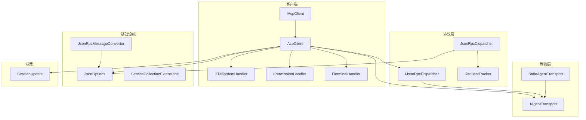
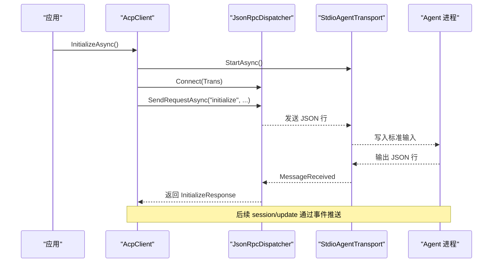
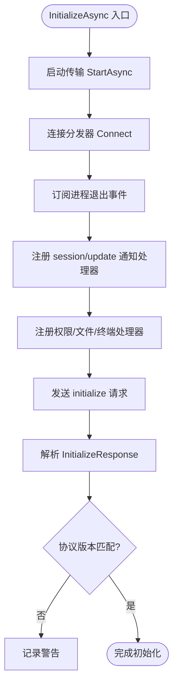
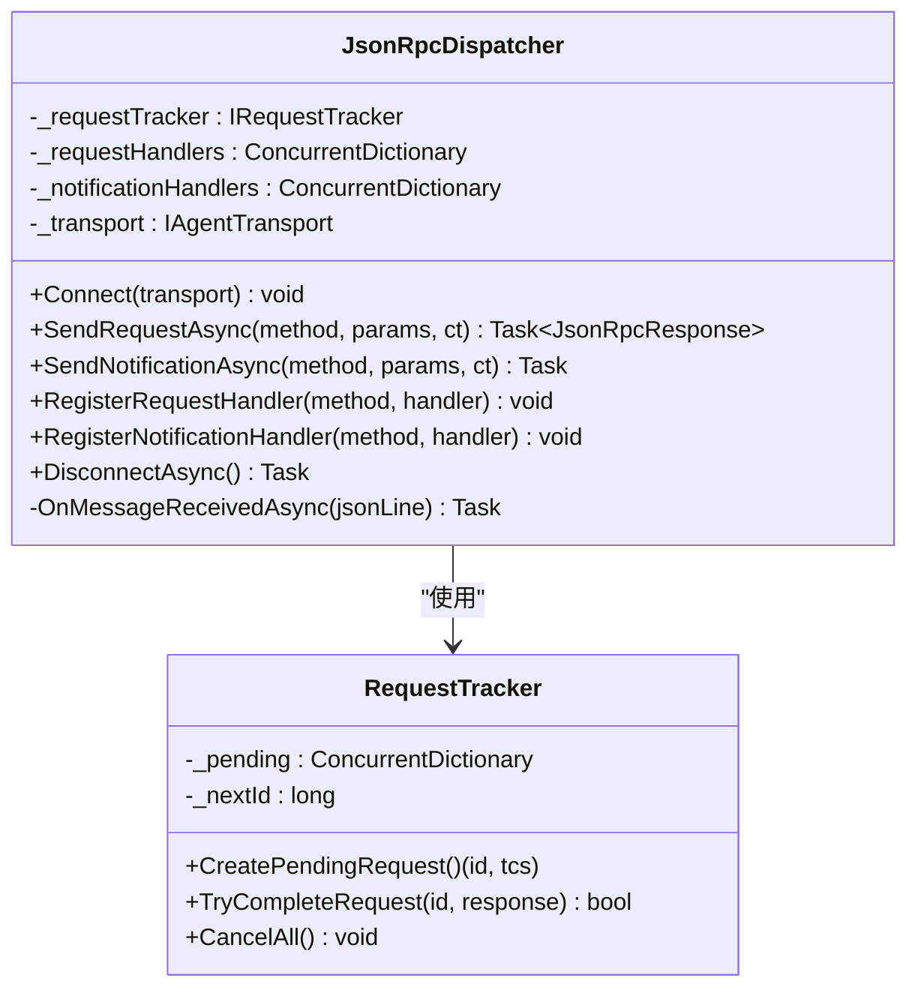
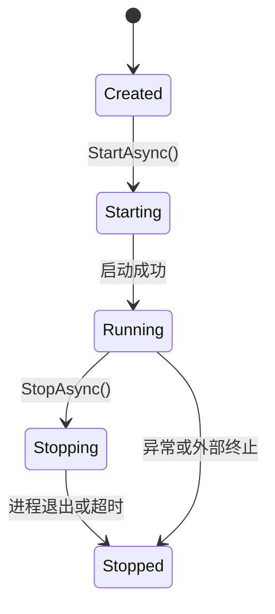
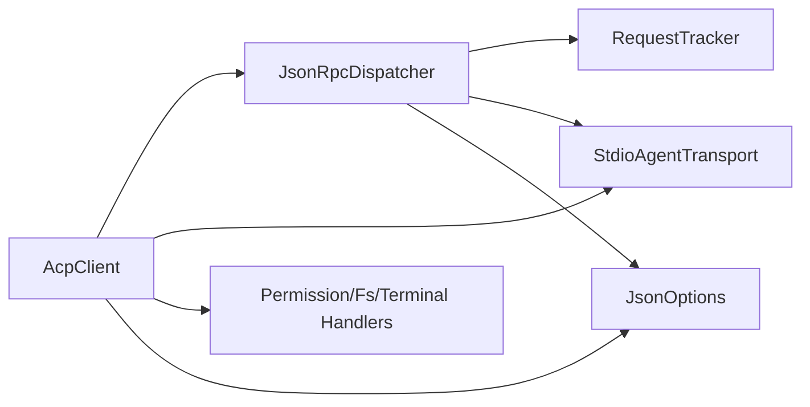
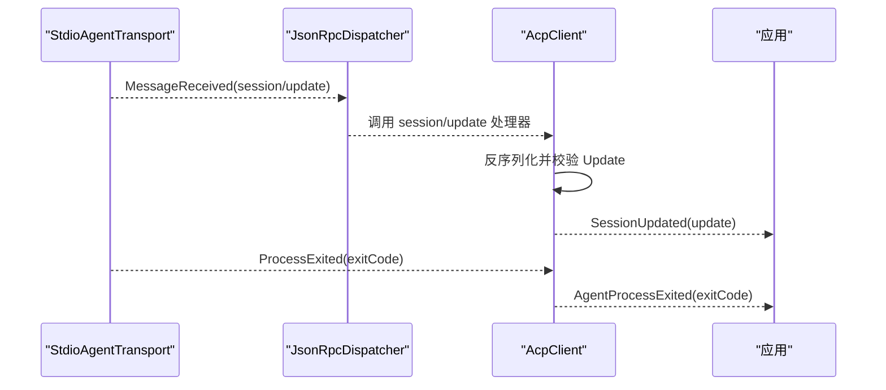

# 高级用法

<cite>
**本文引用的文件**
- [README.md](file://README.md)
- [AcpClient.cs](file://Client/AcpClient.cs)
- [IAcpClient.cs](file://Client/IAcpClient.cs)
- [IFileSystemHandler.cs](file://Client/IFileSystemHandler.cs)
- [IPermissionHandler.cs](file://Client/IPermissionHandler.cs)
- [ITerminalHandler.cs](file://Client/ITerminalHandler.cs)
- [JsonRpcDispatcher.cs](file://Protocol/JsonRpcDispatcher.cs)
- [IJsonRpcDispatcher.cs](file://Protocol/IJsonRpcDispatcher.cs)
- [RequestTracker.cs](file://Protocol/RequestTracker.cs)
- [StdioAgentTransport.cs](file://Transport/StdioAgentTransport.cs)
- [ServiceCollectionExtensions.cs](file://Infrastructure/ServiceCollectionExtensions.cs)
- [JsonOptions.cs](file://Infrastructure/JsonOptions.cs)
- [JsonRpcMessageConverter.cs](file://JsonRpc/JsonRpcMessageConverter.cs)
- [SessionUpdate.cs](file://Models/SessionUpdate.cs)
</cite>

## 目录
1. [简介](#简介)
2. [项目结构](#项目结构)
3. [核心组件](#核心组件)
4. [架构总览](#架构总览)
5. [详细组件分析](#详细组件分析)
6. [依赖关系分析](#依赖关系分析)
7. [性能与内存优化](#性能与内存优化)
8. [事件驱动编程模式](#事件驱动编程模式)
9. [连接复用与池化策略](#连接复用与池化策略)
10. [复杂集成场景示例](#复杂集成场景示例)
11. [调试、日志与监控](#调试日志与监控)
12. [错误恢复、重试与熔断](#错误恢复重试与熔断)
13. [生产部署最佳实践](#生产部署最佳实践)
14. [故障排除指南](#故障排除指南)
15. [结论](#结论)

## 简介
本文件面向需要深度定制和扩展 ACP 客户端的高级用户，重点覆盖以下主题：
- 自定义 JSON-RPC 方法的注册与处理（RegisterRequestHandler、RegisterNotificationHandler）
- 事件驱动的异步编程模型（会话更新、进程退出、通知分发）
- 连接复用与池化策略、内存优化与性能调优
- 多会话管理、并发处理与资源清理
- 调试技巧、日志记录与监控方案
- 错误恢复机制、重试策略与熔断模式
- 生产环境部署与故障排除

## 项目结构
该库采用分层组织方式：
- Client：客户端契约与实现、处理器接口
- Protocol：JSON-RPC 分发器与请求跟踪
- Transport：基于子进程 stdio 的传输层
- Infrastructure：序列化选项与服务注册扩展
- JsonRpc：消息类型与转换器
- Models：协议数据模型与枚举

图表来源
- [AcpClient.cs:1-120](file://Client/AcpClient.cs#L1-L120)
- [JsonRpcDispatcher.cs:1-124](file://Protocol/JsonRpcDispatcher.cs#L1-L124)
- [StdioAgentTransport.cs:1-147](file://Transport/StdioAgentTransport.cs#L1-L147)
- [ServiceCollectionExtensions.cs:1-23](file://Infrastructure/ServiceCollectionExtensions.cs#L1-L23)
- [JsonOptions.cs:1-28](file://Infrastructure/JsonOptions.cs#L1-L28)
- [JsonRpcMessageConverter.cs:1-73](file://JsonRpc/JsonRpcMessageConverter.cs#L1-L73)
- [SessionUpdate.cs:1-119](file://Models/SessionUpdate.cs#L1-L119)

章节来源
- [README.md:1-99](file://README.md#L1-L99)

## 核心组件
- AcpClient：封装初始化、会话管理、提示发送、取消、关闭以及内置处理器注册；暴露 SessionUpdated 与 AgentProcessExited 事件；提供 RegisterRequestHandler/RegisterNotificationHandler 扩展点。
- JsonRpcDispatcher：负责 JSON-RPC 请求/响应匹配、通知分发、反序列化和调用处理器；通过 RequestTracker 维护待完成请求。
- StdioAgentTransport：基于子进程的 stdin/stdout/stderr 通信，启动/停止进程，读取消息并触发事件。
- 处理器接口：IPermissionHandler、IFileSystemHandler、ITerminalHandler 用于实现权限、文件系统与终端能力。
- 基础设施：JsonOptions 统一序列化配置；ServiceCollectionExtensions 提供 DI 注册。

章节来源
- [AcpClient.cs:12-249](file://Client/AcpClient.cs#L12-L249)
- [JsonRpcDispatcher.cs:9-124](file://Protocol/JsonRpcDispatcher.cs#L9-L124)
- [StdioAgentTransport.cs:8-147](file://Transport/StdioAgentTransport.cs#L8-L147)
- [IFileSystemHandler.cs:1-14](file://Client/IFileSystemHandler.cs#L1-L14)
- [IPermissionHandler.cs:1-17](file://Client/IPermissionHandler.cs#L1-L17)
- [ITerminalHandler.cs:1-23](file://Client/ITerminalHandler.cs#L1-L23)
- [JsonOptions.cs:1-28](file://Infrastructure/JsonOptions.cs#L1-L28)
- [ServiceCollectionExtensions.cs:1-23](file://Infrastructure/ServiceCollectionExtensions.cs#L1-L23)

## 架构总览
ACP 客户端通过 Transport 与 Agent 进程进行 JSON-RPC 通信，Dispatcher 负责消息路由与处理器调度，AcpClient 编排握手、会话与事件流。

图表来源
- [AcpClient.cs:48-182](file://Client/AcpClient.cs#L48-L182)
- [JsonRpcDispatcher.cs:27-47](file://Protocol/JsonRpcDispatcher.cs#L27-L47)
- [StdioAgentTransport.cs:30-68](file://Transport/StdioAgentTransport.cs#L30-L68)

## 详细组件分析

### AcpClient：初始化、会话与事件流
- 初始化流程：启动传输、连接分发器、订阅进程退出事件、注册 session/update 通知处理器、注册权限/文件/终端处理器、发送 initialize 请求并解析结果。
- 会话管理：创建/加载会话、发送提示、取消会话。
- 事件模型：SessionUpdated 在收到 session/update 时触发；AgentProcessExited 在进程退出时触发。
- 扩展点：RegisterRequestHandler/RegisterNotificationHandler 将方法映射到自定义处理器。

图表来源
- [AcpClient.cs:48-182](file://Client/AcpClient.cs#L48-L182)

章节来源
- [AcpClient.cs:48-249](file://Client/AcpClient.cs#L48-L249)
- [IAcpClient.cs:9-59](file://Client/IAcpClient.cs#L9-L59)

### JsonRpcDispatcher：请求-响应与通知分发
- 请求-响应：为每个请求生成唯一 id，使用 TaskCompletionSource 等待响应；若响应包含 Error，则抛出 JsonRpcException。
- 通知分发：根据 method 查找已注册的处理器并异步执行。
- 消息接收：反序列化后按类型分派；请求会调用处理器并将结果写回传输。

图表来源
- [JsonRpcDispatcher.cs:9-124](file://Protocol/JsonRpcDispatcher.cs#L9-L124)
- [RequestTracker.cs:6-52](file://Protocol/RequestTracker.cs#L6-L52)

章节来源
- [JsonRpcDispatcher.cs:1-124](file://Protocol/JsonRpcDispatcher.cs#L1-L124)
- [RequestTracker.cs:1-52](file://Protocol/RequestTracker.cs#L1-L52)

### StdioAgentTransport：子进程通信与生命周期
- 启动：创建子进程，重定向标准输入/输出/错误，启动读循环。
- 发送：向标准输入写入 JSON 行并刷新。
- 停止：取消读循环，优雅关闭或强制终止进程树。
- 事件：MessageReceived、TransportFaulted、ProcessExited。

图表来源
- [StdioAgentTransport.cs:30-93](file://Transport/StdioAgentTransport.cs#L30-L93)

章节来源
- [StdioAgentTransport.cs:1-147](file://Transport/StdioAgentTransport.cs#L1-L147)

### 处理器接口与内置注册
- 权限处理器：session/request_permission，未实现时返回取消结果。
- 文件系统处理器：fs/read_text_file、fs/write_text_file，未实现时返回不可用错误。
- 终端处理器：terminal/create、terminal/output、terminal/wait_for_exit、terminal/kill、terminal/release，未实现时返回不可用错误。

章节来源
- [AcpClient.cs:74-147](file://Client/AcpClient.cs#L74-L147)
- [AcpClient.cs:250-359](file://Client/AcpClient.cs#L250-L359)
- [IFileSystemHandler.cs:1-14](file://Client/IFileSystemHandler.cs#L1-L14)
- [IPermissionHandler.cs:1-17](file://Client/IPermissionHandler.cs#L1-L17)
- [ITerminalHandler.cs:1-23](file://Client/ITerminalHandler.cs#L1-L23)

### 序列化与消息转换
- JsonOptions：统一设置大小写不敏感、忽略 null、紧凑输出、允许元数据属性乱序，并注册 JsonRpcMessageConverter 与字符串枚举转换器。
- JsonRpcMessageConverter：根据字段 presence 区分请求、通知、响应，避免递归并正确反序列化为具体类型。

章节来源
- [JsonOptions.cs:1-28](file://Infrastructure/JsonOptions.cs#L1-L28)
- [JsonRpcMessageConverter.cs:1-73](file://JsonRpc/JsonRpcMessageConverter.cs#L1-L73)

## 依赖关系分析
- AcpClient 依赖 IJsonRpcDispatcher 与 IAgentTransport，并通过事件与处理器接口解耦业务逻辑。
- JsonRpcDispatcher 依赖 IRequestTracker 与 IAgentTransport，内部使用并发字典存储处理器。
- StdioAgentTransport 依赖 .NET Process API 与流式读写。
- 所有组件共享 JsonOptions 以保持一致的序列化行为。

图表来源
- [AcpClient.cs:12-249](file://Client/AcpClient.cs#L12-L249)
- [JsonRpcDispatcher.cs:9-124](file://Protocol/JsonRpcDispatcher.cs#L9-L124)
- [StdioAgentTransport.cs:8-147](file://Transport/StdioAgentTransport.cs#L8-L147)
- [JsonOptions.cs:1-28](file://Infrastructure/JsonOptions.cs#L1-L28)

章节来源
- [ServiceCollectionExtensions.cs:1-23](file://Infrastructure/ServiceCollectionExtensions.cs#L1-L23)

## 性能与内存优化
- 序列化开销：JsonOptions 默认紧凑输出与忽略 null，减少网络负载；避免重复创建 JsonSerializerOptions，使用静态 Default。
- 反序列化性能：JsonRpcMessageConverter 一次性解析根元素并按字段存在性选择目标类型，避免多次解析。
- 并发安全：RequestTracker 使用并发字典与原子递增 id，确保高并发请求-响应对齐。
- 流式处理：StdioAgentTransport 使用异步流读取，避免阻塞线程；读循环支持取消令牌。
- 事件派发：SessionUpdated 使用异步委托，建议消费者快速返回或使用后台任务处理，避免背压。

章节来源
- [JsonOptions.cs:1-28](file://Infrastructure/JsonOptions.cs#L1-L28)
- [JsonRpcMessageConverter.cs:1-73](file://JsonRpc/JsonRpcMessageConverter.cs#L1-L73)
- [RequestTracker.cs:1-52](file://Protocol/RequestTracker.cs#L1-L52)
- [StdioAgentTransport.cs:95-118](file://Transport/StdioAgentTransport.cs#L95-L118)
- [AcpClient.cs:64-72](file://Client/AcpClient.cs#L64-L72)

## 事件驱动编程模式
- 会话更新：AcpClient 在 InitializeAsync 中注册 session/update 通知处理器，反序列化为 SessionUpdateParams.Update 并触发 SessionUpdated 事件。
- 进程退出：订阅 Transport.ProcessExited，转发为 AcpClient.AgentProcessExited，便于上层清理与告警。
- 异步处理：事件处理器应使用 async/await，避免长时间阻塞；对耗时操作建议使用独立任务队列或限流。

图表来源
- [AcpClient.cs:56-72](file://Client/AcpClient.cs#L56-L72)
- [JsonRpcDispatcher.cs:110-116](file://Protocol/JsonRpcDispatcher.cs#L110-L116)
- [StdioAgentTransport.cs:137-145](file://Transport/StdioAgentTransport.cs#L137-L145)

章节来源
- [AcpClient.cs:56-72](file://Client/AcpClient.cs#L56-L72)
- [SessionUpdate.cs:1-119](file://Models/SessionUpdate.cs#L1-L119)

## 连接复用与池化策略
当前实现为单例传输（一个 AcpClient 对应一个 StdioAgentTransport），适合简单场景。对于多会话或多 Agent 进程，可考虑：
- 连接池：维护多个 StdioAgentTransport 实例，按会话或租户分配；使用对象池减少创建销毁开销。
- 路由策略：根据 method 前缀或会话上下文选择不同传输实例，实现隔离与负载均衡。
- 健康检查：定期检测进程存活与延迟，失败自动剔除并重建。
- 资源清理：在池回收时调用 StopAsync，确保子进程被正确终止。

注意：以上为概念性建议，需结合应用需求自行实现。

[本节为概念性内容，不涉及具体文件分析]

## 复杂集成场景示例
- 多会话管理：
  - 使用 CreateSessionAsync/LoadSessionAsync 管理多个会话，CurrentSessionId 指向当前活动会话。
  - 为每个会话维护独立的上下文（如工作目录、权限策略）。
- 并发处理：
  - 多个并发 SendPromptAsync 调用由 RequestTracker 保证 id 唯一性与响应匹配。
  - 事件处理器应避免阻塞，必要时使用任务队列与背压控制。
- 资源清理：
  - ShutdownAsync 先断开分发器再停止传输，确保无残留任务。
  - DisposeAsync 调用 ShutdownAsync 并抑制终结器。

章节来源
- [AcpClient.cs:184-240](file://Client/AcpClient.cs#L184-L240)
- [JsonRpcDispatcher.cs:27-47](file://Protocol/JsonRpcDispatcher.cs#L27-L47)

## 调试、日志与监控
- 日志：AcpClient 使用 ILogger<AcpClient> 记录初始化、会话创建、提示发送、进程退出等关键路径；可通过注入自定义 Logger 实现集中化日志。
- 调试技巧：
  - 启用详细日志级别，观察 JSON 行收发与反序列化过程。
  - 在处理器中记录入参与出参，定位业务问题。
  - 使用 Transport.TransportFaulted 捕获底层异常。
- 监控指标：
  - 请求-响应延迟、错误率、事件处理时长。
  - 进程存活状态、退出码分布。
  - 会话数量、并发度、内存占用。

章节来源
- [AcpClient.cs:48-182](file://Client/AcpClient.cs#L48-L182)
- [StdioAgentTransport.cs:113-117](file://Transport/StdioAgentTransport.cs#L113-L117)

## 错误恢复、重试与熔断
- 错误传播：
  - 响应中的 Error 字段会被 RequestTracker 转换为 JsonRpcException，调用方可捕获并处理。
  - 处理器异常在 OnMessageReceivedAsync 中被捕获，当前实现忽略异常以避免中断消息流。
- 重试策略：
  - 针对瞬时错误（如网络抖动、进程重启）可实现指数退避重试，限制最大重试次数。
  - 对幂等方法（如 session/new）可安全重试；非幂等方法需谨慎。
- 熔断模式：
  - 当连续失败超过阈值时，暂时停止请求并进入冷却期，期间直接返回降级结果。
  - 半开状态尝试少量请求验证服务可用性，成功后恢复正常。

章节来源
- [RequestTracker.cs:19-30](file://Protocol/RequestTracker.cs#L19-L30)
- [JsonRpcDispatcher.cs:118-122](file://Protocol/JsonRpcDispatcher.cs#L118-L122)

## 生产部署最佳实践
- 进程管理：
  - 使用进程守护（如 systemd、Windows Service）确保 Agent 进程自恢复。
  - 合理设置超时与强制终止策略，避免僵尸进程。
- 资源隔离：
  - 为不同租户或环境隔离进程与工作目录，防止相互干扰。
- 配置管理：
  - 通过环境变量或配置文件注入命令、参数与工作目录。
- 可观测性：
  - 集中化日志、指标采集与告警规则，覆盖关键路径与异常。
- 容量规划：
  - 评估并发会话数与处理器吞吐，调整线程池与队列大小。

[本节为通用指导，不涉及具体文件分析]

## 故障排除指南
- 常见问题：
  - 未实现处理器导致 -32601 错误：检查 PermissionHandler、FileSystemHandler、TerminalHandler 是否已赋值。
  - 协议版本不匹配：记录警告并评估兼容性。
  - 进程意外退出：查看退出码与 stderr 输出，定位崩溃原因。
- 排查步骤：
  - 启用详细日志，确认 JSON 行格式与顺序。
  - 在分发器与处理器中增加断点，验证反序列化与路由。
  - 使用独立工具模拟 Agent 输出，验证客户端解析逻辑。

章节来源
- [AcpClient.cs:102-147](file://Client/AcpClient.cs#L102-L147)
- [AcpClient.cs:176-179](file://Client/AcpClient.cs#L176-L179)
- [StdioAgentTransport.cs:120-135](file://Transport/StdioAgentTransport.cs#L120-L135)

## 结论
本库提供了清晰的 JSON-RPC 分发与事件驱动模型，便于扩展自定义方法与通知。通过合理的连接复用、内存优化与错误恢复策略，可在生产环境中稳定运行。建议结合应用需求实现连接池、熔断与监控，以提升可靠性与可观测性。

[本节为总结，不涉及具体文件分析]